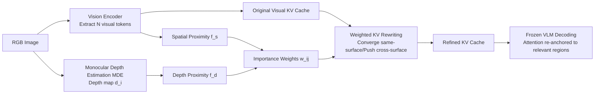

# Mitigating Hallucination in Vision-Language Model with Depth and Spatial-aware Key-Value Refinement

**Conference**: ICLR 2026  
**OpenReview**: [https://openreview.net/forum?id=FHTt9ipAra](https://openreview.net/forum?id=FHTt9ipAra)  
**Code**: To be confirmed  
**Area**: Visual Hallucination Suppression / Multimodal Large Language Models  
**Keywords**: Visual Hallucination, KV cache, Depth Prior, Spatial Proximity, Training-free, VLM  

## TL;DR
The authors observe that visual hallucinations in VLMs stem from the "loss of coherence and isotropic divergence of Key vectors for adjacent visual tokens." Consequently, they propose DSCR, a training-free method that utilizes monocular depth and 2D spatial proximity to regroup Key/Value vectors of the same object and push apart those across different surfaces. Without fine-tuning, this redirects cross-modal attention back to relevant regions, achieving up to a 41.6% accuracy improvement across five hallucination benchmarks.

## Background & Motivation
**Background**: Visual hallucinations (generating non-existent content, incorrect attributes, or misjudged spatial relationships) remain a significant weakness in VLM reliability. Current mitigation strategies are categorized into three types: re-training with visual supervision (bbox/mask), alignment with human preferences using RL rewards, and training-free methods that reshape attention or filter low-confidence predictions.

**Limitations of Prior Work**: While these methods are locally effective, they fail to address the fundamental question: **how hallucinations are generated at the internal representation level of the model**. Existing solutions patch symptoms (such as attention shifts or over-reliance on language priors) without understanding the internal mechanism that prevents attention from anchoring to visual tokens.

**Key Challenge**: Through PCA visualization of Transformer Key vectors, the authors identify a clear contrast: **when hallucinations do not occur, the Key vectors of spatially adjacent patches are highly aligned and become more coherent in deeper layers; however, during hallucinations, Key vectors diverge almost isotropically, blurring object boundaries**. Consequently, cross-modal attention fails to stably transmit visual information to the language model. In other words, the representational root of hallucination is the "collapse of KV-coherence."

**Goal**: To directly repair the coherence of the KV cache without modifying model weights, fine-tuning, or relying on specific queries, thereby refocusing attention on relevant image regions.

**Core Idea**: **[Geometric Prior + KV Rewriting]** Directly inject two types of signals—monocular **depth** (providing real 3D structure to sharpen object edges at depth discontinuities and separate foreground from background) and **2D spatial proximity** (enhancing local context to cluster adjacent patches in the representation space)—into each Key/Value vector. This guides same-object tokens to form coherent clusters while pushing away tokens that are distant on different surfaces or image planes.

## Method

### Overall Architecture
DSCR performs a one-time refinement of the **visual token KV cache** before decoding. Visual tokens first pass through a frozen VLM to obtain the original KV cache, while a ready-made monocular depth estimation (MDE) model extracts a depth map. Based on depth similarity and spatial distance between tokens, a set of "importance weights" is calculated. Each Key/Value vector is then rewritten as a weighted sum of all visual tokens (clustering same-surface tokens and pushing away cross-surface ones), and the original cache is replaced with this refined version for text generation. The entire process is training-free, model-agnostic, query-agnostic, and requires only one forward pass plus one tensor multiplication.

### Key Designs

**1. Dual Proximity of Depth and Space: Explicitly encoding "Same Object" into weights**. The starting point of DSCR is to transform the determination of "which patches should align" from implicit learning to explicit geometric calculation. For the $i$-th and $j$-th patches, depth proximity uses a Gaussian kernel to measure the depth difference $f_d(d_i-d_j)=\exp\!\left(-\frac{(d_i-d_j)^2}{2\sigma_d^2}\right)$, where closer depths yield higher weights. The physical intuition is that pixels with nearly identical disparity almost certainly belong to the same physical surface, while depth mutations correspond to actual object boundaries. Similarly, spatial proximity uses the Euclidean distance of 2D pixel coordinates $f_s(s_i-s_j)=\exp\!\left(-\frac{\|s_i-s_j\|_2^2}{2\sigma_s^2}\right)$ to measure planar adjacency, reinforcing the local prior that neighboring patches often share textures or semantics. These are combined with exponential weights to obtain the total proximity $\tilde w_{ij}=f_d(d_i-d_j)^\alpha+f_s(s_i-s_j)^\beta$, where depth handles cross-surface "segmentation" and space handles same-surface "smoothing."

**2. Diagonal Masking + Column Normalization: Allowing tokens to be refined by neighbors rather than self-reinforcement**. Directly using $\tilde w_{ij}$ for weighting would cause tokens to be dominated by themselves, losing the benefit of neighbor-based repair. The authors set the self-proximity term $\tilde w_{jj}$ to zero (masking the diagonal of the proximity matrix) and apply column normalization to obtain relative importance weights $w_{ij}=\frac{\tilde w_{ij}\cdot \mathbb{I}[i\neq j]}{\sum_k \tilde w_{kj}\cdot \mathbb{I}[k\neq j]}$. This ensures that the refinement of each target token comes entirely from the geometric weighting of other tokens, aggregating "same-surface evidence" while dispersing "cross-depth noise." This step is theoretically equivalent to applying a **Graph Laplacian smoothing term** to the Key vector map: suppressing same-surface tokens into a low-frequency subspace and pulling apart tokens across depth gaps, which simultaneously suppresses high-frequency noise and amplifies reliable local evidence.

**3. KV Cache Weighted Rewriting: Plug-and-play via a single tensor multiplication**. Once weights are obtained, the Key/Value vectors for the $j$-th visual token are rewritten as a weighted sum of all visual tokens: $\hat k_j^I=\sum_i w_{ij}k_i^I$, $\hat v_j^I=\sum_i w_{ij}v_i^I$. The same set of weights is shared across selected Transformer layers (layers 10–39 in experiments) and all attention heads. This rewriting is completed via a single tensor product with negligible overhead and only affects the cache corresponding to visual tokens. This perspective of "directly repairing the representational root of hallucination (KV-coherence collapse) in the cache" makes DSCR the first method to suppress hallucinations by refining the KV cache with auxiliary geometric cues, providing complementary gains when combined with existing inference-time methods like VCD, OPERA, or HALC.

## Key Experimental Results

### Main Results
MME Hallucination Subset (Total score, higher is better):

| Model | Baseline | VCD | OPERA | DAMO | AGLA | DSCR (Ours) |
|------|----------|-----|-------|------|------|------------|
| LLaVA-1.5 | 892.68 | 892.68 | 914.69 | 872.20 | 890.17 | **925.96** |
| LLaVA-1.6 | 889.51 | 886.77 | 899.51 | 870.54 | 885.87 | **901.56** |
| Qwen-VL | 825.01 | 844.57 | 830.35 | 865.39 | 822.41 | **872.61** |
| Qwen2.5-VL | 1042.91 | 1032.12 | 1035.41 | 1032.47 | 1040.31 | **1039.97** |

POPE (GQA) / RePOPE (MSCOCO) F1 (LLaVA-1.5):

| Strategy | POPE w/o → w/ | RePOPE w/o → w/ |
|------|---------------|------------------|
| Random | 0.87 → **0.90** | 0.72 → **0.80** (+0.08) |
| Popular | 0.85 → **0.88** | 0.70 → **0.75** |
| Adversarial | 0.80 → **0.83** | 0.68 → **0.73** |

CHAIR (LLaVA-1.5, lower is better): DSCR achieves the lowest $\text{CHAIR}_I=11.2$ and tied lowest $\text{CHAIR}_S=39.2$, while maintaining an average description length of 96.1 (avoiding hallucination reduction through shorter sentences). On AMBER, it reduces $\text{CHAIR}_S$ by approximately 6.35% and improves overall F1 by about 14.2% relative to the baseline.

### Ablation Study
Efficiency and Depth Model Robustness:

| Dimension | Result |
|------|------|
| Inference Time | 11.06 s/img, **faster than all similar methods** (VCD 15.13 / OPERA 39.37 / AGLA 23.97), slightly above baseline 9.35 |
| Depth Model | Options include Depth-Anything-v2 / MiDaS-Lite / DPT-Lite; GPU usage spans 526–2134 MiB; key metric fluctuations only ±7% |
| Hyperparameter Sensitivity | Performance varies <5% when fixed at $\sigma_d{=}0.6, \sigma_s{=}0.6, \alpha{=}0.6, \beta{=}0.8$ |
| General VL Tasks | COCO captioning: BLEU-4 +0.113, CIDEr +0.380, SPICE +0.031 (performance improves rather than drops) |

### Key Findings
- **Attention Diagnosis**: Original models often assign near-zero attention to image tokens, relying instead on system prompts and text priors; DSCR consistently pulls attention back to relevant image tokens and maintains higher attention at "suspect token" positions.
- **Depth Hallucination Mini-benchmark**: On a self-constructed set (50 images with overlapping objects and similar depths, questioning nearest/farthest/smallest/largest objects), DSCR improves accuracy by 41.4%. On the MME position subset, spatial refinement provides a 6% gain.
- Even if the depth map is noisy or a lightweight depth model is used, DSCR remains effective, indicating that it relies on geometric guidance rather than precise depth values.

## Highlights & Insights
- **Attributing "Hallucination" to a Measurable Representational Metric**: The collapse of coherence in adjacent Key vectors, supported by both PCA visualization and attention diagnosis, is closer to the root cause than "attention shift."
- **First Work to Use Geometric Refinement on KV Cache for Hallucination Suppression**: This novel perspective enables cache rewriting via a single tensor multiplication, making it more efficient than most training-free baselines.
- **Orthogonal and Stackable**: As a plug-in, it can be added to VCD/OPERA/HALC/DAMO/AGLA to achieve additional gains, making it highly suitable for engineering deployment.
- **No Sacrifice of General Capability**: While many de-hallucination methods degrade performance on primary tasks, DSCR slightly improves image captioning quality.

## Limitations & Future Work
- It relies on monocular depth estimation models. Although robust to depth noise, the depth prior may fail in scenarios with large untextured areas, reflections, or transparency, which were not explored in depth regarding extreme failure cases.
- Weights are shared across selected layers and all attention heads, lacking layer/head-specific adaptation; since different layers have different semantic granularities, a uniform weight might not be optimal.
- The Gaussian kernel proximity is an isotropic geometric assumption; the "same-object" assumption based on depth and planar proximity might be weaker for objects like long thin structures or rods.
- Evaluation is primarily focused on LLaVA/Qwen families; the effectiveness for larger-scale or purely generative long-text hallucination suppression remains to be verified.

## Related Work & Insights
- **Training-free Inference-time De-hallucination**: VCD (Contrastive Decoding), OPERA, HALC, DAMO, AGLA (Global+Local Attention Assembly)—DSCR is orthogonal and stackable with these.
- **Geometric/Depth Guided Attention**: Locality priors from LocalViT/SATA and DFormerv2's integration of depth geometry into ViT inspired the use of "depth as a boundary prior." Graph signal processing theory via Graph Laplacian smoothing provides a theoretical basis for cache rewriting.
- **Insight**: Attributing failure to the collapse of a measurable internal representational property $\rightarrow$ repairing it directly at the cache level using inexpensive external priors (depth/coordinates). This "Diagnosis—Geometric Injection—Training-free Repair" paradigm could be transferred to broader visual grounding issues like spatial reasoning, counting, and occlusion understanding.

## Rating
- **Novelty**: ⭐⭐⭐⭐⭐ Attributing hallucination to KV-coherence and being the first to refine KV cache via depth + spatial geometry is a highly novel perspective.
- **Experimental Thoroughness**: ⭐⭐⭐⭐ Comprehensive coverage across five benchmarks + depth mini-benchmark + ablations on efficiency/depth models/hyperparameters; multi-model validation is slightly biased towards the LLaVA family.
- **Writing Quality**: ⭐⭐⭐⭐ Logical flow from PCA observation to the method and theoretical explanation (Graph Laplacian), with clear illustrations.
- **Value**: ⭐⭐⭐⭐⭐ High deployment value due to being training-free, plug-and-play, stackable, efficient, and preserving general capabilities.

<!-- RELATED:START -->

## Related Papers

- [\[CVPR 2026\] KVSmooth: Mitigating Hallucination in Multi-modal Large Language Models through Key-Value Smoothing](../../CVPR2026/hallucination/kvsmooth_mitigating_hallucination_in_multi-modal_large_language_models_through_k.md)
- [\[ICLR 2026\] Hallucination-aware Intermediate Representation Edit in Large Vision-Language Models](hallucination-aware_intermediate_representation_edit_in_large_vision-language_mo.md)
- [\[ICLR 2026\] Imitating the Truth: Attention-aware Truth-Guided Enhancement for Hallucination Mitigation in Large Vision-Language Models](imitating_the_truth_attention-aware_truth-guided_enhancement_for_hallucination_m.md)
- [\[ICLR 2026\] Copy-Paste to Mitigate Large Language Model Hallucinations](copy-paste_to_mitigate_large_language_model_hallucinations.md)
- [\[ICLR 2026\] NDAD: Negative-Direction Aware Decoding for Large Language Models via Controllable Hallucination Signal Injection](ndad_negative-direction_aware_decoding_for_large_language_models_via_controllabl.md)

<!-- RELATED:END -->
