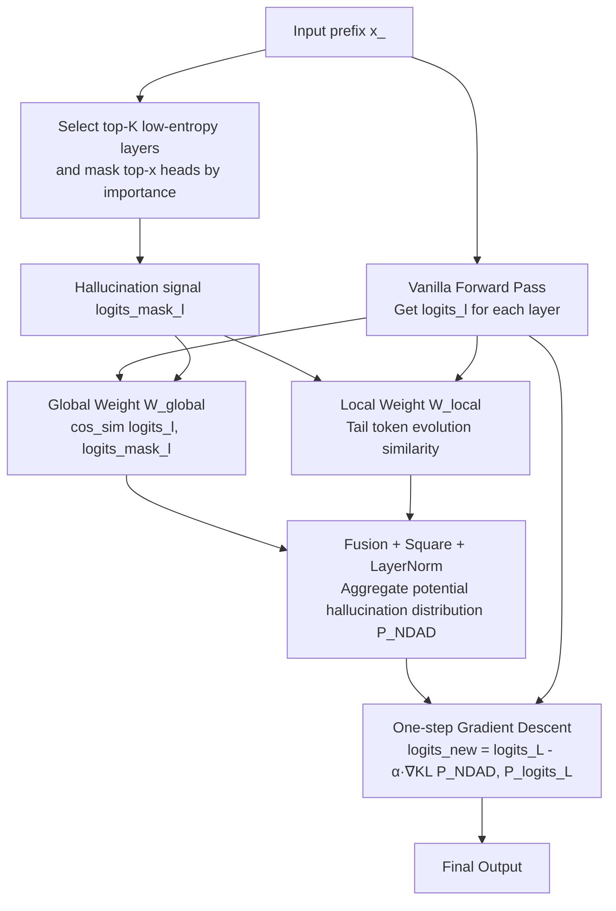

# NDAD: Negative-Direction Aware Decoding for Large Language Models via Controllable Hallucination Signal Injection

**Conference**: ICLR 2026  
**OpenReview**: [https://openreview.net/forum?id=fCZf20wK6p](https://openreview.net/forum?id=fCZf20wK6p)  
**Code**: TBD  
**Area**: Hallucination Mitigation / Inference-time Intervention Decoding  
**Keywords**: hallucination, intervention decoding, attention head masking, contrastive decoding, factuality  

## TL;DR
NDAD takes an unconventional approach: instead of "mining" factual signals from early layers to boost, it actively masks important attention heads to **induce hallucination signals**. These signals are then used as a "negative direction" and subtracted from the final output distribution, enhancing the factual reliability of LLMs without retraining or external knowledge.

## Background & Motivation
**Background**: Mainstream methods for mitigating LLM hallucinations follow two paths: Retrieval-Augmented Generation (RAG) to introduce external knowledge, and training-based methods (SFT/RLHF/DPO) to update parameters. However, the former introduces architectural complexity, latency, and external dependencies, while the latter is computationally expensive and difficult to generalize across domains.

**Limitations of Prior Work**: A third path, inference-time intervention decoding, has gained attention because pre-training already encodes factual signals within internal representations, though conventional decoding often fails to surface them. Methods like DoLa and SLED extract "faithful evidence" from early layer representations and use it to reshape the final token distribution—essentially "boosting positives."

**Key Challenge**: Boosting positives requires the precise localization of "which layer/signals represent the trustworthy factual direction," a process that is inherently noisy. Furthermore, pushing probability mass toward certain directions may accidentally accumulate mass on spurious or speculative trajectories.

**Goal**: To flip the calibration paradigm from "boosting positives" to "subtracting negatives." Rather than laboriously searching for the correct direction, the goal is to actively manufacture a **controllable hallucination direction** and explicitly steer the final distribution away from it.

**Core Idea**: **[Negative-Direction Awareness]** Since certain attention heads are critical for maintaining factuality, masking them forces the model to "reveal its hallucinations." NDAD uses this induced hallucination distribution as the negative direction for contrastive decoding, controls its influence with global and local weights, and finally reduces the probability mass of hallucination-related tokens via a single step of gradient descent.

## Method

### Overall Architecture
NDAD overlays three steps on standard autoregressive decoding: ① **Hallucination Signal Generation**: Select layers and heads based on importance and layer entropy for masking to obtain `logits_mask` with hallucination tendencies; ② **Dynamic Weighting**: Use global consistency (similarity between the hallucination signal and original early-layer logits) and local divergence (whether tail tokens evolve into the final output) to aggregate multi-layer, multi-directional hallucination signals into a potential hallucination distribution $P_{\text{NDAD}}$; ③ **Negative-Direction Decoding**: Use a single gradient descent step to penalize the KL divergence between $P_{\text{NDAD}}$ and the original final distribution, adjusting the final logits while preserving high-confidence predictions. The process only modifies the last layer logits and is training-free.

### Key Designs

**1. Hallucination Signal Generation: Precise Negative Direction Masking via "Head Importance × Layer Entropy."** The fundamental difference between NDAD and DoLa/SLED lies in the signal source—it does not seek factual evidence from early layers but explicitly manufactures hallucinations. This is based on findings that specific attention heads are crucial for maintaining factuality; weakening them causes the model to deviate from factual directions. NDAD employs head importance scores and introduces layer entropy as a filtering signal. For the $l$-th layer with $n$ heads, entropy is calculated as $E_l = -\sum_{i=1}^{n} p_{l,i}\log p_{l,i}$, where $p_{l,i}=s_{l,i}/\sum_j s_{l,j}$. **Low entropy indicates importance is concentrated in a few heads**, meaning those heads are highly influential. By masking the top-$x$ heads in the top-$K$ lowest-entropy layers, the model generates $\text{logits}^{\text{mask}}_l$.

**2. Global Consistency Weight: Measuring Reference Value.** Not all induced hallucination signals are reliable. NDAD calculates the directional similarity between the hallucination signal and original logits within the same layer: $W^{\text{global}}_l = \phi(c_l)$, where $c_l = \cos\text{sim}(\text{logits}_l, \text{logits}^{\text{mask}}_l)$ and $\phi(\cdot)$ maps the value to $[0,1]$. Higher consistency indicates the signal closely reflects the model's true potential hallucination tendency, warranting a larger weight.

**3. Local Divergence Weight: Focusing on "Deteriorating" Tail Tokens.** While global weights look at layer-wide directions, local weights focus on low-probability tail tokens, which are often associated with lower factuality. The method approximates the final layer $\text{logits}_L$ as the ground-truth and constructs $I$ one-hot vectors $\{P_{e_1},...,P_{e_I}\}$ from its top-$I$ tokens. Simultaneously, the probabilities of these top tokens in $P_{\text{logits}^{\text{mask}}_l}$ are pushed to $\epsilon\to 0$ to get a cleaner tail hallucination distribution $P^{\text{tail}}_{\text{logits}^{\text{mask}}_l}$. If the evolution trajectory from premature to mature ($d_1 = \text{logits}_L - \text{logits}^{\text{mask}}_l$) aligns with the evolution of the tail distribution toward the correct direction ($d_2 = \nabla\text{KL}(P^{\text{tail}}, P_{e_i})$), the token is more likely to be a "bad" evolution and should be suppressed.

**4. Weighted Aggregation + Negative Gradient Descent.** The weights are combined as $W_{l,i} = W^{\text{global}}_l W^{\text{local}}_{l,i}$ and sharpened via squaring $\tilde{W}_{l,i} = (W_{l,i})^2$. After normalization, the potential hallucination distribution $P_{\text{NDAD}} = \sum_{l=1}^{L} N_l P_l$ is formed. Using an Evolution Rate $\alpha$, a single gradient descent step adjusts the final logits: $\text{logits}^{\text{new}}_L = \text{logits}_L - \alpha\nabla\text{KL}(P_{\text{NDAD}}, P_{\text{logits}_L})$. This reduces probability mass in hallucination-prone regions while retaining the model's original high-confidence predictions.

## Key Experimental Results

### Main Results (Llama Series, TruthfulQA-MC / FACTOR / CoT)

| Model | Method | MC1 | MC2 | MC3 | Avg | Factor-Wiki | StrQA | GSM8K |
|------|------|-----|-----|-----|-----|-------------|-------|-------|
| Llama2-7B-base | Greedy | 26.58 | 41.88 | 18.96 | 29.14 | 58.42 | 60.74 | 13.95 |
| | +SLED | 34.15 | 62.57 | 31.89 | 42.87 | 67.00 | 61.27 | 14.63 |
| | **+NDAD** | **34.39** | **62.62** | **31.98** | **43.00** | **67.30** | **61.57** | **14.86** |
| Llama2-13B-base | +SLED | 34.76 | 63.58 | 31.88 | 43.41 | 70.94 | 66.51 | 29.19 |
| | **+NDAD** | **34.88** | **63.60** | **31.97** | **43.48** | **71.18** | **66.81** | **29.26** |
| Llama2-13B-chat | +SLED | 37.45 | 63.50 | 32.90 | 44.62 | 67.50 | 69.74 | 37.15 |
| | **+NDAD** | **37.58** | **63.63** | **33.02** | **44.74** | **67.74** | **69.96** | **37.30** |

In open-ended generation (EM), NDAD consistently outperforms SLED (e.g., PopQA 26.00 vs. 25.86 on Llama2-7B). It achieves SOTA across architectures like Qwen2.5-7B and Llama3-8B, with significant gains in GSM8K (e.g., Llama3-8B-instruct 77.18 vs. SLED 75.82). On 70B models, the relative gain on GSM8K reaches 58% over the second-best method.

### Ablation Study (Llama2-7B-base)

| Variant | MC1 | MC2 | MC3 | Avg | Factor | StrQA | GSM8K |
|------|-----|-----|-----|-----|--------|-------|-------|
| random head | 34.15 | 62.55 | 31.91 | 42.87 | 67.17 | 61.13 | 13.95 |
| random layer | 34.15 | 62.61 | 31.84 | 42.87 | 67.10 | 61.40 | 14.71 |
| w/o global weight | 34.27 | 62.57 | 31.93 | 42.92 | 67.20 | 61.09 | 14.63 |
| w/o local weight | 33.90 | 61.13 | 31.43 | 42.15 | 67.17 | 61.44 | 14.10 |
| **NDAD** | **34.39** | **62.62** | **31.98** | **43.00** | **67.30** | **61.57** | **14.86** |

### Key Findings
- **Induced Hallucinations are Real**: Directly decoding from masked logits consistently degrades performance across all models/datasets, with the largest drop in GSM8K. This confirms that complex reasoning relies heavily on head aggregation, and masking them injects a stronger hallucination signal.
- **Weights are Essential**: Removing either global or local weights leads to performance drops. Local weights have a more significant impact (Avg drops from 43.00 to 42.15).
- **Informed Selection Outperforms Random**: Selection based on "head importance × layer entropy" is superior to random selection, validating the proposed induction mechanism.
- **Resource Efficiency**: NDAD's per-sample runtime on Llama2-7B is 1.34s (vs. Greedy 1.11s, SLED 1.17s) with 17.8GB VRAM usage, remaining within a plug-and-play range.

## Highlights & Insights
- **Paradigm Flip**: The core innovation is shifting from "adding correct directions" to "subtracting hallucination directions." Manufacturing hallucinations via masking is a more robust and controllable operation than accurately locating factual signals.
- **Layer Entropy as a Signal**: Using "low entropy = concentrated importance" to select layers is an elegant way to identify layers that are pivotal for model stability.
- **Dual Weighting**: The global and local weights serve orthogonal roles—measuring signal reliability and identifying specific bad token evolutions—which are proved complementary.
- **GSM8K Gains**: The largest performance increase on reasoning tasks suggests that tasks relying heavily on attention heads benefit most from the negative-direction mechanism.

## Limitations & Future Work
- **Marginal Gains**: Improvements over SLED in some tasks are relatively small (+0.13 in MC Avg), which may be due to the nature of multiple-choice tasks.
- **Overhead**: NDAD uses approximately 2.3GB more VRAM and is 15% slower than SLED, which might be a concern in resource-constrained scenarios.
- **External Dependency**: The method relies on pre-computed head importance scores from external research, which might not be readily available for all new architectures.
- **Hyperparameter Sensitivity**: The choice of $K$, $x$, and $\alpha$ requires tuning, although performance appears robust within certain intervals.

## Related Work & Insights
- **Intervention Decoding Taxonomy**: ITI moves activations along "truthful directions"; AD uses entropy constraints; CD, DoLa, and SLED employ contrastive logits. NDAD uses SLED as its structural backbone but changes the contrastive "counter-pole" from early-layer factual evidence to mask-induced negative signals.
- **Insights**: ① The "induce and subtract failure" logic can be extended to other calibration issues like toxicity or bias; ② Structural masking of attention heads is more semantically targeted than random noise for creating "bad samples."

## Rating
- **Novelty**: ⭐⭐⭐⭐ Innovative shift from positive boosting to negative subtraction; clever use of layer entropy and dual weights.
- **Experimental Thoroughness**: ⭐⭐⭐⭐ Evaluated on 7 models (up to 70B) and diverse tasks with comprehensive ablations.
- **Writing Quality**: ⭐⭐⭐⭐ Clear logic, well-defined formulas, and helpful visualizations.
- **Value**: ⭐⭐⭐⭐ Practical, training-free, and plug-and-play, though the marginal gain over SLED is limited.

<!-- RELATED:START -->

## Related Papers

- [\[ICLR 2026\] Hallucination-aware Intermediate Representation Edit in Large Vision-Language Models](hallucination-aware_intermediate_representation_edit_in_large_vision-language_mo.md)
- [\[ICLR 2026\] TraceDet: Hallucination Detection from the Decoding Trace of Diffusion Large Language Models](tracedet_hallucination_detection_from_the_decoding_trace_of_diffusion_large_lang.md)
- [\[ICLR 2026\] Imitating the Truth: Attention-aware Truth-Guided Enhancement for Hallucination Mitigation in Large Vision-Language Models](imitating_the_truth_attention-aware_truth-guided_enhancement_for_hallucination_m.md)
- [\[ICLR 2026\] Enhancing Hallucination Detection through Noise Injection](enhancing_hallucination_detection_through_noise_injection.md)
- [\[CVPR 2026\] Residual Decoding: Mitigating Hallucinations in Large Vision-Language Models via History-Aware Residual Guidance](../../CVPR2026/hallucination/residual_decoding_mitigating_hallucinations_in_large_vision-language_models_via_.md)

<!-- RELATED:END -->
