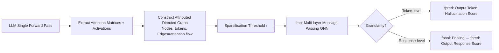

# Neural Message-Passing on Attention Graphs for Hallucination Detection

**Conference**: ICLR 2026  
**OpenReview**: [https://openreview.net/forum?id=4twbqwV4br](https://openreview.net/forum?id=4twbqwV4br)  
**Code**: [https://github.com/Noired/charm](https://github.com/Noired/charm)  
**Area**: Hallucination detection / Graph Neural Networks / LLM Interpretability  
**Keywords**: hallucination detection, attention graph, GNN, message passing, computational traces  

## TL;DR
The authors treat internal attention matrices and activations of LLMs as an "attributed directed graph" (tokens as nodes, attention flow as edges). A GNN is used for message passing to detect hallucinations. It is theoretically proven that this framework encompasses previous attention-based heuristics while empirically surpassing them.

## Background & Motivation
- **Background**: LLM hallucination detection (HD) mainly follows two paths: (1) multiple sampling/self-evaluation (slow and expensive, unsuitable for real-time); (2) utilizing "computational traces" during decoding—primarily linear probes on residual stream activations or heuristics based on attention maps.
- **Limitations of Prior Work**: Attention-based methods (e.g., Lookback Lens, LLM-Check) rely on manual heuristics or shallow classifiers (e.g., logistic regression on the attention Laplacian), which have limited expressiveness. More importantly, existing methods treat different traces (activations, attention, etc.) in **isolation**, ignoring their complementary information.
- **Key Challenge**: Attention is inherently a pairwise relationship between tokens, naturally forming a graph structure. Current methods either flatten these into manual scalar features, losing the structure, or look at single signals, lacking a modern deep learning framework to unify heterogeneous signals while exploiting structure.
- **Goal**: Construct a unified framework representing computational traces as attributed graphs, transforming hallucination detection into a graph learning task applicable at both the token and response levels, while fusing multiple trace signals.
- **Core Idea**: **[Graph Learning Perspective]** Tokens are nodes, and directed edges induced by attention connect them. Nodes carry activation and self-attention features, while edges carry pairwise attention features. A GNN learns directly on this graph, theoretically approximating existing attention heuristics.

## Method

### Overall Architecture
CHARM (Catching HAllucinated Responses via learnable Message-passing) consists of three steps: extract attention matrices and activations from a single LLM forward pass to construct an attributed directed graph; use a message-passing GNN ($f_{\text{mp}}$) to update token representations; finally, perform prediction directly for token-level detection or apply pooling ($f_{\text{pool}}$) and a prediction head ($f_{\text{pred}}$) for response-level detection. The pipeline is $f = f_{\text{pred}} \circ f_{\text{pool}} \circ f_{\text{mp}}$.

### Key Designs

**1. Computational Trace Graph: Unifying internal signals into an attributed graph by bundling "structure + heterogeneous features."** Attention scores $\alpha_{i,j}^{l,h}$ represent pairwise (asymmetric) relationships between tokens. Thus, for any token sequence $\vec{s} = \vec{p} \mid \vec{r}$, a directed graph $G=(V,E)$ is naturally induced: nodes are all tokens, and edges $(T_i, T_j)$ ($i>j$) represent $T_i$ attending to $T_j$ via certain layers/heads. The "attributed" nature is key: edge features are cross-layer/head attention vectors $x_{E,(i,j)} = \alpha_{i,j}$; node features are the token's self-attention scores $\alpha_{i,i}$, concatenated with residual stream activations $a_i^l$, i.e., $x_{V,i} = (\alpha_{i,i} \mid a_i^l)$. This graph encodes both interactions and the computational state of tokens, with the potential to include other traces like logits.

**2. Attention Sparsification: Using threshold $\tau$ to remove weak edges, balancing efficiency and information.** Small attention scores contribute noise and are negligible for updating token representations. Scores below threshold $\tau$ are zeroed, and edges without support from any layer/head are discarded:

$$(X^\tau_E)_{(i,j),(l,h)} = \begin{cases} 0 & \alpha_{i,j}^{l,h} \le \tau \\ \alpha_{i,j}^{l,h} & \text{otherwise} \end{cases}$$

Experiments on NQ show that raising $\tau$ from 0.001 to 0.5 reduces the edge count from ~200k to ~1.1k and memory from 1177MB to 23MB, with minimal AUPR drop. The default $\tau=0.05$ provides the best trade-off.

**3. Message Passing Layer: Local aggregation on the attention graph with prompt/response edge typing.** The $t$-th layer updates token $i$'s representation as:

$$h_i^{(t+1)} = \text{up}_t\!\left(h_i^{(t)},\ \bigoplus_{j:(i,j)\in E} \text{msg}_t\!\left(h_i^{(t)}, h_j^{(t)}, x^\tau_{E,(i,j)}, p_{i,j}\right)\right)$$

Where $\bigoplus$ is a permutation-invariant aggregator (sum/avg/max), $\text{up}_t$ and $\text{msg}_t$ are MLPs, and $h_i^{(0)} = x_{V,i}$. $p_{i,j}$ is a one-hot tag indicating if the edge is "prompt→response" or "response→response," allowing the model to route attention to prompt vs. historical response into different subspaces.

**4. Expressive Power Proof: CHARM encompasses existing heuristics, representing "generalization, not replacement."** The paper proves that a single-layer $f_{\text{mp}}$ CHARM can approximate two representative methods with arbitrary precision: (1) Token-level Lookback Lens, whose features are ratios of prompt vs. response attention; (2) Response-level LLM-Check, whose score is the sum of logs of self-attention scores. This theoretically ensures CHARM is "strictly no weaker" than these manual heuristics.

## Key Experimental Results

### Main Results

**Token-level (Contextual Hallucination, LLaMa-2-7B-chat)**

| Method | NQ AUROC | NQ AUPR | CNN AUROC | CNN AUPR |
|---|---|---|---|---|
| Probas | 49.8 | 16.2 | 54.4 | 8.2 |
| Act-24 | 73.0 | 36.2 | 71.3 | 20.3 |
| Lookback Lens † | 71.9 | 34.3 | 74.4 | 19.7 |
| **Ours (att)** | **74.8** | **40.3** | **75.4** | **22.7** |

**Response-level (Multi-type Hallucination, Mistral-7B-instruct)**

| Method | Movies AUROC | Winobias AUROC | Math AUROC |
|---|---|---|---|
| Act-24 | 77.0 | 76.6 | 77.7 |
| LapEig | 72.9 | 74.1 | 73.6 |
| Ours (att) | 80.3 | 70.4 | 76.5 |
| **Ours (att+act-24)** | 79.7 | **77.8** | **80.8** |

### Ablation Study

**Graph Structure Ablation (Removing message passing, degrading to dense layers on node features)**

| Method | CNN AUROC | CNN AUPR | Math AUROC | Math AUPR |
|---|---|---|---|---|
| Ours (no g.) | 70.8 | 19.2 | 80.6 | 82.7 |
| **Ours** | **75.4** | **22.7** | **81.7** | **83.8** |

### Key Findings
- **Attention is intrinsically powerful**: On contextual datasets (NQ/CNN), the attention-only version CHARM(att) performed better than the version with activations.
- **Synergy between activations and attention**: On Winobias and Math, adding act-24 significantly improved results, suggesting different hallucination types favor different trace combinations.
- **Structure is core**: Removing the graph structure caused AUPR to drop from 22.7 to 19.2 on CNN, verifying the utility of message passing topology.
- **Competitive zero-shot transfer**: In NQ↔CNN cross-dataset transfer, CHARM ranked 1st for CNN→NQ and 2nd for NQ→CNN, outperforming activation probes.
- **Fast inference**: Approximately $10^{-3}$ seconds per sample.

## Highlights & Insights
- **Convincing perspective shift**: Transitioning from "attention graph analysis" (previously descriptive) to "direct learning on attention graphs for downstream tasks" is a natural but overlooked paradigm shift.
- **Theoretical + Empirical loop**: Not only does it outperform existing methods, but it also formally proves the framework encompasses them, justifying the use of a more complex model.
- **Unified granularity**: The same framework handles token-level and response-level detection by toggling $f_{\text{pool}}$, avoiding the need for disparate designs.
- **Engineering friendliness**: Sparsification enables memory adjustment across two orders of magnitude with minimal performance impact.

## Limitations & Future Work
- **Single layer activation only**: Node features only concatenate one layer of activation. Integrating multi-layer activations or logits remains future work.
- **Zero-shot transfer remains open**: No single method consistently leads in cross-dataset scenarios; generalization mechanisms are still unclear.
- **White-box dependency**: Requires access to internal attention/activations, making it inapplicable to closed-source API models.
- **Double-edged sword of activations**: Adding activations dropped performance on contextual datasets; automatic selection of traces is currently lacking.

## Related Work & Insights
- **Heuristic HD**: Lookback Lens, LLM-Check, and Binkowski's spectral methods are unified as special cases of CHARM.
- **Graph views of LLM computation**: While researchers have analyzed signal propagation (representation collapse, oversquashing), this paper advances it to "learning on the graph."
- **Activation Probes**: These are sources for CHARM's node features.
- **Insight**: Any task leaving structured traces (e.g., jailbreak detection, reasoning path analysis) could adopt this "computational trace graph + GNN" paradigm.

## Rating
- **Novelty**: ⭐⭐⭐⭐ Reformulating HD as graph learning on attention graphs is unified and novel.
- **Experimental Thoroughness**: ⭐⭐⭐⭐ Covers two granularities, 5 datasets, multiple hallucination types, and systematic ablations.
- **Writing Quality**: ⭐⭐⭐⭐ Logical progression with clear theoretical propositions.
- **Value**: ⭐⭐⭐⭐ Provides an extensible, white-box, and fast HD framework with methodology applicable to broader LLM internal signal analysis.

<!-- RELATED:START -->

## Related Papers

- [\[ACL 2026\] Hallucination Detection in LLMs with Topological Divergence on Attention Graphs](../../ACL2026/hallucination/hallucination_detection_in_llms_with_topological_divergence_on_attention_graphs.md)
- [\[ICLR 2026\] Enhancing Hallucination Detection through Noise Injection](enhancing_hallucination_detection_through_noise_injection.md)
- [\[ICLR 2026\] HARP: Hallucination Detection via Reasoning Subspace Projection](harp_hallucination_detection_via_reasoning_subspace_projection.md)
- [\[ACL 2025\] HD-NDEs: Neural Differential Equations for Hallucination Detection in LLMs](../../ACL2025/hallucination/hd-ndes_neural_differential_equations_for_hallucination_detection_in_llms.md)
- [\[ICLR 2026\] Learning to Reason for Hallucination Span Detection](learning_to_reason_for_hallucination_span_detection.md)

<!-- RELATED:END -->
## Related Papers

- [\[ACL 2026\] Hallucination Detection in LLMs with Topological Divergence on Attention Graphs](../../ACL2026/hallucination/hallucination_detection_in_llms_with_topological_divergence_on_attention_graphs.md)
- [\[ICLR 2026\] Enhancing Hallucination Detection through Noise Injection](enhancing_hallucination_detection_through_noise_injection.md)
- [\[ACL 2025\] HD-NDEs: Neural Differential Equations for Hallucination Detection in LLMs](../../ACL2025/hallucination/hd-ndes_neural_differential_equations_for_hallucination_detection_in_llms.md)
- [\[ICLR 2026\] VeriTrail: Closed-Domain Hallucination Detection with Traceability](veritrail_closed-domain_hallucination_detection_with_traceable_evidence_synthes.md)
- [\[ICLR 2026\] Learning to Reason for Hallucination Span Detection](learning_to_reason_for_hallucination_span_detection.md)

<!-- RELATED:END -->
