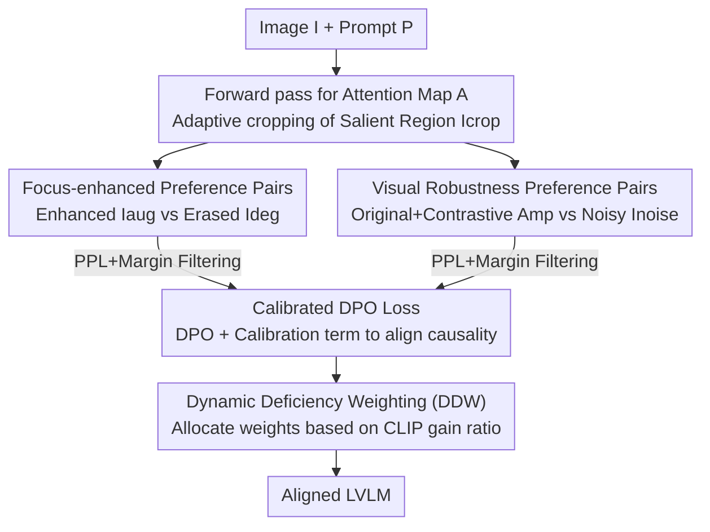

# P2-DPO: Grounding Hallucination in Perceptual Processing via Calibration Direct Preference Optimization

**Conference**: ICLR 2026  
**OpenReview**: [https://openreview.net/forum?id=ekOwxTn65Y](https://openreview.net/forum?id=ekOwxTn65Y)  
**Code**: https://github.com/ZrpChuang/P2-DPO  
**Area**: Multimodal VLM / Alignment RLHF  
**Keywords**: Hallucination suppression, DPO, Preference optimization, on-policy, visual robustness

## TL;DR
P2-DPO enables Large Vision-Language Models (LVLMs) to automatically generate on-policy, vision-grounded preference pairs (focus enhancement + noise resistance) targeting their own perceptual weaknesses. By utilizing a calibrated DPO loss to align the causal relationship between visual signals and text generation, the method outperforms strong baselines trained on expensive human feedback across hallucination benchmarks without relying on any manual annotation.

## Background & Motivation
**Background**: The mainstream approach to suppressing LVLM hallucinations is preference optimization, particularly DPO. This involves using manual or synthetic preference pairs to learn directly from "corrected preferences," pushing model outputs to be more faithful to the image. Data sources typically follow two patterns: post-hoc text revision of model outputs (humans or stronger AI correcting hallucinated answers as winning responses) or synthetic hallucination injection to create contrastive pairs.

**Limitations of Prior Work**: The authors categorize these practices as "Post-hoc Semantic Correction" (PSC) and identify a fundamental flaw: they are vision-agnostic, comparing only textual differences. Since winning and losing responses are often induced by nearly identical visual evidence, their gradients for "vision-dominant parameters" cancel each other out, failing to address the actual root cause in visual processing. Furthermore, because this data comes from external feedback, it is essentially off-policy. If the winning response falls outside the support of the reference model $\pi_{ref}$, the KL constraint in DPO causes the implicit reward to satisfy $\hat{r}_w \to +\infty$, leading to sigmoid weight collapse to 0 and gradient vanishing. Consequently, the most informative samples are often unlearnable.

**Key Challenge**: The authors decompose the visual causes of hallucination into "Perception failure" (the model fails to see key evidence, a capacity limit) and "Perceptual Processing failure" (the model sees the evidence and focuses correctly but fails in the final processing step). While perception failure is widely studied, the "last mile" problem of perceptual processing failure is largely ignored, despite being most suitable for self-correction as the model is already close to the correct answer. Perceptual processing failure manifests in two ways: "perception bottlenecks," where the model answers incorrectly despite correct attention localization, and a "lack of robustness," where the model is hypersensitive to slight image noise.

**Goal**: To construct preference data that is both vision-grounded and on-policy, specifically designed to repair these two perceptual processing shortcomings without manual annotation.

**Key Insight**: Since these are processing failures where the "model is almost right," the model can generate its own preference pairs. By applying causal interventions directly to visual inputs (cropping enhancement, erasure, noise addition) and letting the model generate winning/losing responses, the data becomes naturally vision-grounded and on-policy.

**Core Idea**: Replace off-policy "post-hoc text revision" preference pairs with on-policy visual contrastive preference pairs generated via direct intervention on visual inputs, complemented by a calibration loss to explicitly align the causal chain between visual signals and text generation.

## Method

### Overall Architecture
P2-DPO is a fully self-driven DPO framework independent of external feedback. Given an image $I$ and a prompt $P$, it follows a three-step process: first, a forward pass extracts the attention map of the answer relative to the image to derive various visual inputs (enhancement, degradation, noise); second, the reference model $M_{ref}$ generates two sets of "orthogonal" preference pairs (focus-enhanced and visually robust) under these visual conditions; finally, the model is trained with a combined calibrated DPO loss, using Dynamic Deficiency Weighting (DDW) to assign sample-specific weights to the two signals. This pipeline generates two types of preference pairs from a single image-prompt instance with high efficiency and no manual labeling, followed by quality filtering.

### Key Designs

**1. Vision-grounded on-policy preference pairs: Intervening on images instead of text**

The core foundation addresses the PSC issues of "textual difference → gradient cancellation + off-policy gradient vanishing." The authors formally demonstrate why "Visual Contrastive Preference Generation" (VCPG) is superior. By decoupling parameters into a vision-dominant set $\theta_1$ and a language-dominant set $\theta_2$, the DPO gradient for $\theta_1$ is driven by the difference in log-likelihood gradients $\Delta(\theta_1)$. The expectation $\mathbb{E}[\|\Delta(\theta_1)\|]$ correlates positively with Visual Information Dependency (VID), defined as $I(Y;F_v\mid P,\theta)$. In PSC, winning and losing responses use similar visual evidence ($I(Y^w;F_v)\approx I(Y^l;F_v)$), resulting in small $\|\Delta(\theta_1)\|$. VCPG deliberately creates a "visual information gap" ($I(Y^w;F_v)\gg I(Y^l;F_v)$), increasing the gradient norm and Fisher information $\mathrm{Tr}(F_{\theta_1})$ to provide a strong, precise optimization signal for visual parameters. Since both responses are self-generated, the data is on-policy, avoiding the gradient vanishing caused by sigmoid collapse when $\hat{r}_w\to+\infty$. This is empirically validated using Implicit Preference Strength (IPS): off-policy RLHF-V data has an average IPS of -58.52 with 68.3% negative samples, while the proposed on-policy data maintains positive IPS and low variance, ensuring stable learning.

**2. Focus-enhanced preference pairs: Comparing "seeing clearly" vs. "not seeing clearly"**

Targeting "perception bottlenecks" where localization is correct but the answer is wrong. The authors observe that even during hallucination, attention maps often correctly locate relevant regions. A specific prompt guides the model to focus on key visual areas, followed by a forward pass to obtain the attention map $A$. $A$ is the tensor product of answer-to-token attention $A_{tok}$ and token-to-image attention $A_{img}$ (both averaged across $H$ heads, $\bar{A}=\frac{1}{H}\sum_h A_h$), where $A = A_{tok}\otimes A_{img}$ quantifies the relevance of each image patch. An adaptive cropping algorithm extracts the most salient visual entity $I_{crop}$. Two inputs are then derived: an enhanced input $I_{aug}=\text{Combine}(I, I_{crop})$ which stitches the salient crop back onto the original image to reinforce details, and a degraded input $I_{deg}=\text{Erase}(I, \text{Bbox}(I_{crop}))$ which lightly erases this region. The winning response $y^w_{focus}=M_{ref}(I_{aug}, P_{enh})$ comes from a "clearer perception" state, while the losing response $y^l_{focus}=M_{ref}(I_{deg}, P)$ comes from a state of "targeted destruction of evidence." This isolates the key region as the only variable for precise perceptual processing optimization.

**3. Visual robustness preference pairs: Creating "noise-resistant ideal answers" via contrastive amplification**

Targeting the "lack of robustness" where minor noise causes failure. A three-step process is used: first, Gaussian noise is added to create $I_{noise}=\text{Noise}(I)$, and the model generates a losing response $y^l_{rob}=M_{ref}(I_{noise}, P)$. Second, a high-quality initial response $y^{init}_{rob}=M_{ref}(I, P)$ is generated from the original image. Third, "Contrastive Amplification" refines this into the winning response $y^w_{rob}$. This treats the model looking at the original image as an Expert (EP) and the one looking at the noisy image as an Amateur (AT), amplifying the logit difference at each decoding step within a candidate set $V_{head}$ pre-defined by the expert: $y_t\sim\text{softmax}((1+\lambda_{ca})\cdot\text{logits}_{EP}(y_t)-\lambda_{ca}\cdot\text{logits}_{AT}(y_t))$ for $y_t\in V_{head}(y_{<t})$. This pushes generation towards visual fidelity while maintaining linguistic coherence. During training, both winning and losing responses in this pair are conditioned on the same noisy image $I_{noise}$, teaching the model to provide ideal answers even under noise. Pairs are filtered based on Perplexity (PPL) and a log-probability margin $M=\log p_{ref}(y^w)-\log p_{ref}(y^l)$ within the interval $[\theta_{low},\theta_{high}]$.

**4. Calibrated DPO Loss + Dynamic Deficiency Weighting: Balancing causal alignment and signal components**

Standard DPO only learns correlation signals. The authors add a calibration loss $L_{Calib}$ defined via "perceptual confidence gain" $\Delta\pi(y)\triangleq\log\pi(y\mid I_{aug})-\log\pi(y\mid I_{deg})$. Minimizing $L_{Calib}$ is equivalent to maximizing $\Delta\pi_\theta(y^w_{focus})$, which in turn maximizes the VID of the winning response $I(Y^w_{focus};F^+_v\mid P,\theta)$. The total objective for the focus branch is $L_{focus}=L_{dpo\_focus}+\lambda_{calib}\cdot L_{Calib}$; the robustness branch symmetrically uses $L_{dpo\_rob}$. To balance the two branches (local perception vs. global noise resistance), Dynamic Deficiency Weighting (DDW) is introduced. A pre-trained CLIP model calculates the "perceptual gain ratio" $r=\frac{\text{CLIPScore}(P, I_{crop})}{\text{CLIPScore}(P, I)}$. If $r>1$, it indicates the cropped area is highly relevant and the bottleneck is the primary issue. This is mapped to an adjustment factor $\alpha=\alpha_{max}\cdot\tanh(\frac{r-1.0}{\tau})$, assigning weights $w_{focus/robust}=w_{base}\pm\alpha$. The final objective is $L_{total}=\mathbb{E}[w_{focus}\cdot L_{focus}+w_{robust}\cdot L_{dpo\_rob}]$.

### Loss & Training
- Perception Bottleneck Branch: $L_{focus}=L_{dpo\_focus}+\lambda_{calib}L_{Calib}$. $L_{dpo\_focus}$ follows the standard DPO format, and $L_{Calib}$ handles causal alignment.
- Robustness Branch: $L_{dpo\_rob}$, with winning/losing both conditioned on $I_{noise}$.
- Total Objective: $L_{total}=\mathbb{E}[w_{focus}\cdot L_{focus}+w_{robust}\cdot L_{dpo\_rob}]$, weighted per-sample via DDW.
- Preference data is generated using image-prompt instances from the RLHF-V dataset, but **without using its manual preference labels**, ensuring zero human feedback. The base model is LLaVA-1.5-7B, with validation on Qwen2.5-VL-7B/3B.

## Key Experimental Results

### Main Results
Using LLaVA-1.5-7B, P2-DPO with self-generated data (Self) outperforms strong baselines using human/AI feedback across multiple hallucination benchmarks:

| Dataset/Metric | Base | V-DPO_RLHF-V (Human) | P2-DPO (Self) | Gain vs Base |
|------|------|------|------|------|
| POPE Avg. F1 ↑ | 85.10 | 87.28 | **87.44** | +2.34 |
| HallusionBench aAcc ↑ | 48.16 | 51.63 | **55.62** | +7.46 |
| MMHal Score ↑ | 1.97 | 2.16 | **2.43** | +0.46 |
| AMBER Hal ↓ | 36.4 | 27.3 | 26.7 | −9.7 |
| AMBER F1R ↑ | 62.4 | 64.1 | **70.9** | +8.5 |

Stable gains were also observed on Qwen2.5-VL-3B/7B: on the 7B model, MMHal hallucination rate decreased by 0.03 and HallusionBench aAcc increased by 4.16. For the 3B model, AMBER relational reasoning F1R reached 80.9 (+3.0). The method shows consistent cross-benchmark performance, cross-architecture stability, and zero annotation cost.

### Ablation Study

| Experiment | Configuration | Key Metric | Description |
|------|------|---------|------|
| Perception Bottleneck (TextVQA) | LLaVA-1.5-7B | AFR 14.73 / P-Acc 66.29 | Good localization, poor processing |
| | + DPO_RLHF | 15.57 / 65.71 | P-Acc actually drops |
| | + P2-DPO | **18.71 / 70.10** | AFR +3.98, P-Acc +3.81; bridges perception gap |
| Ablation (POPE F1) | Full P2-DPO | 87.42 | Full model |
| | w/o FEPs | 85.84 | Drop of 1.58 without focus-enhanced pairs |
| | w/o VRPs | 85.27 | Drop of 2.15 without robustness pairs |
| | w/o L_Calib | 86.17 | Drop of 1.25 without calibration loss |
| | w/o DDW | 86.68 | Drop of 0.74 replacing DDW with static weighting |

### Key Findings
- **Dual preference pairs are essential and complementary**: Using only FEPs or VRPs results in performance drops under standard DPO, indicating that perception bottlenecks and robustness are orthogonal weaknesses.
- **On-policy data ensures stable learning**: IPS analysis shows off-policy RLHF-V has a negative average IPS and high negative sample ratio, whereas the proposed on-policy data maintains positive IPS and low variance, quantifying the difference in "learning difficulty."
- **Robustness advantage in low-to-medium noise**: At $\sigma=0.20$, POPE F1 is 4+ points higher than the original LLaVA-1.5-7B, covering the most common real-world noise range.
- All four components (FEPs, VRPs, $L_{Calib}$, DDW) contribute positively to the final performance.

## Highlights & Insights
- **Decomposition of "Perception" vs "Perceptual Processing"**: Provides a clean diagnostic framework that targets "correct attention but wrong answer," a neglected sub-problem ideal for self-correction.
- **Visual intervention solves vision-agnostic and off-policy issues simultaneously**: Using image modification and self-generation addresses major DPO data flaws with a single approach. The use of VID and Fisher information provides a non-heuristic theoretical explanation for stronger gradients.
- **Calibration loss upgrades "correlation" to "causality"**: By explicitly rewarding the dependency of the answer on enhanced visual details via $\Delta\pi$, this approach incorporates causality into the loss, which is transferable to other vision-grounded alignment tasks.
- **DDW diagnoses sample-level weaknesses using CLIP**: Quantifying whether a sample suffers from a bottleneck or robustness issue using a computable ratio allows for tailored correction pressure.

## Limitations & Future Work
- **Dependency on attention map quality**: Focus-enhanced pairs rely on the model's ability to correctly localize key regions. In cases of true perception failure (incorrect attention), cropping might amplify rather than correct errors.
- **Limited to "Perceptual Processing" failures**: The authors explicitly exclude hallucinations caused by "Perception failure" (knowledge/encoder limits), leaving knowledge-based hallucinations unaddressed.
- **Key proofs are in the appendix**: Theoretical arguments for VCPG, $L_{Calib}$ equivalence, and threshold selection are primarily in the appendix; the main text provides heuristic intuition.
- **Hyperparameter sensitivity**: Parameters like $\lambda_{calib}$, $\lambda_{ca}$, and DDW weights require tuning when migrating between base models.

## Related Work & Insights
- **Compared to PSC (e.g., HA-DPO, RLHF-V)**: PSC relies on text revision and is vision-agnostic/off-policy. Ours uses visual intervention and self-generation, ensuring it is vision-grounded and on-policy, outperforming them with zero manual labeling.
- **Compared to Architectural Enhancements**: Those methods involve high costs and low portability. P2-DPO is a training paradigm intervention that is more portable and targeted at specific processing failures.
- **Compared to VCD / Contrastive Decoding**: This method incorporates contrastive decoding techniques (Expert vs Amateur) into the data generation phase rather than using it as a purely inference-time trick.

## Rating
- Novelty: ⭐⭐⭐⭐⭐ Clear diagnostic framework + vision-grounded on-policy data generation.
- Experimental Thoroughness: ⭐⭐⭐⭐ Complete multi-benchmark/base/ablation results, though theoretical proofs are relegated to the appendix.
- Writing Quality: ⭐⭐⭐⭐ Logical flow from motivation to theory to method; occasional heavy notation.
- Value: ⭐⭐⭐⭐⭐ Significant practical value for low-cost LVLM alignment by surpassing human-feedback baselines.

<!-- RELATED:START -->

## Related Papers

- [\[CVPR 2026\] MoD-DPO: Towards Mitigating Cross-modal Hallucinations in Omni LLMs using Modality Decoupled Preference Optimization](../../CVPR2026/hallucination/mod-dpo_towards_mitigating_cross-modal_hallucinations_in_omni_llms_using_modalit.md)
- [\[NeurIPS 2025\] Mitigating Hallucination Through Theory-Consistent Symmetric Multimodal Preference Optimization](../../NeurIPS2025/hallucination/mitigating_hallucination_through_theory-consistent_symmetric_multimodal_preferen.md)
- [\[ICLR 2026\] Cat-PO: Cross-modal Adaptive Token-rewards for Preference Optimization in Truthful Multimodal LLMs](cat-po_cross-modal_adaptive_token-rewards_for_preference_optimization_in_truthfu.md)
- [\[ICLR 2026\] PostAlign: Multimodal Grounding as a Corrective Lens for MLLMs](postalign_multimodal_grounding_as_a_corrective_lens_for_mllms.md)
- [\[ICLR 2026\] Grounding or Guessing? Visual Signals for Detecting Hallucinations in Sign Language Translation](grounding_or_guessing_visual_signals_for_detecting_hallucinations_in_sign_langua.md)

<!-- RELATED:END -->
