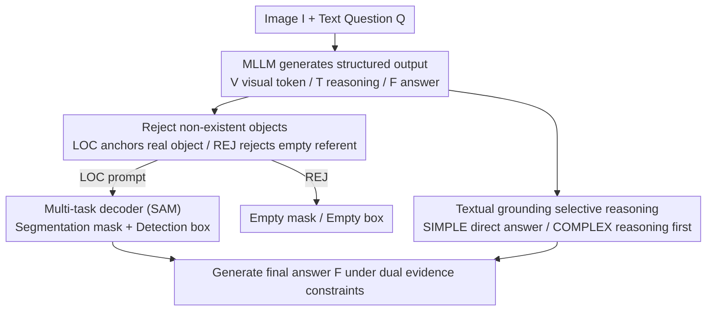

# PostAlign: Multimodal Grounding as a Corrective Lens for MLLMs

**Conference**: ICLR 2026  
**OpenReview**: [https://openreview.net/forum?id=zJnPyb2xrp](https://openreview.net/forum?id=zJnPyb2xrp)  
**Code**: None  
**Area**: Multimodal VLM / Hallucination Mitigation  
**Keywords**: Multimodal Alignment, Hallucination Mitigation, Visual Grounding, Negative Sample Rejection, Selective Reasoning

## TL;DR
PostAlign treats "visual grounding (localization boxes/masks) + textual grounding (reasoning rationale)" as a **corrective lens** post-positioned on MLLMs. It uses a `<REJ>` rejection token to empower the model to reject non-existent objects and employs `<SIMPLE>/<COMPLEX>` routing signals to decide whether to generate intermediate reasoning based on question difficulty, significantly reducing hallucinations on benchmarks like POPE and HaloQuest while preserving general reasoning capabilities.

## Background & Motivation
**Background**: MLLMs (e.g., LLaVA, Qwen2-VL, InternVL) rely on large-scale visual encoders combined with pretrained language models to align images and text, demonstrating impressive performance in captioning, VQA, and visual dialogue.

**Limitations of Prior Work**: When tasks require fine-grained visual understanding or complex reasoning, these models often suffer from "alignment breakdown"—the generated text is not truly anchored to the image content. This results in hallucinations: claiming objects exist when they do not (typical co-occurrence hallucinations, such as identifying a cat on a sofa as a dog when it is actually a cat) or misidentifying attributes and spatial positions.

**Key Challenge**: The root cause is the model's over-reliance on **linguistic priors** rather than actual visual evidence. The paper provides a compelling experiment: when the image input is removed, 89.2% of hallucination tokens are still generated—indicating that hallucinations primarily stem from linguistic statistical associations (which words frequently appear together) rather than visual misinterpretation. In other words, linguistic priors suppress visual information layer by layer during decoding, pushing the model toward "generation based on textual habits."

**Goal**: (1) Enable the model to reject non-existent referents in the image instead of hallucinating them; (2) Facilitate adaptive reasoning intensity based on question difficulty, avoiding redundancy for simple questions while providing sufficient reasoning for complex ones; (3) Maintain the existing general reasoning and generalization capabilities of the MLLM.

**Key Insight**: Instead of designing a new grounding architecture, the authors use grounding outputs **in reverse**. Since hallucinations originate from a lack of visual anchoring, they explicitly provide visual evidence (object localization) and textual evidence (reasoning chains) to the model, using them as constraints to calibrate the final answer.

**Core Idea**: Treat multimodal grounding as "corrective lenses" for MLLMs—visual grounding provides image anchoring cues, and textual grounding provides interpretable rationales. This dual evidence pulls the output back to real visual context, while negative sample rejection and selective reasoning mechanisms precisely target hallucinations and redundant reasoning.

## Method

### Overall Architecture
PostAlign (also referred to as MMGrounded-PostAlign in the paper) is a **post-alignment framework**. It attaches two external evidence sources to an existing MLLM, prompting the MLLM to output a structured sequence $A = \{V, T, F\}$, where $V$ denotes visual grounding tokens, $T$ denotes textual grounding reasoning tokens, and $F$ is the final answer token.

The pipeline operates as follows: Given an image $I$ and a textual question $Q$, the MLLM first outputs a visual grounding token `<LOC>`. Its last-layer embedding is projected via an MLP to serve as a prompt for a **multi-task decoder** (based on SAM ViT-H), which decodes the segmentation mask and detection box of the target object. If the referred object is absent from the image, `<LOC>` is replaced by `<REJ>`, and the decoder is assigned an empty mask/box, skipping the decoding process. Simultaneously, the textual grounding side decides whether to generate an intermediate rationale based on the question difficulty. Finally, both visual evidence (boxes/masks) and textual evidence (rationale) act as implicit constraints to guide the MLLM in generating a final answer anchored in dual-modal evidence. Three main components: MLLM (token generation), visual grounding encoder (dense visual feature extraction), and multi-task decoder (mask + box output).

### Key Designs

**1. Dual Grounding as a Post-Corrective Lens: Treating Localization and Reasoning as Evidence rather than Tasks**

Addressing the root cause of "outputs not anchored in vision," the authors do not optimize the accuracy of the grounding itself but rather treat the **output** of grounding as a constraint signal to calibrate the MLLM. Visual grounding identifies "which object in the image" it is—starting from the last-layer embedding of the `<LOC>` token, projected via an MLP into a prompt embedding, and sent to the multi-task decoder along with dense features from the visual encoder to produce masks and boxes. Textual grounding provides the "reasoning chain before the answer." These two streams of evidence wrap the final answer generation like implicit constraints, pulling the model from "textual sequence completion" back to "viewing the image while reasoning." This is opposite to the approach of Kosmos-2 or Shikra, which "make MLLMs perform grounding." Those works treat grounding as a target task; this work uses grounding results to feed back into the MLLM's visual understanding and hallucination suppression.

**2. Negative Sample Rejection Mechanism: Using the `<REJ>` Token to Empower the Model to Say "Not in Image"**

To counter co-occurrence hallucinations (e.g., hallucinating a "table" upon seeing a "chair"), the authors introduce negative sample rejection. Specifically, when the referred object is missing from the image, the MLLM is forced to predict the `<LOC>` as a dedicated `<REJ>` token. The multi-task decoder then assigns an empty mask and box for `<REJ>`, bypassing the decoding process. To strengthen this capability, a negative sample rejection loss is added:

$$L_{rej} = -\frac{1}{N}\sum_{i=1}^{N}\Big[y_i^{rej}\log p_i^{rej} + (1-y_i^{rej})\log(1-p_i^{rej})\Big]$$

where $y_i^{rej}\in\{0,1\}$ labels whether sample $i$ should be rejected. The brilliance of this design is that once the model is explicitly trained to reject objects that are "linguistically probable but visually non-existent," it is forced to distinguish between "true visual grounding with anchors" and "pseudo-grounding misled by linguistic priors," thereby weakening the over-reliance on linguistic priors at the source. This directly addresses the observation that 89.2% of hallucinations persist even without the image.

**3. Selective Reasoning Mechanism: Using `<SIMPLE>/<COMPLEX>` Routing to Decide Reasoning Necessity based on Difficulty**

Based on the observation that "not all questions require intermediate reasoning," the authors incorporate selective reasoning into textual grounding. During training, questions are categorized into two types with corresponding routing tokens: simple questions (e.g., "What color is the car in the image?") where the model directly outputs `<LOC>` and the final answer, skipping the rationale; and complex questions (e.g., "Which food in the image contains the most protein?") where the model outputs `<LOC>` + `<COMPLEX>` + reasoning chain + answer. During inference, a self-reflection prompt allows the model to assess difficulty and automatically assign labels. This is supported by a selective reasoning loss:

$$L_{reason} = -\frac{1}{N}\sum_{i=1}^{N}\Big[y_i^{rea}\log p_i^{rea} + (1-y_i^{rea})\log(1-p_i^{rea})\Big]$$

where $y_i^{rea}\in\{0,1\}$ indicates whether question $i$ requires generating a rationale. This prevents "overthinking" on simple questions, which slows down inference, while ensuring sufficient reasoning depth for complex ones. Experiments (Table 3) show it outperforms fixed strategies like "always reason" or "never reason" across Easy/Medium/Hard categories in ReasonSeg.

### Loss & Training
The authors fine-tune the MLLM using LoRA while jointly optimizing the multi-task decoder. The visual grounding encoder (SAM ViT-H) is frozen, while token embeddings, the LLM head, projection layers, and mask/box decoders undergo full fine-tuning. The total loss is:

$$L = \lambda_1 L_{rej} + \lambda_2 L_{reason} + L_{ground} + L_{text}$$

where the visual grounding loss $L_{ground}$ consists of a detection loss $L_{det} = L_{smooth\text{-}L1}(\hat{y}_{bbox}, y_{bbox}) + L_{GIoU}(\hat{y}_{bbox}, y_{bbox})$ and a segmentation loss $L_{seg} = L_{BCE}(\hat{y}_{mask}, y_{mask}) + L_{DICE}(\hat{y}_{mask}, y_{mask})$. $L_{text}$ is the cross-entropy loss for language modeling. Training data includes `<SIMPLE>/<COMPLEX>` reasoning type labels for every sample and negative samples containing `<REJ>`.

## Key Experimental Results

Backbones include LLaVA-1.5-7B/13B, Qwen2-VL-7B, Qwen2.5-VL-7B, InternVL3-14B, and InternVL3.5-14B, with SAM ViT-H used for visual grounding. Evaluation is divided into three categories: Hallucinations (HaloQuest, POPE), General Reasoning (MME, MMBench), and Grounding (RefCOCO, ReasonSeg).

### Main Results

PostAlign consistently improves all backbones across POPE (Random/Popular/Adversarial), MME, and MMBench (EN/CN):

| Model | POPE-Ran | POPE-Pop | POPE-Adv | MME | MMBench-EN |
|------|----------|----------|----------|-----|------------|
| LLaVA-1.5-7B | 83.3 | 80.1 | 78.2 | 1504.6 | 62.2 |
| + PostAlign-7B | 86.6 | 84.2 | 82.3 | 1514.3 | 63.9 |
| LLaVA-1.5-13B | 85.4 | 82.2 | 79.2 | 1517.4 | 66.8 |
| + PostAlign-13B | 88.9 | 87.3 | 85.6 | 1520.3 | 68.9 |
| InternVL3-14B | 89.1 | 87.2 | 84.3 | 1762.8 | 84.3 |
| + PostAlign-14B | 91.2 | 89.0 | 86.6 | 1772.3 | 85.5 |

Compared to BTL methods that "unify boxes as language tokens": BTL-Generation shows almost no gains and degrades MME/MMBench (decreased reasoning capability), BTL-Caption yields only minor improvements, whereas the explicit visual grounding module is significantly superior—indicating that treating visual evidence as an "external constraint" is more robust than "learning it within the text sequence."

### Ablation Study

Deconstruction of visual grounding tokens on HaloQuest (LLaVA-1.5-7B baseline, Human Eval):

| Configuration | False Premise | Visually Challenging | Insufficient Context |
|------|---------------|----------------------|----------------------|
| No grounding (Baseline) | 2.0 | 23.5 | 2.5 |
| + `<SEG>` Mask | 6.5 | 30.1 | 7.4 |
| + `<DET>` Box | 8.2 | 31.1 | 6.6 |
| + `<SEG>`+`<DET>` | 9.9 | 33.9 | 9.9 |
| + `<SEG>`+`<DET>`+`<REJ>` | **33.2** | **38.3** | **31.4** |

Comparison of three textual grounding strategies on ReasonSeg (LLaVA-1.5-7B + SAM-ViT-H, gIoU/cIoU):

| Strategy | Easy gIoU | Medium gIoU | Hard gIoU |
|------|-----------|-------------|-----------|
| pre-reasoning | 67.3 | 57.2 | 57.0 |
| inter-reasoning | 64.3 | 55.5 | 53.9 |
| selective reasoning | **68.9** | **58.9** | **57.2** |

### Key Findings
- **`<REJ>` is the primary contributor to hallucination suppression**: In False Premise / Insufficient Context scenarios (which involve many "anti-conceptual" cases, e.g., asking about the breed of a dog that isn't in the image), adding `<REJ>` boosted scores from single digits to 30+, as these categories directly test the ability to reject false premises.
- **Masks and boxes are complementary**: Both `<SEG>` and `<DET>` provide gains individually, and their combination is even higher, indicating that pixel-level and box-level localization yield complementary visual anchors.
- **Selective reasoning wins across all three levels**: Fixed "always reason" (inter-reasoning) was actually the worst, while pre-reasoning was good but computationally expensive; selective reasoning adapts to difficulty, proving both efficient and accurate.
- **No damage to general capabilities**: PostAlign slightly improves scores on MME/MMBench, whereas BTL-Generation significantly drops—post-positioning external evidence is less disruptive to the original model than altering output formats.

## Highlights & Insights
- **The "remove image to verify hallucinations" diagnostic experiment is elegant**: 89.2% of hallucinations persist without the image, cleanly proving that hallucinations stem from linguistic priors rather than visual misreading, directly validating the design of "visual evidence as a corrective lens."
- **The `<REJ>` token makes "rejection" a first-class learnable citizen**: While many works suppress hallucinations via decoding post-processing, this approach allows the model to explicitly generate a rejection signal during generation, which the decoder then treats as null—simple yet effective for "anti-conceptual" scenarios.
- **Reversing the use of grounding is a portable paradigm**: The idea of "not building a new grounding architecture, but using existing grounding outputs as evidence constraints" can be extended to any alignment problem where "output is not anchored in a specific modality" (e.g., audio, documents, tables).
- **Selective reasoning transforms CoT from "all-or-nothing" to adaptive**: Using routing tokens and self-reflection prompts allows the model to self-assess difficulty, avoiding over-reasoning for simple problems. This mechanism could also be applied to reasoning budget allocation in text-only LLMs.

## Limitations & Future Work
- **Dependency on external grounding annotations and SAM decoder**: Training requires mask/box supervision and negative samples with `<REJ>`, making data construction costly; during inference, the additional SAM decoder increases deployment complexity.
- **Reliability of difficulty self-assessment**: The quality of the automatic `<SIMPLE>/<COMPLEX>` classification directly determines the gains of selective reasoning. The paper does not fully quantify misclassification rates, which might degrade performance on boundary cases.
- **Trade-off between rejection threshold and recall is not deeply explored**: A tendency to over-use `<REJ>` might lead to the rejection of real but difficult-to-locate objects. The paper primarily highlights the benefits of rejection without extensive discussion on the costs of "over-rejection."
- **Future Directions**: Explore weak-supervised or self-supervised evidence sources that do not require dense grounding labels, or develop the corrective lens as a pluggable inference-time module to reduce training coupling.

## Related Work & Insights
- **vs Kosmos-2 / Shikra (grounding-as-task)**: These formalize grounding as "text predicting bounding boxes," making the MLLM perform localization. This paper does the opposite, using grounding outputs as evidence to calibrate the MLLM's final answer, aimed at hallucination suppression rather than localization accuracy.
- **vs BTL (boxes unified as language tokens)**: BTL-Generation/Caption embeds box coordinates into text sequences. This paper's experiments show this hurts general reasoning (MME/MMBench drops), whereas an explicit visual grounding module improves hallucination metrics without compromising generalization.
- **vs Decoding post-processing / Specific decoding strategies**: Such methods often perform post-processing during inference, increasing latency and showing poor cross-domain generalization. This paper internalizes rejection and evidence alignment into the model during training, producing anchored outputs directly during inference.

## Rating
- Novelty: ⭐⭐⭐⭐ The combination of "grounding as a corrective lens + `<REJ>` explicit rejection + selective reasoning" is clear; while individual components aren't revolutionary, the whole is very targeted.
- Experimental Thoroughness: ⭐⭐⭐⭐ Covers 6 backbones across Hallucination/Reasoning/Grounding benchmarks with detailed ablations.
- Writing Quality: ⭐⭐⭐⭐ Driven by a diagnostic experiment with sound logic and clear methodological presentation.
- Value: ⭐⭐⭐⭐ Provides a practical training-side solution for "linguistic prior hallucinations" in MLLMs with a portable paradigm.

## Related Papers

- [\[ICLR 2026\] P2-DPO: Grounding Hallucination in Perceptual Processing via Calibration Direct Preference Optimization](p2-dpo_grounding_hallucination_in_perceptual_processing_via_calibration_direct_p.md)
- [\[ICML 2026\] Instruction Lens Score: Your Instruction Contributes a Powerful Object Hallucination Detector for Multimodal Large Language Models](../../ICML2026/hallucination/instruction_lens_score_your_instruction_contributes_a_powerful_object_hallucinat.md)
- [\[ICLR 2026\] Grounding or Guessing? Visual Signals for Detecting Hallucinations in Sign Language Translation](grounding_or_guessing_visual_signals_for_detecting_hallucinations_in_sign_langua.md)
- [\[ICLR 2026\] FREAK: A Fine-grained Hallucination Evaluation Benchmark for Advanced MLLMs](freak_a_fine-grained_hallucination_evaluation_benchmark_for_advanced_mllms.md)
- [\[CVPR 2026\] Evaluating and Easing Hallucinations for GUI Grounding](../../CVPR2026/hallucination/exposing_and_evaluating_hallucinations_for_gui_grounding.md)

<!-- RELATED:END -->

<!-- RELATED:START -->

## Related Papers

- [\[ICLR 2026\] Grounding or Guessing? Visual Signals for Detecting Hallucinations in Sign Language Translation](grounding_or_guessing_visual_signals_for_detecting_hallucinations_in_sign_langua.md)
- [\[ICML 2026\] Instruction Lens Score: Your Instruction Contributes a Powerful Object Hallucination Detector for Multimodal Large Language Models](../../ICML2026/hallucination/instruction_lens_score_your_instruction_contributes_a_powerful_object_hallucinat.md)
- [\[ICLR 2026\] FREAK: A Fine-grained Hallucination Evaluation Benchmark for Advanced MLLMs](freak_a_fine-grained_hallucination_evaluation_benchmark_for_advanced_mllms.md)
- [\[ICLR 2026\] P2-DPO: Grounding Hallucination in Perceptual Processing via Calibration Direct Preference Optimization](p2-dpo_grounding_hallucination_in_perceptual_processing_via_calibration_direct_p.md)
- [\[ICLR 2026\] Dynamic Multimodal Activation Steering for Hallucination Mitigation in Large Vision-Language Models](dynamic_multimodal_activation_steering_for_hallucination_mitigation_in_large_vis.md)

<!-- RELATED:END -->
