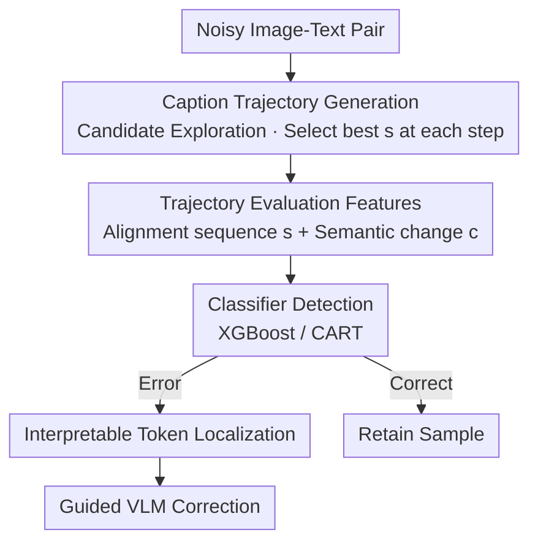

# Seeing What's Wrong: A Trajectory-Guided Approach to Caption Error Detection

**Conference**: ICLR 2026  
**OpenReview**: [https://openreview.net/forum?id=73FGjnKu1P](https://openreview.net/forum?id=73FGjnKu1P)  
**Code**: https://github.com/mazumder-lab/TRACED  
**Area**: Multimodal VLM / Data Cleaning / Image-Text Alignment  
**Keywords**: Caption error detection, image-text alignment, trajectory features, data cleaning, interpretability

## TL;DR
This paper proposes TRACED: instead of judging caption correctness via a single image-text similarity score, it iteratively edits the caption to maximize alignment, generating a "caption trajectory." Features derived from the improvement magnitude and semantic shifts of this trajectory are used to train a classifier. TRACED improves detection accuracy by up to 2.8% on MS COCO, Flickr30k, and MM-IMDb, localizes specific erroneous words, and guides VLMs to increase corrected caption alignment scores by up to 14.5%.

## Background & Motivation
**Background**: Large-scale image-text models like CLIP, BLIP, and LEMoN are trained on millions to billions of web-crawled or synthetic pairs, which contain significant amounts of erroneous captions. Existing "caption filters" typically assign a **single** quality or similarity score (e.g., model confidence, neighborhood consistency, or alignment score), discarding pairs with scores below a certain threshold.

**Limitations of Prior Work**: Single-score methods suffer from a fundamental blind spot—**not all errors are equally easy to detect**. A caption that is mostly correct but contains one wrong word (e.g., changing "wearing a black jacket" to "wearing **no** jacket") might still retain a high BLIP alignment score (e.g., 0.55) and be misclassified as "correct." Conversely, a correct but difficult-to-describe image might receive a low score (e.g., 0.44) and be misclassified as "incorrect." The error signal is lost within a single scalar.

**Key Challenge**: A single similarity score lacks "resolution"—it identifies "how similar the current pair is" but fails to answer **"how much room for improvement exists for this caption."** The authors observe that correct captions are already near-optimal (minimal score increase upon editing), while incorrect captions possess significant improvement potential (alignment scores spike when key errors are corrected). This "improvement potential" is a strong signal for error detection, but it is discarded by single-score methods.

**Goal**: (1) Design a detection signal that captures "improvement potential" and can be integrated with any existing detector; (2) Provide interpretable results by pinpointing specific erroneous words; (3) Utilize this interpretable information for downstream caption correction.

**Key Insight**: Instead of observing a static score, observe how the score and semantics evolve as the caption is "iteratively improved"—shifting detection from reading a single "point" to reading a "curve."

**Core Idea**: Utilize statistical features of a "caption trajectory" (an ordered sequence of captions generated by iteratively editing to maximize alignment) for error detection instead of relying on a single similarity score.

## Method

### Overall Architecture
TRACED addresses the limitations of single-score detection by expanding each image-text pair from "one score" to "one trajectory." Given a potentially noisy pair, the system first **iteratively rewrites the caption** to maximize an alignment scoring function $s$, obtaining a sequence of progressively "better aligned" captions (the trajectory). It then **evaluates this trajectory**, extracting the sequence of alignment scores and the semantic offset of each step relative to the original caption as features. These features train a lightweight classifier to determine if the pair is erroneous. If an error is detected, the system **localizes erroneous tokens** and provides these clues to a VLM to guide correction.

The pipeline is as follows (an exploration strategy generates candidates at each step, $s$ selects the best, and the loop repeats to form the trajectory):

### Key Designs

**1. Caption Trajectory: Separating Correct from Incorrect via "Room for Improvement"**

This is the core pillar of the work. The authors shift the detection target from a "single caption" to a "sequence of captions generated by iterative editing." Formally, given a scoring function $s: \mathcal{X}\times\mathcal{Y}\to\mathbb{R}$ (image-text alignment), starting from the original caption $x_0$, several candidate rewrites are generated at each step. The one with the highest $s$ is chosen as $x_t$, resulting in a trajectory $(x_0, x_1, \dots, x_T)$ (Algorithm 1). The core insight is: **correct captions are near-optimal**, so editing only leads to marginal gains in $s$ with minimal semantic change; **incorrect captions have high improvement potential**, often requiring significant changes to significantly boost $s$. This "degree of improvement vs. magnitude of change" effectively distinguishes errors—providing richer information and better interpretability than $s(x_0,y)$ alone. This framework is flexible, as $s$ can be CLIP cosine similarity, BLIP matching probability, or LEMoN scores.

**2. Candidate Exploration Strategies: Elim, GCD, and Fast GCD**

Trajectory quality depends on how candidates are generated—a trade-off between computational cost and trajectory quality. Three strategies are proposed:
*   **Elimination (Elim)**: For a caption of length $L$, $L$ candidates are generated by deleting one word at a time. This requires only $L$ forward passes and no gradients, making it highly efficient.
*   **Greedy Coordinate Descent (GCD)** (inspired by adversarial attacks): Considers the top-$K$ gradient-guided replacement words for each position. The large candidate pool ($KL$) is randomly sampled to size $N$ for evaluation.
*   **Fast GCD (FGCD)**: A hybrid approach. It first uses Elim to identify the word whose removal most improves $s$, then explores top-$K$ replacements *only* for that word. This requires 1 gradient backprop + $K+L$ forward passes, significantly lower than GCD.
In experiments, the simple **Elim often provides the most informative trajectories**, as word deletion directly reflects the "positive/negative contribution" of each word, and the restricted search space provides a regularization effect.

**3. Trajectory Evaluation Features & Classification: Dual Signals of s and c**

The trajectory must be compressed into discriminative features. The authors define an evaluation function $e(x_0,\dots,x_T,y)\in\mathbb{R}^d$ using two types of signals: **alignment score sequence** $s(x_0,y),\dots,s(x_T,y)$ (characterizing "how much can it improve") and **semantic similarity** $c(x_t,x_0)$ (cosine similarity of CLIP or BLIP-ITC embeddings, characterizing "how much was changed"). The final feature vector is:

$$e = [\,s(x_0,y),\dots,s(x_T,y),\; c(x_1,x_0),\dots,c(x_T,x_0)\,]$$

Ablations show that using either signal alone is suboptimal. Correct captions show "marginal gain + small change," while incorrect ones show "large gain + large change." The combined features are fed into a classifier (XGBoost/CART) for a 3-fold grid search cross-validation to output "error/no error."

**4. Interpretable Token Localization and Guided VLM Correction**

Trajectories also pinpoint "which word is wrong." In an Elim trajectory, **words whose removal leads to the highest alignment gains are often the error sources**. For example, removing "no" might cause the BLIP score to jump from 0.55 to 0.99. This token-level localization is used for correction: if removing a word increases $s$, it is likely an error; if it decreases $s$, it is likely correct. This "suspicious word list" is fed into a VLM prompt to guide the correction process (optionally using CoT). For large-scale cleaning, a teacher model (InternVL3-14B) is distilled into a smaller model (InternVL3-1B) using TRACED-guided corrections.

### Case Study: Localizing "no"
Original noisy caption: "A man is standing in front of a brick storefront wearing **no** jacket." The initial BLIP score is 0.55 (likely to be misjudged as correct). The Elim trajectory iteratively deletes words: deleting "no" drastically increases alignment. By step 6, the score is near-optimal. The "significant improvement + semantic jump upon word removal" allows the classifier to flag it as an error and highlight "no" as the source—an insight invisible to the static 0.55 score.

## Key Experimental Results

### Main Results
Setup: 50% noise injected into clean datasets. Three noise types: random (entirely different caption), noun (captions sharing nouns), and fine-grained (minimal but semantically significant perturbations via GPT-4o-mini). TRACED is applied to CLIP, LEMoN, and BLIP baselines.

| Dataset | Baseline Method | Baseline Acc(%) | +TRACED(Elim) | Gain |
|--------|---------|------------|---------------|------|
| Flickr30k | BLIP(ITM) | 88.5 | 89.5 | +1.3 |
| Flickr30k | CLIP | 83.8 | 85.7 | **+2.8** |
| MS COCO | BLIP(ITM) | 89.1 | 90.5 | +1.7 |
| MS COCO | CLIP | 82.7 | 84.5 | +2.5 |
| MM-IMDb | LEMoN(FIX) | 76.5 | 78.3 | +2.4 |

Average improvements: MS COCO up to +2.5%, Flickr30k up to +2.8%, MM-IMDb up to +2.4%. Improvements are consistent across all baselines.

### Ablation Study

| Configuration | Key Finding | Description |
|------|---------|------|
| $s$ only / $c$ only | Suboptimal | A single signal cannot distinguish "small change/small gain" from "large change/small gain." |
| Combined $s+c$ | Consistently Best | Complementary signals of alignment gain and semantic shift. |
| Elim vs. GCD/FGCD | Elim Best | Word deletion provides "cleaner" signals; GCD induces "high-scoring but meaningless" noise. |
| Fine-grained Noise | Largest Gain | TRACED shows the most benefit (+7.5%) where baselines struggle most. |
| Trajectory Length $T$ | Sensitive Parameter | Increasing $T$ improves performance, but small $T$ is often sufficient for localization. |

Correction Application: Feeding token-level clues to InternVL3 increases the BLIP score of corrected captions by up to **+14.5%** over unguided correction.

Efficiency: TRACED is highly parallelizable. Using Elim with BLIP(ITM), 1 million pairs can be classified in approximately **6.5 hours** using 4 L40 GPUs.

### Key Findings
- The primary contribution is the "trajectory" representation: shifting to trajectory features universally improves performance, especially for fine-grained noise where single scores fail.
- Simple Elim often outperforms complex strategies: restricted search spaces provide regularization and cleaner signals of word contribution.
- TRACED is sensitive to $T$ but does not require large $T$, as key error words are typically identified within the first few steps.

## Highlights & Insights
- **From Point to Curve**: The core insight—correct captions are hard to improve while incorrect ones are easy—is simple but powerful. It naturally provides interpretability (which step caused the spike = which word was wrong).
- **Model-Agnostic and Plug-and-Play**: Any existing detector's score can serve as $s$. TRACED is a "booster" rather than a replacement, allowing CLIP, BLIP, and LEMoN to benefit directly.
- **Unified Detection and Correction**: The same Elim trajectory performs detection, localizes errors, and guides VLM correction—an efficient "one-stop" solution for data cleaning.
- **Realistic Noise Benchmark**: Using GPT-4o-mini to create "plausible but slightly wrong" noise is more representative of real-world annotation errors than previous random replacement methods.

## Limitations & Future Work
- Evaluation is based on **synthetic noise** (at a fixed 50% rate). Real-world datasets may have varying noise distributions and rates that require further validation.
- Generating a trajectory for every pair (multiple forward passes) is more computationally expensive than a single score, though parallelizable. The cost-benefit ratio for billion-scale datasets needs assessment.
- Only simple classifiers like XGBoost/CART were used; more powerful models might further enhance performance.
- Correction depends on the VLM's ability to utilize "suspicious word" clues. If the VLM is weak or the clues are noisy, the correction benefit might decrease.

## Related Work & Insights
- **vs. Single-Score Detectors (CLIP/BLIP/LEMoN)**: These provide static scores. TRACED uses these scores as $s$ but analyzes the "improvement process" to capture subtle errors missed by static alignment.
- **vs. Adversarial/Coordinate Descent Editing**: While TRACED borrows candidate generation from this field, its goal is not to "attack" the model but to "construct a discriminative trajectory."
- **vs. Caption Correction Methods**: Traditional methods treat detection and correction as separate tasks. TRACED provides specific "disease coordinates" (wrong words), enabling more precise editing by downstream VLMs.

## Rating
- Novelty: ⭐⭐⭐⭐⭐ Reconceptualizing detection as an "improvement trajectory" is a fresh and effective perspective.
- Experimental Thoroughness: ⭐⭐⭐⭐ Extensive datasets and baselines; however, lacks validation on purely natural (non-synthetic) noise distributions.
- Writing Quality: ⭐⭐⭐⭐⭐ Excellent motivation using Figure 1, with clear progression from methodology to interpretability.
- Value: ⭐⭐⭐⭐ Plug-and-play capability with interpretable outputs makes it highly practical for large-scale multimodal data cleaning.

<!-- RELATED:START -->

## Related Papers

- [\[AAAI 2026\] Ground What You See: Hallucination-Resistant MLLMs via Caption Feedback, Diversity-Aware Sampling, and Conflict Regularization](../../AAAI2026/hallucination/ground_what_you_see_hallucination-resistant_mllms_via_caption_feedback_diversity.md)
- [\[ICLR 2026\] Imitating the Truth: Attention-aware Truth-Guided Enhancement for Hallucination Mitigation in Large Vision-Language Models](imitating_the_truth_attention-aware_truth-guided_enhancement_for_hallucination_m.md)
- [\[ICLR 2026\] Enhancing Hallucination Detection through Noise Injection](enhancing_hallucination_detection_through_noise_injection.md)
- [\[ICLR 2026\] Learning to Reason for Hallucination Span Detection](learning_to_reason_for_hallucination_span_detection.md)
- [\[ICLR 2026\] Neural Message-Passing on Attention Graphs for Hallucination Detection](neural_message-passing_on_attention_graphs_for_hallucination_detection.md)

<!-- RELATED:END -->
