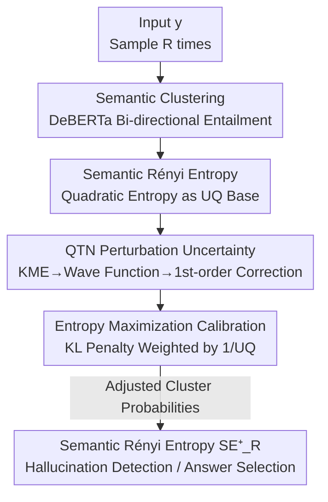

# Semantic Uncertainty Quantification of Hallucinations in LLMs: A Quantum Tensor Network Based Method

**Conference**: ICLR 2026  
**OpenReview**: [https://openreview.net/forum?id=11kPIEkj75](https://openreview.net/forum?id=11kPIEkj75)  
**Code**: https://github.com/pragasv/semantic-entropy-UQ-  
**Area**: LLM Hallucination Detection / Uncertainty Quantification  
**Keywords**: Hallucination Detection, Semantic Entropy, Uncertainty Quantification, Quantum Tensor Network, Entropy Maximization

## TL;DR
To address the blind spot where semantic entropy ignores the "stochastic fluctuations of token sequence probabilities themselves," this paper embeds the kernel mean embedding (KME) of sequence probabilities as a wave function of a Quantum Tensor Network (QTN). It employs perturbation theory to calculate the local uncertainty of each probability in a one-shot manner. These probabilities are then calibrated via "entropy maximization + KL penalty weighted by inverse uncertainty" to derive an interpretable Semantic Rényi Entropy that is more sensitive to confabulation. Across 116 experimental setups involving 4 datasets, 8 models, and 3 quantization levels, the method consistently outperforms SOTA in AUROC/AURAC.

## Background & Motivation
**Background**: LLMs generate "confabulation"—fluent but unreliable content where answers drift randomly under the same prompt. The mainstream unsupervised approach for detecting such hallucinations is **Semantic Entropy (SE)**: multiple responses are sampled for the same question, clustered into semantically equivalent groups using bi-directional entailment (DeBERTa), and the Shannon entropy of the cluster distribution is calculated. Higher entropy indicates a higher likelihood of hallucination. Subsequent works like KLE, SNNE, and SD have improved similarity metrics and clustering methods.

**Limitations of Prior Work**: Existing methods treat token sequence (TS) probabilities $P(s\mid y)$ as deterministic inputs to calculate entropy, **without considering the aleatoric uncertainty of these probabilities**. However, when repeating the same prompt, sequence probabilities jitter due to irrelevant factors like random seeds or phrasing; as long as the probabilities are unstable, the derived semantic entropy remains unreliable. Consequently, high entropy does not always indicate a true hallucination, and low entropy can result from overconfidence, making it difficult to reduce false positives and negatives.

**Key Challenge**: Hallucination risk should ideally depend on "how sensitive sequence probabilities are to model perturbations"—a **local** sensitivity issue that global entropy thresholds (e.g., "hallucination if entropy > $\tau$") naturally fail to capture. Furthermore, classical Bayesian Deep Learning (BDL) tools for UQ are difficult to calibrate, and next-token probabilities do not behave like true categorical probabilities. Additionally, variational inference via stochastic sampling is prohibitively expensive for large-scale LLMs.

**Goal**: To provide a **local, interpretable, one-shot (no multiple samplings required)** uncertainty measure for each TS probability and integrate it into entropy calculations, making the final semantic entropy more sensitive to confabulations.

**Key Insight**: Drawing from physics-inspired UQ (Principe 2010)—treating the kernel mean embedding (KME) of a probability distribution as a wave function of a quantum system. By **perturbing this system**, the local sensitivity of the distribution to infinitesimal perturbations can be read from the first-order corrections of the eigenstates/eigenenergies. If the eigenstate is unstable under perturbation, the corresponding probability is uncertain.

**Core Idea**: Treat TS probabilities as wave functions of a Quantum Tensor Network, use perturbation theory to calculate the local uncertainty of each probability in one shot, and then use entropy maximization to push high-uncertainty regions toward high entropy while anchoring low-uncertainty regions to their original values. This yields an "uncertainty-aware" Semantic Rényi Entropy as the hallucination indicator.

## Method

### Overall Architecture
The method solves the problem of "**incorporating the stochastic fluctuations of sequence probabilities into semantic entropy**." The entire pipeline is deterministic and one-shot: the input $y$ is sampled $R$ times to obtain $R$ generations; semantic clustering is performed via DeBERTa bi-directional entailment. Unlike previous works using Shannon entropy, **Semantic Rényi (quadratic) entropy** is used as the mathematical foundation for the physics-inspired UQ. All TS probabilities are embedded into an RKHS via KME as a QTN wave function. **Perturbation theory** is then used to calculate the local uncertainty $\mathrm{UQ}(p_s^{(r)})$ for each probability $p_s^{(r)}$. Finally, **entropy maximization calibration** is applied, using a KL penalty weighted by inverse uncertainty to adjust probabilities toward "maximum entropy." This results in adjusted cluster probabilities $p_c^{(j)*}$, from which $\mathrm{SE}_R^+$ is calculated for hallucination detection and answer selection.

### Key Designs

**1. Semantic Rényi Entropy: Converting Entropy to a Quadratic Form for the UQ Framework**

Clustering follows the classical approach: sample the input $y$ repeatedly and cluster semantically equivalent generations $C$ using DeBERTa. The cluster probability is $p_c^{(j)} = P(c_j\mid y) = \frac{\sum_{s\in c_j}P(s\mid y)}{\sum_{j}\sum_{s\in c_j}P(s\mid y)}$. To integrate the physics-inspired UQ, an entropy form that can be expressed as a KME and corresponds directly to an "expectation" is required; Shannon entropy does not satisfy this. Thus, **quadratic Rényi entropy** is used: $S_{E_R}(y) = -\log\sum_j p_c^{(j)2} = -\log(\mathbb{E}[p_c])$. This is a direct measure of distributional uncertainty, and $\sum_j p_c^{(j)2}$ can be approximated by the empirical KME of a Gaussian kernel $\hat\psi_y(x)=\frac{1}{R}\sum_r \kappa_\sigma(p_s^{(r)};x)\,p_s^{(r)}$. This step bridges "entropy" and "wave functions," which is the prerequisite for QTN perturbation.

**2. QTN Perturbation Uncertainty: Quantifying Local Sensitivity via Wave Function First-order Corrections**

This is the core innovation, targeting the blind spot of unquantified sequence probability instability. The empirical KME $\{\hat\psi_y\}$ is treated as an eigen-mode of a QTN Hamiltonian $\hat H$. **Perturbing $\hat H$ is equivalent to perturbing the underlying TS probability distribution**; the first-order correction of the eigen-mode/eigen-energy reflects the sensitivity of the distribution to infinitesimal changes. Specifically, a first-order uncertainty "feature" vector is constructed:

$$V_m^{(1)}(x) = E_m^{(1)} + \frac{\sigma^2}{2}\frac{\nabla_m^2|\psi_m^{(1)}(x)|}{|\psi_m^{(1)}(x)|},\quad E_m^{(1)} = -\min_{p_x}\frac{\sigma^2}{2}\frac{\nabla_m^2|\psi_m^{(1)}(x)|}{|\psi_m^{(1)}(x)|}$$

Where the Laplacian $\nabla_m^2|\psi_m^{(1)}(x)|$ measures the local change of the first-order correction relative to the mean. $V_m^{(1)}(x)$ can be viewed as the "spectrum" of uncertainty across probability amplitudes. Finally, $p_s^{(r)}$ is mapped to $x^{(r)}$ in the RKHS, and the average of the adjacent $M$ modes (the paper uses $M=8$) is taken as the uncertainty: $\mathrm{UQ}(p_s^{(r)}) = \frac{1}{M}\sum_m V_m^{(1)}(x)\big|_{x=x^{(r)}}$. Large first-order corrections imply high instability; small ones imply local stability. Compared to Bayesian/sampling UQ, this is **deterministic, one-shot, and physically interpretable**.

**3. Entropy Maximization Calibration: Pushing Probabilities toward Max-Entropy via Inverse-UQ Weighting**

Having $\mathrm{UQ}$ is not enough; it must be integrated into the probabilities. This is done via the principle of maximum entropy: when information is partial, the maximum entropy distribution is the "least biased" estimate. For each probability, the following is solved:

$$p_s^{(r)*} = \arg\max_{\hat p_s^{(r)}}\Big\{-\log\big(\hat p_s^{(r)2} + (1-\hat p_s^{(r)})^2\big) - \lambda\cdot\frac{1}{\mathrm{UQ}(p_s^{(r)})}\cdot \mathrm{KL}(\hat p_s^{(r)}\,\|\,p_s^{(r)})\Big\}$$

The first term is the Rényi entropy (pushing toward high entropy/non-arbitrariness), and the second term is a KL penalty pulling the adjusted value $\hat p_s^{(r)}$ back to the empirical $p_s^{(r)}$. Crucially, **the penalty strength is scaled by $1/\mathrm{UQ}$**: when uncertainty is high, the KL penalty relaxes and the entropy term dominates, pushing the probability toward max-entropy; when uncertainty is low, the KL penalty tightens, anchoring the probability to the original value. This prevents blind flattening of all probabilities while correctly handling unreliable regions. The resulting $\mathrm{SE}_R^+$ corrects the overestimation bias of confabulation, leading to more reliable detection.

### An Example: "Which oil-producing country is a close ally of the US?"
Asking this question 10 times yields generations like Russia / Saudi Arabia (×4) / Iran / Kuwait / Qatar / Iraq. Cluster probabilities $p_c^{(j)}$ are calculated; Saudi Arabia, the correct answer, originally holds $0.888$. Hallucinated answers like Qatar, Iraq, and Iran have non-trivial total mass, causing standard $S_{E_S}$ to **underestimate** confabulation risk. After uncertainty-aware calibration, the probabilities of high-uncertainty hallucinations are suppressed, and the cluster probability of Saudi Arabia rises to $0.859$. The overall entropy estimate $S_E^+$ (0.130) is systematically lower than NE (0.846) and $S_{E_S}$ (0.225)—enabling the selection of high-certainty, semantically consistent answers even when hallucinations are present in the pool.

## Key Experimental Results

Experiments cover TriviaQA, NQ-Open, SVAMP, and SQuAD across 8 models (Mistral-7B/instruct, Falcon-rw-1B, LLaMA-3.2-1B, LLaMA-2-7B/13B, and chat versions), totaling 116 scenarios. Metrics include AUROC, AURAC, and RAC.

### Main Results
| Evaluation Dimension | Ours | Baselines | Conclusion |
|--------|--------|----------|------|
| AUROC (Correct vs. Incorrect) | SRE-UQ ($\mathrm{SE}_R^+$) | NE / $S_{E_S}$ / DSE / KLE etc. + supervised ER, p(True) | Competitive across all models; exceeds supervised methods **without requiring ground-truth labels**. |
| AURAC (AU Accuracy Curve under Rejection) | SRE-UQ | Same as above | Accuracy remains higher as high-uncertainty outputs are filtered; superior to discrete SE, naive entropy, and supervised p(True). |
| Robustness (16/8/4-bit quantization) | SRE-UQ | Same as above | Relative ranking of methods remains stable across three quantization levels; outperforms or matches SOTA under compression. |

### Ablation Study
| Configuration | Key Metric | Description |
|------|---------|------|
| $\mathrm{SE}_R^+$ (with UQ Calibration) | Lowest entropy estimation, highest AUROC/AURAC | Full method. |
| $S_{E_R}$ (Rényi only, no UQ Calibration) | Second to $\mathrm{SE}_R^+$ | Removing UQ integration leads to overestimation of confabulation risk. |
| $S_{E_S}$ / DSE / NE (Shannon/Discrete/Naive) | More likely to underestimate confabulation | Classical semantic entropy baselines. |
| 4-bit Quantization vs. 16-bit | Slight dip in absolute AUROC | Quantization coarsens calibration, but relative ranking remains unchanged. |

### Key Findings
- **Quantization Robustness** is a dimension unexamined by previous works: absolute AUROC drops slightly at 4-bit, but the relative advantage of the method holds, suggesting the gains are not artifacts of precision settings—relevant for edge/mobile deployment.
- **Entropy change is non-uniform across the input space**: low-entropy regions (near 0) are stable, while intermediate ranges (especially 0.25–0.50) show the highest fluctuations—models often toggle between multiple "confident but semantically opposing" answers in this range. A single global entropy threshold is fragile; these high-risk zones require caution.
- Uncertainty integration systematically reduces entropy estimates and corrects overestimation bias, making it possible to select high-certainty answers even during hallucinations—a feat previous works failed to achieve.

## Highlights & Insights
- **Linking hallucination detection to quantum perturbation theory**: Use the first-order correction of wave function eigenstates under perturbation to measure "how unstable a probability is," providing a deterministic, one-shot, and interpretable local UQ that avoids the pitfalls of BDL and sampling.
- **Uncertainty is not just a score, but a KL penalty scaler**: The $1/\mathrm{UQ}$ weighting ensures calibration only where necessary. This "inverse weighting of constraint terms via auxiliary signals" is transferable to other scenarios requiring confidence-based output adjustments.
- **Switching from Shannon to Quadratic Rényi Entropy** allows the entropy to be formulated as a KME—a deliberate mathematical alignment to fit the physics-inspired framework.

## Limitations & Future Work
- Restricted by compute, evaluations focused on smaller models (≤13B), which may not fully reflect the absolute detection precision of frontier models like GPT-4 or Claude.
- Semantic clustering relies on external entailment models (DeBERTa-large + MNLI); errors in entailment propagate to entropy estimation.
- The method requires access to **token-level probabilities**, making it inapplicable to black-box APIs that only provide text without logprobs.
- Details regarding QTN perturbation, the choice of $M=8$ modes, and $\lambda$ are moved to the appendix; the main text lacks comprehensive sensitivity analysis.

## Related Work & Insights
- **vs. Semantic Entropy SE (Farquhar 2024) / Discrete SE (DSE)**: These treat TS probabilities as deterministic inputs to Shannon entropy, ignoring stochastic fluctuations; Ours uses Rényi entropy + QTN perturbation to explicitly quantify and calibrate this aleatoric uncertainty.
- **vs. KLE / SNNE / SD**: These improve similarity metrics and aggregation but remain sensitive to clustering quality and TS probability jitters; Ours models uncertainty directly at the probability level.
- **vs. Structure-aware/Perturbation-based (Graph Uncertainty, SPUQ, SIP)**: These rely on external knowledge graphs or repeated paraphrasing, which are expensive; Ours is a one-shot deterministic calculation.
- **vs. Supervised ER, p(True)**: These require labels/few-shot training and generalize poorly to OOD data; Ours is unsupervised yet outperforms them in AUROC/AURAC.

## Rating
- Novelty: ⭐⭐⭐⭐⭐ First to introduce aleatoric uncertainty of TS probabilities into hallucination detection via QTN perturbation theory for deterministic, interpretable local UQ.
- Experimental Thoroughness: ⭐⭐⭐⭐ 116 setups across 4 datasets, 8 models, and 3 quantization levels; includes under-explored dimensions like quantization and generation length.
- Writing Quality: ⭐⭐⭐⭐ The motivation and "intuition" sections explain the physical analogy clearly; however, the QTN formulas are heavy and rely on the appendix for derivation.
- Value: ⭐⭐⭐⭐ Unsupervised, one-shot, and robust to quantization; suitable for resource-constrained deployment, though limited by reliance on token probabilities for closed APIs.

<!-- RELATED:START -->

## Related Papers

- [\[ICLR 2026\] Estimating Semantic Alphabet Size for LLM Uncertainty Quantification](estimating_semantic_alphabet_size_for_llm_uncertainty_quantification.md)
- [\[ICLR 2026\] HalluGuard: Demystifying Data-Driven and Reasoning-Driven Hallucinations in LLMs](halluguard_demystifying_data-driven_and_reasoning-driven_hallucinations_in_llms.md)
- [\[ICLR 2026\] Critical Confabulation: Can LLMs Hallucinate for Social Good?](critical_confabulation_can_llms_hallucinate_for_social_good.md)
- [\[ICLR 2026\] GHOST: Hallucination-Inducing Image Generation for Multimodal LLMs](ghost_hallucination-inducing_image_generation_for_multimodal_llms.md)
- [\[ICLR 2026\] High Accuracy, Less Talk (HALT): Reliable LLMs through Capability-Aligned Finetuning](high_accuracy_less_talk_halt_reliable_llms_through_capability-aligned_finetuning.md)

<!-- RELATED:END -->
