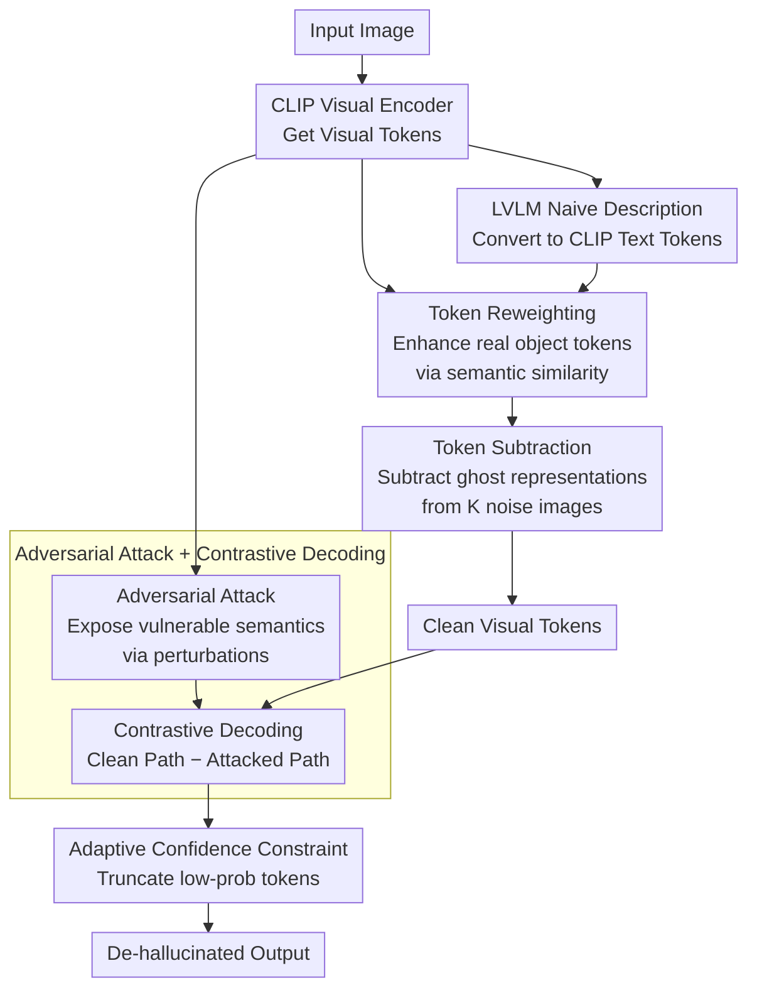

# SHIELD: Suppressing Hallucinations In LVLM Encoders via Bias and Vulnerability Defense

**Conference**: ICLR 2026  
**arXiv**: [2510.16596](https://arxiv.org/abs/2510.16596)  
**Code**: [GitHub](https://github.com/hukcc/SHIELD)  
**Area**: Hallucination Detection  
**Keywords**: LVLM Hallucination, Visual Encoder, Statistical Bias, Inherent Bias, Adversarial Robustness, Contrastive Decoding, Training-free

## TL;DR

This work systematically traces LVLM object hallucinations back to the visual encoder for the first time, identifying three major issues: statistical bias (over-emphasis on high-frequency pattern tokens), inherent bias (residual representations of dominant pre-training objects), and vulnerability (feature distortion caused by minor perturbations). It proposes SHIELD, a training-free framework that synergistically defends against these via token re-weighting, token subtraction, and contrastive decoding, outperforming methods like VCD and OPERA on LLaVA-1.5, InstructBLIP, and Qwen-VL.

## Background & Motivation

**Background**: Large Vision-Language Models (LVLMs) excel at cross-modal tasks, but object hallucinations—generating plausible but non-existent object descriptions—hinder their deployment in safety-sensitive fields such as medicine, autonomous driving, and robotics.

**Limitations of Prior Work**: Existing mitigation methods fall into two categories: training-based methods (CLIP-DPO, LURE, LLaVA-RLHF) which are resource-intensive, and training-free methods (VCD using blurred image contrast, OPERA using over-trust penalties, HALC using adaptive focus contrastive decoding) which are efficient but focus almost exclusively on LLM components, largely ignoring the role of the visual encoder.

**Key Insight — Statistical Bias**: Due to uneven pre-training data distribution, CLIP visual encoders over-emphasize tokens corresponding to high-frequency visual patterns (abnormally high L2 norms). This causes the downstream LLM's attention to be "hijacked" by these over-activated tokens, distorting fine-grained perception. Experiments show that higher peak-to-average L2 ratios correlate with higher hallucination rates.

**Key Insight — Inherent Bias**: Encoders develop "ghost representations" of dominant objects from pre-training data. Even with pure random noise input, LLaVA-1.5 identifies high-frequency objects like "car", "chair", and "table", indicating that the encoder carries input-independent erroneous priors.

**Key Insight — Vulnerability**: Visual encoders lack sufficient noise/perturbation robustness. Experiments show that on the POPE COCO subset, just a few steps of PGD adversarial attack cause the F1 score to drop from approximately 87 to below 70, where small perturbations lead to severe feature distortion.

**Core Idea**: Three problems are addressed with three solutions—token re-weighting to correct statistical bias, token subtraction to eliminate inherent bias, and adversarial contrastive decoding to handle vulnerability—forming a comprehensive "encoder-side defense line" against hallucinations.

## Method

### Overall Architecture

SHIELD addresses object hallucinations by identifying that they occur not only at the LLM decoding end but are rooted in three "mines" within the visual encoder: statistical bias, inherent bias, and vulnerability. SHIELD is a training-free framework that moves the defense forward to the visual tokens, applying four sequential processing steps.

The pipeline operates as follows: an input image passes through the CLIP visual encoder to obtain visual tokens; simultaneously, the original LVLM generates a naive description of the image, converted into CLIP text tokens. Then, **Token Reweighting** uses text-visual semantic similarity to boost tokens of real objects and suppress high-norm noise tokens. **Token Subtraction** removes ghost representations estimated from random noise. During decoding, **Adversarial Attack + Contrastive Decoding** actively constructs perturbations to expose vulnerable semantics, subtracting the attacked path from the clean path. Finally, **Adaptive Confidence Constraint** truncates low-probability tokens amplified by contrast to provide a safeguard.

### Key Designs

**1. Token Reweighting: Preventing suppression of real object tokens by high-norm tokens**

Statistical bias manifests as a few tokens hijacking LLM attention due to excessive L2 norms, causing the model to ignore real objects. SHIELD generates a naive description $\mathbf{c}^{\text{naive}}$ using the original LVLM, converts it into $P$ text tokens $\mathbf{c}$ using a CLIP text encoder, and calculates a cosine similarity matrix $\mathbf{M}\in\mathbb{R}^{N\times P}$ with $N$ visual tokens $\mathbf{x}^v$. For each visual token, the maximum similarity across all text tokens is normalized into a weight $\mathbf{W}^v$ and added back residually: $\mathbf{x}^{v\prime} = \mathbf{x}^v + \mathbf{x}^v \odot \mathbf{W}^v$. This enhances tokens of objects actually present in the description. Notably, while naive descriptions may contain hallucinations, hallucinated objects lack corresponding visual content and won't match high-similarity visual tokens, providing a self-cleaning property.

**2. Token Subtraction: Removing input-independent ghost representations**

Inherent bias stems from residual memory of dominant pre-training objects. SHIELD passes $K$ random noise images through the encoder and averages the output tokens to estimate the ghost representation, which is then subtracted from the re-weighted tokens: $\mathbf{x}^{v\prime\prime} = \mathbf{x}^{v\prime} - \frac{1}{K}\sum_{i=1}^{K}E(\mathbf{n}_i)$ (where $K=32$ in implementation). Since this estimate is input-independent, it can be pre-computed offline, adding near-zero overhead during inference.

**3. Adversarial Attack + Contrastive Decoding: Offsetting vulnerability-induced hallucinations**

The encoder's lack of robustness is exploited by constructing a perturbation $\delta^*$ that minimizes the alignment between the global image representation and the naive description: $\ell_{\text{adv}} = \cos(E(\mathbf{v}+\delta), E_t(\mathbf{c}^{\text{naive}}))$. This yields "attacked" visual tokens $\bar{\mathbf{x}}^v = E(\mathbf{v}+\delta^*)$ which expose the most vulnerable semantic regions. During decoding, logits from clean and attacked paths are contrasted: $p_{\text{shield}}(y_i) = \text{softmax}\big[(1+\alpha)\cdot\text{logit}(y_i\mid\mathbf{x}^{v\prime\prime}) - \alpha\cdot\text{logit}(y_i\mid\bar{\mathbf{x}}^v)\big]$ ($\alpha=2$). Vulnerability-induced hallucinations appear in both paths and are cancelled out, while correct content supported by real visual evidence remains.

**4. Adaptive Confidence Constraint: Safeguarding contrastive decoding**

Contrastive decoding may amplify unreasonable low-probability tokens. SHIELD retains only candidates with probabilities at least $\beta$ times the peak probability: $\nu_{\text{token}}(y_i) = \{y_i \in \nu : p(y_i) \geq \beta \max_\omega p(\omega)\}$ ($\beta=0.35$). This truncation keeps output within certain ranges where the model remains confident.

## Key Experimental Results

### Table 1: CHAIR Hallucination Evaluation (500 COCO images, long descriptions)

| LVLM | Method | $C_S$↓ | $C_I$↓ |
|------|------|--------|--------|
| LLaVA-1.5 | Vanilla | 48.8 | 14.2 |
| LLaVA-1.5 | VCD | 46.8 | 13.2 |
| LLaVA-1.5 | OPERA | 44.6 | 12.8 |
| **LLaVA-1.5** | **SHIELD** | **36.6** | **10.3** |
| InstructBLIP | Vanilla | 54.6 | 24.8 |
| InstructBLIP | VCD | 44.0 | 13.6 |
| InstructBLIP | OPERA | 46.4 | 14.2 |
| **InstructBLIP** | **SHIELD** | **40.4** | **10.9** |
| Qwen-VL | Vanilla | 49.2 | 13.1 |
| Qwen-VL | VCD | 46.4 | 11.9 |
| Qwen-VL | OPERA | 34.6 | 9.5 |
| **Qwen-VL** | **SHIELD** | **28.9** | **9.2** |

SHIELD reduces $C_S$ by ~18% and $C_I$ by ~20% on LLaVA-1.5 compared to the second-best method, OPERA.

### Table 2: POPE Hallucination Evaluation (COCO subset, Accuracy/F1)

| LVLM | Method | Random Acc↑ | Popular Acc↑ | Adversarial Acc↑ | Avg Acc↑ |
|------|------|-------------|--------------|------------------|----------|
| LLaVA-1.5 | Vanilla | 83.2 | 81.8 | 78.9 | 81.3 |
| LLaVA-1.5 | VCD | 87.7 | 85.3 | 80.8 | 84.6 |
| LLaVA-1.5 | OPERA | 89.1 | 86.0 | 79.1 | 84.7 |
| **LLaVA-1.5** | **SHIELD** | **91.3** | **87.4** | **82.5** | **87.0** |

SHIELD shows a significant advantage in the "Adversarial" split, confirming that encoder bias and vulnerability are primary sources of hallucinations in adversarial scenarios.

### Table 3: MME Hallucination Subset Evaluation

| LVLM | Method | Existence↑ | Count↑ | Position↑ | Color↑ | Total↑ |
|------|------|------------|--------|-----------|--------|--------|
| LLaVA-1.5 | Vanilla | 175.6 | 124.6 | 114.0 | 151.0 | 565.3 |
| LLaVA-1.5 | **SHIELD** | **195.0** | **141.6** | **148.3** | **183.3** | **668.3** |

Improvements in Position (114→148) and Color (151→183) for LLaVA-1.5 demonstrate that mitigating statistical bias significantly enhances fine-grained attribute perception.

### Ablation Study (CHAIR, LLaVA-1.5)

| Configuration | $C_S$↓ | $C_I$↓ |
|----------|--------|--------|
| Vanilla | 48.8 | 14.2 |
| + Adaptive Confidence | 50.2 | 13.8 |
| + Adversarial Defense | 46.4 | 12.8 |
| + Statistical Bias Mitigation | 40.4 | 11.0 |
| + Inherent Bias Removal (Full SHIELD) | **36.6** | **10.3** |

Each module contributes significantly. Statistical bias mitigation provides the largest single gain (13% reduction in $C_S$).

## Key Findings

1.  **Encoders are significant sources of hallucinations**: While previous training-free methods focused on the LLM, SHIELD proves that encoder-side bias and vulnerability are independent and critical drivers.
2.  **Statistical bias is the primary driver**: Mitigating statistical bias contributes most to hallucination reduction, especially in long-description scenarios.
3.  **SHIELD does not sacrifice general capability**: Full MME evaluation shows Perception increasing from 1279 to 1473 (+194), indicating that correcting encoder bias also improves OCR and poster recognition.
4.  **Attribute-level hallucinations improve most**: Position and Color saw gains of over 30% and 21%, respectively, showing these are most harmed by encoder bias.
5.  **Constraints on InstructBLIP**: Due to the Q-Former bottleneck, visual token modifications have limited propagation, leading to smaller gains.

## Highlights & Insights

-   **"Encoder-side Hallucination" New Paradigm**: Shifts the attribution of hallucinations from LLM overconfidence or data bias to the visual encoder.
-   **Insightful Noise Experiments**: Feeding pure noise to the encoder and observing "ghost" objects demonstrates that hallucinations are often pre-training imprints rather than model "understanding."
-   **Self-cleaning Naive Descriptions**: The re-weighting mechanism naturally avoids amplifying hallucinated objects in descriptions because they lack matching visual tokens.
-   **Orthogonality of Defense**: Three modules address independent dimensions (distribution, residual, robustness) and show complementary effects.

## Limitations

1.  **Increased Inference Cost**: Requires generating a naive description, calculating similarity matrices, sampling noise, and running adversarial attacks, increasing latency by an estimated 2-3x.
2.  **CLIP Dependency**: Strategies rely on CLIP’s visual-text alignment; applicability to LVLMs not using CLIP encoders is unverified.
3.  **Structural Bottlenecks**: Architects with intermediate adapters (like Q-Former) may see diminished gains.
4.  **Hyperparameter Sensitivity**: Parameters ($\alpha, \beta, K, \dots$) are fixed across models, though optimal values might vary by task.

## Related Work & Insights

### vs VCD (Visual Contrastive Decoding)
VCD contrasts clean images with blurred ones at the LLM decoding stage. SHIELD corrects visual tokens at the encoder side and uses semantic-oriented adversarial perturbations instead of simple blurring. SHIELD reduces $C_S$ by ~22% relative to VCD on CHAIR.

### vs OPERA
OPERA applies an over-trust penalty during beam search. SHIELD outperforms OPERA by significant margins in MME hallucination scores (+76 points) because it addresses the root cause in visual tokens rather than just tuning the decoding search.

## Rating

-   **Novelty**: ⭐⭐⭐⭐⭐ — First systematic attribution of hallucinations to encoder-side statistical/inherent bias and vulnerability.
-   **Experimental Thoroughness**: ⭐⭐⭐⭐ — Comprehensive evaluation across 5 benchmarks and 3 model families.
-   **Writing Quality**: ⭐⭐⭐⭐ — Logical flow from root cause identification to solution is very clear.
-   **Value**: ⭐⭐⭐⭐ — Opens a new direction for LVLM hallucination research with practical training-free value.

<!-- RELATED:START -->

## Related Papers

- [\[CVPR 2026\] AdaIAT: Adaptively Increasing Attention to Generated Text to Alleviate Hallucinations in LVLM](../../CVPR2026/hallucination/adaiat_adaptively_increasing_attention_to_generated_text_to_alleviate_hallucinat.md)
- [\[CVPR 2026\] Cross-Modal Attention Calibration for LVLM Hallucination Mitigation](../../CVPR2026/hallucination/cross-modal_attention_calibration_for_lvlm_hallucination_mitigation.md)
- [\[CVPR 2026\] Fighting Hallucinations with Counterfactuals: Diffusion-Guided Perturbations for LVLM Hallucination Suppression](../../CVPR2026/hallucination/fighting_hallucinations_with_counterfactuals_diffusion-guided_perturbations_for_.md)
- [\[NeurIPS 2025\] Intervene-All-Paths: Unified Mitigation of LVLM Hallucinations across Alignment Formats](../../NeurIPS2025/hallucination/intervene-all-paths_unified_mitigation_of_lvlm_hallucinations_across_alignment_f.md)
- [\[CVPR 2025\] Antidote: A Unified Framework for Mitigating LVLM Hallucinations in Counterfactual Presupposition and Object Perception](../../CVPR2025/hallucination/antidote_a_unified_framework_for_mitigating_lvlm_hallucinations_in_counterfactua.md)

<!-- RELATED:END -->
## Related Papers

- [\[ICLR 2026\] AFTER: 用自适应事实引导的激活编辑缓解 LVLM 的物体幻觉](after_mitigating_the_object_hallucination_of_lvlm_via_adaptive_factual-guided_ac.md)
- [\[CVPR 2026\] AdaIAT: Adaptively Increasing Attention to Generated Text to Alleviate Hallucinations in LVLM](../../CVPR2026/hallucination/adaiat_adaptively_increasing_attention_to_generated_text_to_alleviate_hallucinat.md)
- [\[CVPR 2026\] Cross-Modal Attention Calibration for LVLM Hallucination Mitigation](../../CVPR2026/hallucination/cross-modal_attention_calibration_for_lvlm_hallucination_mitigation.md)
- [\[CVPR 2026\] Fighting Hallucinations with Counterfactuals: Diffusion-Guided Perturbations for LVLM Hallucination Suppression](../../CVPR2026/hallucination/fighting_hallucinations_with_counterfactuals_diffusion-guided_perturbations_for_.md)
- [\[NeurIPS 2025\] Benford's Curse: Tracing Digit Bias to Numerical Hallucination in LLMs](../../NeurIPS2025/hallucination/benfords_curse_tracing_digit_bias_to_numerical_hallucination_in_llms.md)

<!-- RELATED:END -->
