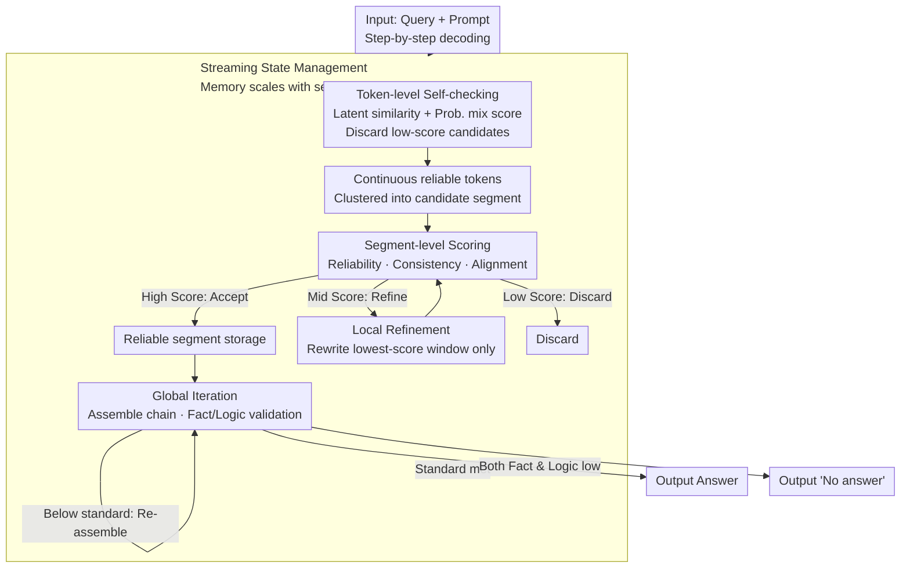

# Token-Guard: Towards Token-Level Hallucination Control via Self-Checking Decoding

**Conference**: ICLR 2026  
**arXiv**: [2601.21969](https://arxiv.org/abs/2601.21969)  
**Code**: [https://github.com/rhq945/Token-Guard](https://github.com/rhq945/Token-Guard)  
**Area**: Hallucination Detection  
**Keywords**: LLM Hallucination Control, Token-level Decoding, Self-Checking, Segment-level Scoring, Iterative Refinement

## TL;DR

Ours proposes Token-Guard, a token-level hallucination control method based on self-checking decoding. Through token-level/segment-level scoring in latent space and an iterative refinement mechanism, it detects and suppresses hallucination generation during the decoding process, achieving an average F1 improvement of 16.3%.

## Background & Motivation

- **Background**: Large Language Models (LLMs) often generate content inconsistent with inputs, which is particularly severe in knowledge-intensive scenarios.
- **Limitations of Prior Work**:
    - RAG and RLHF require expensive external retrieval or large-scale fine-tuning.
    - Existing decoding methods (CoT, ToT, etc.) lack explicit token-level hallucination checking mechanisms.
    - Hallucination risks are not explicitly quantified, and token selection lacks directionality.
    - Most methods only support single-pass generation and lack dynamic refinement capabilities.
- **Key Challenge**: How to achieve fine-grained hallucination control at the decoding stage with low overhead?

## Method

### Overall Architecture

Token-Guard addresses the issue where LLMs pick words based only on probability without signals indicating "whether this word is fabricated," leading to hallucinations that can only be remediated post-generation. The Core Idea is to embed hallucination control into three granularities—from fine to coarse—during the **decoding process**. Each decoding step first performs self-checking on candidate tokens to filter out suspicious words that do not align with the context. Tokens that pass checking are clustered into a candidate segment, which then undergoes segment-level scoring to be accepted, discarded, or refined. Finally, all reliable segments are assembled into a complete reasoning chain for a global factual/logical validation; if sub-standard, the chain is re-assembled. A streaming state management system ensures that memory consumption scales with the number of segments rather than the generation length. This entire process is completed purely during decoding, without reliance on external retrieval or additional training, serving as a plug-and-play plugin for any LLM.

### Key Designs

**1. Token-level self-checking: Quantifying hallucination risk at the moment of word selection**

Existing decoding methods (CoT, ToT) select words based on model probability without explicit signals regarding fabrication risk. Token-Guard calculates a hybrid score for each candidate token $a_t^{(i)}$: $F_{\text{halu}}^{\text{token}}(a_t^{(i)} \mid s_t) = \lambda \cdot \frac{h_t^{(i)} \cdot \bar{h}_{<t}}{|h_t^{(i)}| |\bar{h}_{<t}|} + (1-\lambda) \cdot P(a_t^{(i)} \mid a_{<t}, x)$. The first term is the cosine similarity between the candidate token's latent state and the average latent state of accepted tokens $\bar{h}_{<t}$, measuring semantic coherence. The second term is the conditional probability, measuring statistical naturalness. Using $\lambda = 0.6$, tokens with scores below $\tau_{\text{token}} = 0.4$ are discarded. Latent states are extracted from the penultimate layer. This ensures hallucination risks are intercepted before a token is adopted.

**2. Segment-level representation and scoring: Reviewing semantic fragments**

Since individual tokens might seem reasonable but lead to overall deviation, Token-Guard clusters continuous reliable tokens into a candidate segment $C_k$ and calculates a weighted segment representation $H_k = \sum_{i=1}^{n} w_i h_t^{(i)}$, where $w_i = \frac{\exp(F_{\text{halu}}^{\text{token}}(a_{t_i} \mid s_{t_i}))}{\sum_j \exp(F_{\text{halu}}^{\text{token}}(a_{t_j} \mid s_{t_j}))}$. The segment-level score combines three factors:

$$F_{\text{halu}}^{\text{seg}}(C_k) = \alpha F_{\text{halu}}^{\text{token}}(C_k) + \beta \, \text{Consistency}(C_k) + \gamma \, \text{Alignment}(C_k)$$

This includes token reliability aggregation ($\alpha = 0.5$), local consistency via latent state smoothness ($\beta = 0.3$), and cosine alignment between the segment representation and input context $H_x$ ($\gamma = 0.2$). Thresholds categorize segments: below $\tau_{\text{seg}}^{\text{low}} = 0.55$ are discarded, above $\tau_{\text{seg}}^{\text{high}} = 0.75$ are accepted, and intermediate scores trigger local refinement.

**3. Local refinement and global iteration: Targeted "surgery" and final validation**

To avoid discarding entire sequences, Token-Guard performs local refinement by identifying the lowest-scoring token within an intermediate segment and its neighbors to form a window $W_k^{(l)} = \{a_{i-1}, a_i^{\text{low}}, a_{i+1}\}$. The LLM rewrites only this window $W_k^{(l)'} = \text{LLM\_refine}(W_k^{(l)} \mid a_{<i-1}, a_{>i+1}, H_k)$. After assembling reliable segments into a reasoning chain $R$, global validation is performed using a harmonic fusion of factual score $F_{\text{fact}}$ and logical score $F_{\text{logic}}$:

$$F_{\text{global}}(R) = \frac{F_{\text{fact}}(R) \cdot F_{\text{logic}}(R)}{F_{\text{fact}}(R) + F_{\text{logic}}(R) - F_{\text{fact}}(R) \cdot F_{\text{logic}}(R)}$$

If $F_{\text{global}} < \tau_{\text{global}} = 0.7$, re-assembly is triggered. If both $F_{\text{fact}}$ and $F_{\text{logic}}$ are below 0.5, the model outputs "No answer".

**4. Streaming state management: Decoupling memory from generation length**

To function as a general plugin, Token-Guard maintains only essential compact states. The token level only keeps a running average $\bar{h}_{<t}$ with complexity $\mathcal{O}(L_{\max} \cdot K_{\text{active}} \cdot d)$. Segment hidden states are released once processed, leaving only the segment vector $H_k$. The global phase operates only on $\{H_k\}$ with complexity $\mathcal{O}(K \cdot d)$. This ensures memory overhead is proportional to the number of segments rather than tokens.

## Main Results

### Main Results (Meta-Llama-3.1-8B-Instruct)

| Method | FinanceBench F1 | DROP_hist F1 | DROP_nfl F1 | HaluEval F1 | Avg F1 |
|------|----------------|-------------|-------------|-------------|--------|
| BaseModel | 16.00 | 44.21 | 39.10 | 42.16 | 28.29 |
| Guided Decoding | 16.44 | 55.95 | 36.71 | 57.41 | 34.73 |
| Chain-of-Thoughts | 11.01 | 49.26 | 49.21 | 55.32 | 34.63 |
| Tree-of-Thought | 14.44 | 47.73 | 37.69 | 56.02 | 33.33 |
| **Token-Guard** | **30.80** | **68.52** | **58.10** | **78.54** | **51.03** |

### Qwen3-8B Results

| Method | Avg EM | Avg F1 |
|------|--------|--------|
| BaseModel | 0.22 | 44.25 |
| CoT | 0.23 | 45.10 |
| **Token-Guard** | **0.35** | **53.98** |

### Ablation Study

| Variant | DROP_hist F1 | RAGTruth F1 | Avg BLEU |
|------|-------------|-------------|----------|
| Full Token-Guard | **68.52** | **43.94** | **51.74** |
| w/o Token-Level | 47.51 | 27.10 | 34.97 |
| w/o Segment-Level | 60.10 | 39.20 | 46.32 |
| w/o Global Iteration | 63.05 | 41.05 | 36.26 |
| w/o Prompt | 55.23 | 32.50 | 39.70 |

### Key Findings

- Token-level scoring contributes most to performance (highest F1 drop when removed).
- Global iteration primarily improves BLEU (linguistic fluency) while contributing to EM/F1.
- Greatest advantages are seen in multi-step reasoning tasks (DROP_nfl).
- Improvements are limited in knowledge-intensive tasks (PubMedQA) as it cannot compensate for missing domain knowledge.
- Effectiveness is validated across two backbone models (Llama3.1-8B, Qwen3-8B).

## Highlights & Insights

- **Multi-level Hallucination Control**: Token $\to$ Segment $\to$ Global progression balances accuracy and efficiency.
- **No External Resources**: Purely a decoding stage solution requiring no retrieval systems or additional training.
- **Modular Design**: Integrates as a plugin into any LLM decoding pipeline.
- **Memory Friendly**: Clever state management ensures memory is independent of generation length.

## Limitations & Future Work

- Multi-level scoring introduces additional computational overhead (multiple latent state calculations and cosine similarities per token).
- Numerous hyperparameters ($\lambda$, $\tau_{\text{token}}$, $\alpha/\beta/\gamma$, $\tau_{\text{seg}}$, $\tau_{\text{global}}$, etc.) complicate tuning.
- Detection assumes "consistency with context = truth," which may fail if the model's internal knowledge is incorrect.
- Validated only on 8B-scale models; applicability to larger or smaller models is unknown.
- Global iteration relies on TF-IDF and KMeans, introducing dependencies on traditional NLP methods.

## Related Work & Insights

- **RAG Methods**: External retrieval augmentation; computationally intensive and domain-dependent.
- **RLHF/Alignment**: Requires large-scale fine-tuning and high resource consumption.
- **Decoding Methods**: DoLa (layer contrast), KCTS (knowledge-constrained tree search), Phi-Decoding (look-ahead sampling).
- **Token-Guard**: The first unified framework for hallucination control merging token-level self-checking, segment-level scoring, and global iteration.

## Rating

| Dimension | Score |
|------|------|
| Novelty | ★★★★☆ |
| Theoretical Depth | ★★★☆☆ |
| Experimental Thoroughness | ★★★★☆ |
| Value | ★★★★☆ |
| Writing Quality | ★★★☆☆ |

<!-- RELATED:START -->

## Related Papers

- [\[CVPR 2025\] HalLoc: Token-Level Localization of Hallucinations for Vision Language Models](../../CVPR2025/hallucination/halloc_token-level_localization_of_hallucinations_for_vision_language_models.md)
- [\[CVPR 2026\] One Token, Two Fates: A Unified Framework via Vision Token Manipulation Against MLLMs Hallucination](../../CVPR2026/hallucination/one_token_two_fates_a_unified_framework_via_vision_token_manipulation_against_ml.md)
- [\[ICLR 2026\] Cat-PO: Cross-modal Adaptive Token-rewards for Preference Optimization in Truthful Multimodal LLMs](cat-po_cross-modal_adaptive_token-rewards_for_preference_optimization_in_truthfu.md)
- [\[ACL 2026\] TPA: Next Token Probability Attribution for Detecting Hallucinations in RAG](../../ACL2026/hallucination/tpa_next_token_probability_attribution_for_detecting_hallucinations_in_rag.md)
- [\[ICLR 2026\] TraceDet: Hallucination Detection from the Decoding Trace of Diffusion Large Language Models](tracedet_hallucination_detection_from_the_decoding_trace_of_diffusion_large_lang.md)

<!-- RELATED:END -->
