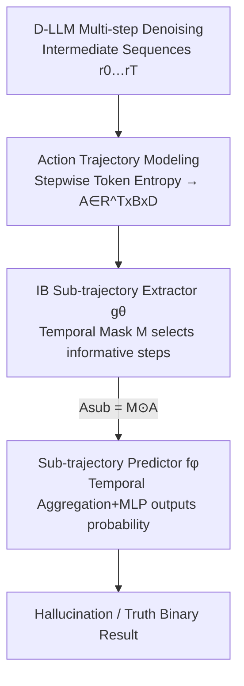

# TraceDet: Hallucination Detection from the Decoding Trace of Diffusion Large Language Models

**Conference**: ICLR 2026  
**OpenReview**: [https://openreview.net/forum?id=4puxTouUSV](https://openreview.net/forum?id=4puxTouUSV)  
**Code**: https://github.com/chang-sx/TraceDet  
**Area**: Hallucination Detection / Diffusion LLMs / LLM Safety  
**Keywords**: Diffusion LLM, Hallucination Detection, Denoising Trace, Information Bottleneck, AUROC

## TL;DR
Focusing on hallucination signals exposed during the multi-step denoising process of Diffusion Large Language Models (D-LLMs), this paper models the denoising trace as an "action trajectory." It utilizes the Information Bottleneck principle to automatically select sub-trajectories that are most informative regarding hallucinations to train a classifier, improving the hallucination detection AUROC by an average of 15.2% across two open-source D-LLMs and three QA datasets.

## Background & Motivation

**Background**: Diffusion Large Language Models (D-LLMs, such as LLaDA-8B and Dream-7B) are emerging as powerful alternatives to autoregressive LLMs (AR-LLMs). Unlike AR-LLMs, which generate tokens from left to right, D-LLMs use bidirectional attention for multi-step denoising. Starting from a fully masked sequence, the model predicts all masked tokens at each step and then re-masks a portion based on confidence, outputting the final answer after $T$ iterations. This paradigm has shown potential in computational efficiency and flexible reasoning, matching the performance of leading models like LLaMA-3 at the same scale.

**Limitations of Prior Work**: Research on D-LLM hallucinations is virtually non-existent, yet hallucinations undermine user trust and can cause severe consequences in critical scenarios. Existing hallucination detection methods are designed for AR-LLMs—either output-based (examining consistency across multiple samples or token entropy) or latent-based (probing hidden states of a single forward pass). All these methods are predicated on the "single forward generation" assumption.

**Key Challenge**: Hallucination signals in D-LLMs are not hidden solely in the final output but are dispersed throughout the multi-step denoising trace. The authors empirically identified three unique patterns absent in AR-LLMs: **Interleaved Hallucination** (intermediate steps jumping between real and hallucinated content), **Swaying Guess** (conflicting keywords appearing alternately), and **Persistent Error** (insisting on a wrong answer from start to finish). Discarding these intermediate dynamics by focusing only on the final text discards the most discriminative evidence; furthermore, some intermediate information is erased during re-masking, creating a mismatch between the final output and the process.

**Goal**: Design a hallucination detection framework specifically for the D-LLM denoising process that leverages intermediate signals. The difficulty lies in the fact that it is not known a priori which denoising steps contribute to hallucinations (as there is no step-level supervision).

**Key Insight**: Borrowing a perspective from diffusion policy optimization, the denoising process is viewed as a Markov Decision Process (MDP). Each step's "action" is the model's prediction of the full answer based on the current intermediate result, turning the entire trace into analyzable sequential evidence.

**Core Idea**: Use the Information Bottleneck (IB) principle to automatically extract sub-trajectories from the full action trajectory that are most informative regarding hallucination labels while remaining as concise as possible. A classifier is then trained on these sub-trajectories without the need for explicit step-level supervision.

## Method

### Overall Architecture

TraceDet aims to determine whether the final answer of a D-LLM denoising process is a hallucination. The framework consists of three serial stages: First, the denoising process is converted into a quantifiable **action trajectory** (characterized by token-level entropy at each step). Second, a **sub-trajectory extractor** $g_\theta$ learns a temporal mask under the Information Bottleneck objective to retain only the most informative steps. Finally, the masked sub-trajectory is fed into a **predictor** $f_\phi$ to output the hallucination probability. The extractor and predictor are trained jointly with a loss function consisting of a classification term and an IB regularization term.

Modeling denoising as an MDP is the foundation: the $t$-th state $s_t=(p_0, r_{T-t})$ consists of the input question and the current intermediate sequence; the action $a_t$ is the predicted full answer $\hat r_{T-t-1}\sim P_\theta(r_0\mid r_{T-t},p_0)$; and the transition involves re-masking tokens to reach the next state based on the noise schedule. Thus, the action trajectory $A=\{a_0,\dots,a_{T-1}\}$ records the step-by-step refinement, providing significantly more information than the final output $r_0$ alone.

### Key Designs

**1. Modeling Denoising as an Action Trajectory based on Token Entropy**

The fundamental difficulty in hallucination detection is the mismatch between intermediate generation and the final answer: information is erased during denoising and re-masking, making it hard to trace hallucinations from the output alone. TraceDet's countermeasure is to explicitly represent the denoising process as an action trajectory—not focusing on the final $r_0$ but on the "actions" at each step. In implementation, actions are characterized by **stepwise sequences of token-level entropy** rather than intermediate text or token embeddings (the latter being too large and numerically unstable). Entropy reflects generation uncertainty and serves as a fixed-size distribution statistic that traces the evolution of uncertainty over time. The final trajectory tensor is $A\in\mathbb{R}^{T\times B\times D}$. Thus, the three hallucination patterns (interleaved, swaying, persistent) manifest as learnable morphological differences in the entropy trajectory.

**2. Information Bottleneck Driven Sub-trajectory Extractor**

Not every step is responsible for hallucination—relevant steps are often sparse and unevenly distributed, and their locations are unknown without labels. Using the full trajectory is redundant and may lead to learning shortcuts. TraceDet applies the IB principle with the objective $\min -I(Y;A_{sub})+\beta I(A;A_{sub})$: the first term ensures $A_{sub}$ is informative regarding the hallucination label $Y$, while the second term constrains $A_{sub}$ to contain minimal information from $A$ to avoid the trivial $A_{sub}=A$ solution. The authors derive a differentiable upper bound for optimization: the first term becomes the classification cross-entropy $L_{cls}$, and the second term treats the posterior $P(A_{sub}\mid A)$ as independent Bernoulli distributions per step with a non-informative Bernoulli prior controlled by $\tau$. The resulting regularization term is:

$$L_{ext}=\sum_{i=0}^{T-1}\Big[p_{a_i}\log\frac{p_{a_i}}{\tau}+(1-p_{a_i})\log\frac{1-p_{a_i}}{1-\tau}\Big],$$

where $p_{a_i}$ is the probability of selecting the $i$-th step and $\tau$ limits the ratio of selected steps. $g_\theta$ uses a Transformer with cross-attention to generate a probability mask $\hat M\in(0,1)^{T\times B}$, and a binary mask $M$ is sampled using Gumbel-Softmax to ensure differentiability.

**3. Sub-trajectory Predictor**

After extracting informative steps, $f_\phi$ receives the masked sub-trajectory $A_{sub}$, performs temporal aggregation to compress the retained steps into a fixed-length representation, and passes it through an MLP with an activation layer to output the probability $f_\phi(A_{sub})\in[0,1]$. It is trained jointly with the extractor. This end-to-end optimization ensures that "which steps to select" and "how to judge them" are mutually calibrated.

### Loss & Training
The total loss is $L=L_{cls}+\beta L_{ext}$, where $L_{cls}$ is the cross-entropy for sub-trajectory classification and $L_{ext}$ is the IB regularization term. The extractor and predictor are trained jointly, using Gumbel-Softmax for gradient estimation during mask sampling. For each dataset, 400 QA pairs are sampled (200 for validation, 200 for testing), with the model selected based on validation performance.

## Key Experimental Results

### Main Results
Two open-source D-LLMs (LLaDA-8B-Instruct, Dream-7B-Instruct) and three factual QA datasets (TriviaQA, HotpotQA, CommonsenseQA) were used with generation lengths of 128 and 64 tokens. Metric: AUROC(%). Open-domain QA evaluation used Qwen3-8B as a judge (90% agreement with humans on TriviaQA, 84% on HotpotQA).

| Model | Method | TriviaQA-128 | HotpotQA-128 | CommonsenseQA-128 | Average |
|------|------|------|------|------|------|
| LLaDA-8B | EigenScore (Second-best) | 69.2 | 64.7 | 58.5 | 63.2 |
| LLaDA-8B | **TraceDet** | **73.9** | **66.1** | **77.2** | **72.0** |
| Dream-7B | EigenScore | 66.0 | 62.5 | 76.9 | 69.8 |
| Dream-7B | **TraceDet** | **78.1** | **75.1** | **84.7** | **80.8** |

TraceDet achieved the highest AUROC in all settings: 8.8% higher than the strongest baseline on LLaDA-8B and 11% higher on Dream-7B, with an average overall improvement of 15.2%. F1 scores were also consistently superior.

### Ablation Study

| Configuration | LLaDA-8B Avg AUROC | Dream-7B Avg AUROC | Description |
|------|------|------|------|
| Ave Entropy | 62.8 | 65.3 | Using mean stepwise entropy as naive confidence |
| TraceDet w/o Masking | 69.1 | 78.4 | Transformer detector without IB sub-trajectory extraction |
| **TraceDet (Full)** | **72.0** | **80.8** | Full framework |

### Key Findings
- **Progressive gains from "Mean Entropy" to "Trajectory Transformer" to "Sub-trajectory Extraction"**: The jump from Ave Entropy to TraceDet w/o Masking (e.g., +13.1% on Dream-7B) shows that modeling the denoising trace as a time series is inherently valuable. Adding IB extraction provides a further 2-3% gain, proving that isolating informative steps removes noise.
- **Using entropy traces instead of embedding traces**: Entropy is stable and fixed-length, whereas embeddings with temporal encoding are too large and unstable.
- **Efficiency advantage**: TraceDet processes 100 samples in 147.5s, significantly faster than Semantic Entropy (801s) or Lexical Similarity (715s) which require multiple samplings.
- **Baseline instability**: Semantic Entropy performs well on TriviaQA but drops to 51.4% on CommonsenseQA. For Dream-7B, intermediate logits often cause Perplexity/LN-Entropy to diverge, highlighting the unreliability of output signals in D-LLMs.

## Highlights & Insights
- **Denoising traces as "evidence sequences"**: While others focus on final output quality, this work discovers that the evolution of uncertainty during intermediate steps serves as a fingerprint for hallucinations.
- **Natural synergy between MDP and IB**: MDP structures the denoising process as an action trace, and IB transforms the lack of step-level labels into a learnable problem of finding the minimal sufficient subset.
- **Transferable engineering choices**: The use of stepwise entropy instead of embeddings can be applied to other tasks monitoring multi-step generation to avoid dimensionality explosion.
- **Systematic characterization of D-LLM hallucination patterns**: The identification of interleaved, swaying, and persistent patterns is a valuable empirical contribution.

## Limitations & Future Work
- **Dependency on stepwise token logits/entropy**: The method requires access to intermediate entropy, limiting it to open-source D-LLMs (only LLaDA and Dream currently available).
- **Narrow task focus**: Only validated on QA; patterns in open-ended generation or multi-turn dialogue remain unexplored.
- **Black-box detection**: TraceDet is a detector, not an explainer or mitigater. It does not answer why hallucinations occur or fix them.
- **Judge dependency**: Relies on external LLMs for labels, which may introduce curator bias.
- Future directions include multi-modal fusion of entropy with text/hidden states, using detection signals for hallucination mitigation, and expanding to more diverse generation tasks.

## Related Work & Insights
- **vs Output-based (Perplexity / Semantic Entropy)**: These rely on output-end characteristics and assume single-pass generation. They often fail for D-LLMs because they disregard intermediate signals and are computationally slow. TraceDet is faster and more robust.
- **vs Latent-based (EigenScore / CCS)**: These probe static hidden states and fail to capture temporal dynamics. TraceDet's temporal modeling leads to significant performance gains (8.8%–11%).
- **vs IB for VLLM Hallucinations**: While prior work used IB for spatial sub-instance extraction in images, this paper applies IB to the temporal trajectory of D-LLM generation.

## Rating
- Novelty: ⭐⭐⭐⭐⭐ First study on D-LLM hallucinations with a novel MDP + IB trajectory approach.
- Experimental Thoroughness: ⭐⭐⭐⭐ Extensive testing across models and tasks, though limited to open-source D-LLMs and QA.
- Writing Quality: ⭐⭐⭐⭐ Clear chain of logic from observation to method, with intuitive pattern visualizations.
- Value: ⭐⭐⭐⭐ Provides a practical, low-overhead hallucination detector for D-LLMs with significant performance gains.

<!-- RELATED:START -->

## Related Papers

- [\[ACL 2026\] Lost in Diffusion: Uncovering Hallucination Patterns and Failure Modes in Diffusion Large Language Models](../../ACL2026/hallucination/lost_in_diffusion_uncovering_hallucination_patterns_and_failure_modes_in_diffusi.md)
- [\[ICLR 2026\] NDAD: Negative-Direction Aware Decoding for Large Language Models via Controllable Hallucination Signal Injection](ndad_negative-direction_aware_decoding_for_large_language_models_via_controllabl.md)
- [\[ICLR 2026\] Mechanistic Detection and Mitigation of Hallucination in Large Reasoning Models](mechanistic_detection_and_mitigation_of_hallucination_in_large_reasoning_models.md)
- [\[ICLR 2026\] Hallucination-aware Intermediate Representation Edit in Large Vision-Language Models](hallucination-aware_intermediate_representation_edit_in_large_vision-language_mo.md)
- [\[ICLR 2026\] Dynamic Multimodal Activation Steering for Hallucination Mitigation in Large Vision-Language Models](dynamic_multimodal_activation_steering_for_hallucination_mitigation_in_large_vis.md)

<!-- RELATED:END -->
