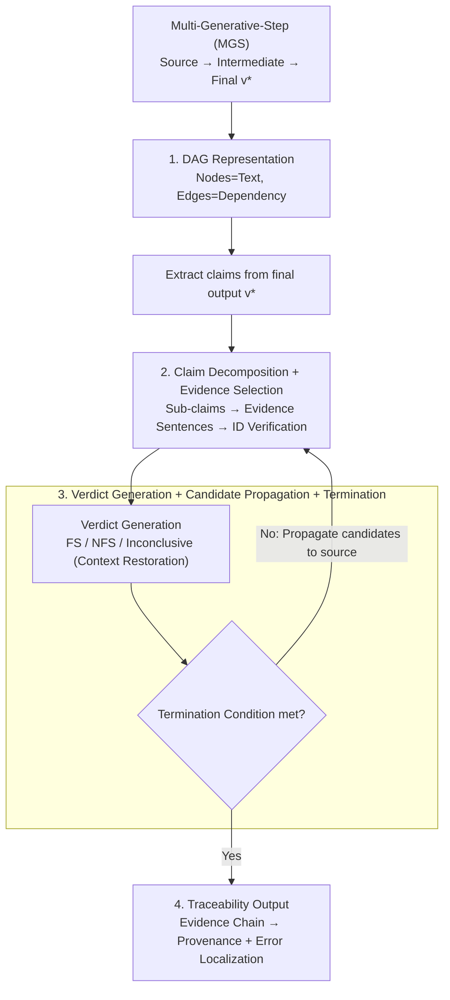

# VeriTrail: Closed-Domain Hallucination Detection with Traceability

**Conference**: ICLR2026  
**arXiv**: [2505.21786](https://arxiv.org/abs/2505.21786)  
**Code**: [Datasets](https://aka.ms/veritrail-datasets)  
**Area**: Hallucination Detection  
**Keywords**: hallucination detection, faithfulness evaluation, traceability, multi-generative-step, DAG

## TL;DR
VeriTrail is proposed—the first closed-domain hallucination detection method providing traceability for multi-generative-step (MGS) processes. It models the generation process as a Directed Acyclic Graph (DAG) and verifies facts layer-by-layer along paths while establishing the first MGS datasets containing all intermediate outputs and human annotations.

## Background & Motivation
- Even when LLMs are instructed to follow source materials, they frequently generate unsupported content—"closed-domain hallucinations."
- Generation processes are categorized into two types:
    - **Single-Generative-Step (SGS)**: e.g., standard RAG, where one LLM call produces the final result.
    - **Multi-Generative-Step (MGS)**: e.g., hierarchical summarization, GraphRAG, where intermediate outputs serve as subsequent inputs.
- MGS is more prone to hallucinations: each step may introduce and propagate errors.
- **Key Challenge**: For MGS, merely detecting hallucinations in the final output is insufficient; there is a need for:
    - **Provenance**: Understanding how the output is derived from source materials.
    - **Error Localization**: Identifying the specific step where the hallucination was introduced.
- Existing methods only evaluate the relationship between the output and source materials without utilizing intermediate outputs, thus failing to provide traceability.

## Core Idea
1. A unified conceptual framework for generation processes (DAG representation).
2. VeriTrail: The first closed-domain hallucination detection method providing traceability for both MGS and SGS.
3. FABLES+ and DiverseSumm+: The first MGS datasets containing all intermediate outputs and human annotations.

## Method

### Overall Architecture

VeriTrail aims to solve the conflict between judging closed-domain hallucinations in MGS final outputs and explaining the derivation—specifically, which path the supporting evidence follows back to the source and at which step the hallucination was introduced. The mechanism involves modeling the entire generation chain as a Directed Acyclic Graph (DAG), where source documents, intermediate outputs, and the final output are nodes. It extracts factual claims from the final output and performs **per-claim, top-down recursive verification**: starting from the upstream nodes of the final output, it selects evidence, generates a verdict, and then propagates candidates one layer closer to the source, iterating until it converges to "evidence-supported root nodes" or triggers termination. The accumulated evidence chain serves as both the provenance path and the basis for error localization.

### Key Designs

**1. DAG representation: A unified mathematical carrier for traceability**

In the past, closed-domain hallucination detection only focused on the "output vs. source" ends, treating the intermediate process as a black box. VeriTrail models the entire generation chain as a DAG $G = (V, E)$: nodes $v \in V$ represent text fragments (source/intermediate/final), and directed edges $(u, v) \in E$ indicate that $u$ was used as input to generate $v$. The set of root nodes $V_0$ represents source documents, and the terminal node $v^*$ is the final output. A stage function $\text{stage}: V \to \mathbb{N}$ marks the layer of each node. This unified representation allows SGS (e.g., standard RAG) to be treated as a degenerate DAG with one intermediate layer, making the verification workflow universally applicable.

**2. Claim decomposition + Evidence selection: Sinking verification to the atomic level**

Verifying a complex claim directly can lead to ambiguous "partially correct" results. Thus, the Decomposition module (via Claimify) splits complex claims into independent sub-claims. For example, "Company X acquired two startups in 2020 as part of healthcare expansion" is split into (1) X acquired two startups in 2020, and (2) the acquisition was part of healthcare expansion. Decomposition is recursive (up to 20 times). For evidence selection, NLTK splits candidate text into sentences with unique IDs. The LLM selects IDs that support or contradict the claim. A critical step is **ID Verification**: any IDs returned by the model that do not match real sentences are discarded, ensuring the "evidence" actually exists in the source and is not a hallucination itself.

**3. Verdict generation + Candidate propagation + Termination: Controlling conservatism with $q$**

Once evidence is selected, a verdict is generated: if no sentences are selected, it is "Not Fully Supported" (NFS). Otherwise, the LLM chooses from **Fully Supported** (FS), **Not Fully Supported** (NFS), or **Inconclusive**. To avoid ambiguity from isolated sentences, the model evaluates evidence within a restored context (full content for roots, summaries for intermediate nodes). The next set of candidate nodes to verify depends on the current verdict:

| Latest Verdict | Candidate Node Selection Strategy |
|----------|---------------|
| Fully Supported / Inconclusive | Source nodes of the current evidence nodes |
| Not Fully Supported | Source nodes of all currently verified nodes (broader search) |

The iteration terminates when: ① Candidates are only verified root nodes; ② No candidates remain; or ③ NFS occurs $q$ consecutive times. The parameter $q$ acts as a "knob": a larger $q$ ensures more thorough verification but leads to more conservative NFS verdicts.

**4. Traceability output: Extracting provenance and error localization**

For each claim, VeriTrail returns the final verdict plus internal reasoning, all intermediate verdicts, and an **evidence chain**. This chain supports:
- **Provenance**: For FS claims, the chain records the support path from intermediate nodes back to the root.
- **Error Localization**: By finding the last iteration $n$ where the verdict was FS, the stage where hallucinations were introduced is identified as $\{\text{stage}(v) \mid v \in V_e(n),\, v \notin V_0\}$. If a claim is never FS, the error is localized to the final output or remains undetermined.

### Walkthrough Example

In hierarchical summarization, a book is split into chunks, summarized into Level-1 summaries, merged into Level-2 summaries, and finally into a full summary $v^*$. For a claim "The protagonist gave up the inheritance," verification starts upstream of $v^*$ (Level-2 nodes). If Level-2 provides FS, candidates move to Level-1. If Level-1 also provides FS, it moves to the original chunks (roots). If the roots also support it, the path `Chunk → L1 → L2 → Final` is recorded as provenance. Conversely, if Level-2 was FS but Level-1 becomes NFS for $q$ iterations, the error is localized to the step where L1 summaries were merged into L2.

## Datasets

### FABLES+ (Hierarchical Summarization)
- Based on the FABLES book summary dataset.
- Regenerated hierarchical summaries for 22 books (avg. 118K tokens), preserving all intermediate outputs.
- Extracted 734 claims; 48% used original labels, others were human-annotated.

### DiverseSumm+ (GraphRAG)
- Based on the DiverseSumm news dataset.
- 148 stories, 1,479 articles, totaling 1.19M tokens.
- Sampled 20 questions, generated answers using GraphRAG.
- Extracted 560 claims, annotated by 4 Upwork annotators and 1 author.

## Key Experimental Results

### Baselines

| Category | Method | Long-content Strategy |
|------|------|---------------|
| NLI | INFUSE | Bidirectional entailment ranking |
| NLI | AlignScore | 350-token chunking |
| NLI | Bespoke-MiniCheck-7B | 32K-token chunking |
| RAG | Top-k Retrieval | Embedding retrieval + Verdict |
| Direct | Gemini 1.5 Pro / GPT-4o Mini | Long-context LM |

### Main Results (Macro F1 / Balanced Accuracy)

| Method | FABLES+ F1 | FABLES+ Bal.Acc | DiverseSumm+ F1 | DiverseSumm+ Bal.Acc |
|------|-----------|----------------|-----------------|---------------------|
| **Ours (q=3)** | **84.5** | **83.6** | **79.5** | 76.3 |
| **Ours (q=1)** | 74.0 | **84.6** | 76.6 | **83.0** |
| RAG (k=15) | 69.6 | 76.5 | 75.1 | 74.0 |
| Bespoke-MiniCheck-7B | 62.2 | 69.0 | 72.1 | 69.4 |
| Gemini 1.5 Pro | 61.1 | 60.8 | 49.8 | 57.6 |
| GPT-4o Mini | 60.7 | 58.2 | 62.9 | 61.5 |
| AlignScore | 59.6 | 67.5 | 60.4 | 62.7 |
| INFUSE | 40.5 | 59.5 | 20.0 | 50.1 |

**Key Findings**:
- Ours outperforms all baselines on both datasets (q=3 is best for F1, q=1 is best for Balanced Accuracy).
- Direct long-context verification (Gemini 1.5 Pro) is suboptimal, likely due to difficulties in retrieving information within massive documents.
- NLI methods like AlignScore and INFUSE show significant performance degradation on long documents.

### Highlights & Insights
- **q-parameter trade-off**: q=1 (terminate on first NFS) yields high NFS recall (89.8%) but low precision (55.1%). q=3 is more balanced (NFS precision 84.5%, recall 55.9%).
- Increasing $q$ makes verification more thorough but NFS verdicts more conservative.

## Limitations & Future Work
- Dependency on LLMs for evidence selection and verdict generation (limited by LLM capability).
- Error localization cannot determine a specific stage in some scenarios.
- Limited dataset scale (734 + 560 claims).
- Primary evaluation was restricted to the gpt-4o model.

## Rating
**Innovation**: ⭐⭐⭐⭐⭐  
**Value**: ⭐⭐⭐⭐⭐  
**Experimental Thoroughness**: ⭐⭐⭐⭐  
**Writing Quality**: ⭐⭐⭐⭐⭐  

VeriTrail is a pioneering work that evolves closed-domain hallucination detection from "judging correctness" to "tracing sources and localizing errors." The DAG framework elegantly unifies various generation processes, and the iterative verification mechanism demonstrates strong performance on ultra-long documents. For increasingly complex MGS pipelines like GraphRAG, this traceable detection method offers significant practical utility.

<!-- RELATED:START -->

## Related Papers

- [\[ICLR 2026\] Beyond In-Domain Detection: SpikeScore for Cross-Domain Hallucination Detection](beyond_in-domain_detection_spikescore_for_cross-domain_hallucination_detection.md)
- [\[ICLR 2026\] Enhancing Hallucination Detection through Noise Injection](enhancing_hallucination_detection_through_noise_injection.md)
- [\[ICLR 2026\] HARP: Hallucination Detection via Reasoning Subspace Projection](harp_hallucination_detection_via_reasoning_subspace_projection.md)
- [\[ACL 2025\] Learning Auxiliary Tasks Improves Reference-Free Hallucination Detection in Open-Domain Long-Form Generation](../../ACL2025/hallucination/learning_auxiliary_tasks_improves_reference-free_hallucination_detection_in_open.md)
- [\[ICLR 2026\] Learning to Reason for Hallucination Span Detection](learning_to_reason_for_hallucination_span_detection.md)

<!-- RELATED:END -->
