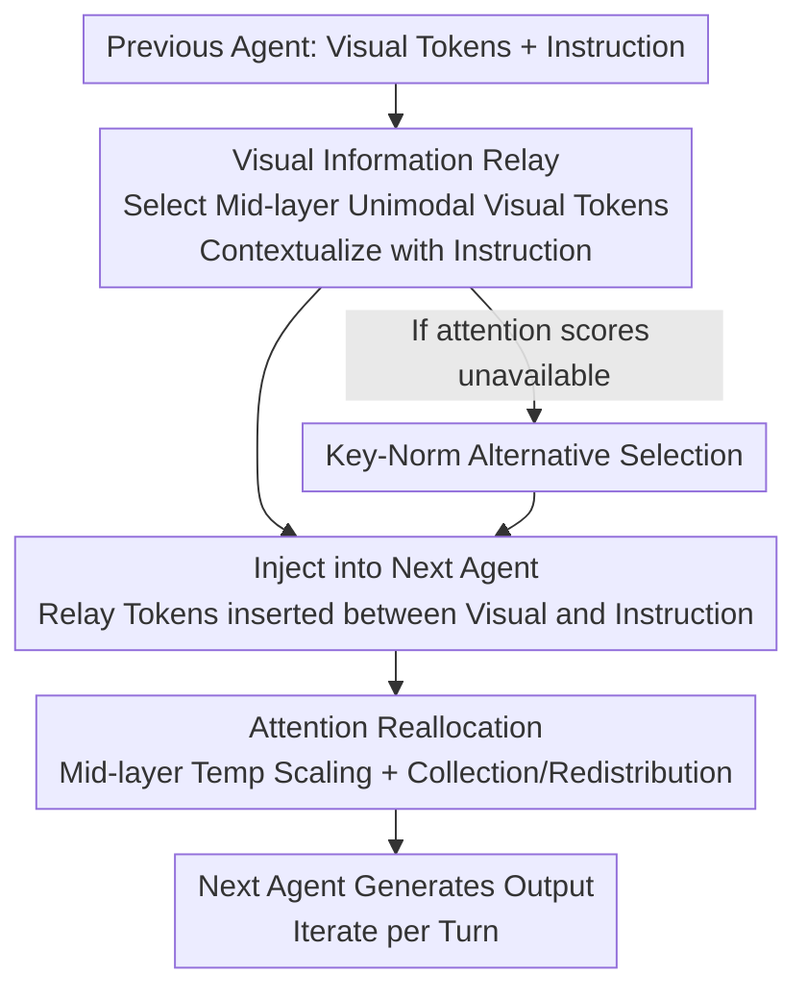

# Visual Multi-Agent System: Mitigating Hallucination Snowballing via Visual Flow

**Conference**: ICLR 2026  
**OpenReview**: [https://openreview.net/forum?id=Ii4HBlERix](https://openreview.net/forum?id=Ii4HBlERix)  
**Code**: https://github.com/YU-deep/ViF.git  
**Area**: Multimodal VLM / Agent / Hallucination Mitigation  
**Keywords**: Multi-Agent Systems, Visual Hallucination, Hallucination Snowballing, Visual Relay Tokens, Attention Reallocation

## TL;DR
This paper identifies "hallucination snowballing" in VLM Multi-Agent Systems (MAS)—where a visual misjudgment by one agent is progressively amplified by subsequent agents via pure text streams. Through turn-wise, layer-wise, and token-level attention analysis, the authors locate "middle-layer unimodal visual tokens" as the critical carriers of visual evidence. They propose ViF: establishing an additional "visual flow" between agents using these visual relay tokens combined with attention reallocation. This model-agnostic approach mitigates snowballing and achieves consistent 2.4–3.8% improvements across 8 benchmarks, 4 MAS structures, and 10 backbones.

## Background & Motivation
**Background**: Multi-agent systems (MAS) driven by VLMs are becoming the mainstream solution for complex multimodal tasks. Multiple agents collaborate over multiple turns of communication to perform collaborative reasoning, multi-turn instruction following, and complex multimodal understanding, tackling problems beyond the capability of a single model.

**Limitations of Prior Work**: MAS collaboration reveals a new reliability failure—**Multi-Agent Visual Hallucination Snowballing**. An agent's misreading of an image or excessive bias toward textual messages is amplified layer by layer as information flows through subsequent agents, eventually producing catastrophic, propagative hallucinations regarding visual content. This is a novel problem not addressed by single-agent research.

**Key Challenge**: Snowballing originates from two interacting mechanisms: (1) **Intrinsic Hallucination**—individual VLM agents produce incorrect descriptions of visual content; (2) **Hallucination Propagation**—agents rely on generated **text streams** to relay visual information. Text compresses and selectively emphasizes visual features, causing surviving hallucinated assertions to be accepted as authoritative evidence by downstream agents. Because subsequent agents treat preceding text as strong evidence, early hallucinations are amplified rather than corrected. Consequently, merely reducing single-agent hallucinations (the focus of existing work) cannot resolve the propagation problem.

**Key Insight**: The authors perform diagnostic attention analysis across three dimensions: turns, layers, and tokens. As agent turns increase, attention allocated to visual tokens continuously decreases (average 0.165 → 0.099 at turn 10 → 0.063 at turn 20, a 62% drop). The **middle layers show the largest decrease (-60%)**, far exceeding the first layer (-21%) and the last layer (-30%), while attention shifts to instruction tokens. Crucially, a small subset of **visual tokens exhibiting a "unimodal" distribution in middle layers** is most effective at retaining visual-specific information (performance drops most sharply when these are removed). However, their proportion plummets with turns (1.22% at turn 1 → 0.10% at turn 20), synchronizing with the disappearance of visual attention peaks.

**Core Idea**: Since text streams lose visual evidence, an **additional visual flow** is established. The middle-layer unimodal "visual relay tokens" are passed directly between agents. Combined with attention reallocation to amplify this ideal pattern, visual evidence is preserved against the information loss of "visual-to-text" conversion and text priors.

## Method

### Overall Architecture
ViF is a lightweight, model-agnostic mitigation paradigm applicable to any VLM-based MAS. While agents originally communicate only via text streams, ViF adds a parallel **visual flow**. In each turn, it selects a "unimodal" subset of visual tokens from the previous agent based on middle-layer attention trends as visual relay tokens. These are contextualized with the current instruction and injected into the next agent. Simultaneously, attention reallocation is performed in middle and deep layers to collect attention from invalid visual/instruction tokens and redistribute it to valid visual tokens, sustaining the "visual attention peak" across deeper agent turns. For modern models using Flash-Attention where attention scores are inaccessible, a Key-Norm-based alternative is provided.

### Key Designs

**1. Visual Information Relay: Bridging Agents via Unimodal Visual Tokens**

This design directly addresses the "loss of visual evidence via text relay." Instead of relying solely on text, the visual token set $V=\{v_1,\dots,v_m\}$ is decomposed to select a unimodal subset $R=\{r_1,\dots,r_n\}\subset V$ (where $n\ll m$) based on middle-layer attention trends. Analysis proves these tokens are highly semantically relevant and carry the "essence" of visual evidence. Since raw relay tokens lack specific context, a lightweight Transformer block $f(\cdot)$ is used to contextualize them with instruction tokens $I$:

$$\hat{R} = f(R \oplus I)[:n]$$

Here $\oplus$ denotes concatenation, and the first $n$ components are taken to maintain the original relay token length. To preserve spatial information, the same positional encoding strategy as the previous agent is applied. These relay tokens are then inserted between the next agent's original visual tokens and instruction tokens. This ensures downstream agents receive "native, unbiased" visual semantic carriers rather than compressed text.

**2. Attention Reallocation: Sustaining the Visual Attention Peak**

Passing tokens is insufficient; analysis shows deep-layer agents systematically shift attention from visual to instruction tokens. The authors reshape the attention distribution. First, temperature scaling is applied to the Softmax in middle layers to amplify visual attention trends, encouraging the emergence of unimodal patterns:

$$A = \mathrm{Softmax}_\tau(S) = \frac{\exp(s/\tau)}{\sum_{i=1}^{m}\exp(s_i/\tau)}$$

where $\tau$ is the temperature and $S, s$ are the attention score matrix and scores. Second, a collection mask $M_c$ in middle layers gathers attention (factor $\alpha$) from the **invalid visual token set** $V_\oslash$ and instruction tokens, which is then redistributed to the **valid visual token set** $V_\circ=V-V_\oslash$ using a reallocation mask $M_r$. This process is reversed in deep layers—redistributing attention from visual to instruction tokens—aligning with the finding that "deep-layer visual tokens are less important."

**3. Key-Norm Alternative: Supporting Flash-Attention Models**

Unimodal token selection typically depends on attention scores. However, many new models use Flash-Attention 2/3, where these scores are unavailable. The authors design a selection strategy based on **Key-Norm** (L2 norm of the key matrix) to approximate the attention-based selection. This ensures ViF remains truly model-agnostic across engineering realities. Results for LLaVA-OV, Qwen2-VL, and Qwen2.5-VL (marked with $*$ in tables) are achieved using this Key-Norm approach.

### Loss & Training
The core learnable component is the lightweight Transformer block $f(\cdot)$. Attention reallocation involves three key hyperparameters: unimodal significance threshold $\omega$, temperature $\tau$, and reallocation factor $\alpha$, determined via sensitivity analysis. The method is a plug-and-play module that does not require retraining the backbone VLMs.

## Key Experimental Results

### Main Results
ViF provides consistent improvements across 3 comprehensive benchmarks (MME / MMBench / MM-Vet) and 5 hallucination benchmarks (CHAIR / POPE / AMBER / MMHal-Bench / HallBench) using 4 MAS structures (linear / layered / random / circular).

| MAS Structure | Backbone | POPE↑ | AMBER↑ | HallBench↑ | Avg. Gain |
|--------|------|-------|--------|-----------|---------|
| Linear | LLaVA-NeXT-7B | 88.6 ↑1.8 | 89.3 ↑2.3 | 55.3 ↑2.4 | ↑3.2% |
| Circular | LLaVA-NeXT-7B | 93.3 ↑2.3 | 92.7 ↑3.3 | 55.7 ↑2.6 | ↑3.8% |
| Circular | Qwen2.5-VL-7B* | 93.4 ↑2.1 | 95.9 ↑2.4 | 57.3 ↑2.4 | ↑2.6% |
| Circular | LLaVA-NeXT-34B | 93.6 ↑2.2 | 96.3 ↑2.2 | 57.8 ↑2.8 | ↑4.4% |
| Circular | Qwen2.5-VL-32B* | 94.0 ↑1.5 | 96.7 ↑2.7 | 60.1 ↑3.2 | ↑4.1% |

Six 7B backbones show an average gain of 2.4–3.8%. The circular structure, characterized by high interaction density and concentrated hallucinations, shows the largest improvement. Large models (30B+) see gains exceeding 4%, as ViF unlocks their potential in multi-agent scenarios. Improvements of 2.0–4.9% are also observed in 4 enhanced visual benchmarks (MMIU / MuirBench / MVBench / Video-MME).

To quantify snowballing, the authors define the **Hallucination Snowballing score (HS)** (capturing both hallucination levels and propagation; lower is better). With ViF, the average HS across five benchmarks decreases by at least 30%, with nearly 40% reduction in circular structures.

| Method (circular, LLaVA-NeXT-7B) | POPE Metric↑ | POPE-HS↓ | AMBER-HS↓ | Avg. HS Change |
|------|-----------|---------|----------|------------|
| Baseline | 91.0 | 29.1 | 31.1 | — |
| MemVR | 90.5 | 31.2 | 34.4 | ↑18.4% |
| VISTA | 91.2 | 27.8 | 28.3 | ↑3.1% |
| FarSight | 91.9 | 22.7 | 26.6 | ↓5.4% |
| TAME | 91.4 | 22.8 | 22.7 | ↓3.7% |
| **ViF (Ours)** | **93.3** | **17.0** | **17.7** | **↓39.8%** |

Notably, SOTA methods designed for single-model hallucination (MemVR / VISTA / FarSight / DeCo / TAME) often **underperform the baseline** in MAS settings. By modifying decoding or attention while still relying on text relay, they amplify text-over-visual biases. ViF nearly halves the HS scores.

### Ablation Study
Performed on LLaVA-NeXT-7B + circular (values represent relative change to full model):

| Configuration | POPE↑ | AMBER↑ | HallBench↑ | Description |
|------|-------|--------|-----------|------|
| Ours (Full) | 93.3 | 92.7 | 55.7 | Full Model |
| w/o Relay Token (50%) | 92.0 (-1.3) | 91.6 (-1.1) | 54.8 (-0.9) | Removed 50% relay tokens |
| w/o Relay Token (75%) | 91.7 (-1.6) | 91.1 (-1.6) | 54.1 (-1.6) | Removed more relay tokens |
| w/o Reallocation (Middle) | 92.1 (-1.2) | 91.4 (-1.3) | 54.4 (-1.3) | Removed mid-layer reallocation |
| w/o Reallocation | 91.9 (-1.4) | 91.5 (-1.2) | 54.2 (-1.5) | Removed all reallocation |

Visual relay tokens contribute most significantly; even with 50% removed, the model outperforms most baselines. Attention reallocation further optimizes distribution and activates relay tokens, with middle-layer reallocation being more critical than deep-layer reallocation.

### Key Findings
- **More Turns, Larger Gap**: Baselines degrade after 5 turns, underperforming single-agent setups by turn 20. ViF maintains an upward performance trend as turns increase. However, in single-agent scenarios (turn=1), ViF offers marginal gains, indicating its value is specific to multi-agent collaboration.
- **Snowballing is Manifested Attention Degradation**: The 62% drop in visual attention and the plummeting proportion of unimodal tokens (1.22% to 0.10%) correlate strongly with rising hallucination rates (+224%), validating the visual flow approach.
- **Controllable Overhead**: ViF introduces 8.1–13.4% inference latency and 4.8–11.9% FLOPs. Relative overhead decreases as model size increases (latency <4%, FLOPs <3% for 34B).

## Highlights & Insights
- **Attributing "Hallucination Snowballing" to an Observable Quantity**: Instead of just describing the phenomenon, the authors use layer/token analysis to pinpoint the "disappearance of middle-layer unimodal tokens." This "diagnose then treat" paradigm is a valuable template for other propagation failures.
- **"Visual Flow" as a Symmetric Complement to "Text Flow"**: While existing methods tweak text outputs, ViF acknowledges that visual information should be transmitted via visual tokens, bypassing the lossy compression of language.
- **Engineering Honesty with Key-Norm**: The author addresses the practical limitation of Flash-Attention by providing a Key-Norm approximation, ensuring the "model-agnostic" claim holds true for production-grade models.

## Limitations & Future Work
- ViF provides almost no gain in single-agent scenarios, strictly limiting its scope to multi-agent collaboration.
- HS is a custom metric (see Eq.7 in the paper); caution is needed when comparing absolute HS values across different structures due to varying initial hallucination rates.
- Relay token selection relies on the empirical finding of "middle-layer unimodality," primarily validated on LLaVA/Qwen series. Transferability to significantly different architectures remains to be explored.
- The 8–13% latency overhead may be non-negligible for high-turn, real-time deployments.

## Related Work & Insights
- **vs. Single-model mitigation (MemVR / VISTA / FarSight / DeCo / TAME)**: These target intrinsic hallucination but fail in MAS propagation due to text-relay biases. ViF reduces HS by an additional 34.4% on average.
- **vs. Existing "Hallucination Snowballing" studies**: Previous research typically addressed internal model drift or pure-text scenarios. This work is the first to formalize **multi-agent visual** snowballing and link it to deep-layer visual attention degradation.

## Rating
- Novelty: ⭐⭐⭐⭐⭐ First to formalize multi-agent visual snowballing with a targeted "visual flow + unimodal relay" solution.
- Experimental Thoroughness: ⭐⭐⭐⭐⭐ 8 benchmarks × 4 structures × 10 backbones + HS metric + ablation/efficiency analysis.
- Writing Quality: ⭐⭐⭐⭐ Clear diagnosis-hypothesis-method chain, though notation for masks/sets is dense.
- Value: ⭐⭐⭐⭐⭐ Model-agnostic and plug-and-play, providing a reusable paradigm for VLM-MAS reliability.

<!-- RELATED:START -->

## Related Papers

- [\[ICML 2026\] MM-Snowball: Evaluating and Mitigating Hallucination Snowballing in Multimodal Multi-Turn Dialogue](../../ICML2026/hallucination/mm-snowball_evaluating_and_mitigating_hallucination_snowballing_in_multimodal_mu.md)
- [\[ACL 2026\] Dialectic-Med: Mitigating Diagnostic Hallucinations via Counterfactual Adversarial Multi-Agent Debate](../../ACL2026/hallucination/dialectic-med_mitigating_diagnostic_hallucinations_via_counterfactual_adversaria.md)
- [\[ICML 2026\] Learning from Fine-Grained Visual Discrepancies: Mitigating Multimodal Hallucinations via In-Context Visual Contrastive Optimization](../../ICML2026/hallucination/learning_from_fine-grained_visual_discrepancies_mitigating_multimodal_hallucinat.md)
- [\[ICML 2026\] Finding the Correct Visual Evidence Without Forgetting: Mitigating Hallucination in LVLMs via Inter-Layer Visual Attention Discrepancy](../../ICML2026/hallucination/finding_the_correct_visual_evidence_without_forgetting_mitigating_hallucination_.md)
- [\[ICLR 2026\] Grounding or Guessing? Visual Signals for Detecting Hallucinations in Sign Language Translation](grounding_or_guessing_visual_signals_for_detecting_hallucinations_in_sign_langua.md)

<!-- RELATED:END -->
