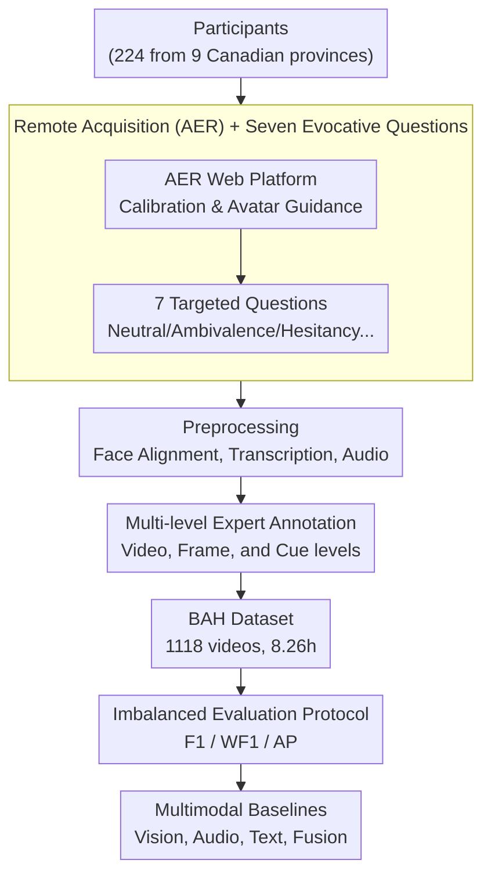

# BAH Dataset for Ambivalence/Hesitancy Recognition in Videos for Digital Behaviour Analysis

**Conference**: ICLR 2026  
**arXiv**: [2505.19328](https://arxiv.org/abs/2505.19328)  
**Code**: [github.com/sbelharbi/bah-dataset](https://github.com/sbelharbi/bah-dataset)  
**Area**: Human Behavior Understanding / Affective Computing  
**Keywords**: Ambivalence/Hesitancy Recognition, Multimodal Video Dataset, Behavioral Change, Affective Computing, Domain Adaptation

## TL;DR

This paper proposes BAH, the first multimodal dataset for Ambivalence/Hesitancy (A/H) recognition in videos. It contains 1,118 videos (8.26 hours) from 224 participants across 9 Canadian provinces, annotated by behavioral science experts, and provides baseline experimental results at both frame and video levels.

## Background & Motivation

Ambivalence and Hesitancy (A/H) are core psychological states in the process of behavioral change, manifesting as individuals simultaneously experiencing the desire to change and resistance to it. In face-to-face clinical interviews, healthcare providers can identify A/H through non-verbal cues such as vocal tone, facial expressions, and body language to implement targeted personalized interventions. However, in digital health (eHealth) intervention scenarios, there is a lack of automatic, reliable, and non-invasive means for A/H recognition.

Existing affective computing research primarily focuses on basic emotions (e.g., 7 categories including happiness, sadness, surprise), continuous emotional dimensions (Valence-Arousal), and pain estimation. Although progress has been made in compound emotion recognition, A/H—as a subtle complex emotion involving internal conflict between attitudes and intentions—remains entirely unexplored in the machine learning community. The fundamental reason is the absence of specialized training and evaluation datasets. The BAH dataset is proposed specifically to fill this gap.

## Method

### Overall Architecture

The contribution of BAH is not a single algorithm, but a complete construction pipeline that grounds "A/H concepts from behavioral science" into "machine-learnable video benchmarks." The core challenge addressed is that A/H is a subtle, transient internal conflict that only manifests genuinely in natural contexts; any deviation in the process would render the labels meaningless. Therefore, the pipeline is designed around "evoking genuine A/H, labeling it accurately, and measuring it fairly." It utilizes a web platform for participants to record remotely at home, using 7 carefully designed questions to elicit A/H rather than acting. The recorded videos undergo preprocessing (face alignment, transcription, audio extraction) and are then annotated at video, frame, and cue levels by three behavioral science experts following a unified codebook. Finally, an evaluation protocol tailored for extreme class imbalance (reporting F1, WF1, and AP simultaneously) ensures that baseline scores reflect the model's ability to recognize the rare positive class. The final output includes 1,118 videos (8.26 hours) from 224 participants.

### Key Designs

**1. Remote Acquisition Platform (AER): Scaling with Diversity**

Subtle states like A/H requires massive real-world samples for learning. Laboratory recording is expensive and lacks diversity. The team built AER (www.aerstudy.ca), a web platform allowing participants to record remotely at home using their own webcams and microphones, guided by a virtual avatar. Built-in calibration tests filter out poor video/audio quality. Since data is collected in the "wild" rather than a studio, it closer reflects real eHealth deployment, despite increased noise from lighting and equipment. 224 participants aged 18–66 were recruited via Prolific across 9 Canadian provinces, with balanced distributions in gender (59.8% M / 39.3% F), ethnicity, and age.

**2. Seven Evocative Questions: Natural Expression over Acting**

Dataset quality depends on the authenticity of the state. Behavioral scientists designed 7 questions to elicit neutral, positive, negative, ambivalent, willing, resistant, and hesitant responses. For example, Question 4 ("Tell us about something you enjoy doing but wish you could stop") specifically targets the conflict between desire and resistance. Question order is randomized, and participants are unaware of the target emotions, ensuring A/H is induced through genuine self-disclosure rather than posing.

**3. Multi-level Expert Annotation: Presence, Timing, and Cues**

Video-level labels alone cannot support temporal localization or interpretability. Three experts trained on a unified codebook used ELAN software for two-stage annotation: first determining A/H presence at the video level, then marking precise onset/offset times at the frame level. They also recorded specific cues (facial expression, verbal, audio, body language, and cross-modal inconsistency). Cross-modal inconsistency (e.g., saying "yes" while shaking the head "no") is emphasized as a core signal. The paper omits "apex" or intensity labels as A/H is often a persistent or fluctuating state without a single maximum intensity moment.

**4. Specialized Evaluation Protocol for Extreme Imbalance**

A/H occurs sparsely on the timeline. Among 1,118 videos (8.26 hours), 638 contain A/H (totaling 1.5 hours). At the frame level, only 18.36% (131,103 out of 714,005 frames) are positive. There are 1,274 A/H segments with an average duration of $4.25\pm2.47$ seconds ($102.92\pm59.16$ frames). To prevent inflated metrics from "all-negative" predictions, the protocol reports F1 (positive class), Weighted F1 (WF1), and Average Precision (AP). Since WF1 is biased towards the majority negative class (baseline of 0.7148 with all-negative predictions), F1 and AP serve as the primary indicators of a model's ability to identify rare positive instances.

## Key Experimental Results

### Main Results: Frame-level Classification

| Modality Combination | F1 | WF1 | AP |
|---------|-----|-----|-----|
| Vision (ResNet152+TCN) | 0.2213 | 0.7450 | 0.2674 |
| Audio | 0.2099 | 0.7387 | 0.2520 |
| Text Transcription | 0.2486 | 0.7149 | 0.2047 |
| Vision + Audio | 0.2873 | 0.7338 | 0.2818 |
| Vision + Text | 0.3046 | 0.7424 | 0.2809 |
| Tri-modal Fusion | 0.2737 | 0.7396 | 0.2416 |

### Ablation Study: Impact of Context Modeling

| Configuration | F1 | WF1 | AP | Description |
|------|-----|-----|-----|------|
| ResNet152 w/o Context | 0.1757 | 0.7086 | 0.2096 | Independent frame classification |
| ResNet152 + TCN w/ Context | 0.2213 | 0.7450 | 0.2674 | Temporal context modeling |

### Zero-shot Inference (Video-LLaVA)

| Prompt Style | Frame F1 | Video F1 |
|---------|--------|---------|
| Simple Prompt | 0.0000 | 0.0000 |
| Definition Only | 0.1360-0.3296 | 0.1836-0.7575 |
| Transcripts + Definition | 0.3604 | 0.7233 |

### Domain Adaptation (Personalization)

| Method | F1 | WF1 | AP |
|------|-----|-----|-----|
| Source-only | 0.1547±0.1608 | 0.6814±0.1687 | 0.2462±0.1665 |
| UDA (MMD) | 0.2418±0.1513 | 0.6494±0.1484 | 0.2608±0.1685 |
| UDA (Sub-Based) | 0.2674±0.1475 | 0.6461±0.1534 | 0.2673±0.1642 |
| Oracle | 0.3699 | - | - |

### Key Findings

1.  **High Difficulty of A/H Recognition**: All baseline models show F1 scores below 0.32 and AP below 0.28, suggesting A/H recognition is significantly more difficult than basic emotion recognition.
2.  **Crucial Role of Text**: The text modality alone (F1 0.2486) outperforms vision (F1 0.2213), and the Vision+Text combination achieves the best overall F1 (0.3046).
3.  **Temporal Context Benefits**: Using TCN to model temporal dependencies improves performance across all backbones, as A/H is not an instantaneous state.
4.  **Zero-shot M-LLM Text Reliance**: Video-LLaVA performance depends heavily on transcripts; zero-shot recognition using vision alone is nearly impossible.
5.  **Potential of Personalization**: Participant-based Unsupervised Domain Adaptation (Sub-Based UDA) significantly improves F1 from 0.1547 to 0.2674, though it remains below the Oracle upper bound (0.3699).

## Highlights & Insights

-   **High Novelty**: This is the first dataset in the ML community dedicated to A/H recognition, bridging a gap between behavioral science and machine learning.
-   **Fine-grained Annotation**: Expert annotations covers not just A/H presence but also specific cues like facial expressions, verbal content, and cross-modal inconsistencies.
-   **Multi-task Applicability**: Supports frame-level classification, video-level classification, domain adaptation (personalization), and interpretability studies.
-   **Cross-modal Inconsistency** is identified as a vital signal for A/H (e.g., verbal-nonverbal mismatch), providing insight for future architecture design.
-   **In-the-wild Data Collection** using participants' own devices increases task difficulty but enhances practical value for eHealth applications.

## Limitations & Future Work

1.  **Single Annotator per Video**: While consistency checks were performed on a subset, most videos were annotated by only one expert.
2.  **Limited Vision Cues**: Baseline models only used cropped facial regions, ignoring body language cues highlighted by experts.
3.  **Severe Imbalance**: Only 18% of frames are positive; the study did not explore advanced imbalanced learning techniques beyond downsampling.
4.  **Simple Fusion**: Strategies like concatenation do not fully exploit the "inconsistency" feature inherent in A/H.
5.  **Large Model Testing**: Zero-shot experiments were limited to Video-LLaVA and did not cover more powerful recent multimodal large models (M-LLMs).

## Related Work & Insights

-   Similar to C-EXPR-DB (compound emotions) but more specialized for clinically relevant A/H states.
-   Complements MESC (emotional support) and IEMOCAP (acted), as BAH features natural responses from diverse participants.
-   Significantly impacts digital health interventions by enabling personalized eHealth responses via automated A/H detection.
-   Detection of cross-modal inconsistency could draw from methods in deception detection and sarcasm recognition.

## Rating
- Novelty: ⭐⭐⭐⭐⭐ (First A/H dataset, pioneering contribution)
- Experimental Thoroughness: ⭐⭐⭐⭐ (Comprehensive baselines but limited algorithmic innovation)
- Writing Quality: ⭐⭐⭐⭐ (Clear structure, detailed appendices)
- Value: ⭐⭐⭐⭐⭐ (Fills a major gap with broad application prospects)

<!-- RELATED:START -->

## Related Papers

- [\[CVPR 2025\] Team LEYA in 10th ABAW Competition: Multimodal Ambivalence/Hesitancy Recognition Approach](../../CVPR2025/human_understanding/team_leya_in_10th_abaw_competition_multimodal_ambivalencehesitancy_recognition_a.md)
- [\[ICLR 2026\] BANZ-FS: BANZSL Fingerspelling Dataset](banz-fs_banzsl_fingerspelling_dataset.md)
- [\[ICLR 2026\] From Pixels to Semantics: Unified Facial Action Representation Learning for Micro-Expression Analysis](from_pixels_to_semantics_unified_facial_action_representation_learning_for_micro.md)
- [\[CVPR 2026\] HUMAPS-4D: A Multimodal Dataset for HUman Motion Analysis with Physiological and Semantic informations](../../CVPR2026/human_understanding/humaps-4d_a_multimodal_dataset_for_human_motion_analysis_with_physiological_and_.md)
- [\[AAAI 2026\] Facial-R1: Aligning Reasoning and Recognition for Facial Emotion Analysis](../../AAAI2026/human_understanding/facial-r1_aligning_reasoning_and_recognition_for_facial_emotion_analysis.md)

<!-- RELATED:END -->
