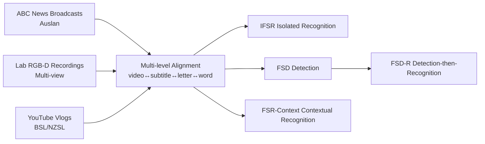

# BANZ-FS: BANZSL Fingerspelling Dataset

**Conference**: ICLR 2026  
**OpenReview**: [https://openreview.net/forum?id=GMR9BUsPbq](https://openreview.net/forum?id=GMR9BUsPbq)  
**Code/Data**: [BANZ-FS (CC BY-NC-SA 4.0)](https://openreview.net/forum?id=GMR9BUsPbq)  
**Area**: Sign Language Understanding / Datasets and Benchmarks  
**Keywords**: Fingerspelling recognition, BANZSL, Two-handed fingerspelling, Sign language translation, Temporal detection  

## TL;DR
This paper constructs BANZ-FS, the first large-scale dataset for **two-handed fingerspelling** in BANZSL (British, Australian, and New Zealand Sign Language). It aggregates over 35K multi-level aligned fingerspelling instances from broadcast news, laboratory recordings, and web vlogs, and systematically benchmarks SOTA models across detection, isolated recognition, and contextual recognition tasks.

## Background & Motivation
**Background**: Fingerspelling is a crucial mechanism in sign language for spelling "out-of-vocabulary" words such as names, locations, and technical terms letter-by-letter, making it essential for sign language translation (SLT) systems. However, existing fingerspelling datasets (ChicagoFSWild, FSBoard, Fleurs-ASL-FS, etc.) focus almost exclusively on the **single-handed system of American Sign Language (ASL)**.

**Limitations of Prior Work**: The **two-handed fingerspelling** system used by the BANZSL family (BSL/Auslan/NZSL, sharing a common two-handed alphabet) has been severely neglected. Existing datasets like Auslan-Daily and BOBSL-FS contain very few fingerspelling instances and mostly lack segment-level temporal annotations, failing to support detection tasks. Furthermore, existing data rarely capture natural phenomena such as spelling errors, abbreviations, initialisms, and self-corrections.

**Key Challenge**: Two-handed fingerspelling introduces unique visual challenges including **self-occlusion, high intra-letter variance, and rapid inter-letter transitions**. However, the academic community lacks a BANZSL fingerspelling benchmark that is both sufficiently large and representative of real-world usage to evaluate and advance related models.

**Goal**: To fill this gap by establishing a large-scale BANZSL fingerspelling dataset with multi-level alignment, covering both controlled and realistic environments, to support detection, isolated recognition, and contextual recognition.

**Core Idea**: **[Multi-source collection + Multi-level alignment]** Data is collected from three heterogeneous sources: broadcast news, laboratory recordings, and web videos. Each instance is aligned at three levels: video↔subtitles, video↔fingerspelled letters, and video↔target words, allowing the same data to serve detection, recognition, and contextual recognition tasks.

## Method

### Overall Architecture
BANZ-FS is comprised of two parts: a dataset and a task benchmark. The data side aggregates corpora from three sources (ABC News with Auslan, multi-view Lab recordings via Kinect/RealSense, and YouTube vlogs for BSL/NZSL) to cover different tempos and levels of formality. Auslan experts provided multi-level temporal alignment. The task side decomposes fingerspelling modeling into four progressive tasks with specific evaluation metrics.

### Key Designs

**1. Three-source heterogeneous corpora: Covering the spectrum from formal broadcast to casual signing.** The dataset intentionally combines three sources to ensure realistic diversity. News broadcasts feature high formality from professional interpreters with the fastest speeds (avg. 4.59 chars/s). Lab recordings provide clean, controlled references with green screens and multiple sensors at slower speeds (avg. 1.3 chars/s), facilitating cross-view robustness studies. Web vlogs cover casual "in-the-wild" signing styles and variable environments. Collectively, the dataset includes 35,028 video clips, 116 signers, and over 200,000 fingerspelled characters, capturing varying rhythms, fluency, and linguistic proficiency across Auslan experts, Deaf individuals, and learners.

**2. Multi-level alignment protocol + Cross-verification.** For news videos, AlphaPose is used to track all individuals, and annotators select the signer ID based on spatial trajectories and signing consistency. Then, they "correct video-subtitle alignment → annotate fingerspelling temporal segments → back-fill target words from subtitles." Each instance contains four types of annotations: signing segment boundaries, fingerspelling boundaries, word form, and English transcription. Quality is maintained via a "recognition-based validation" protocol—5% of segments are randomly audited, with a 95% initial pass rate required.

**3. Explicit annotation of natural linguistic phenomena.** Unlike previous works that only label the intended letters, BANZ-FS explicitly classifies and labels natural phenomena: exact word matches (24%), lexical abbreviations (e.g., equipment→EQ, 32%), initialisms (GWS, 18%), spelling errors (Maguire→Maquire, 15%), and self-corrections (miimiles→miles, 5%). It also quantifies open-set characteristics by reporting out-of-training signers (OOS), out-of-training fingerspelled strings (OOFS), and singletons to strictly evaluate generalization.

**4. Four-level progressive tasks and metrics.** Fingerspelling modeling is split into: **IFSR** (Isolated recognition from cropped clips, using Letter Accuracy $1-\frac{\text{EditDistance}(L^*,\hat{L})}{|L^*|}$); **FSD** (Detection in untrimmed video, using AP@IoU$_{0.5}$); **FSD-R** (Detection-then-recognition, where a segment is a True Positive only if recognition accuracy >50%, using AP@Acc$_{0.5}$); and **FSR-Context** (Extracting fingerspelling spans from SLT model translations and evaluating character-level Letter Accuracy). The FSD-R metric ties localization quality directly to recognizability.

## Key Experimental Results

### Main Results (IFSR, Letter Accuracy %, "Full" denotes combined training)

| Method | News | Lab | Web | Full |
|---|---|---|---|---|
| Iterative-Att | 45.6 | 72.3 | 51.3 | 58.6 |
| MiCT-RANet | 56.4 | 81.8 | 60.1 | 68.6 |
| TS-FS-Reg | 57.2 | 82.9 | 62.4 | 69.7 |
| FS-PoseNet | 62.5 | 87.3 | 70.1 | 74.7 |
| **HandReader** | **64.4** | 86.7 | **71.8** | **75.4** |

### Detection and Detection-then-Recognition (FSD / FSD-R, Full training)

| Method | FSD AP@IoU$_{0.5}$ (Full) | FSD-R AP@Acc$_{0.5}$ (Full) | Web (FSD) |
|---|---|---|---|
| Bi-LSTM CTC | 42.5 | 26.9 | 27.2 |
| Modified R-C3D | 48.8 | 30.5 | 32.2 |
| TS-FS-Det | 54.1 | 42.5 | 37.4 |
| MT-FS-Det | 62.7 | 45.9 | 41.6 |
| **SL-Seg** | **66.9** | **53.5** | **47.3** |

### Key Findings
- **Cross-domain generalization is the major bottleneck**: Nearly all models perform well on their source domain (especially the controlled Lab, reaching up to 93.1%) but degrade sharply on "in-the-wild" Web data. HandReader, which uses multi-modal (RGB+3D pose) cues, is the most robust across domains.
- **Good detection does not imply correct recognition**: There is a significant performance gap between FSD and FSD-R. Many accurately localized segments fail the 50% recognition threshold, suggesting a need for "recognition-aware detection."
- **Contextual recognition is extremely challenging**: Gloss-free SLT models achieve only 16.4% Letter Accuracy on FSR-Context. Character-level tokenization (ByT5) outperforms subword-level T5, indicating that letter-by-letter content benefits from character-level modeling.
- **Pose cues improve detection robustness**: SL-Seg, which uses frame-level BIO labels and poses, outperforms proposal/regression-based methods in the Web domain.

## Highlights & Insights
- **Filling a genuine gap**: This is the first large-scale fingerspelling dataset for the two-handed BANZSL system, providing a missing piece in a field long dominated by single-handed ASL research.
- **"Honest" task design**: FSD-R explicitly incorporates "recognizability" into the metric, which is much closer to real-world utility than pure detection AP.
- **Explicit modeling of real-world phenomena**: Abbreviations, initialisms, and errors, often discarded as noise, are categorized and annotated, adding significant research value.
- **Incidental expansion of Auslan News**: During annotation, the Auslan-Daily News subset was expanded to roughly three times its original size (40 hours of aligned news), benefiting broader SLT research.

## Limitations & Future Work
- **Dataset focus rather than new methodology**: The paper benchmarks existing SOTA models; specialized algorithms designed specifically for two-handed fingerspelling are still needed.
- **Low performance on cross-domain and context tasks**: Performance on Web recognition and FSR-Context (16.4%) remains far from practical, highlighting the difficulty of the dataset.
- **Long-tail and open-set challenges**: Character distributions are long-tailed, and the presence of numerous OOFS/singletons makes low-resource and open-vocabulary recognition an unsolved problem.
- **Source imbalance**: News (Auslan) samples significantly outnumber BSL/NZSL web data, leading to uneven coverage among the three BANZSL dialects.

## Related Work & Insights
This work extends the lineage of ASL fingerspelling datasets (ChicagoFSWild, FSBoard, Fleurs-ASL-FS) and BANZSL resources (Auslan-Daily, BOBSL-FS). As shown in the systematic comparison in Table 1, previous resources were either single-handed, lacked segment annotations, or lacked scale. BANZ-FS creates a generational leap in scale (35K), signer diversity (116), and supported tasks. **Insights**: (1) Multi-modal fusion of 3D pose and RGB is key to generalization under two-handed self-occlusion; (2) Detection and recognition should be evaluated jointly; (3) Character-level tokenization (ByT5) is more suitable than subwords for letter-by-letter tasks like fingerspelling.

## Rating
- **Novelty**: ⭐⭐⭐⭐ First large-scale two-handed BANZSL fingerspelling dataset; filling an obvious gap with multi-source data and natural phenomena labeling.
- **Experimental Thoroughness**: ⭐⭐⭐⭐ Solid matrix-style benchmark (4 tasks × multiple SOTA × multiple domains) with thorough open-set and generalization analysis.
- **Writing Quality**: ⭐⭐⭐⭐ Clear motivation, well-defined tasks/metrics, and high information density in tables.
- **Value**: ⭐⭐⭐⭐ Provides essential infrastructure for the underserved two-handed sign language community; the CC BY-NC-SA release will drive future BANZSL research.

<!-- RELATED:START -->

## Related Papers

- [\[ICLR 2026\] BAH Dataset for Ambivalence/Hesitancy Recognition in Videos for Digital Behaviour Analysis](bah_dataset_for_ambivalencehesitancy_recognition_in_videos_for_digital_behaviour.md)
- [\[CVPR 2025\] FSboard: Over 3 Million Characters of ASL Fingerspelling Collected via Smartphones](../../CVPR2025/human_understanding/fsboard_over_3_million_characters_of_asl_fingerspelling_collected_via_smartphone.md)
- [\[CVPR 2026\] OpenFS: Multi-Hand-Capable Fingerspelling Recognition with Implicit Signing-Hand Detection and Frame-Wise Letter-Conditioned Synthesis](../../CVPR2026/human_understanding/openfs_multi-hand-capable_fingerspelling_recognition_with_implicit_signing-hand_.md)
- [\[ICLR 2026\] SpeakerVid-5M: A Large-Scale High-Quality Dataset for Audio-Visual Dyadic Interactive Human Generation](speakervid-5m_a_large-scale_high-quality_dataset_for_audio-visual_dyadic_interac.md)
- [\[CVPR 2026\] GazeShift: Unsupervised Gaze Estimation and Dataset for VR](../../CVPR2026/human_understanding/gazeshift_unsupervised_gaze_estimation_and_dataset_for_vr.md)

<!-- RELATED:END -->
