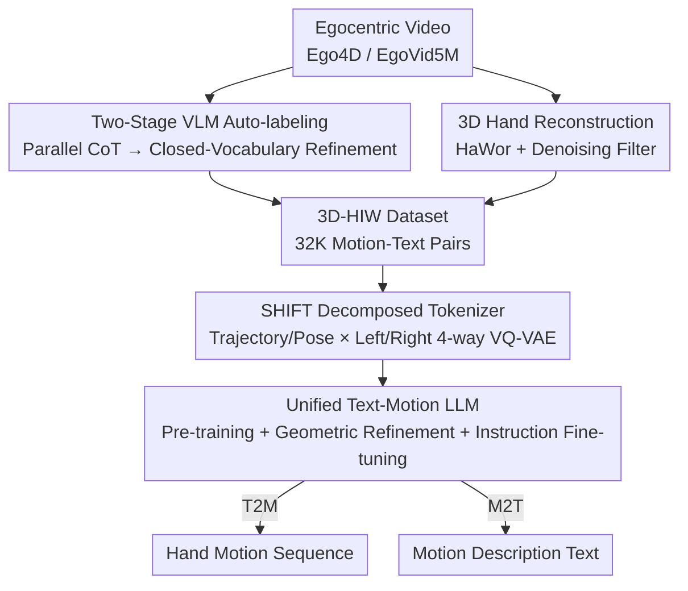

# CLUTCH: Contextualized Language model for Unlocking Text-Conditioned Hand motion modelling in the wild

**Conference**: ICLR2026  
**OpenReview**: [https://openreview.net/forum?id=W7YRskO47j](https://openreview.net/forum?id=W7YRskO47j)  
**Code**: Project Page https://balamuruganthambiraja.github.io/CLUTCH (Commitment to open-source code, data, and models)  
**Area**: Human Understanding / Hand Motion Generation  
**Keywords**: Hand Motion Generation, Text-to-Motion, VQ-VAE, Motion Language Model, Auto-labeling

## TL;DR
CLUTCH utilizes a triad of "32,000 VLM-auto-labeled in-the-wild hand motion data (3D-HIW) + a SHIFT decomposed VQ-VAE that discretizes trajectory/pose and left/right hands separately + LLM fine-tuning with geometric reconstruction loss in the motion space." For the first time, text $\leftrightarrow$ hand motion modeling is achieved in "in-the-wild" scenarios (e.g., playing piano, kneading dough, writing), achieving SOTA performance in both text-to-motion and motion-to-text tasks.

## Background & Motivation
**Background**: Current hand motion modeling relies almost entirely on **studio motion capture** datasets such as GRAB, ARCTIC, and H2O. While high-quality, these datasets feature extremely narrow motion varieties and are expensive to collect. The mainstream approach involves training a VQ-VAE on this data to discretize motion into tokens, followed by an LLM (e.g., MotionGPT, HOIGPT) treating motion tokens as a "foreign language" for text $\leftrightarrow$ motion conversion.

**Limitations of Prior Work**: This paradigm suffers from two major flaws. First, motion capture data includes only limited types of actions and intentions, failing to capture the natural, diverse, and multi-action "in-the-wild" hand movements. Second, directly applying existing methods (MotionGPT/HOIGPT) to hand animation yields poor results. The authors identify two specific causes: **poor generalization of the motion tokenizer** (a single VQ-VAE encoding both hands simultaneously leads to jitter and lack of realism) and **inaccurate motion geometry predicted by the LLM** (correct token prediction does not guarantee high-quality decoded motion).

**Key Challenge**: The Cross-Entropy (CE) objective in training only pursues "selecting the correct next token," but token-level accuracy does not guarantee smooth or realistic geometric motion after decoding. Prior work like EgoLM attempted to remedy this with soft-mixture regression loss, but soft-mixture encourages smooth interpolation while CE forces hard token selection, leading to a **conflict between the two** during pre-training.

**Goal**: The problem is decomposed into three sub-problems: (1) how to obtain large-scale, text-annotated in-the-wild hand motion data at low cost; (2) how to design a motion tokenizer that remains faithful and generalizes well under high temporal compression; (3) how to ensure LLM fine-tuning preserves both linguistic alignment and geometric correctness of motion.

**Key Insight**: Borrowing the concept of using "VLM/LLM as annotators," the authors apply off-the-shelf 3D hand trackers to massive egocentric videos to automatically generate data. Simultaneously, the "motion multimodality" is explicitly decoupled within the tokenizer—separating trajectory from pose, and the left hand from the right hand.

**Core Idea**: By integrating "VLM-auto-labeled in-the-wild data + Part-Modality decomposed VQ-VAE (SHIFT) + an LLM fine-tuning stage with geometric reconstruction in the motion space," the paper liberates text-conditioned hand motion modeling from the studio to the real world.

## Method

### Overall Architecture
CLUTCH addresses "generating in-the-wild hand motions from a sentence, or describing a hand motion sequence." The pipeline consists of three serial stages: **data generation, motion discretization into tokens, and training a unified LLM for the joint text-motion token space**.

The first stage is the **Data Labeling Pipeline**: Egocentric videos from Ego4D / EgoVid5M are processed through two paths. One uses VLMs for two-stage text annotation (Open-Vocabulary Parallel Chain-of-Thought $\rightarrow$ Closed-Vocabulary Refinement). The other uses a 3D hand tracker (HaWor) to reconstruct hand movements with MANO parameters, followed by filtering and outlier removal, resulting in 32,000 "motion-text" pairs named the 3D-HIW dataset. The second stage is the **SHIFT tokenizer**: Motion for each hand is encoded and quantized using independent VQ-VAEs across four paths: "Trajectory $\tau$ / Pose $\theta$" and "Left Hand / Right Hand," producing fine-grained discrete tokens. The third stage is the **Unified LLM**: Motion and text tokens are merged into a shared vocabulary $V = V_t \cup V_m$, with motion segments marked by `<som>/<eom>` delimiters. The model undergoes pre-training $\rightarrow$ geometric refinement $\rightarrow$ instruction fine-tuning, enabling a single model to perform Text-to-Motion (T2M) and Motion-to-Text (M2T).

### Key Designs

**1. Two-stage VLM Auto-labeling: Using Parallel CoT to Suppress Hallucination for Wild Text Annotation**

In-the-wild hand data lacks reliable text descriptions rather than videos. VLMs often hallucinate non-existent objects or actions when describing egocentric videos. The labeling pipeline consists of two stages. Stage one is **Open-Vocabulary High-Level Annotation**: A complex reasoning prompt is split into several **atomic prompts** (hand roles, action-object relations, state transitions, intent). A VLM (VILA) answers these independently, and a summarization LLM (Claude) aggregates these into a coherent description. This **Parallel Chain-of-Thought (Parallel CoT)** decomposes "thinking about everything at once" into "focusing on one aspect at a time," significantly reducing hallucinations. Stage two is **Closed-Vocabulary Refinement**: Candidate words for objects, actions, and hand roles are extracted from EgoVid5M/Ego4D narrations and clustered. The VLM is constrained to select from these candidates, refining high-level descriptions into faithful fine-grained annotations. Finally, a VLM verification + Local Outlier Factor (LOF) filtering step removes outliers. This pipeline achieved a GPT-Score of 6.9, significantly higher than LaVILA (4.9), EgoHOD (6.1), VILA-Naive (5.5) using a single large prompt, and VILA-Stage1 (6.4).

**2. Motion Reconstruction and Data Filtering: Refining Egocentric Videos into Clean MANO Sequences**

Text alone is insufficient; this branch transforms videos into 3D hand movements. Segments involving human-object interaction are filtered based on high-level text. Samples are drawn across clustered scene activities (e.g., crafting, repair) to ensure balanced coverage. A hand keypoint tracker is then used, retaining only sequences where **both hands are visible in $\ge 80\%$ of frames**. 3D hand motion is reconstructed in the global coordinate system via HaWor. To suppress noise, Savitzky-Golay and Gaussian filters are applied sequentially. Finally, sequences with sudden jitter (signals of HaWor failure) are identified and removed using the "mean of top-3 sequence-level accelerations in translation/rotation parameters." The resulting 3D-HIW contains 5,000 minutes of hand poses, 1,355 objects, 1,045 verbs, and 12 million frames of MANO poses—approximately 10x larger than GRAB/ARCTIC and 2x larger than Gigahands.

**3. SHIFT: Decomposing Hands into "Part $\times$ Modality" 4-way VQ-VAE for Fidelity and Generalization**

This innovation addresses the "poor generalization of tokenizer" issue. Hand motion is inherently multimodal; encoding both hands with a standard VQ-VAE leads to instability, a problem amplified by wild data. SHIFT (Structuring Hands Into Fine-grained Tokens) **decouples motion along two dimensions**: Modality (Trajectory $\tau$ - 9D, including 6D global rotation + translation; and Pose $\theta$ - 90D, 15 joints with 6D rotation) and Part (Left hand / Right hand). Specialized trajectory encoders $E_\tau$ and pose encoders $E_\theta$ produce embeddings $z_j, y_j \in \mathbb{R}^{d\times N/8}$ ($j\in\{l,r\}$), which are quantized to $\hat z_j, \hat y_j$ and reconstructed. Training uses standard VQ loss, but codebook/commitment losses are applied to each of the four embeddings:

$$L_{VQ} = L_{rec}(M, \hat M) + \sum_{x\in X}\big(\|\mathrm{sg}[x]-\hat x\|^2 + \beta\|x-\mathrm{sg}[\hat x]\|^2\big),\quad X=\{z_l,z_r,y_l,y_r\}$$

where $\mathrm{sg}$ is stop-gradient. This "Part-Modality" decomposition is more accurate than single codebook or "Part-only" (PD VQ-VAE) designs. In ablations, SHIFT's MPJPE (45.94) is far lower than standard VQ-VAE (93.26), maintaining fidelity even under high temporal compression ($N/8$), allowing the LLM to be trained on 4 A100s (whereas MotionGPT/HOIGPT require 64 V100s / 32 A100s).

**4. Geometric Refinement Stage: Using Gumbel-Softmax to Bring Reconstruction Loss into Motion Space**

This addresses the "inaccurate motion geometry" issue. The LLM performs autoregressive prediction on interleaved motion tokens (alternating trajectory/pose tokens) and text, using a standard next-token cross-entropy $L_{LM}=-\sum_i \log p_\theta(x_i^t\mid x_{<i}^t, X_s)$. However, correct token selection doesn't ensure smooth motion. Unlike prior attempts to add soft-mixture regression during pre-training (which conflicts with CE), the authors introduce a standalone **Geometric Refinement stage** after pre-training. Using **Gumbel-Softmax parameterization** for discrete token selection, sampled tokens are differentiably decoded back to hand motion parameters, allowing **direct application of reconstruction loss in the motion space**. The joint objective is $L = \alpha L_{LM} + \lambda L_{rec}$. A masked prediction task with $\alpha=0$ further forces the model to focus on reconstruction quality. Ablations show geometric refinement reduces total model KID from 0.297 (w/o GR) to 0.216, outperforming EgoLM’s soft-mixture approach. The full LLM training follows: "Pre-training $\rightarrow$ Geometric Refinement $\rightarrow$ Instruction Fine-tuning."

### Loss & Training
- **SHIFT**: $L_{VQ}$ = MSE Reconstruction + 4-way codebook/commitment losses.
- **LLM Pre-training**: Pure cross-entropy next-token prediction + simple T2M/M2T tasks to learn semantics and temporal ordering.
- **Geometric Refinement**: $L=\alpha L_{LM}+\lambda L_{rec}$ with Gumbel-Softmax for differentiable reconstruction loss; includes $\alpha=0$ masked prediction.
- **Instruction Fine-tuning**: Multi-task prompt supervision, unified support for T2M and M2T.

## Key Experimental Results

### Main Results
The dataset is the self-built 3D-HIW (32K sequences, 80/10/10 split, no leakage). All baselines were retrained on the same data for fair comparison.

Text-to-Motion (T2M):

| Method | RP3 ↑ | MMD ↓ | KID ↓ | Div → | MM ↑ |
|------|------|------|------|------|------|
| Ground Truth | 0.667 | 1.903 | — | 3.964 | — |
| HumanMDM | 0.694 | 1.971 | 0.344 | 3.824 | 1.748 |
| MotionGPT | 0.573 | 2.183 | 0.756 | 3.642 | 2.015 |
| T2M-GPT | 0.683 | 1.976 | 0.431 | 3.854 | 1.892 |
| **CLUTCH** | **0.721** | **1.765** | **0.216** | 3.865 | 1.984 |

Motion-to-Text (M2T): CLUTCH scores RP3 0.571 / BLEU4 0.181 / BLEU1 0.420 / Rouge-L 0.472, comprehensively outperforming MotionGPT (0.407 / 0.132 / 0.345 / 0.439) and TM2T.

### Ablation Study

| Configuration | Key Metrics | Description |
|------|---------|------|
| SHIFT (Ours) | MPJPE 45.94 / ACCEL 5.395 | Part-Modality 4-way decomposition (Best) |
| PD VQ-VAE | MPJPE 95.27 / ACCEL 7.500 | Left/Right hands only |
| Std. VQ-VAE | MPJPE 93.26 / ACCEL 7.771 | Single codebook |
| MotionGPT VQ-VAE | MPJPE 93.49 / ACCEL 8.340 | Baseline tokenizer |
| Full (PT+GR+IFT) | KID 0.216 / T2M RP3 0.72 / M2T RP3 0.57 | Full training pipeline |
| w/o GR (PT+IFT) | KID 0.297 / T2M RP3 0.69 / M2T RP3 0.57 | Without Geometric Refinement |
| PT only | T2M RP3 0.53 / M2T RP3 0.50 | Pre-training only |

### Key Findings
- **SHIFT is critical for tokenizer quality**: The "Part-Modality decomposition" alone halves MPJPE from ~93 to 45.94. Its stability under temporal compression reduces training costs from dozens of GPUs to just 4 A100s.
- **IFT for Generalization, GR for Geometry**: Instruction fine-tuning raises T2M RP3 from 0.53 to 0.69, while geometric refinement further suppresses KID from 0.297 to 0.216. As the authors summarize: "IFT increases generalization, GR makes generalization meaningful."
- **Scaling benefits for both data and models**: Performance improves steadily as sequences increase from 7K to 30K. Scaling the language model from T5-Small (50M) to Base (220M) and Large (770M) yields significant gains (e.g., T2M RP3 0.545 $\rightarrow$ 0.721 $\rightarrow$ 0.733).
- **Two-stage labeling is essential**: A single large prompt (VILA-Naive 5.5) and Stage-1 only (VILA-Stage1 6.4) are inferior to the full two-stage pipeline (6.9).

## Highlights & Insights
- **Dual-pronged approach (Data + Loss)**: One hand solves "where wild data comes from" (auto-labeling pipeline transforms Ego4D into a text-hand motion library), while the other solves "why LLM motion geometry is inaccurate" (Gumbel-Softmax brings reconstruction loss into the motion space).
- **Parallel CoT as a transferable trick**: Splitting "reasoning about everything" into atomic prompts and aggregating them is a simple but effective hallucination-reduction technique for any VLM-based video/image annotation task.
- **Part-Modality codebook design**: Treating "multimodal discretization" by "splitting codebooks according to physical semantics" is more effective than simply increasing codebook size. This is applicable to other structured sequences like full-body motion or facial animation.
- **The "Aha" moment**: High token-level accuracy does not equal good motion. The Geometric Refinement stage explicitly pulls training signals from the discrete token space back to the continuous motion space, effectively addressing the long-standing CE vs. regression conflict.

## Limitations & Future Work
- **Hand-Object Interaction (HOI) is absent**: The current model focuses only on hand motion, bypassing HOI due to the difficulty of wild HOI reconstruction. Fine-grained expressiveness and temporal segmentation of overlapping actions require more work.
- **Data quality bounded by tracker limits**: 3D-HIW ground truths are "pseudo-labels" from HaWor reconstruction + filtering. Heuristic-based jitter removal (acceleration thresholds) might filter out fast actions or miss systematic biases. No calibration against manual MoCap was performed.
- **Reliance on self-built benchmarks**: 3D-HIW is the first wild hand benchmark; SOTA conclusions currently rely on retraining baselines on this internal data without external cross-validation.
- **Future directions**: Integrating HOI into a unified token space, using temporal heads for overlapping actions, and leveraging stronger 3D trackers or multi-view cues.

## Related Work & Insights
- **vs MotionGPT / HOIGPT**: While all treat motion tokens as "foreign languages," those models use single/double codebook tokenizers and focus on token accuracy. CLUTCH uses the 4-way SHIFT tokenizer and Geometric Refinement, achieving better generalization and fidelity at a fraction of the training cost.
- **vs EgoLM (Soft-mixture Regression)**: EgoLM adds soft-mixture regression during PT, which conflicts with CE. CLUTCH isolates geometric alignment into a refinement stage and uses Gumbel-Softmax for differentiable selection, outperforming the soft-mixture approach.
- **vs GRAB / ARCTIC / Gigahands**: These datasets are high-quality but limited to studios. 3D-HIW uses VLM+tracker for auto-labeling, resulting in a dataset ~10x larger than MoCap sets and ~2x larger than Gigahands, covering rare actions like piano playing and cooking.

## Rating
- Novelty: ⭐⭐⭐⭐⭐ First in-the-wild hand motion modeling; targeted innovations in data pipeline, SHIFT tokenizer, and geometric refinement.
- Experimental Thoroughness: ⭐⭐⭐⭐ Extensive ablations across tasks, labeling, and training stages, though primarily on a self-built benchmark.
- Writing Quality: ⭐⭐⭐⭐ Clear mapping from pain points to methods; well-explained pipeline; some metric definitions require appendix lookup.
- Value: ⭐⭐⭐⭐⭐ Opens the door for wild hand motion generation; open-source commitment benefits AR/VR, robotics, and HCI.

<!-- RELATED:START -->

## Related Papers

- [\[ECCV 2024\] HUMOS: Human Motion Model Conditioned on Body Shape](../../ECCV2024/human_understanding/humos_human_motion_model_conditioned_on_body_shape.md)
- [\[CVPR 2026\] MoLingo: Motion-Language Alignment for Text-to-Human Motion Generation](../../CVPR2026/human_understanding/molingo_motion-language_alignment_for_text-to-motion_generation.md)
- [\[ICCV 2025\] GenM3: Generative Pretrained Multi-path Motion Model for Text Conditional Human Motion Generation](../../ICCV2025/human_understanding/genm3_generative_pretrained_multi-path_motion_model_for_text_conditional_human_m.md)
- [\[CVPR 2026\] OpenFS: Multi-Hand-Capable Fingerspelling Recognition with Implicit Signing-Hand Detection and Frame-Wise Letter-Conditioned Synthesis](../../CVPR2026/human_understanding/openfs_multi-hand-capable_fingerspelling_recognition_with_implicit_signing-hand_.md)
- [\[ICLR 2026\] Motion-Aligned Word Embeddings for Text-to-Motion Generation](motion-aligned_word_embeddings_for_text-to-motion_generation.md)

<!-- RELATED:END -->
