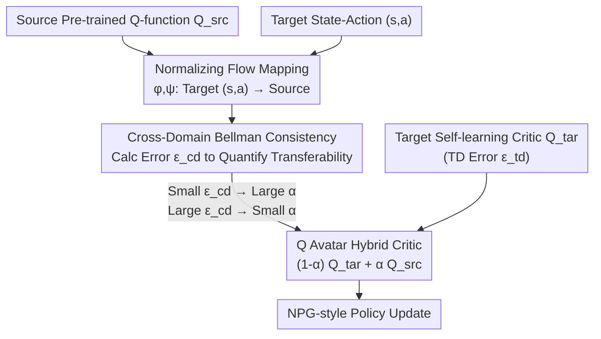

# Cross-Domain Policy Optimization via Bellman Consistency and Hybrid Critics

**Conference**: ICLR 2026  
**arXiv**: [2603.12087](https://arxiv.org/abs/2603.12087)  
**Code**: [https://rl-bandits-lab.github.io/Cross-Domain-RL/](https://rl-bandits-lab.github.io/Cross-Domain-RL/)  
**Area**: Human Understanding  
**Keywords**: Cross-domain RL, Bellman consistency, Hybrid Critic, Q-function transfer, Negative transfer protection

## TL;DR

The Q Avatar framework is proposed to quantify source model transferability via cross-domain Bellman consistency. By utilizing an adaptive, hyperparameter-free weighting function to hybridize source and target domain Q-functions, reliable knowledge transfer is achieved in cross-domain RL with different state-action spaces, guaranteeing no negative transfer regardless of source model quality or domain similarity.

## Background & Motivation

### Background
Cross-Domain Reinforcement Learning (CDRL) aims to leverage data collected from a source domain to improve learning efficiency in a target domain. In practical scenarios (e.g., between robots with different morphologies), the source and target domains often possess **different state and action spaces**, making direct transfer impossible.

### Key Challenges

**State-Action Space Inconsistency**: Source and target domains may have different dimensions for state and action representations, requiring complex inter-domain mappings.

**Unknown Transferability**: It is difficult to determine the transfer performance of a source model beforehand. CDRL is prone to **negative transfer**, where performance after transfer is worse than learning from scratch.

### Limitations of Prior Work
- Hand-crafted latent space mapping methods (Ammar & Taylor, 2012) lack flexibility.
- Learned inter-domain mappings (Zhang et al., 2021; Gui et al., 2023) are based on dynamic alignment but lack performance guarantees and ignore transferability issues.
- All existing methods assume domains are sufficiently similar and do not address negative transfer protection.

## Method

### Overall Architecture

Q Avatar addresses cross-domain transfer where state and action space dimensions differ between the source (e.g., simulator) and target (e.g., real robot). The approach follows a three-step mechanism: "Bridge, Quantify, and Mix." First, it uses normalizing flow-based mappings $\phi, \psi$ to map target domain state-actions back to the source domain, enabling the source Q-function to be evaluated on target data. Second, it uses the cross-domain Bellman error to quantify the reliability of the transferred Q-function in real-time. Finally, it dynamically weights the source and target critics into a hybrid critic to drive policy updates. The mechanism ensures that the hybrid weight fluctuates automatically with transferability—relying more on the source when it is credible and reverting to target-only learning when it is not—preventing negative transfer even with poor source models or large domain gaps.

### Key Designs

**1. Normalizing Flow Inter-domain Mapping: Stable Cross-Domain Correspondence**

The first step addresses spatial inconsistency. Since source and target dimensions differ, the source Q-function cannot directly process target $(s,a)$. Q Avatar uses normalizing flows to parameterize mappings $\phi: \mathcal{S}_{\text{tar}} \to \mathcal{S}_{\text{src}}$ and $\psi: \mathcal{A}_{\text{tar}} \to \mathcal{A}_{\text{src}}$. The training objective minimizes the cross-domain Bellman loss, making the mapping converge toward making the source Q-function self-consistent in the target domain. Normalizing flows are chosen for their inherent invertibility and training stability, avoiding degenerate solutions common in alignment. This component is modular; the Q Avatar framework is compatible with various mapping methods.

**2. Cross-Domain Bellman Consistency: Quantifying Transferability**

CDRL's primary difficulty is the inability to judge source knowledge quality beforehand. Q Avatar formalizes "transferability" as a computable metric: the cross-domain Bellman error $\epsilon_{\text{cd}}(s,a;\phi,\psi,Q_{\text{src}},\pi) = |Q_{\text{src}}(\phi(s),\psi(a)) - r_{\text{tar}}(s,a) - \gamma \mathbb{E}_{s',a'}[Q_{\text{src}}(\phi(s'),\psi(a'))]|$. If the mapped source Q-function satisfies the Bellman equation in the target domain (low error), it is consistent with the target rewards and dynamics and thus reliable. This metric relies solely on data rather than extra environment interaction or human priors.

**3. Q Avatar Hybrid Critic: Hyperparameter-free Weighting**

During policy updates, Q Avatar linearly blends the target critic and the source critic: $Q^{(t)}_{\text{avatar}} = (1-\alpha(t)) Q^{(t)}_{\text{tar}} + \alpha(t) Q_{\text{src}}(\phi^{(t)}, \psi^{(t)})$. The weight $\alpha(t)$ is fully adaptive and calculated as the ratio of the reciprocals of the cross-domain Bellman error and the target TD error: $\alpha(t) = \frac{1/\|\epsilon_{\text{cd}}\|_{d^{\pi^{(t)}}}}{1/\|\epsilon_{\text{td}}^{(t)}\|_{d^{\pi^{(t)}}} + 1/\|\epsilon_{\text{cd}}\|_{d^{\pi^{(t)}}}}$. When the source error is smaller than the target error, $\alpha$ increases to favor source knowledge. The theoretical optimality gap is bounded by $O\left(\frac{\log|\mathcal{A}|}{\sqrt{T}(1-\gamma)}\right) + C \cdot \min\{\|\epsilon_{\text{td}}^{(t)}\|, \|\epsilon_{\text{cd}}\|\}$, ensuring the hybrid critic performs no worse than learning from scratch.

## Key Experimental Results

### Main Results

Evaluations were conducted across locomotion, robot arm manipulation, and navigation:

| Environment | Threshold | Q Avatar | SAC (From Scratch) | Ratio |
| :--- | :--- | :--- | :--- | :--- |
| HalfCheetah | 6000 | 126K steps | 176K steps | 0.71 |
| Ant | 1600 | 206K steps | 346K steps | 0.59 |
| Door Opening | 90 | 48K steps | 98K steps | 0.49 |
| Table Wiping | 45 | 72K steps | 98K steps | 0.73 |
| Navigation | 20 | 218K steps | 490K steps | **0.44** |

In the best case, it requires only 44% of the environment steps compared to SAC to reach the threshold.

### Ablation Study

| Configuration | Key Metric | Description |
| :--- | :--- | :--- |
| Strong Positive Transfer (Symmetric Ant) | High $\alpha(t)$ | Effectively utilizes source knowledge |
| Strong Negative Transfer (Opposite Goal Ant) | Low $\alpha(t)$ | Automatically protects against negative transfer |
| Low Quality Source (Return 1000 vs 7000) | Decreasing $\alpha(t)$ | Adaptive reduction of dependence |
| Unrelated Domain (Hopper → Table Wiping) | No negative transfer | Reliable safety guarantee |
| Non-stationary Env (Noisy Rewards+Actions) | Maintained gain | Robustness |
| $N_\alpha$ Sensitivity Test | Slight sensitivity | Works well across 300/1000/3000 |

### Key Findings
- $\alpha(t)$ accurately reflects transferability: high for positive and low for negative transfer.
- Q Avatar avoids negative transfer even when source and target domains are completely unrelated.
- Supports multi-source transfer with automatic weight distribution.
- Validated effectiveness on image-based DMC tasks.

## Highlights & Insights

1.  **Theory-Driven Framework**: Establishes a formal definition of transferability from Bellman consistency, tightly coupling theory with algorithm design.
2.  **Hyperparameter-free Adaptive Weighting**: $\alpha(t)$ is determined entirely by error ratios, eliminating manual tuning for practical usability.
3.  **Negative Transfer Guarantee**: Ensures performance is at least as good as learning from scratch, a critical feature missing in most CDRL methods.
4.  **"Avatar" Metaphor**: Analogy to remote-controlling an engineered body to adapt to an alien environment effectively conveys the algorithmic concept.

## Limitations & Future Work

- Tabular analysis assumes finite state-action spaces and exploratory initial distributions, creating a gap with continuous control reality.
- The training quality of the normalizing flow mapping directly affects the accuracy of Bellman error estimation.
- Source models were pre-trained with SAC; robustness to other algorithms (e.g., PPO) remains unverified.
- Scalability to high-dimensional complex tasks (e.g., dexterous manipulation) requires further validation.
- Currently limited to single-target scenarios (single-to-single or multi-to-single source).

## Related Work & Insights

- **CMD** (Gui et al., 2023): Learned inter-domain mapping via dynamic cycle consistency but lacks performance guarantees.
- **CAT** (You et al., 2022): Uses encoder-decoders for mapping but is limited to parameter-level transfer.
- **DARC** (Eysenbach et al., 2021): Reward augmentation method, but assumes identical state-action spaces.
- **Task Vectors** (Wang et al., 2020): Uses dual Q-functions for Q-learning but is restricted to identical spaces.
- Insight: The use of Bellman consistency as a transferability metric could be extended to imitation learning and offline RL.

## Rating
- Novelty: ⭐⭐⭐⭐ 
- Experimental Thoroughness: ⭐⭐⭐⭐⭐ 
- Writing Quality: ⭐⭐⭐⭐ 
- Value: ⭐⭐⭐⭐⭐ 

<!-- RELATED:START -->

## Related Papers

- [\[CVPR 2026\] HamiPose: Hamiltonian Optimization for Unsupervised Domain Adaptive Pose Estimation](../../CVPR2026/human_understanding/hamipose_hamiltonian_optimization_for_unsupervised_domain_adaptive_pose_estimati.md)
- [\[ICLR 2026\] Human-Object Interaction via Automatically Designed VLM-Guided Motion Policy](human-object_interaction_via_automatically_designed_vlm-guided_motion_policy.md)
- [\[CVPR 2026\] Through the Frequency Lens: Cross-Domain Generalisable Gaze Estimation with Adaptive Modulation](../../CVPR2026/human_understanding/through_the_frequency_lens_cross-domain_generalisable_gaze_estimation_with_adapt.md)
- [\[CVPR 2026\] Towards Cross-Modal Preservation, Consistency and Alignment for Privacy-Preserving Visible-Infrared Person Re-Identification](../../CVPR2026/human_understanding/towards_cross-modal_preservation_consistency_and_alignment_for_privacy-preservin.md)
- [\[NeurIPS 2025\] A Generalized Label Shift Perspective for Cross-Domain Gaze Estimation](../../NeurIPS2025/human_understanding/a_generalized_label_shift_perspective_for_crossdomain_gaze_e.md)

<!-- RELATED:END -->
