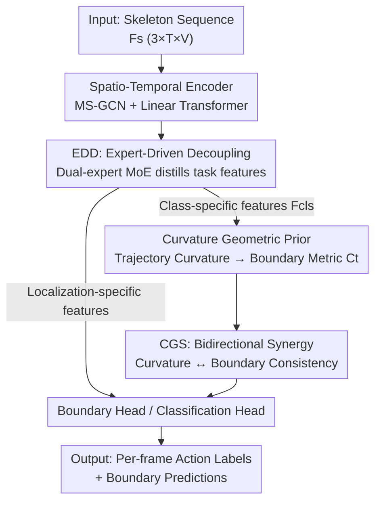

# Curvature-Guided Task Synergy for Skeleton based Temporal Action Segmentation

**Conference**: ICLR2026  
**OpenReview**: [https://openreview.net/forum?id=Vgh30npuN3](https://openreview.net/forum?id=Vgh30npuN3)  
**Code**: TBD  
**Area**: Human Understanding / Skeleton Action Segmentation / Temporal Action Segmentation  
**Keywords**: Skeleton Action Segmentation, Curvature Geometric Prior, Task Synergy, Mixture-of-Experts, Boundary Localization

## TL;DR
CurvSeg addresses the inherent conflict between "temporal invariance for classification" and "temporal sensitivity for boundary localization" in skeleton-based temporal action segmentation. It proposes using the **geometric curvature of classification feature trajectories** as a boundary prior—where curvature is high within action segments and low at transitions. This establishes a bidirectional closed-loop synergy between classification and localization, complemented by a dual-expert MoE to distill task-specific features, serving as a plug-and-play module that enhances the segmentation accuracy of baselines like DeST/LaSA across four datasets.

## Background & Motivation

**Background**: Temporal Action Segmentation (TAS) aims to assign action labels to every frame of an untrimmed video, serving as a fundamental task for fine-grained human behavior understanding. While RGB/optical flow-based methods have progressed significantly, they are unreliable in privacy-sensitive or appearance-variable scenarios (e.g., healthcare). **Skeleton-based TAS (STAS)** models pure kinematics, inherently protecting privacy and decoupling from visual distractors, making it an important alternative.

**Limitations of Prior Work**: STAS involves two sub-tasks with naturally conflicting requirements—**action classification** requires temporally invariant, abstract features to ensure consistent intra-segment recognition; **boundary localization** requires temporally sensitive, fine-grained features to precisely lock onto action switching moments. The prevailing paradigm is "task decoupling": attaching two independent decoding heads (DeST, LaSA, etc.) to a shared spatio-temporal encoder (GCN+TCN).

**Key Challenge**: The authors argue that this decoupling is an "over-simplification." While the two tasks compete at the feature level, they are highly complementary at the semantic level—knowing "what action is occurring" provides a strong prior for "where the boundary is," and vice versa. Isolating the two creates "information silos," artificially cutting off potentially mutually beneficial cross-task synergy. Recent works have either decoupled spatio-temporal modeling to mitigate over-smoothing (DeST) or introduced language priors to enhance representations (LaSA), but none have addressed the root problem of "insufficient cross-task synergy."

**Key Insight**: The authors leverage a geometric insight from representation learning—in a well-learned feature space, the trajectories of continuous data sequences (e.g., skeleton frames) are spatially constrained within their respective class clusters. This constraint **forces trajectories to turn continuously within an action segment** to avoid crossing cluster boundaries, resulting in high curvature. At action transitions, trajectories "straighten out," forming low-curvature "valleys." These curvature valleys naturally mark potential transition points.

**Core Idea**: Use the curvature of classification features as a **parameter-free geometric prior** to guide boundary detection, and let localization predictions in turn supervise the classification feature space (penalizing low curvature within predicted action segments). This forms a virtuous cycle of "feature learning $\leftrightarrow$ temporal localization." Simultaneously, a dual-expert MoE is used to extract exclusive features for each sub-task, ensuring the quality of features upon which curvature calculation depends.

## Method

### Overall Architecture

CurvSeg (Fig. 2) stacks two core modules on top of skeleton encoders like DeST/LaSA. The input is a skeleton sequence $F_s \in \mathbb{R}^{D_{in}\times T\times V}$ ($D_{in}=3$ for 3D coordinates, $T$ frames, $V$ joints), and the output is a per-frame action label. The pipeline is: skeleton data passes through a **Spatio-Temporal Encoder** (Multi-scale GCN for spatial modeling + Linear Transformer for $O(n)$ global temporal modeling) to obtain frame-level features $F_{ST}$; then **Expert-Driven Decoupling (EDD)** adaptively splits these shared features into classification-specific features $F_{cls}$ and localization-specific features; next, **Curvature-Guided Synergy (CGS)** calculates the per-frame curvature from $F_{cls}$, converting it into a boundary change metric $C_t$ to apply bidirectional consistency constraints with the boundary head prediction $\hat{y}^b_t$; finally, the classification and boundary heads output frame-level logits. The two modules are interdependent—EDD provides high-quality features as a foundation, while CGS maximizes the geometric potential on this foundation.

### Key Designs

**1. EDD (Expert-Driven Decoupling): Distilling task-specific features**

The effectiveness of curvature synergy depends on underlying feature quality, but existing methods force two decoding heads to consume the same shared encoder output, which is a "compromise representation." Inspired by multi-modal perception, EDD constructs classification and localization expert groups: they process the same encoded features but focus on task-relevant aspects. Spatially, joints are recalibrated using an SE-style module—$F_{ST} = F_{ST} + \mathrm{Sigmoid}(\mathrm{MLP}(z_{st})) F_{ST}$, where $z_{st}$ is the global temporal pooling of $F_{ST}$, then compressed via a Decoupled Spatio-Temporal Interaction (DSTI) layer into $F_{ST}\in\mathbb{R}^{D\times T}$. Temporally, a set of **Gaussian Experts** acts as soft temporal masks: the $T$ frames are uniformly cut into $M$ segments, each containing $S=\lfloor T/M\rfloor$ frames. Each segment generates $G$ Gaussian functions $G^{(m)}_i=\mathcal{N}(\mu^{(m)}_i,(\sigma^{(m)}_i)^2)$, with centers and variances calculated by an MLP. A router assigns soft weights $\tau^{(m)}$ to each expert per segment, and the features are weighted sums $\tilde{F}^{(m)}=\sum_{i=1}^{G}\tau^{(m)}_i G^{(m)}_i F^{(m)}$. Fragmented modeling allows Gaussian experts to learn **relative** temporal patterns like "event starts" (within normalized local contexts) rather than absolute positions, significantly simplifying learning.

**2. Curvature Geometric Prior: Using class feature trajectory curvature as a boundary probe**

This is the geometric cornerstone of the paper. When classification representations successfully separate action classes, they constrain the sequence trajectory within compact, class-exclusive regions. Appendix B formally derives that the **average curvature of a random walk is inversely proportional to its bounding hypersphere radius**. The intuitive result: points within a segment must frequently change direction to stay within class boundaries $\rightarrow$ high curvature; points during transitions translate between class regions $\rightarrow$ low curvature. Specifically, three consecutive points $F_{cls,t-w}, F_{cls,t}, F_{cls,t+w}$ on the trajectory are used to measure the turning angle between adjacent difference vectors:

$$\theta_t = \arccos \frac{(F_{cls,t}-F_{cls,t-w})\cdot(F_{cls,t+w}-F_{cls,t})}{\|F_{cls,t}-F_{cls,t-w}\|\cdot\|F_{cls,t+w}-F_{cls,t}\|}$$

Curvature is defined as the turning angle normalized by the length of difference vectors $\kappa_t = \theta_t/(\|F_{cls,t}-F_{cls,t-w}\|\cdot\|F_{cls,t+w}-F_{cls,t}\|+\epsilon)$. A moving average is applied for denoising to get $\bar\kappa$, followed by min-max normalization for scale invariance $\hat\kappa_t$. Finally, the **inverse** is taken to obtain the boundary metric $C_t = 1-\hat\kappa_t$—low curvature (valleys) corresponds to high boundary probability. Compared to traditional distance metrics or gradient saliency, curvature explicitly characterizes the directional evolution of the feature manifold.

**3. CGS (Bidirectional Task Synergy): Aligning curvature and boundary predictions**

A curvature prior alone is insufficient; the key is to link it with localization and classification in a closed loop. CGS applies **bidirectional consistency constraints** between predicted boundary probabilities and the curvature-based metric:

$$L_{curv} = -\frac{1}{T}\sum_{t=1}^{T}\big[\mathrm{MSE}(\hat{y}^b_t,\varphi(C_t)) + \mathrm{MSE}(C_t,\varphi(\hat{y}^b_t))\big]$$

where $\varphi(\cdot)$ is the stop-gradient function. The forward path $C\!\to\!L$ uses geometric priors to refine boundaries and improve F1; the backward path $L\!\to\!C$ penalizes low curvature within predicted segments, forcing classification features to organize into more discriminative, compact clusters, thereby improving accuracy and producing more precise geometric priors.

### Loss & Training

The total objective combines the baseline frame-level cross-entropy + segment-level smoothing classification loss $L_c$, binary logistic regression boundary loss $L_b$, and curvature synergy loss $L_{curv}$:

$$L = L_c + L_b + \lambda L_{curv}$$

where $\lambda$ balances the synergy strength. Training uses Adam on a single 3090. Curvature window $w=10$. $\lambda$ is set to 4/2.5/2 for PKU/LARa/MCFS respectively. Each video is split into 64 segments with 2 Gaussian experts per segment.

## Key Experimental Results

### Main Results

CurvSeg, as a plug-and-play module for DeST and LaSA, shows comprehensive improvements across four standard datasets (MCFS-22/130, PKU-MMD X-sub/X-view, LARa). **Segment-level F1 improvements are most significant**, while frame accuracy also increases, confirming the "more accurate boundaries $\rightarrow$ purer features $\rightarrow$ better classification" loop.

| Dataset | Metric | Baseline LaSA | +Ours | Gain |
|--------|------|-----------|-------|------|
| PKU-MMD (X-sub) | F1@50 | 63.6 | 65.5 | +1.9 |
| PKU-MMD (X-view) | F1@10 | 72.9 | 74.4 | +1.5 |
| LARa | Acc | 75.3 | 76.6 | +1.3 |
| MCFS-130 | Edit | 79.3 | 79.8 | +0.5 |

### Ablation Study

| Configuration | LARa Acc | F1@50 | Description |
|------|---------|-------|------|
| Base (LaSA) | 75.3 | 57.9 | Baseline only |
| +EDD | 76.2 | 58.4 | Expert decoupling provides task-specific foundations |
| +CGS | 76.2 | 58.7 | Curvature synergy targets boundary F1 |
| Full (Ours) | 76.6 | 59.0 | Synergy gain exceeds the sum of individual modules |

Comparison of Guiding Signals (LARa): Curvature vs. other boundary proxies.

| Guidance Method | Acc | F1@50 | Description |
|---------|-----|-------|------|
| Base | 75.3 | 57.9 | No guidance |
| Euclidean Distance | 76.0 | 57.8 | Sensitive to magnitude |
| Cosine | 75.2 | 57.0 | Worst performance |
| Gradient Saliency | 74.4 | 57.1 | Tends to highlight action centers |
| Curvature (Ours) | 76.2 | 58.7 | Optimal, parameter-free |

### Key Findings
- **EDD and CGS are complementary**: The full model gain is significantly greater than the individual contributions—EDD provides high-quality specific features, allowing CGS to maximize geometric potential.
- **Bidirectional paths serve distinct roles**: The forward $C\!\to\!L$ increases F1 (refining boundaries), while the backward $L\!\to\!C$ increases Acc (regularizing features).
- **Curvature as a standalone detector**: Simply thresholding the inverted curvature for boundary prediction achieves competitive results (F1@10 72.3 on LARa).
- **Hyperparameter Sensitivity**: $w=10$ is optimal. If $w$ is too small (5), context is insufficient; if too large ($\geq 40$), the sharp directional changes defining boundaries are over-smoothed.

## Highlights & Insights
- **Mapping "Representation Geometry" to "Synergy Signals"**: The insight that curvature valleys equal boundaries transforms abstract manifold geometry into a parameter-free prior that can directly supervise boundaries—bridging classification and localization without new parameters.
- **Clever Bidirectional Stop-Gradient Design**: Using $\varphi$ in both terms of $L_{curv}$ allows curvature and boundaries to align as "soft labels" rather than dragging each other into collapse.
- **"Relative Timing" via Gaussian Experts**: Cutting long videos into segments to let experts learn relative patterns like "event starts" rather than absolute positions is a strategy transferable to any temporal localization task.
- **Plug-and-play**: CGS+EDD does not modify the baseline backbone and directly enhances DeST/LaSA with low integration costs.

## Limitations & Future Work
- **Shallow curvature valleys in low-dynamic actions**: For continuous evolving actions without abrupt changes (e.g., Step Sequences in figure skating), curvature valleys are much shallower, making geometric priors less effective.
- **Sensor noise inducing false peaks**: Jitter in skeleton estimation introduces high-frequency fluctuations in feature trajectories, creating false curvature peaks (false positives) in non-boundary regions.
- **Dependency on classification quality**: The mechanism assumes that classification representations are already well-learned and clusters are compact; priors may be unreliable in early training or extreme class imbalance.
- **Future Directions**: Introducing adaptive windows or multi-scale curvature for low-dynamic segments, and robust smoothing/confidence weighting for noise.

## Related Work & Insights
- **vs. DeST**: DeST decouples spatio-temporal modeling to mitigate over-smoothing but maintains independent heads with shared inputs. This work adds cross-task synergy (CGS) and task-specific features (EDD).
- **vs. LaSA**: LaSA uses language priors to enhance representations (semantic injection); this work follows a pure geometric route without external modalities, and the two are orthogonal (CGS still yields gains on LaSA).
- **vs. Decoupled Heads in Object Detection**: The classification/localization conflict in STAS borrows from object detection, but this work argues that pure decoupling creates silos and uses curvature geometry to reconstruct synergy.

## Rating
- Novelty: ⭐⭐⭐⭐⭐ Uses trajectory curvature as a boundary prior with a bidirectional closed loop; theoretically supported (Appendix B).
- Experimental Thoroughness: ⭐⭐⭐⭐ Extensive testing across four datasets and two baselines with comprehensive ablations.
- Writing Quality: ⭐⭐⭐⭐ Clear motivation and intuitive geometric explanations.
- Value: ⭐⭐⭐⭐ Plug-and-play, parameter-free, and privacy-friendly for skeletal TAS scenarios.

<!-- RELATED:START -->

## Related Papers

- [\[CVPR 2026\] PRISM: Learning a Shared Primitive Space for Transferable Skeleton Action Representation](../../CVPR2026/human_understanding/prism_learning_a_shared_primitive_space_for_transferable_skeleton_action_represe.md)
- [\[ICLR 2026\] TriC-Motion: Tri-domain Causal Modeling for Text-to-Action Generation](tric-motion_tri-domain_causal_modeling_grounded_text-to-motion_generation.md)
- [\[ICLR 2026\] From Pixels to Semantics: Unified Facial Action Representation Learning for Micro-Expression Analysis](from_pixels_to_semantics_unified_facial_action_representation_learning_for_micro.md)
- [\[ICLR 2026\] From Sparse to Dense: Spatio-Temporal Fusion for Multi-View 3D Human Pose Estimation with DenseWarper](from_sparse_to_dense_spatio-temporal_fusion_for_multi-view_3d_human_pose_estimat.md)
- [\[ICLR 2026\] Human-Object Interaction via Automatically Designed VLM-Guided Motion Policy](human-object_interaction_via_automatically_designed_vlm-guided_motion_policy.md)

<!-- RELATED:END -->
## Related Papers

- [\[CVPR 2026\] PRISM: Learning a Shared Primitive Space for Transferable Skeleton Action Representation](../../CVPR2026/human_understanding/prism_learning_a_shared_primitive_space_for_transferable_skeleton_action_represe.md)
- [\[ICLR 2026\] From Pixels to Semantics: Unified Facial Action Representation Learning for Micro-Expression Analysis](from_pixels_to_semantics_unified_facial_action_representation_learning_for_micro.md)
- [\[ICLR 2026\] Human-Object Interaction via Automatically Designed VLM-Guided Motion Policy](human-object_interaction_via_automatically_designed_vlm-guided_motion_policy.md)
- [\[ICLR 2026\] From Sparse to Dense: Spatio-Temporal Fusion for Multi-View 3D Human Pose Estimation with DenseWarper](from_sparse_to_dense_spatio-temporal_fusion_for_multi-view_3d_human_pose_estimat.md)
- [\[ICLR 2026\] Pose-RFT: Aligning MLLMs for 3D Pose Generation via Hybrid Action Reinforcement Fine-Tuning](pose-rft_aligning_mllms_for_3d_pose_generation_via_hybrid_action_reinforcement_f.md)

<!-- RELATED:END -->
