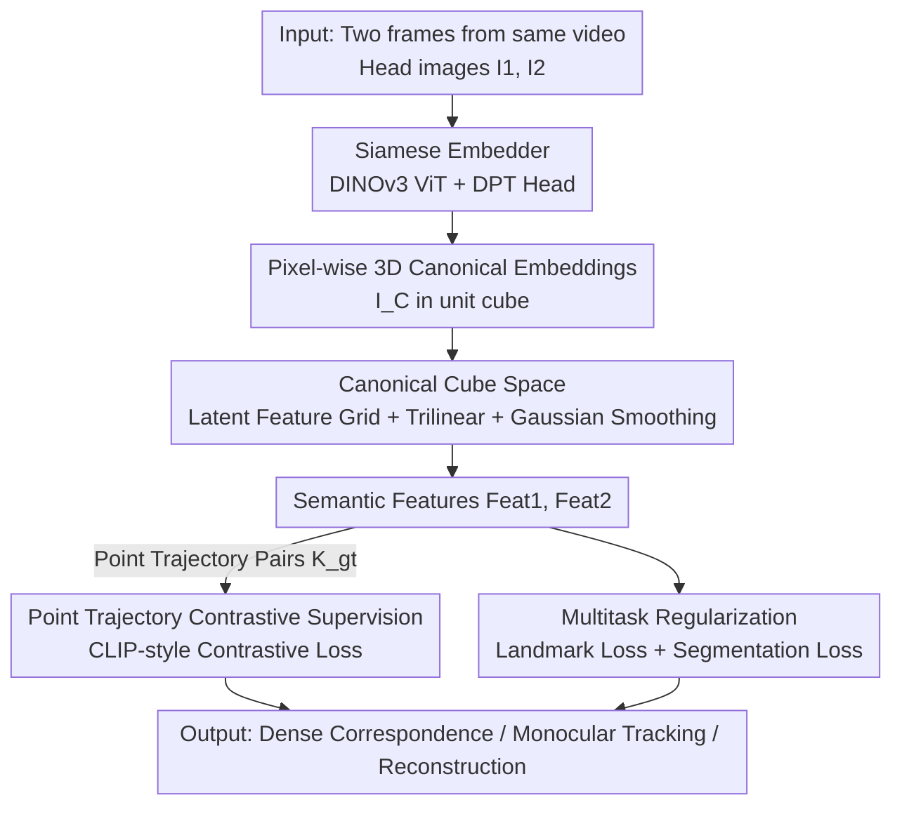

# DenseMarks: Learning Canonical Embeddings for Head Images via Point Trajectories

**Conference**: ICLR2026  
**OpenReview**: [https://openreview.net/forum?id=KOvRxAMBzV](https://openreview.net/forum?id=KOvRxAMBzV)  
**Code**: To be confirmed (Authors state code and checkpoints will be released)  
**Area**: Human Understanding / Dense Correspondence / Head Tracking  
**Keywords**: Canonical Embeddings, Dense Correspondence, Point Trajectories, Contrastive Learning, Head Tracking

## TL;DR
DenseMarks uses a ViT embedder to map **every pixel** of a head image to coordinates in a 3D canonical unit cube. Trained using automated pairs from off-the-shelf point trackers on in-the-wild talking head videos combined with contrastive loss, it achieves a cross-identity, cross-pose consistent, and interpretable dense correspondence representation, reaching SOTA in geometry-aware point matching and monocular head tracking.

## Background & Motivation
**Background**: High-quality face/head modeling (AR/VR, film, gaming) almost exclusively relies on **head tracking** to maintain correspondences between feature points. Mainstream approaches fall into two categories: sparse facial landmark detection (e.g., 68 points) tracking statistically stable isolated features like eye corners; or parametric 3D model (3DMM/FLAME) fitting, assuming head geometry follows a shared PCA shape basis.

**Limitations of Prior Work**: Both categories **only cover the face/skin**, excluding hair, accessories, and clothing. In real videos, extreme poses, expressions, or occlusions cause individual landmarks or entire regions to disappear, introducing significant tracking errors. In other words, traditional correspondence is **incomplete and unstable**—it only works well on features with "strong statistical regularities."

**Key Challenge**: To achieve robustness, correspondence must shift from "detecting and aligning a few isolated landmarks" to "densely extracting and matching representations at every pixel." While Vision Foundation Models (DINOv3, etc.) provide dense representations, these general features often **match color rather than semantics** or contain geometric artifacts, making them unreliable for direct correspondence. Furthermore, directly learning canonical coordinates like NOCS lacks large-scale 3D model supervision in the head domain.

**Goal**: Learn a head representation that simultaneously satisfies (1) high-quality dense correspondence covering the full head (including hair/accessories), (2) robust tracking under strong occlusion, and (3) a structured, interpretable, and smooth canonical latent space for exploration and interaction.

**Key Insight**: The authors observe that human heads are a highly structurally similar visual category, and **point trackers** (CoTracker3) can generate massive amounts of ground-truth frame-by-frame point correspondences for free on ordinary talking head videos—serving as a proxy for missing 3D ground-truth.

**Core Idea**: Convert the "correspondence" problem into "embedding every pixel into a shared 3D canonical cube." Using point trajectory pairs and contrastive loss, points with the same semantics are pushed to the same location in the cube, degrading correspondence to a nearest-neighbor search within the cube.

## Method

### Overall Architecture
DenseMarks solves the task of "given a head image, output coordinates for every pixel in a shared canonical space such that semantically identical points across different individuals and poses fall at the same location." The overall system is a **Siamese training pipeline**: two frames $I_1, I_2$ are sampled from the same talking head video and passed through the same embedder $\psi_\theta$ (shared weights) to obtain pixel-wise canonical embeddings $I_C^1, I_C^2 \in \mathbb{R}^{H\times W\times 3}$, where each value is a 3D position in a unit cube. These positions query a pre-discretized latent feature grid $E$ (via trilinear interpolation) to obtain semantic features $\text{Feat}^1, \text{Feat}^2$. Finally, contrastive loss is applied to these features using pairs provided by the point tracker, supplemented by landmark and segmentation losses for regularization. At inference, only a single image feed-forward is required, and the resulting embeddings can be used for point matching, monocular tracking, and stereo reconstruction.

### Key Designs

**1. 3D Canonical Cube Space: Replacing 3D templates with queryable, interpretable latent feature grids**

The authors avoid UV maps (2D canonical) because they struggle to seamlessly cover hair and accessories and suffer from seams. Instead, the canonical space is a 3D **unit cube**, where each pixel's embedding is a continuous coordinate. To provide semantic meaning, a latent feature grid of resolution $N_d\times N_d\times N_d$ is overlaid on the cube. Each voxel holds a $D$-dimensional learnable vector, forming a matrix $E_{\text{raw}}\in\mathbb{R}^{(N_d)^3\times D}$ that stores high-dimensional semantics. Semantic features are retrieved via trilinear interpolation $\text{Feat}=\text{Trilerp}(E, I_C)$, which is equivalent to an attention operation. To ensure smoothness, 3D Gaussian filtering is applied to $E_{\text{raw}}$ with intensity $\sigma$: $E=\text{gaussian\_filter\_3D}(E_{\text{raw}},\sigma)$. This ensures smooth semantic transitions between neighboring points and avoids overlapping regions. This design is inspired by functional maps (e.g., CSE) using Laplace-Beltrami smoothing but is implemented in a 3D cube without relying on parametric meshes, thus covering areas like hair.

**2. Siamese Embedder: Lifting pixels to canonical coordinates using pretrained VFMs**

The embedder $\psi_\theta: I\to I_C$ maps an RGB image to pixel-wise canonical coordinates of the same resolution. The authors use a **DINOv3** pretrained ViT as the backbone (leveraging its strong priors) followed by a DPT head for progressive upsampling to a $512\times512$ output resolution. The Siamese setup is crucial: two frames sharing weights are processed independently to ensure the same identity across different frames maps to the same space, allowing the contrastive loss to compare within a "unified canonical space." By leveraging VFMs, DenseMarks corrects general semantic features—which often match color—into geometry-aware semantic positions.

**3. Point Trajectory Contrastive Supervision: Using off-the-shelf trackers for pseudo-GT**

Lacking dense ground-truth correspondence in the head domain, the authors use point trackers on talking head videos to produce automated pairs. During training, $I_1, I_2$ are taken from the **same video** (at any distance). CoTracker3 tracks uniformly sampled points in the foreground to obtain matches $(K_{gt}^1, K_{gt}^2)$. Semantic features $\text{Feat}^1, \text{Feat}^2\in\mathbb{R}^{P\times D}$ are extracted at these positions, and a CLIP-like contrastive loss is applied to encourage the pairwise cosine similarity matrix to approximate the identity matrix:
$$\mathcal{L}^{\text{contr}}_{\theta,E}(\text{Feat}^1,\text{Feat}^2)=\left\|(\text{norm}(\text{Feat}^1))(\text{norm}(\text{Feat}^2))^T-I\right\|_F$$
Positive pairs (the same tracked point) are pulled together while others are pushed apart, causing semantically identical positions in the cube to cluster naturally. Trajectory-based correspondences proved more reliable than those distilled from pretrained diffusion models.

**4. Multitask Regularization: Anchoring landmarks and structuring via segmentation**

Contrastive loss alone lacks interpretability. Two regularizations are added. **Landmark Loss** anchors 300W-format facial landmarks to predefined fixed positions $L_k\in\mathbb{R}^3$ in the cube. Using off-the-shelf detectors on $I_1, I_2$, the loss is $\mathcal{L}^{\text{lmks}}=\sum_{k=1}^{68}|I_C[l_k]-L_k|$, providing a consistent "coordinate system" for the cube. **Segmentation Loss** adds a conv1×1 head $S_\xi$ that predicts face parsing region logits $S=S_\xi(\text{Feat})$. A pixel-wise cross-entropy loss with GT masks from off-the-shelf parsers ensures embeddings align with semantic regions and prevents region overlap. The total loss is:
$$\mathcal{L}=\mathcal{L}^{\text{contr}}+\lambda_{\text{lmks}}(\mathcal{L}^{\text{lmks}}(I_C^1)+\mathcal{L}^{\text{lmks}}(I_C^2))+\lambda_{\text{segm}}(\mathcal{L}^{\text{segm}}(S^1)+\mathcal{L}^{\text{segm}}(S^2))$$
with $\lambda_{\text{lmks}}=50$ and $\lambda_{\text{segm}}=1$.

### Loss & Training
Training data consists of 35K in-the-wild talking head videos from CelebV-HQ. GroundedSAM2 extracts foregrounds, and CoTracker3 generates pseudo-GT. Videos with too few trajectories (<80) or failed segmentation are discarded, leaving 32K videos (max 400 trajectories per video). Landmarks are obtained via Mediapipe (70 points), and masks are refined via FaRL + face-parsing. The embedder uses DINOv3 initialization + DPT head; $E$ is initialized from $\mathcal{N}(0,1)$. Optimization uses AdamW (backbone LR $5\times10^{-5}$, DPT head $10^{-4}$, grid $E$ $10^{-3}$) with cosine annealing for 140K steps. Training takes 1.5 days on a single RTX 3090 Ti.

## Key Experimental Results

### Main Results
Evaluated on the Nersemble dataset: same-person pairs measure correspondence quality (MAE/RMSE/PCK), while cross-person pairs measure consistency and identity preservation (ArcFace/Met3R).

| Method | MAE↓ | RMSE↓ | PCK@0.05↑ | ArcFace↑ | Met3R↓ |
|------|------|-------|-----------|----------|--------|
| Fit3D (768) | 12.75 | 21.83 | 0.57 | 0.236 | 0.558 |
| Hyperfeatures (384) | 8.26 | 13.29 | 0.72 | 0.329 | 0.454 |
| DINOv3 (768) | 7.60 | 12.69 | 0.72 | 0.266 | 0.460 |
| Sapiens (1280) | 14.88 | 24.12 | 0.56 | 0.167 | 0.595 |
| CSE (16) | 11.22 | 17.92 | 0.55 | 0.359 | 0.490 |
| **Ours (3)** | **3.68** | **5.90** | **0.90** | **0.384** | **0.388** |

Using only **3 dimensions**, DenseMarks significantly outperforms baselines using 768/1280 dimensions. Monocular tracking experiments show that adding a DenseMarks-based photometric loss improves robustness in extreme poses.

### Ablation Study

| Config | MAE↓ | RMSE↓ | PCK↑ | ArcFace↑ | Met3R↓ | Note |
|------|------|-------|------|----------|--------|------|
| w/o Canonical Space | 6.35 | 10.20 | 0.85 | 0.348 | 0.455 | Representation learning without cube |
| **Ours** | **3.68** | **5.90** | **0.90** | **0.384** | **0.388** | Full Model |

The canonical cube bottleneck is a major contributor: removing it nearly doubles the MAE (3.68 → 6.35).

### Key Findings
- **Tiny dimensions, highest accuracy**: 3D canonical coordinates beat 1000+ dimensional features, proving "geometric constraints" are more important than "representation capacity."
- **Canonical space is core**: The cube bottleneck enforces cross-pose and cross-identity consistency.
- **Robustness to pseudo-GT noise**: The method maintains performance even with only 10% of trajectories or added ±16px Gaussian noise, indicating point trackers provide high-quality supervision.

## Highlights & Insights
- **Turning "No 3D GT" into "Pseudo-GT + Contrastive Learning"**: Bypasses the scarcity of 3D data by using free video trajectories to achieve dense head correspondence (including hair).
- **3D Canonical Cube as a Bottleneck**: Replaces UV/template meshes with a queryable, continuous 3D space, which ablation proves is the primary performance driver.
- **SOTA with 3D Embeddings**: Compressing semantics into 3D coordinates suggests "geometric constraints > representation dimensionality," which is also efficient for storage.

## Limitations & Future Work
- **Toolchain Dependency**: Pseudo-GT depends on the reliability of the point tracker and landmark detector; systematic biases (e.g., failure on specific hairstyles) may be inherited.
- **Data Bias**: CelebV-HQ is dominated by interview-style front-facing views; coverage of extreme angles or exaggerated accessories may be limited.
- **Category Specificity**: Designed for the structural similarity of heads; generalization to other categories (hands, animals) requires re-anchoring landmarks.

## Related Work & Insights
- **vs NOCS / Canonical Coordinate Learning**: NOCS requires 3D models; DenseMarks uses trajectories + contrastive loss to capture semantics like hair that parametric models miss.
- **vs CSE (Functional Maps)**: CSE uses latent feature matrices and Laplace-Beltrami smoothing on meshes; DenseMarks uses a 3D cube and Gaussian smoothing without mesh dependencies.
- **vs DINOv3 / Sapiens**: General VFM features match colors or contain artifacts; DenseMarks refines matches to semantic positions.
- **vs 3DMM Trackers**: 3DMMs have simple topology and rely on non-convex photometric losses; DenseMarks provides dense semantic correspondence that complements 3DMMs in extreme poses.

## Rating
- Novelty: ⭐⭐⭐⭐⭐ 
- Experimental Thoroughness: ⭐⭐⭐⭐ 
- Writing Quality: ⭐⭐⭐⭐ 
- Value: ⭐⭐⭐⭐⭐ 

<!-- RELATED:START -->

## Related Papers

- [\[ICLR 2026\] Motion-Aligned Word Embeddings for Text-to-Motion Generation](motion-aligned_word_embeddings_for_text-to-motion_generation.md)
- [\[CVPR 2026\] Seeing without Pixels: Perception from Camera Trajectories](../../CVPR2026/human_understanding/seeing_without_pixels_perception_from_camera_trajectories.md)
- [\[CVPR 2026\] FlexAvatar: Learning Complete 3D Head Avatars with Partial Supervision](../../CVPR2026/human_understanding/flexavatar_learning_complete_3d_head_avatars_with_partial_supervision.md)
- [\[ICLR 2026\] Sparkle: A Robust and Versatile Representation for Point Cloud-based Human Motion Capture](sparkle_a_robust_and_versatile_representation_for_point_cloud-based_human_motion.md)
- [\[ICLR 2026\] Inverse Virtual Try-On: Generating Multi-Category Product-Style Images from Clothed Individuals](inverse_virtual_try-on_generating_multi-category_product-style_images_from_cloth.md)

<!-- RELATED:END -->
