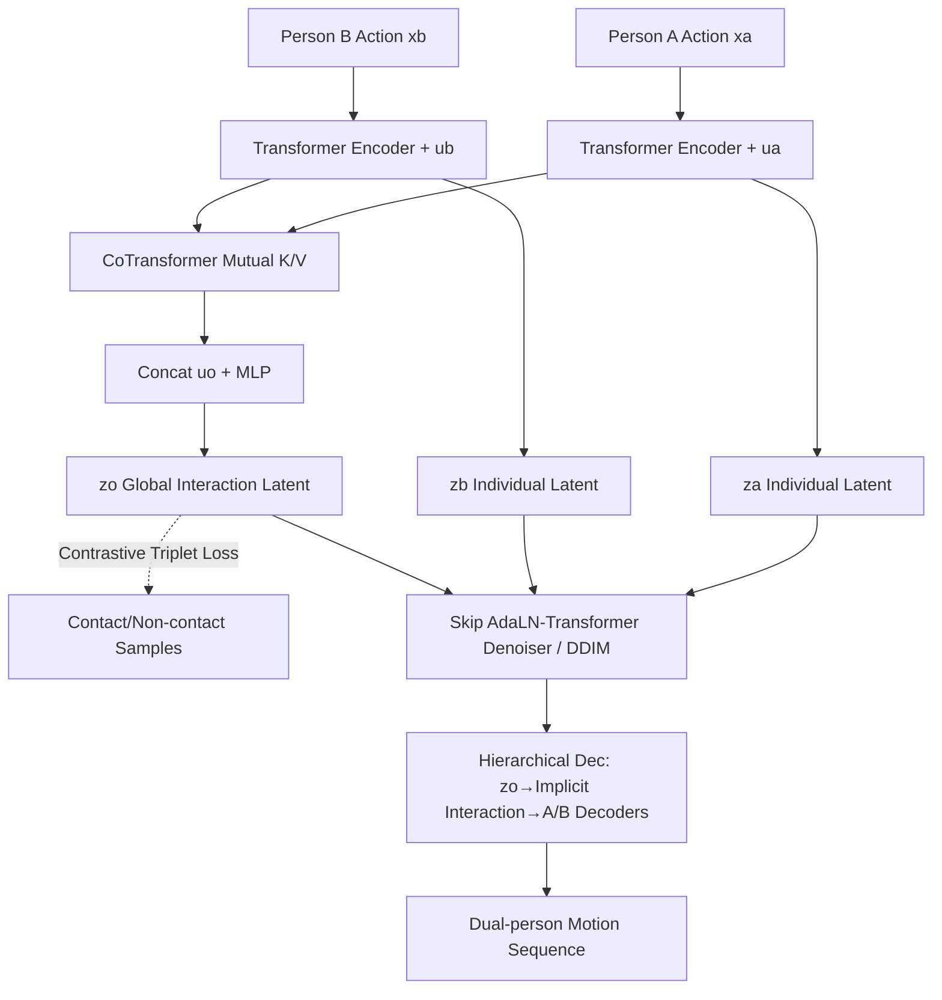

# Disentangled Hierarchical VAE for 3D Human-Human Interaction Generation

**Conference**: ICLR 2026  
**OpenReview**: [https://openreview.net/forum?id=53eIDko6N5](https://openreview.net/forum?id=53eIDko6N5)  
**Code**: [https://github.com/ZenGengChin/dhvae-official](https://github.com/ZenGengChin/dhvae-official)  
**Area**: 3D Human Motion Generation / Dual-person Interaction Generation  
**Keywords**: Human-Human Interaction, Disentangled Hierarchical VAE, Latent Diffusion, Contrastive Learning, Physical Plausibility  

## TL;DR
DHVAE explicitly decomposes dual-person interaction motion into three disentangled latent variables: "Person A action," "Person B action," and "Global interaction context." It applies contrastive learning constraints on the global latent variable to ensure contact plausibility and employs DDIM for diffusion denoising within a hierarchical latent space, achieving new SOTA results on InterHuman and InterX with a smaller and faster model.

## Background & Motivation
- **Background**: Text-conditioned human motion generation has matured for single-person scenarios (e.g., T2M-GPT, MDM, MLD). Recent work has extended to Human-Human Interaction (HHI), typically using Latent Diffusion Models (LDM) to compress interactions into a unified latent space for denoising.
- **Limitations of Prior Work**: InterLDM encodes both individuals into a **flat unified latent space**, which entangles "individual identity" with "interaction context," resulting in poor fine-grained coordination. While InterMask is SOTA, it **lacks explicit modeling of global interaction**, often leading to physical implausibilities such as hand interpenetration or missed contacts.
- **Key Challenge**: A single latent variable must represent both independent fine-grained actions and global interaction semantics. This leads to excessive information compression and high covariance between the two individuals, causing semantic misalignment and physical penetration.
- **Goal**: Construct a **disentangled, controllable, and physically plausible** HHI generation framework that allows text to independently control individual actions and interaction styles while ensuring realistic contact.
- **Core Idea**: **[Explicit Three-level Disentanglement]** HHI representation is decomposed into $z_a$ (Person A action), $z_b$ (Person B action), and $z_o$ (Global interaction context). A CoTransformer is used for mutually-aware encoding of $z_o$, followed by a contrastive learning prior on $z_o$ and synthesis via hierarchical latent diffusion.

## Method

### Overall Architecture
DHVAE is a two-stage pipeline: first, a disentangled hierarchical VAE is trained to encode dual-person motion into three latent tokens $\{z_o, z_a, z_b\}$; second, a skip-connected AdaLN-Transformer denoiser is trained in this hierarchical latent space for DDIM diffusion generation. The VAE uses a CoTransformer for "mutual awareness" between individuals and injects a physical plausibility prior into $z_o$ via contrastive learning. The diffusion stage addresses scale and structural heterogeneity of the latent variables using Segmented Position Encoding (SPE) and token scaling.

### Key Designs

**1. Disentangled Hierarchical VAE and Three-level ELBO.** Traditional flat VAEs use a single $z$ to model $\log p(x_a,x_b)\ge \mathbb{E}_{q(z|x)}[\log p(x|z)]-D_{KL}[q(z|x)\|p(z)]$, which fails to separate individual and shared semantics. DHVAE reformulates the ELBO for a three-latent structure:

$$\mathcal{L}_{ELBO}=\mathbb{E}\big[\log p(x_a|z_o,z_a)+\log p(x_b|z_o,z_b)\big]-D_{KL}[q(z_a|x_a)\|p(z_a)]-D_{KL}[q(z_b|x_b)\|p(z_b)]-D_{KL}[q(z_o|z_a,z_b)\|p(z_o)]$$

Each individual's reconstruction is decoded by their "individual latent + shared global latent." $q(z_o|z_a,z_b)$ is encoded by the CoTransformer. This reduces covariance between individuals, making the denoising process easier to learn and naturally supporting one-to-many controllable generation.

**2. CoTransformer Mutually-aware Encoding.** Individual branches use Transformer encoders with learnable tokens $u_a, u_b$ to extract $z_a, z_b$ and temporal embeddings. The CoTransformer allows **each branch to use the other's output as Key/Value** for cross-attention, capturing "mutual awareness." Skip connections prevent query distortion. The outputs are concatenated with a global token $u_o$ and passed through an MLP to obtain the Gaussian latent $z_o$.

**3. Contrastive Learning on Global Interaction Latent.** To ensure physical plausibility, DHVAE performs triplet contrastive learning on $z_o$. For each motion pair, voxelized meshes are used to determine **real contact**. For contact cases, $x_b$ is shifted by a small ground translation $\pm\sigma_c$ (~5cm) to create a positive sample $x_b^+$. For non-contact, the margin is relaxed to $\pm\sigma_u$ (~30cm). Negative samples $x_b^-$ are created using larger displacements (~45–90cm). The triplet loss $\mathcal{L}_{triplet}=\max(0, d(z_o,z_o^+)-d(z_o,z_o^-)+m)$ makes $z_o$ sensitive to spatial plausibility.

**4. Hierarchical Latent Diffusion and Skip-AdaLN Denoiser.** DDIM non-Markovian sampling is performed on $\{z_o, z_a, z_b\}$. Since the latents have different scales, **token scaling** normalizes $z_a, z_b$ by a factor $s_l$. **Segmented Position Encoding (SPE)** (SiLU-MLP + embedding) labels the role of each token. The denoiser uses an AdaLN-zero style with **U-Net-like skip connections** between symmetrical layers to mitigate gradient vanishing and reuse low-level features.

## Key Experimental Results

### Main Results (InterHuman / InterX)

| Dataset | Model | R-Prec@1 ↑ | FID ↓ | MM Dist ↓ |
|---|---|---|---|---|
| InterHuman | InterMask | 0.449 | 5.153 | 3.790 |
| InterHuman | TIMotion | 0.485 | 5.600 | 3.779 |
| InterHuman | **Ours** | **0.496** | **5.015** | **3.772** |
| InterX | InterMask | 0.403 | 0.399 | 3.705 |
| InterX | TIMotion | 0.412 | 0.385 | 3.706 |
| InterX | **Ours** | **0.442** | **0.339** | **3.604** |

Ours outperforms baselines in R-Precision, FID, and MMDist across both benchmarks.

### Efficiency and Reconstruction Quality

| Model | rFID ↓ | MPJPE ↓ | L1 ↓ | | Model | AITS ↓ | Parameters |
|---|---|---|---|---|---|---|---|
| MLD-VAE | 1.011 | 0.089 | 0.256 | | InterMask | 1.021 | 74M |
| 2D-VQ-VAE | 0.970 | 0.129 | 0.276 | | TIMotion | 1.472 | 77M |
| **DHVAE** | **0.503** | **0.055** | **0.218** | | **Ours** | **0.454** | **56M** |

Ours uses the fewest parameters (56M) and is the fastest (0.454s per sentence) while achieving the highest reconstruction upper bound.

## Key Findings
- **Contrastive loss mainly handles physics**: Removing it has little impact on numerical metrics like FID but significantly increases penetration and drops the contact ratio from 0.581 to 0.445.
- **Disentangled > Flat Latent**: Replacing DHVAE with a standard MLD-VAE degrades rFID from 0.503 to ~1.0 and significantly worsens gFID.
- **SPE and Token Scaling are critical**: Removing either causes a massive drop in performance (gFID rises to 6.5–7.5). Skip connections have a smaller impact but aid convergence.

## Highlights & Insights
- **Clear Disentanglement**: Decomposing interaction into individual and global latents reduces covariance between persons from a probabilistic perspective, which is more aligned with the hierarchical nature of HHI than a unified latent space.
- **Physical Plausibility via Contrastive Learning**: Using voxelized contact detection to construct positive/negative samples avoids overfitting to "fixed-distance" penalties and provides a reusable paradigm for injecting physical priors into latent spaces.
- **Efficiency**: Achieving SOTA while being smaller (56M) and faster (0.454s) proves that disentangled representations are more efficient, not just more complex.

## Limitations & Future Work
- **Limited to two persons**: The framework is naturally designed for pairs. Extending to group interactions would require redesigning the global latent aggregation.
- **Geometric-only contrastive samples**: Positive/negative samples are primarily generated via ground translation and Gaussian jittering, which may not cover all rotational or pose-based contact implausibilities.
- **Two-stage training**: The VAE's reconstruction upper bound limits the final generation quality; end-to-end optimization or stronger tokenizers could be explored.

## Related Work & Insights
- **Insights**: When a latent variable must represent "multiple individuals + their relationship," explicit disentanglement according to a graphical model structure, combined with task-specific priors (like physical contact) on the relationship latent, is often more effective than simply increasing the capacity of a unified latent space.

## Rating
- **Novelty**: ⭐⭐⭐⭐ The combination of three-level ELBO, CoTransformer, and contact-aware contrastive learning is novel and self-consistent for HHI.
- **Experimental Thoroughness**: ⭐⭐⭐⭐ Comprehensive testing on two benchmarks across reconstruction, generation, efficiency, and physics.
- **Writing Quality**: ⭐⭐⭐⭐ Logical flow from motivation to method and experiments; clear visualization of latent designs.
- **Value**: ⭐⭐⭐⭐ Refreshing SOTA while being smaller and faster, with significant improvements in physical plausibility.

<!-- RELATED:START -->

## Related Papers

- [\[CVPR 2026\] Hierarchical Enhancement of Semantic Priors for Disentangled Text-Driven Motion Generation](../../CVPR2026/human_understanding/hierarchical_enhancement_of_semantic_priors_for_disentangled_text-driven_motion_.md)
- [\[ICLR 2026\] InfBaGel: Human-Object-Scene Interaction Generation with Dynamic Perception and Iterative Refinement](infbagel_human-object-scene_interaction_generation_with_dynamic_perception_and_i.md)
- [\[ICLR 2026\] Unleashing Guidance Without Classifiers for Human-Object Interaction Animation](unleashing_guidance_without_classifiers_for_human-object_interaction_animation.md)
- [\[CVPR 2026\] Interact2Ar: Full-Body Human-Human Interaction Generation via Autoregressive Diffusion Models](../../CVPR2026/human_understanding/interact2ar_full-body_human-human_interaction_generation_via_autoregressive_diff.md)
- [\[ICLR 2026\] Human-Object Interaction via Automatically Designed VLM-Guided Motion Policy](human-object_interaction_via_automatically_designed_vlm-guided_motion_policy.md)

<!-- RELATED:END -->
## Related Papers

- [\[CVPR 2026\] Hierarchical Enhancement of Semantic Priors for Disentangled Text-Driven Motion Generation](../../CVPR2026/human_understanding/hierarchical_enhancement_of_semantic_priors_for_disentangled_text-driven_motion_.md)
- [\[ICLR 2026\] InfBaGel: Human-Object-Scene Interaction Generation with Dynamic Perception and Iterative Refinement](infbagel_human-object-scene_interaction_generation_with_dynamic_perception_and_i.md)
- [\[ICLR 2026\] Unleashing Guidance Without Classifiers for Human-Object Interaction Animation](unleashing_guidance_without_classifiers_for_human-object_interaction_animation.md)
- [\[CVPR 2026\] Interact2Ar: Full-Body Human-Human Interaction Generation via Autoregressive Diffusion Models](../../CVPR2026/human_understanding/interact2ar_full-body_human-human_interaction_generation_via_autoregressive_diff.md)
- [\[ICLR 2026\] Human-Object Interaction via Automatically Designed VLM-Guided Motion Policy](human-object_interaction_via_automatically_designed_vlm-guided_motion_policy.md)

<!-- RELATED:END -->
