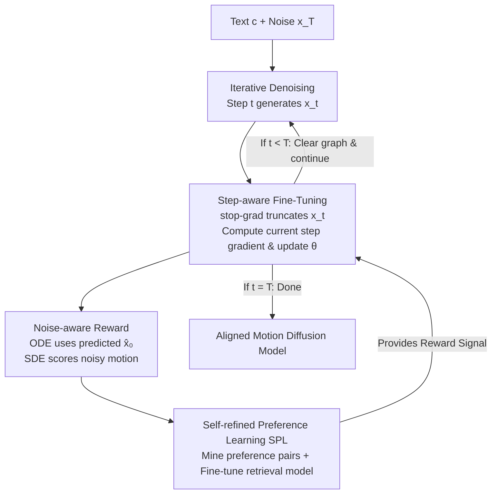

# EasyTune: Efficient Step-Aware Fine-Tuning for Diffusion-Based Motion Generation

**Conference**: ICLR2026  
**OpenReview**: [https://openreview.net/forum?id=Fy1EoIaAzQ](https://openreview.net/forum?id=Fy1EoIaAzQ)  
**Code**: Project Page (Provided in the paper abstract, specific URL TBD)  
**Area**: Human Motion Generation / Diffusion Models / RLHF Alignment  
**Keywords**: Text-to-motion generation, differentiable rewards, step-aware fine-tuning, preference learning, memory optimization

## TL;DR
EasyTune transforms the fine-tuning paradigm for diffusion models from "calculating reward gradients after the full denoising trajectory" to **independently optimizing at each denoising step**. This breaks the recursive gradient dependency between steps, reducing VRAM usage from $O(T)$ to $O(1)$ and enabling denser optimization. Combined with a Self-refined Preference Learning (SPL) module that converts retrieval models into motion reward models without human annotation, it outperforms DRaFT-50 by 7.7% in alignment (MM-Dist) on HumanML3D, while using only 31.16% of its additional VRAM and speeding up training by 7.3×.

## Background & Motivation

**Background**: Text-to-motion generation currently relies on diffusion models to sample coherent human motion sequences from natural language descriptions for applications in animation, HCI, and VR. However, diffusion models are pre-trained with likelihood-based objectives, which often diverge from downstream goals like semantic alignment, motion realism, and user preference. To bridge this gap, RLHF concepts have been introduced, specifically **differentiable reward fine-tuning** (e.g., DRaFT, AlignProp, DRTune), which backpropagates gradients from a differentiable reward model $R_\phi(x_\theta)$ directly to the diffusion parameters $\theta$ to maximize the reward.

**Limitations of Prior Work**: Differentiable reward methods face two major issues. First, **optimization is sparse and coarse-grained**—most update $\theta$ only after completing a full $T$-step denoising trajectory to generate a clean motion $x_0^\theta$, leading to sparse signals and slow convergence. Second, **memory explosion**—backpropagating through the final reward $\nabla_\theta R(x_\theta)$ requires storing the entire computation graph and Jacobians for the trajectory $\{x_t^\theta\}_{t=1}^T$, with VRAM scaling linearly with $T$. Existing methods often use engineering tricks like early stopping or partial gradient blocking, which are complex and lack generality. Furthermore, the motion domain lacks specialized reward models, forcing the use of general retrieval models that fail to capture nuanced motion preferences.

**Key Challenge**: The source of these problems is identified theoretically (Corollary 1) and experimentally (Fig. 6) as the **recursive coupling of multi-step denoising trajectories**. Denoising is inherently recursive: $x_t^\theta$ generates $x_{t-1}^\theta$. Calculating $\partial x_0^\theta/\partial\theta$ requires unrolling the entire chain $\partial x_1^\theta/\partial\theta, \partial x_2^\theta/\partial\theta, \dots, \partial x_T^\theta/\partial\theta$. This chain exhausts VRAM and introduces a hidden issue: the chain product $\prod_{s=1}^{t-1}\partial\pi_\theta(x_s^\theta)/\partial x_s^\theta$ tends toward zero during optimization (gradient vanishing), meaning **early high-noise steps receive almost no optimization**, even though they have the greatest impact on the final motion.

**Goal**: Achieve dense, fine-grained optimization at every denoising step without storing the entire computation graph or relying on complex tricks, while solving the lack of motion reward models and human-labeled preference pairs.

**Key Insight**: The authors observe that while rewards in image generation are mostly output-level (due to the complexity of noisy semantics), **motion representations have simpler, more interpretable semantics**. Fig. 4 shows that noisy motion states maintain high similarity to clean states. This makes direct scoring of intermediate noisy motions feasible. Since intermediate steps can be scored, they can be optimized on the spot.

**Core Idea**: Replace "full trajectory optimization" with "step-wise independent optimization" using stop-gradients to break the recursive dependency. This decomposes the $O(T)$ gradient chain into $O(1)$ single-step terms and uses SPL to adapt retrieval models into motion reward models without labels.

## Method

### Overall Architecture

EasyTune takes a pre-trained diffusion motion model $\epsilon_\theta$ (e.g., MLD, MLD++, MotionLCM, MDM) and a text prompt $c$ as input, and outputs a fine-tuned model aligned with rewards. The framework operates along two parallel lines: **Reward Model Acquisition** (SPL transforms a retrieval model into a preference-aware reward model) and **Diffusion Model Fine-tuning** (Step-aware optimization uses this reward to align the diffusion model step-by-step).

Unlike the old paradigm (left in the figure) which processes the full trajectory and backpropagates $\nabla_\theta R_\phi(x_0^\theta,c)$ at the end, EasyTune (right) uses a stop-gradient at each step $t$ to truncate $x_t^\theta$, calculates gradients only for the **current step** $\partial\pi_\theta/\partial\theta$, updates parameters immediately, and clears the graph before the next step. Rewards are categorized by sampler type: ODE samplers use a one-step predicted clean motion $\hat x_0$ for scoring, while SDE samplers use noise-aware rewards for direct scoring of noisy motions.

### Key Designs

**1. Step-wise Decoupled Optimization: Breaking the Recursive Gradient Chain with stop-gradient**

This core design addresses VRAM explosion and gradient vanishing. Old methods optimize for the final output $L(\theta)=-\mathbb{E}[R_\phi(x_0^\theta,c)]$, where the gradient (Eq. 5) involves a chain coefficient $\prod_{s=1}^{t-1}\partial\pi_\theta(x_s^\theta)/\partial x_s^\theta$. EasyTune shifts the target to rewards at **each noisy step** and uniformly samples time steps:

$$L_{\text{EasyTune}}(\theta) = -\mathbb{E}_{c\sim D_T,\, x_t^\theta\sim\pi_\theta(\cdot|c),\, t\sim U(0,T)}\big[R_\phi(x_t^\theta, t, c)\big]$$

The crucial operation is applying a stop-gradient $\mathrm{sg}(\cdot)$ to the previous state during the reverse step:

$$x_{t-1}^\theta = \pi_\theta(\mathrm{sg}(x_t^\theta), t, c) = \frac{1}{\sqrt{\alpha_t}}\Big(\mathrm{sg}(x_t^\theta) - \frac{\beta_t}{\sqrt{1-\bar\alpha_t}}\,\epsilon_\theta(\mathrm{sg}(x_t^\theta), t, c)\Big)$$

Under this setup, the gradient (Corollary 2) simplifies to the direct term of the current step $\partial x_{t-1}^\theta/\partial\theta = \partial\pi_\theta(\mathrm{sg}(x_t^\theta),t,c)/\partial\theta$, completely breaking the recursive chain. Consequently, only the current step's computation graph is needed, reducing VRAM from $O(T)$ to a constant $O(1)$ (verified in Fig. 6). Since each step is optimized independently, early high-noise steps are updated effectively, leading to better alignment. Note the difference from DRTune: although DRTune uses $\mathrm{sg}(\cdot)$, its update rule (Eq. 10) still retains the $\partial x_t^\theta/\partial\theta$ term, failing to fully break the recursion.

**2. Noise-aware Reward: Enabling Direct Scoring of "Noisy Intermediate Motions"**

Step-wise optimization requires a reward model capable of evaluating **noisy intermediate motions**. This leverages the domain-specific characteristic that motion semantics remain somewhat interpretable in noisy states (Fig. 4). The implementation varies by sampler (Eq. 12): For ODE-based models (MLD, MLD++, MotionLCM), deterministic sampling allows for a rough clean motion $\hat x_0 = \pi'_\theta(x_t,t,c)$ and reward $R_\phi(\hat x_0, 0, c)$; for SDE-based (and ODE) models, a noise-aware reward $R_\phi(x_t,t,c)$ directly scores the noisy motion. The reward is defined as the alignment similarity between motion and text features (Eq. 11):

$$R_\phi(x,c) = E_M(x)\cdot E_T(c)\cdot \tau$$

where $E_M$ and $E_T$ are motion/text encoders and $\tau$ is a learnable temperature.

**3. Self-refined Preference Learning (SPL): Adapting Retrieval Models into Reward Models without Human Labels**

Due to the lack of high-quality preference pairs in the motion domain, training a reward model directly is difficult. Existing retrieval models are sub-optimal as they only learn to align "correct pairs" and cannot distinguish "better vs. worse." SPL uses a retrieval auxiliary task to automatically generate preference pairs. **Preference Pair Mining**: Given text $c$ and ground truth $x_{gt}$, retrieve the top-$k$ motions $D_R$ (Eq. 13). If $x_{gt}\notin D_R$ (indicating the model failed to rank it highly), set the preferred motion $x_w=x_{gt}$ and the non-preferred motion $x_l$ as the highest-scoring candidate in the retrieval set. If the model already ranks correctly, skip the sample by setting the target distribution $Q=(0.5,0.5)$ to zero out the KL gradient (Eq. 14, 16). **Preference Fine-tuning**: Pass the rewards of $(x_w, x_l)$ through a softmax to get $P$ (Eq. 15), supervised by target distribution $Q$ ($(1.0,0.0)$ for preferences), minimizing KL divergence (Eq. 17):

$$L_{\text{SPL}}(\phi) = D_{KL}(Q\,\|\,P) = \sum_{x\in\{x_w,x_l\}} Q(x,c)\log\frac{Q(x,c)}{P(x,c)}$$

The "self-refining" aspect comes from dynamically mining negative samples specifically where the current model is weak, forcing the retrieval model to become a preference-aware reward model without manual tagging.

### Loss & Training

A two-stage process: First, SPL (minimizing $L_{\text{SPL}}$, top-$K=10$, reward model initialized with ReAlign) trains the frozen motion reward model. Second, the diffusion model is fine-tuned using the step-wise objective $L_{\text{EasyTune}}$ (learning rate $1\times10^{-5}$, batch 256, single RTX A6000 48GB). A "Chain Optimization" variant (keeping the chain but using step-wise logic) was used for comparison, but "Step Optimization" is the primary recommendation.

## Key Experimental Results

### Main Results

Comparing various differentiable reward fine-tuning methods on HumanML3D (base model MLD):

| Method | R-P@1 ↑ | FID ↓ | MM-Dist ↓ | VRAM (GB) ↓ |
|------|---------|-------|-----------|-----------|
| MLD (Base) | 0.504 | 0.450 | 3.052 | 15.21 |
| w/ DRaFT-50 | 0.528 | 0.197 | 2.872 | 37.32 |
| w/ AlignProp | 0.560 | 0.266 | 2.739 | 30.40 |
| w/ DRTune | 0.549 | 0.313 | 2.795 | 27.01 |
| **w/ EasyTune (Step)** | **0.581** | **0.132** | **2.637** | **22.10** |

Compared to the base, FID improved by 70.7% and MM-Dist by 13.6%. Alignment (MM-Dist) outperformed DRaFT-50 by 7.7%, using only 31.16% of its additional memory overhead with a 7.3× training speedup. EasyTune consistently improves diverse SOTA backbones: MLD's R-P@1 rose from 0.504 to 0.581, and MLD++ from 0.548 to 0.591, surpassing models like ParCo (0.515) and ReMoDiffuse (0.510).

### Ablation Study

| Configuration | Key Metrics | Note |
|------|---------|------|
| EasyTune (Step Optimization) | FID 0.132 / VRAM 22.10GB | Full method: Independent step optimization |
| EasyTune (Chain Optimization) | FID 0.172 / VRAM 24.21GB | Keeps chain; verifies step-wise efficacy but costlier |
| Predicted Reward (ODE) | R-P@1 0.568 (MLD) | Eq. 12 (1st term); ODE scores via $\hat x_0$ |
| Noise-aware Reward (SDE+ODE) | R-P@1 0.581 (MLD) | Eq. 12 (2nd term); Direct noisy scoring |

### Key Findings
- **Constant VRAM consumption**: Fig. 6 shows VRAM for DRaFT/AlignProp/DRTune scales linearly with denoising steps, while EasyTune stays constant at $O(1)$, confirming the break in recursive dependency.
- **Solving Gradient Vanishing**: In Fig. 3, while chain coefficients for standard methods vanish as $t$ increases, EasyTune's independent updates allow early steps to be fully optimized, leading to faster convergence and higher rewards.
- **High Generalizability**: Improvements across 6 pre-trained diffusion backbones (MLD, MLD++, MotionLCM, MDM, etc.) demonstrate architecture-agnostic robustness.

## Highlights & Insights
- **Dual Problem Solving via stop-gradient**: A single mechanism reduces VRAM from $O(T)$ to $O(1)$ while simultaneously fixing the gradient vanishing in early steps. This is far more elegant than engineering workarounds like early stopping.
- **Exploiting Motion vs. Image Disparity**: Unlike images where noisy semantics are uninterpretable, motion's intermediate states are clear enough to score. This domain insight is the true enabler for the framework and suggests potential applications in other interpretable modalities (e.g., trajectory, skeleton sequences).
- **Reusable SPL Logic**: The idea of using "ground truth not being in top-k" as a natural preference signal to mine negatives provides a self-refined paradigm for any scenario where labels are scarce but retrieval models exist.

## Limitations & Future Work
- Step-aware rewards rely on the "interpretable noisy semantics" of the motion domain (Fig. 4). This may not directly translate to modalities like images with complex noisy semantics.
- The reward model's ceiling is constrained by the initial retrieval model (ReAlign) and the quality of mined pairs. When ground truth is already in the top-k, potential weak signals may be ignored.
- Evaluations are limited to HumanML3D and KIT-ML. Effectiveness on long-form, complex, or multi-person interaction sequences remains to be seen.
- Future work: Change the "skip sample" logic from a hard threshold to soft weighting and introduce stronger rewards such as physical plausibility.

## Related Work & Insights
- **vs. DRaFT / AlignProp / ReFL**: These backpropagate through the entire trajectory, resulting in $O(T)$ memory and sparse optimization. EasyTune optimizes per step, reducing memory by 60%+ while improving alignment.
- **vs. DRTune**: DRTune also uses stop-gradient but maintains $\partial x_t^\theta/\partial\theta$ in the update, resulting in linear memory growth. EasyTune's complete removal of recursive terms (Corollary 2) is the key to constant memory.
- **vs. DPO / SoPo**: These rely on large-scale human preference data. SPL bypasses this bottleneck by mining pairs automatically via retrieval tasks.
- **vs. DDPO / DPOK**: Strategy gradient methods depend on computing exact likelihoods, which is difficult for diffusion. EasyTune's differentiable reward approach sidesteps this complexity.

## Rating
- Novelty: ⭐⭐⭐⭐⭐ Decoupling differentiable fine-tuning from trajectory-level to step-level via stop-gradient, supported by theoretical derivation (Corollary 1/2). First such work for text-to-motion.
- Experimental Thoroughness: ⭐⭐⭐⭐ Extensive verification across 6 backbones and 2 datasets. However, analysis of preference data quality and complex sequences could be deeper.
- Writing Quality: ⭐⭐⭐⭐ Clear logical chain from motivation (dependency → vanishing → decoupling) to results. Good visualizations, though math/symbols are dense.
- Value: ⭐⭐⭐⭐⭐ Significant reductions in memory (60%+) and time (7.3×) with better performance. Highly practical for RLHF in motion generation; ideas are transferable to other modalities with interpretable intermediate states.

<!-- RELATED:START -->

## Related Papers

- [\[AAAI 2026\] ReAlign: Text-to-Motion Generation via Step-Aware Reward-Guided Alignment](../../AAAI2026/human_understanding/realign_text-to-motion_generation_via_step-aware_reward-guided_alignment.md)
- [\[ICLR 2026\] Pose-RFT: Aligning MLLMs for 3D Pose Generation via Hybrid Action Reinforcement Fine-Tuning](pose-rft_aligning_mllms_for_3d_pose_generation_via_hybrid_action_reinforcement_f.md)
- [\[ICLR 2026\] PulpMotion: Framing-Aware Multimodal Camera and Human Motion Generation](pulp_motion_framing-aware_multimodal_camera_and_human_motion_generation.md)
- [\[CVPR 2026\] Causal Motion Diffusion Models for Autoregressive Motion Generation](../../CVPR2026/human_understanding/causal_motion_diffusion_models_for_autoregressive_motion_generation.md)
- [\[ICLR 2026\] Motion-Aligned Word Embeddings for Text-to-Motion Generation](motion-aligned_word_embeddings_for_text-to-motion_generation.md)

<!-- RELATED:END -->
