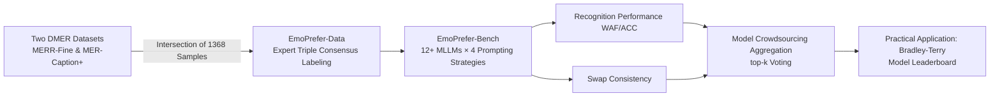

# EmoPrefer: Can Large Language Models Understand Human Emotion Preferences?

**Conference**: ICLR 2026  
**OpenReview**: [https://openreview.net/forum?id=EhA4znYsuG](https://openreview.net/forum?id=EhA4znYsuG)  
**Code**: [zeroQiaoba/AffectGPT/EmoPrefer](https://github.com/zeroQiaoba/AffectGPT/tree/master/EmoPrefer)  
**Area**: Affective Computing / Human Emotion Understanding  
**Keywords**: Descriptive Multimodal Emotion Recognition, Emotion Preference Learning, MLLM-as-a-Judge, Preference Dataset, Benchmarking

## TL;DR
To address high evaluation costs in Descriptive Multimodal Emotion Recognition (DMER), EmoPrefer is proposed as the first emotion preference dataset and benchmark. It systematically explores whether MLLMs can replace human annotators for emotion preference judgment. The best approach (Qwen2.5-Omni) achieves a 67.21% two-class WAF, leaving room for further improvement.

## Background & Motivation

**Background**: Descriptive Multimodal Emotion Recognition (DMER) uses free-form natural language to describe emotional states. Compared to traditional classification paradigms (e.g., 6 basic emotions), it is more fine-grained and interpretable, achieving rapid progress via MLLMs.

**Limitations of Prior Work**: Evaluation of DMER is extremely difficult. Methods based on ground-truth descriptions rely on human-annotated "gold descriptions," but emotions are naturally tied to multimodal behaviors (expressions, gestures, tone, etc.). High-quality reference descriptions are both expensive and incomplete. While collecting human preference labels (choosing the better of two descriptions) is more feasible, comparing $M$ models on $N$ samples requires $C(M,2) \times N$ comparisons, which remains costly.

**Key Challenge**: Whether MLLMs can be used as preference judges to replace human manual labeling at a low cost.

**Goal**: Construct the first human-centric multimodal emotion preference dataset and benchmark to systematically evaluate the capability boundaries of current MLLMs in emotion preference prediction.

**Core Idea**: Utilize Multimodal LLMs to replace human annotators in making preference judgments on "which emotion description is better," thereby reducing DMER evaluation costs.

## Method

### Overall Architecture

EmoPrefer consists of three modules: EmoPrefer-Data (high-quality human preference dataset), EmoPrefer-Bench (zero-shot evaluation benchmark for 12+ MLLMs), and two sets of evaluation metrics (recognition performance and swap consistency). The overall workflow is as follows:

### Key Designs

**1. EmoPrefer-Data: High-Confidence Preference Annotation**

Data originates from the intersection of two existing DMER datasets (MERR-Fine and MER-Caption+), totaling 1,368 samples. Each sample contains two descriptions for the same video. Master's students in affective computing were recruited as annotators. A qualification test with 12 consensus samples was conducted (requiring accuracy $\geq 75\%$), resulting in 3 qualified annotators. Each sample was independently judged (Description A better / Description B better / Tie), and only samples with unanimous consensus were retained to ensure high confidence. The upper bound of human consistency is approximately 69.31% (two-class) after removing "Tie" options, and drops to 59.23% when included, indicating inherent ambiguity in "Tie" samples.

**2. Four Prompting Strategies: From End-to-End to Chain-of-Decomposition**

Four progressive strategies were designed to explore MLLM preference judgment:
- **S1 (Direct Judgment)**: Video and two descriptions are input simultaneously; the model selects the better one.
- **S2 (Two-step, Same MLLM)**: The MLLM first generates its own description, then uses it as a reference to judge the candidates.
- **S3 (Two-step, External LLM as Judge)**: The MLLM generates a description, while the judgment step is delegated to an external text-only LLM (Qwen2.5-7B) to avoid text-understanding degradation after multimodal fine-tuning.
- **S4 (S3 + Explicit Reasoning)**: Adds an explicit reasoning process before the judgment in S3 to verify the effectiveness of CoT.

Experiments show most MLLMs perform better under S3/S4, indicating text capabilities are affected by multimodal training. However, models with more refined training pipelines, like Qwen2.5-VL and Qwen2.5-Omni, excel in S1/S2 as longer reasoning chains introduce error accumulation.

**3. Swap Consistency: A Second Dimension for Robustness**

In addition to recognition performance, the **swap consistency** metric is introduced. It calculates the proportion of consistent predictions when a sample is input in normal and reversed order. An ideal judge should be independent of input order. Experiments show a weak correlation between recognition performance and swap consistency, suggesting they measure different capability dimensions.

**4. Model Crowdsourcing: Aggregating MLLMs for Reliability**

Majority voting is applied to multiple MLLM predictions (model-based crowdsourcing). Models are ranked by performance, and top-k models are aggregated. Findings show that while excessive $k$ introduces noise, choosing $k=3$ or 4 with open-source models significantly reduces costs without substantial performance loss compared to closed-source APIs.

## Key Experimental Results

### Main Results (EmoPrefer-Bench Optimal Strategy)

| Model | Strategy | Two-class WAF ↑ | Two-class ACC ↑ | Swap Consistency ↑ |
|------|------|-----------|-----------|------------|
| VideoChat | S4 | 51.79 | 52.31 | 40.85 |
| Video-LLaVA | S4 | 54.53 | 54.62 | 42.86 |
| LLaVA-Next-Video | S4 | 56.41 | 56.57 | 53.92 |
| VITA-1.5 | S4 | 60.08 | 60.12 | 59.06 |
| Qwen2-Audio | S4 | 63.17 | 63.23 | 61.50 |
| **Qwen2.5-VL** | S1 | 64.43 | 65.28 | 62.02 |
| **Qwen2.5-Omni** | S2 | **67.21** | 67.32 | **79.09** |
| GPT-4o (Closed) | S1 | 59.28 | 59.41 | 64.55 |
| GPT-4.1 (Closed) | S1 | 60.75 | 60.75 | **80.84** |
| Gemini-1.5-Flash (Closed) | S1 | 64.64 | 65.19 | 72.04 |
| **Human Consistency Bound** | — | ~69.31 | — | — |

The open-source Qwen2.5-Omni outperforms all closed-source models in recognition performance and approaches the human consistency bound, indicating that emotion preference judgment capabilities have partially transferred to open-source models.

### Key Findings

- Most models prefer S3/S4 (external LLM judge); however, models with strong text capabilities (Qwen2.5-VL/Omni) perform better with S1/S2 as longer reasoning chains accumulate errors.
- Larger external LLMs (Qwen2-72B) do not necessarily outperform Qwen2.5-7B, suggesting LLM scale and emotion preference alignment are not monotonically related.
- Pearson correlation between swap consistency and recognition performance is low, requiring simultaneous consideration for a comprehensive evaluation.
- Model crowdsourcing (top-k=3 open-source models) balances performance and cost. The normal-swapped combination is unstable in crowdsourcing scenarios and is not recommended as a default.

## Highlights & Insights

- **Novel Evaluation Perspective**: Recontextualizes DMER evaluation from "calculating similarity with ground-truth" to "preference learning," and further to "automated preference judgment by MLLMs."
- **First All-Modality Emotion Preference Dataset**: While existing judge benchmarks are mostly text-based, EmoPrefer-Data covers text, image, audio, and video, specifically targeting the affective domain.
- **Practical Application**: Integrated with the Bradley-Terry algorithm, it has been successfully applied to model rankings in real-world competitions (MER2025), validating its utility.
- **Cost-Performance Trade-off**: The paper provides a clear recommendation for "open-source top-3 crowdsourcing," offering high engineering value.

## Limitations & Future Work

- EmoPrefer-Data consists of only 1,368 samples, primarily from MER2024 (Chinese scenarios, single subjects). Cross-cultural generalization remains unverified.
- The best MLLM still performs below the human consistency bound (67.21% vs 69.31%), indicating emotion preference decoding remains an open problem.
- Only zero-shot capabilities were evaluated; the potential of emotion-aware RLHF and fine-tuning has not been explored.
- Prediction accuracy for the "Tie" category is significantly lower than for binary classification, warranting further research into ambiguous samples.

## Related Work & Insights

- **vs MT-Bench / JudgeBench**: These benchmarks focus on general tasks (writing, math, reasoning) in the text modality. EmoPrefer extends judgment capabilities to the multimodal affective domain.
- **vs MLLM-as-a-Judge**: Prior work utilized image sequences without audio; EmoPrefer introduces full video and audio, aligning closer to real affective scenarios.
- **vs preference-driven DMER evaluation** (Lian et al., 2025b): **Ours** serves as a direct response to their preference annotation cost issues by substituting humans with MLLMs.
- **Insight**: EmoPrefer-Data can serve as seed data for training emotion-aware reward models, introducing alignment signals into the MLLM RLHF pipeline.

## Rating

- Novelty: ⭐⭐⭐⭐ First multimodal emotion preference dataset and benchmark with clear task definition.
- Experimental Thoroughness: ⭐⭐⭐⭐ Covers 12+ MLLMs across 4 strategies, with systematic ablation and practical validation.
- Writing Quality: ⭐⭐⭐⭐ Logical flow, rich visuals, and a complete evaluation system.
- Value: ⭐⭐⭐⭐ Enhances efficiency and reduces costs for DMER evaluation; directly benefits emotional RLHF research.

<!-- RELATED:START -->

## Related Papers

- [\[ICLR 2026\] LINK: Learning Instance-level Knowledge from Vision-Language Models for Human-Object Interaction Detection](link_learning_instance-level_knowledge_from_vision-language_models_for_human-obj.md)
- [\[ICML 2025\] Scaling Large Motion Models with Million-Level Human Motions](../../ICML2025/human_understanding/scaling_large_motion_models_with_million-level_human_motions.md)
- [\[CVPR 2025\] ChatGarment: Garment Estimation, Generation and Editing via Large Language Models](../../CVPR2025/human_understanding/chatgarment_garment_estimation_generation_and_editing_via_large_language_models.md)
- [\[CVPR 2026\] Bridging Facial Understanding and Animation via Language Models](../../CVPR2026/human_understanding/bridging_facial_understanding_and_animation_via_language_models.md)
- [\[CVPR 2025\] Pose Priors from Language Models](../../CVPR2025/human_understanding/pose_priors_from_language_models.md)

<!-- RELATED:END -->
