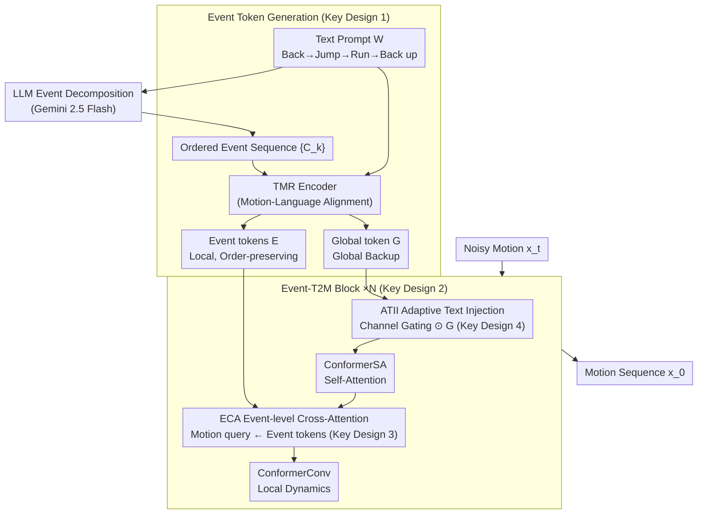

# Event-T2M: Event-level Conditioning for Complex Text-to-Motion Synthesis

**Conference**: ICLR 2026  
**arXiv**: [2602.04292](https://arxiv.org/abs/2602.04292)  
**Code**: Yes (Project Page)  
**Area**: Image Generation  
**Keywords**: Text-to-Motion Generation, Event-level Conditioning, Diffusion Models, Compositional Motion, Conformer

## TL;DR

The Event-T2M framework is proposed to decompose text prompts into event-level atomic actions. By combining a TMR encoder and an Event-level Cross-Attention (ECA) module with a Conformer-based diffusion model, it significantly improves the quality and semantic alignment of complex multi-event motion generation.

## Background & Motivation

While the field of Text-to-Motion generation has made significant progress on benchmarks like HumanML3D and KIT-ML (with FID optimized to two decimal places), these benchmarks primarily consist of simple, single-action descriptions. This masks a critical issue: when faced with complex multi-action prompts (e.g., "run forward, then stop, then wave"), existing systems often merge, skip, or reorder actions.

**Core Problem**:

**Limitations of Prior Work**: Most methods use the [EOS] token of CLIP as a global representation, compressing the entire prompt into a single embedding and losing temporal information.

**Background**: Benchmarks do not distinguish between simple and complex prompts, making it impossible to evaluate model performance as compositional complexity increases.

**Key Challenge**: CLIP is pre-trained on image-text pairs and lacks supervision signals for temporal continuity and event transitions in motion.

## Method

### Overall Architecture

Event-T2M reframes the "complex multi-action text → motion" generation process at the **event granularity**. Given a prompt $W$, an LLM (Gemini 2.5 Flash) is first used to decompose it into an **ordered event sequence** $\{C_k\}_{k=1}^K$ (e.g., "step back, jump up, run forward, then back up" is split into four events). Then, a motion-aware TMR encoder encodes each event separately into an **event token** (stacked as $E$ to preserve sequential order), while the entire sentence is encoded into a **global token** $G$ as a backup. The generation side is a Conformer-style diffusion denoiser composed of $N$ stacked **Event-T2M Blocks**. Each block utilizes **ECA (Event-level Cross-Attention)** to align motion frames with the ordered event tokens and uses **ATII (Adaptive Text Injection)** to provide global semantic support when local event descriptions are ambiguous. Finally, a motion sequence aligned with each event segment is denoised from noise.

**Mechanism**: Events are defined as the smallest semantically self-contained actions or state changes in a text prompt, whose execution can be temporally isolated and mapped to a continuous motion segment. This is the starting point for replacing "single embedding compression" with "a sequence of ordered tokens."

### Key Designs

**1. Event Token Generation: Encoding each atomic event separately to preserve the temporal structure of the prompt.**

Since compressing the entire sentence into one embedding loses event order, each decomposed event $C_k$ is passed through the TMR encoder individually to obtain a dedicated event token:

$$E_k = f_{\text{TMR}}(C_k), \quad E_k \in \mathbb{R}^{D_y}$$

Stacking $K$ event tokens $E \in \mathbb{R}^{K \times D_y}$ explicitly preserves the chronological relationship (e.g., "back, then jump, then run") as a sequence. Simultaneously, a global text token $G = f_{\text{TMR}}(W)$ is encoded to provide overall semantics if local descriptions are vague. The choice of TMR over CLIP is critical: TMR is trained with motion-language alignment and contains supervision for temporal continuity, which is absent in CLIP's image-text pre-training.

**2. Event-T2M Block Architecture: Adding an event injection step within the Conformer block.**

The denoiser consists of $N$ stacked blocks, each following an 8-step update. It essentially adds/replaces the standard Conformer "Self-Attention—Convolution—FFN" skeleton with event cross-attention (Step 5, ECA). Other steps handle local modeling, global temporal dependencies, and global text injection:

| Step | Module | Function |
|------|------|------|
| (1) | LIMM | Local Information Modeling (Depthwise Conv) |
| (2) | ATII | Adaptive Text Information Injection (Channel-wise Gating) |
| (3) | FFN | Feed-Forward Network (0.5 residual weight) |
| (4) | ConformerSA | Self-Attention (Global temporal dependency) |
| (5) | **ECA** | **Event-level Cross-Attention (Core)** |
| (6) | ConformerConv | Depthwise Separable Conv (Local dynamics) |
| (7) | FFN | Feed-Forward Network (0.5 residual weight) |
| (8) | LIMM | Local Information Modeling |

The two FFNs each take a 0.5 residual weight, following the intuition of the Macaron-style architecture.

**3. Event-level Cross-Attention (ECA): Allowing motion tokens to actively "query" the corresponding event.**

This is the core of the method. It replaces the standard self-attention in the Conformer block with a motion-to-text cross-attention: the query comes from the current motion token $x_t^{\text{ctx}}$, while key/value pairs come from the event tokens $E$:

$$Q_m = x_t^{\text{ctx}} W^Q, \quad K_e = E W^K, \quad V_e = E W^V$$

$$A^{(h)} = \text{softmax}\left(\frac{Q_m^{(h)} (K_e^{(h)})^\top}{\sqrt{d_h}}\right)$$

In this way, each frame of motion can decide "which event should I align with now" during generation, avoiding merging or skipping segments. To prevent this new module from disrupting the established diffusion dynamics early in training, the output is multiplied by a learnable scaling factor $\gamma$, initialized near zero: $\text{ECA}(x_t, E) = \gamma \cdot \text{Dropout}(Z)$. This ensures the model starts by "ignoring" the injection and gradually learns to use event information, guaranteeing stable convergence.

**4. ATII Adaptive Text Injection: Using global semantics as a backup when event cues are insufficient.**

While ECA injects fine-grained event information, some local event descriptions may be too vague. ATII integrates the global text embedding $G$ into the motion state via channel-wise gating. After downsampling the motion sequence by $S$ to get $m'_j$, a sigmoid gate decides which dimensions of $G$ should pass through:

$$\hat{g}_j = \text{Sigmoid}(W_c[m'_j \oplus G]) \odot G$$

This gating ensures that global semantics are filtered adaptively based on the current motion state, complementing the local refinement provided by ECA.

### Loss & Training

A standard conditional denoising diffusion objective is used to train the denoiser $\varphi_\theta$ to recover clean motion $x_0$ from noisy motion $x_t$:

$$\mathcal{L}(\theta) = \mathbb{E}_{x_0, t, \epsilon}\left[\|x_0 - \varphi_\theta(x_t, t, G, E)\|_2^2\right]$$

- Text conditions are randomly dropped with probability $\tau$ for Classifier-Free Guidance (CFG).
- Efficient generation is achieved using 10-step DDPM during inference.
- Macaron-style architecture uses 0.5 residual weights for the FFNs.

## Key Experimental Results

### Main Results

**Table 1: HumanML3D Standard Benchmark**

| Method | R-Prec Top-1↑ | R-Prec Top-3↑ | FID↓ | MM-Dist↓ |
|------|--------------|--------------|------|----------|
| MoMask | 0.521 | 0.807 | 0.045 | 2.958 |
| MoGenTS | 0.529 | 0.812 | 0.033 | 2.867 |
| **Ours** | **0.562** | **0.842** | 0.056 | **2.711** |

**Table 3: HumanML3D-E Event Stratified Benchmark (≥4 events)**

| Method | R-Prec Top-1↑ | FID↓ | MM-Dist↓ |
|------|--------------|--------------|------|----------|
| MoMask | 0.441 | 0.418 | 3.205 |
| MoGenTS | 0.420 | 0.423 | 3.241 |
| **Ours** | **0.466** | 0.265 | **3.063** |

Ours outperforms MoGenTS by approximately 4.6 percentage points on R-Precision Top-1 (for ≥4 events), demonstrating its advantage in complex compositional scenarios.

### Ablation Study

**Text Encoder Comparison (TMR vs CLIP)**: Under event-level conditioning, the TMR encoder outperforms CLIP across all levels of event complexity.

**Conditioning Method Comparison**: Event-level vs Token-level:

| Conditioning | R-Prec Top-1↑ (≥2 events) | FID↓ |
|---------|----------------------|------|
| Token-level | 0.521 | 0.082 |
| **Event-level** | **0.536** | 0.079 |

Event-level encoding outperforms token-level encoding under all complexity conditions.

### Key Findings

1. **Advantage scales with complexity**: As the number of events increases from ≥1 to ≥4, performance of baseline methods drops sharply, while Event-T2M remains robust.
2. **Efficiency**: For ≥4 events, Event-T2M achieves high precision with a smaller model size.
3. **Human Evaluation**: The rationality of event definitions, the reliability of HumanML3D-E, and generating quality were highly rated by human evaluators.

## Highlights & Insights

1. **Key Insight**: The formal definition of an event has universality—decomposing complex prompts into minimal, semantically self-contained units can be generalized to other conditional generation tasks.
2. **Novelty**: Replacing general-purpose CLIP with motion-language aligned TMR encoders provides a paradigm for domain-specific conditional generation.
3. **Value**: HumanML3D-E is the first benchmark stratified by event count, filling the gap in compositional complexity evaluation.
4. **Design Motivation**: The learnable scale factor $\gamma$ in ECA, initialized near zero, is a practical engineering trick to ensure training stability.

## Limitations & Future Work

1. LLM event decomposition relies on external models (Gemini 2.5 Flash), adding inference dependency and latency.
2. Transition quality between events is not explicitly modeled.
3. Validation was only performed on HumanML3D/KIT-ML; missing generalization experiments on larger-scale datasets.
4. FID still has room for improvement as the number of events increases.
5. End-to-end joint optimization of event decomposition and generation could be explored.

## Related Work & Insights

- **GraphMotion**: Enhances text representation with semantic graphs, but evaluation is limited.
- **AttT2M**: Body-part attention + global-local motion-text attention.
- **MMM**: Masked motion modeling, jointly encoding text and motion.
- **Light-T2M**: The inspiration for the ATII module.
- Insight: The concept of event-level decomposition can be transferred to tasks like text-to-video or text-to-dance.

## Rating

- Novelty: ⭐⭐⭐⭐ — Event-level conditioning is a concise and effective new perspective.
- Technical Contribution: ⭐⭐⭐⭐ — The triad of ECA + TMR + Event-stratified benchmark.
- Experimental Thoroughness: ⭐⭐⭐⭐ — Standard benchmarks + stratified benchmarks + ablations + human evaluation.
- Writing Quality: ⭐⭐⭐⭐ — Clear structure and motivation.
- Overall Recommendation: ⭐⭐⭐⭐ — Significant work, especially for practical value in multi-action generation scenarios.

<!-- RELATED:START -->

## Related Papers

- [\[CVPR 2026\] EventGait: Towards Robust Gait Recognition with Event Streams](../../CVPR2026/human_understanding/eventgait_towards_robust_gait_recognition_with_event_streams.md)
- [\[ICLR 2026\] Motion-Aligned Word Embeddings for Text-to-Motion Generation](motion-aligned_word_embeddings_for_text-to-motion_generation.md)
- [\[ECCV 2024\] FreeMotion: A Unified Framework for Number-free Text-to-Motion Synthesis](../../ECCV2024/human_understanding/freemotion_a_unified_framework_for_number-free_text-to-motion_synthesis.md)
- [\[ECCV 2024\] Event-based Head Pose Estimation: Benchmark and Method](../../ECCV2024/human_understanding/event-based_head_pose_estimation_benchmark_and_method.md)
- [\[CVPR 2026\] E-3DPSM: A State Machine for Event-Based Egocentric 3D Human Pose Estimation](../../CVPR2026/human_understanding/e-3dpsm_a_state_machine_for_event-based_egocentric_3d_human_pose_estimation.md)

<!-- RELATED:END -->
