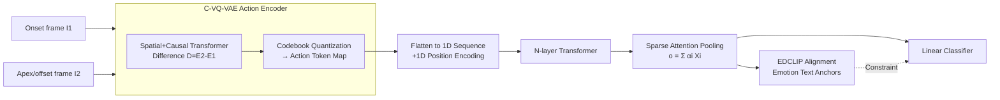

# From Pixels to Semantics: Unified Facial Action Representation Learning for Micro-Expression Analysis

**Conference**: ICLR 2026  
**OpenReview**: [https://openreview.net/forum?id=yJFVKlratr](https://openreview.net/forum?id=yJFVKlratr)  
**Code**: Open-sourced (GitHub, specific link not provided in the paper)  
**Area**: Micro-Expression Recognition / Facial Action Representation Learning / Affective Computing  
**Keywords**: Micro-Expression Recognition (MER), Discrete Facial Action Encoding, VQ-VAE, Action Tokens, CLIP Alignment, Sparse Attention  

## TL;DR
This paper proposes D-FACE, which utilizes a conditional VQ-VAE pre-trained on large-scale face videos to discretize facial muscle movements between two frames into "identity- and domain-invariant" semantic-level action tokens. By employing a Transformer with sparse attention pooling and emotion-description guided CLIP alignment for micro-expression recognition, it marks the first shift in MER from relying on pixel-level motion descriptors (optical flow/frame difference) to semantic-level tokens, while simultaneously enabling cross-identity/cross-domain micro-expression generation.

## Background & Motivation
**Background**: Micro-expressions (ME) are involuntary facial movements lasting less than 0.5 seconds that are localized and subtle, capable of leaking suppressed genuine emotions. They are highly valuable in lie detection, healthcare, and security. Mainstream micro-expression recognition (MER) methods rely on handcrafted pixel-level motion descriptors such as optical flow (OFF-ApexNet, STSTNet, SLSTT) and frame differences (MMNet). Recent end-to-end solutions estimate optical flow via autoencoders, but handcrafted optical flow remains dominant.

**Limitations of Prior Work**: Pixel-level motion descriptors suffer from two fundamental flaws: first, they are **highly sensitive to identity**, as displacement fields for the same action vary significantly across different faces, leading to poor cross-subject transferability; second, they describe **displacement fields rather than the semantic meaning of muscle movements**, the latter of which is truly relevant to emotional interpretation. Compounded by the extreme scarcity of annotated micro-expression data, the robustness and generalization of deep models are further limited.

**Key Challenge**: The desired representation is a high-level semantic of "what facial action occurred between two frames," which should be shared across different identities, datasets, and domains. However, existing representations remain at the pixel displacement level, being neither semantic nor universal.

**Goal**: To learn a set of compact, identity- and domain-invariant, and cross-dataset sharable **semantic-level facial action representations** that improve MER accuracy and enable the generation of new micro-expression data.

**Core Idea**: **[Paradigm Shift]** Treat facial motion as a "discrete vocabulary"—drawing from conditional VQ-VAE used in robot latent action quantization to pre-train a facial action tokenizer on millions of face image pairs. This discretizes inter-frame muscle movements into tokens within a shared codebook, serving as a "unified vocabulary" for facial actions. **[Sequence Modeling]** Empirical analysis shows these tokens possess "order-dependent semantics" (the same token activates different muscles at different sequence positions), thus the token map is flattened into a 1D sequence and modeled with a Transformer like a sentence. **[Semantic Anchoring]** Use emotional text descriptions as CLIP anchors to align action tokens with human-understandable emotions.

## Method

### Overall Architecture
Given the onset and offset (or apex) frames of a micro-expression, D-FACE first uses a Conditional VQ-VAE (C-VQ-VAE) to discretize the facial muscle movements into a **semantic action token map**. The map is then flattened into a 1D sequence, augmented with 1D positional encodings, and fed into a Transformer. **Sparse attention pooling** is used to aggregate discriminative action cues. Finally, **Emotion-Description guided CLIP (EDCLIP)** aligns action features with emotional text anchors for recognition. The entire action tokenizer is pre-trained unsupervised on VoxCeleb and fine-tuned for downstream MER.

### Key Designs

**1. Conditional VQ-VAE Discrete Facial Action Encoding: Forcing Identity/Domain Invariance via Information Bottleneck.** The encoder performs patch embedding on $I_1, I_2$, extracts local spatial dependencies via a spatial Transformer, and models directed temporal transitions $I_1 \to I_2$ via a causal Transformer. A CNN then produces embedding maps $E_1, E_2$, with the motion embedding defined as the difference $D = E_2 - E_1$. Each vector in $D$ is mapped to the nearest codeword in codebook $Z=\{z_1,...,z_K\}$ to obtain the token index map $(M)_{i,j}=\arg\min_k\|(D)_{i,j}-z_k\|_2^2$. During training, NSVQ is used to smooth quantization gradients $\tilde D = D + \frac{\|D-\tilde Z\|}{\|V\|}V$ where $V \sim \mathcal{N}(0,1)$, followed by an up-projection decoder to reconstruct the second frame. The loss is pixel reconstruction $L_{rec}=\|I_2-\hat I_2\|_2^2$. The key insight is that since pre-training data (VoxCeleb with 7000+ identities and vast pose/appearance variations) is extremely diverse, **a limited codebook cannot encode individual-specific morphological differences**. The optimization objective naturally forces the quantization to retain only stable motion patterns shared across identities while filtering out identity/appearance-related variations—the source of identity and domain invariance.

**2. Order-Dependent Semantics → 1D Sequence Transformer Modeling.** Through "single-token tampering" experiments (obtaining a "no-action" index map from two identical faces, then changing one index and regenerating the face), two counter-intuitive phenomena were discovered: first, **the same action token activates different muscle movements depending on its position in the sequence**, meaning token semantics depend on sequence position rather than being globally fixed; second, **tokens in the upper region can drive lower mouth movements, and vice versa**, meaning 2D positions do not correspond to activated facial regions but are determined by relative order and contextual interaction. Based on this, action token embeddings are flattened into a 1D sequence $\hat Z=(\hat z_1,...,\hat z_L)$ with learnable positional encodings $g_i=T(\hat z_i)+p_i$, and an $N$-layer standard Transformer is used for contextual interaction. Ablations confirm that 1D PE outperforms 2D PE and CNN backbones.

**3. Sparse Attention Pooling: Focusing on Few Muscle-Activating Tokens.** Micro-expressions are inherently local; only a subset of action tokens in a sequence corresponds to actual muscle movements. Attention is calculated with a global query vector $q$ as $\alpha=\mathrm{softmax}(Xq/\sqrt d)$, and pooled as $o=\sum_i \alpha_i (X)_{i,:}$. To encourage sparsity and focus on informative local cues, an entropy penalty is added to $\alpha$: $L_{sparse}=-\frac1L\sum_i \alpha_i\log\alpha_i$. Ablations show sparse attention pooling outperforms average pooling and class tokens.

**4. EDCLIP: Emotional Text Descriptions as Anchors while Pushing "Others" Away.** To bridge action tokens to human-understandable emotions, text descriptions are designed for each emotion class (e.g., "surprise: raised eyebrows + open mouth"), using a frozen CLIP text encoder to obtain class-level embeddings $\{t_c\}$. Pooled action features $o$ are projected into the same space via a learnable function $f(\cdot)$, using contrastive loss $L_{CLIP}=-\log\frac{\exp(\mathrm{sim}(f(o),t_y)/\tau)}{\sum_c \exp(\mathrm{sim}(f(o),t_c)/\tau)}$. For the "others" class, which is semantically vague, a margin constraint is used instead of a text anchor: $L_{oth}=\max(0,\max_{c\neq c_{oth}}\mathrm{sim}(f(o),t_c)-\delta)$, pushing it away from specific emotion anchors. Total loss is $L=L_{cls}+\lambda_{rec}L_{rec}+\lambda_{sparse}L_{sparse}+\lambda_{EDCLIP}L_{EDCLIP}$.

## Key Experimental Results

Pre-training: Randomly sampled image pairs from VoxCeleb with 8–15 frame intervals (~0.25–0.5s), totaling ~1 million pairs across 7000+ identities. Trained for 800k steps, codebook size 32, feature dimension 32. Evaluation used LOSO protocol on CASME-II / SMIC-HS / SAMM / CAS(ME)³.

### Main Results

CDE (Composite Dataset, 3-class, MEGC2019):

| Method | Full UF1 | Full UAR | CASME-II UF1 | SMIC-HS UF1 | SAMM UF1 |
|------|----------|----------|--------------|-------------|----------|
| SLSTT (2022) | 0.8160 | 0.7900 | 0.9010 | 0.7400 | 0.7150 |
| SRMCL (2024) | 0.8630 | 0.8830 | 0.9635 | 0.7946 | 0.8470 |
| HTNet (2024) | 0.8603 | 0.8475 | 0.9532 | 0.8049 | 0.8131 |
| LTR3O (2025) | 0.8931 | 0.8819 | 0.9578 | 0.8336 | **0.8912** |
| **Ours** | **0.8943** | **0.8967** | **0.9738** | **0.8422** | 0.8716 |

CAS(ME)³ (4-class, major benchmark):

| Method | UF1 | UAR |
|------|-----|-----|
| µ-bert (2023) | 0.4718 | 0.4913 |
| MER-CLIP (2025, with AU labels) | 0.6544 | 0.6242 |
| **Ours** | **0.6807** | **0.6469** |

D-FACE achieved first place in both Full UF1 and UAR on the CDE composite set. On CAS(ME)³, it outperformed the second-best MER-CLIP (which utilized extra AU labels) by 4.02% in UF1 and 3.64% in UAR. It was second-best on SAMM, likely because SAMM consists of grayscale images while the model was pre-trained on RGB.

### Ablation Study

C-VQ-VAE Capacity (CAS(ME)³) and Component Ablation (CASME-II 5-class):

| Dimension | Setting | ACC/UF1 |
|------|------|---------|
| Codebook×Seq | 32×16 (Optimal) | UF1 0.6807 |
| Codebook×Seq | 16×9 (Too Small) | UF1 0.5210 |
| Codebook×Seq | 64×16 (Redundant) | UF1 0.6227 |
| Architecture | CNN backbone | UF1 0.8120 |
| Architecture | Transformer 2D PE | UF1 0.8164 |
| Architecture | **Transformer 1D PE** | **UF1 0.8571** |
| Aggregation | Average Pooling | UF1 0.8345 |
| Aggregation | Class Token | UF1 0.8294 |
| Aggregation | **Sparse Attention Pooling** | **UF1 0.8571** |
| EDCLIP | w/o | UF1 0.8286 |
| EDCLIP | **w/** | **UF1 0.8571** |

### Key Findings
- **The codebook must be "compact yet expressive"**: 32×16 is optimal; too small loses detail, too large introduces redundancy and instability.
- **1D sequence modeling > 2D spatial structure**: Validates the empirical observation of order-dependent semantics.
- **All components contribute**: Sparse attention pooling, 1D Transformer, and EDCLIP each provide incremental gains.
- **Generalization extends to generation**: Salient tokens selected by sparse attention can be transferred to cross-identity/cross-domain faces to generate new images that retain the same micro-expression.

## Highlights & Insights
- **Paradigm Contribution**: Shifts MER from pixel-level motion descriptors to semantic-level discrete action tokens, viewing facial actions as a "discrete vocabulary."
- **Domain Transfer Ingenuity**: Adapts C-VQ-VAE from robot latent action quantization to the face domain, "automatically" extracting identity/domain invariance via information bottlenecks and diverse large-scale pre-training without explicit decoupling designs.
- **Explainable Empirical Analysis**: Single-token tampering experiments reveal order-dependent semantics and the "position $\neq$ region" phenomenon, providing both a basis for 1D modeling and rare interpretability.
- **Elegant "Others" Handling**: Uses margin-based distancing instead of forced alignment with vague descriptions, fitting the characteristics of the MER task.
- **Dual Recognition & Generation Capability**: The same token set improves recognition while supporting cross-identity/cross-domain generation, expanding possibilities for data augmentation.

## Limitations & Future Work
- **RGB Pre-training Sensitivity**: Grayscale images in SAMM led to sub-optimal results, suggesting a need for cross-color domain pre-training or adaptation.
- **Dependency on Onset/Apex Frames**: The method requires two specific frames; the lack of apex labels in datasets like SMIC-HS necessitates using pseudo-apex frames, which may propagate error.
- **Manual Codebook Scaling**: Optimal dimensions were selected via manual search rather than an adaptive mechanism.
- **Manual Text Descriptions**: EDCLIP requires manually written class descriptions, which must be redesigned for new emotion systems or finer-grained AUs.
- **Lacks Quantitative Generation Evaluation**: Cross-domain generation was mostly visualized qualitatively without standardized fidelity or identity-preservation metrics.

## Related Work & Insights
- **Pixel-level Motion Descriptors**: LBP-TOP, OFF-ApexNet, STSTNet, SLSTT, MMNet, LTR3O are the mainstream routes "replaced" by this work.
- **VQ-VAE / Latent Action Quantization**: Drawing from Genie and robot latent action models (Ye et al. 2025), this is an excellent example of repurposing discrete representation learning across tasks.
- **CLIP Alignment**: Extends the strategy of MER-CLIP using text to bridge emotion semantics, while novelly handling the "others" class.
- **Insights**: (1) Using information bottlenecks with diverse data to force invariance is a universal alternative to explicit decoupling; (2) Action representations do not necessarily need to align with 2D spatial layouts; (3) Discrete tokens naturally support a "recognition + generation" duality.

## Rating
- **Novelty**: ⭐⭐⭐⭐⭐ Paradigm shift in MER; provides new perspectives via empirical analysis of token semantics.
- **Experimental Thoroughness**: ⭐⭐⭐⭐ Solid evaluation across four datasets plus CDE protocol and capacity studies; however, lacks quantitative metrics for generation.
- **Writing Quality**: ⭐⭐⭐⭐ Clear motivation-observation-method logic with effective visualizations and complete formulas.
- **Value**: ⭐⭐⭐⭐⭐ Beyond SOTA, serves as a transferable, explainable, and integrated recognition/generation paradigm for affective computing.

<!-- RELATED:START -->

## Related Papers

- [\[CVPR 2026\] Region-Aware Instance Consistency Learning for Micro-Expression Recognition](../../CVPR2026/human_understanding/region-aware_instance_consistency_learning_for_micro-expression_recognition.md)
- [\[CVPR 2026\] PRISM: Learning a Shared Primitive Space for Transferable Skeleton Action Representation](../../CVPR2026/human_understanding/prism_learning_a_shared_primitive_space_for_transferable_skeleton_action_represe.md)
- [\[CVPR 2026\] CLEX: Complementary Label Exchange Learning for Noisy Facial Expression Recognition](../../CVPR2026/human_understanding/clex_complementary_label_exchange_learning_for_noisy_facial_expression_recogniti.md)
- [\[AAAI 2026\] Facial-R1: Aligning Reasoning and Recognition for Facial Emotion Analysis](../../AAAI2026/human_understanding/facial-r1_aligning_reasoning_and_recognition_for_facial_emotion_analysis.md)
- [\[ICLR 2026\] EMBridge: Enhancing Gesture Generalization from EMG Signals Through Cross-modal Representation Learning](embridge_enhancing_gesture_generalization_from_emg_signals_through_cross-modal_r.md)

<!-- RELATED:END -->
