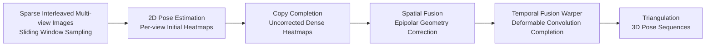

# From Sparse to Dense: Spatio-Temporal Fusion for Multi-View 3D Human Pose Estimation with DenseWarper

**Conference**: ICLR 2026  
**OpenReview**: [https://openreview.net/forum?id=MLs6ThXmcz](https://openreview.net/forum?id=MLs6ThXmcz)  
**Code**: [https://github.com/lingli1724/DenseWarper-ICLR2026](https://github.com/lingli1724/DenseWarper-ICLR2026)  
**Area**: Multi-View 3D Human Pose Estimation / Spatio-Temporal Fusion  
**Keywords**: Multi-view 3D Pose Estimation, Sparse Interleaved Input, Epipolar Geometry, Heatmap Fusion, Deformable Convolution, Temporal Completion  

## TL;DR
This paper proposes a new paradigm called "Sparse Interleaved Input"—where $N$ cameras each capture one frame at different time steps instead of synchronous full-frame sampling. The DenseWarper framework (epipolar spatial fusion + deformable convolution temporal completion) is then used to restore sparse interleaved heatmaps into dense, spatio-temporally consistent pose sequences. It outperforms traditional synchronous multi-view inputs with only $1/N$ of the data and improves the effective output frame rate by $N$ times.

## Background & Motivation
**Background**: Multi-view 3D human pose estimation relies on images captured by multiple synchronized cameras at the **same instant** to reconstruct the pose. It provides sufficient spatial information and higher accuracy than monocular methods, serving as the foundation for tasks like action recognition, dance synthesis, and VR.

**Limitations of Prior Work**: This "single-instant dense input" paradigm has three structural bottlenecks: ① Computational redundancy, as synchronous images from all views must be fed at every time step; ② Insufficient utilization of temporal information, discarding rich temporal dependencies between adjacent frames; ③ Inability to exceed the frame rate limit of a single camera, as the temporal resolution of output poses is capped by the camera sampling rate. Existing keypoint interpolation methods (e.g., SLERP, MCC) increase the frame rate but only as post-processing in the skeleton space, failing to truly exploit multi-view spatio-temporal complementarity.

**Key Challenge**: There is a trade-off between accuracy, efficiency, and frame rate—it is difficult to achieve all three simultaneously using either full-frame synchronous input (redundant, low frame rate) or interpolation (limited accuracy).

**Goal**: Design an input paradigm and model that allows sparse sampling to break the frame rate limit without sacrificing accuracy while reducing data redundancy.

**Core Idea**: **[Sparse Interleaved Sampling]** Let Camera 1 sample at $t$, Camera 2 at $t+\delta$, ..., Camera $N$ at $t+(N-1)\delta$. Each time step contains only one frame from one view. This is essentially **joint spatio-temporal sampling**, utilizing the temporal phase difference between views to reconstruct higher-frequency pose signals. For $N$ cameras with frame rate $F$, the output interval becomes $\delta$, and the equivalent sampling rate increases to $N \times F$. This is coupled with **[DenseWarper: Sparse to Dense]**, which performs spatial correction and temporal completion on interleaved heatmaps to obtain dense spatio-temporally consistent outputs.

## Method

### Overall Architecture
DenseWarper is an end-to-end framework: first, a 2D pose estimator generates initial heatmaps for interleaved frames of each view. Available frames from each view are **copied** to missing time steps to create "uncorrected" dense heatmaps. These then pass through two core modules: **Spatial Fusion** based on epipolar geometry to align and correct copied heatmaps, and **Temporal Fusion (Warper)** based on deformable convolutions for implicit completion along the time dimension. Finally, 3D poses are reconstructed from the corrected dense heatmaps using triangulation. A **sliding window** mechanism enables real-time incremental processing without waiting for all views to finish sampling.

### Key Designs

**1. Sparse Interleaved Input Paradigm: Converting frame rate limits into a sampling design.** Traditional input requires all $M$ views to be present at every time step. This paper rearranges them into an interleaved sequence $D=\{I_i\}_{i=1}^{\lfloor N/M\rfloor}$, where in each set $I_i=\{I_{V_1}^{M(i-1)+1}, I_{V_2}^{M(i-1)+2}, \dots, I_{V_M}^{M\cdot i}\}$, each view contributes only one frame at a different time. The advantage is that while the independent sampling rate of each view remains $F$ with interval $N \times \delta$, the interleaved views reduce the overall pose output interval to $\delta$. This boosts the equivalent frame rate to $N \times F$, breaking the frame rate limit without hardware upgrades, while using only $1/N$ of the data to naturally reduce redundancy.

**2. Epipolar Spatial Heatmap Fusion: Using 1D epipolar line search instead of 2D matching for cross-view error correction.** Heatmaps obtained via copy-completion suffer from spatio-temporal misalignment. This paper utilizes the epipolar constraint $q'^{\top}Fq=0$ to compress the search range for an inaccurate point $q$ in one view from a 2D region to an epipolar line $l'=Fq$ in another view. Specifically, for a copied heatmap $H_v^n(x)$ of view $v$ at frame $n$, the maximum response point along the corresponding epipolar line $p_u(x)$ in every other view $u$ is sampled to provide correct spatial information. The fusion is expressed as $\hat H_v^n(x)=\lambda H_v^n(x)+\frac{1-\lambda}{M}\sum_{u=1}^{M}\max_{x'\in p_u(x)}H_u^n(x')$. Using the "maximum response on the epipolar line" is a reasonable simplification, as accurate corresponding points typically yield the highest response, avoiding expensive point-to-point matching.

**3. Warper Temporal Fusion: Using difference-driven multi-scale deformable convolutions for implicit temporal completion.** Spatial fusion only solves "what this frame looks like from other views," but real motion at missing time steps within the same view still needs completion. For each target time step, the Warper calculates the difference between current heatmaps and "accurate heatmaps" on the diagonal as motion cues. These are fed into 3x3 residual blocks followed by 5 layers of convolutions with dilation rates $d \in \{3,6,12,18,24\}$. Each layer predicts offsets $o^{(d)}(p_n)$ for each pixel $p_n$ to rewarp the pose heatmap $B$, and the 5 rewarped results are summed to predict the target heatmap. Multi-scale dilation allows the model to capture both slight jitters and large displacements, implicitly learning the "missing frames."

**4. Sliding Window + Cache: Enabling low-latency real-time processing for interleaved inputs.** In a naive approach, the second set $I_2$ would wait for the $N$-th view to finish sampling, causing high latency. The sliding window allows a new window to be formed as soon as any view finishes sampling. For example, once $I_{V_1}^5$ is sampled, it immediately forms $I'_2=\{I_{V_2}^2, I_{V_3}^3, I_{V_4}^4, I_{V_1}^5\}$, where the first three are already computed and cached. This avoids waiting for all views and reuses heatmaps, reducing both latency and computational cost.

## Key Experimental Results

### Main Results (Human3.6M, MPJPE / mm, lower is better)

| Method | Input | 2D=GT | 2D=CPN | 2D=SimpleBaseline | P-MPJPE(SB) |
|---|---|---|---|---|---|
| GLA-GCN (T=243) | Single-view | 28.5 | 44.4 | 43.7 | 35.2 |
| KTP-Former (T=243) | Single-view | — | 40.2 | 38.1 | 31.4 |
| Adafuse | Full-frame | 23.7 | 35.8 | 28.1 | 20.7 |
| Adafuse + SLERP | Interpolation | 23.5 | 35.3 | 28.1 | 20.7 |
| Sgraformer | Full-frame | — | 35.4 | 24.3 | 19.9 |
| **Ours** | **Sparse Interleaved** | **21.3** | **33.6** | **22.3** | **19.4** |

With GT, 21.3mm is a 25.2% improvement over single-view GLA-GCN and approximately 10.1% over full-frame Adafuse, achieving SOTA in 12 out of 15 actions. With SimpleBaseline, it achieves 22.3mm, ranking best in 14/15 actions.

### MPI-INF-3DHP (MPJPE / mm, SimpleBaseline 2D)

| Method | Input | MPJPE ↓ |
|---|---|---|
| KTP-Former (T=243) | Single-view | 67.59 |
| Adafuse | Full-frame | 78.57 |
| Adafuse + SLERP | Interpolation | 83.37 |
| PPT + SLERP | Interpolation | 110.34 |
| **Ours** | **Sparse Interleaved** | **65.89** |

### Efficiency (Table 4)

| Method | Params(M) | FLOPs(G) | Latency(ms) | MPJPE/MB ↓ |
|---|---|---|---|---|
| FinePose | 269.23 | 287.32 | 82.24 | 0.117 |
| Adafuse | 69.66 | 204.26 | 96.03 | 0.403 |
| **Ours** | 76.51 | **111.36** | **44.51** | **0.291** |

The latency is only 44.51ms (about half of Adafuse's 96ms), achieving a processing speed 4 times the input FPS.

### Ablation Study (SimpleBaseline 2D, MPJPE / mm)

| Spatial Heatmap Fusion | Warper | Human3.6M | MPI-INF-3DHP |
|---|---|---|---|
| ✗ | ✗ | 36.06 | 94.46 |
| ✓ | ✗ | 31.54 | 88.63 |
| ✓ | ✓ | **22.28** | **65.89** |

### Key Findings
- Spatial fusion alone improves H36M from 36.06 to 31.54mm, verifying the effectiveness of epipolar correction. Adding the Warper further reduces it to 22.28mm, a 38.2% improvement over "spatial fusion only," indicating that **temporal completion is the primary source of gain**.
- Sparse interleaved input (with $1/N$ data) consistently outperforms full-frame synchronous input across three 2D detectors, proving that "joint spatio-temporal sampling" utilizes information more efficiently than "single-instant dense sampling."
- The paper also establishes a unified 2D detection alignment benchmark for MPI-INF-3DHP, filling a gap in the evaluation benchmarks for this dataset.

## Highlights & Insights
- **Paradigm-level Innovation**: Breaks the long-standing default assumption that "multi-view must be synchronized," redefining the input structure itself rather than just tweaking the network. It logically justifies the equivalent frame rate of $N \times F$ from a sampling theory perspective.
- **Sparse yet Stronger**: Counter-intuitively achieves higher accuracy with less data ($1/N$) by compensating for missing information through geometric priors (epipolar constraints) and motion modeling (deformable convolutions).
- **Engineering Friendly**: The sliding window and caching make interleaved sampling truly real-time viable, with only 44.51ms latency and 4x input FPS capability, offering practical value for high-temporal-resolution applications (VR, motion capture).

## Limitations & Future Work
- The sparse interleaved assumption relies on fixed phase differences $\delta$ and calibrated cameras (accurate fundamental matrices $F$). Epipolar correction may degrade in scenarios with camera jitter, asynchronous drift, or uncalibrated setups.
- "Copy-completion + max response on epipolar line" is a strong simplification; for fast motions causing significant cross-view displacement, the max response point might not correspond to the ground truth.
- Experiments were primarily validated on Human3.6M and MPI-INF-3DHP (mostly indoor). Generalization to outdoor, heavily occluded, or multi-person interaction scenarios remains to be tested.
- While the frame rate increase is theoretically $N \times$, the paper does not fully analyze how errors accumulate with increasing $N$ due to the coupling of 2D detector and triangulation errors.

## Related Work & Insights
- **Multi-view Fusion**: Compared to full-frame methods like Adafuse (adaptive multi-view fusion) and Sgraformer, this paper extends "fusion" from synchronous multi-view to "cross-instant interleaved multi-view," introducing a temporal dimension to heatmap fusion.
- **Frame Rate Up-conversion / Interpolation**: Unlike skeleton post-processing methods such as SLERP (Spherical Linear Interpolation) or MCC (Motion Consistency Interpolation), this work performs temporal completion via deformable convolutions at the heatmap level, integrating information earlier and more densely.
- **Insight**: The idea of sparse interleaved sampling can be extended to other multi-view 3D perception tasks (3D reconstruction, point clouds, SLAM). As long as multiple sensors exist and phase differences are tolerable, there is an opportunity to trade lower sampling density for higher temporal resolution.

## Rating
- Novelty: ⭐⭐⭐⭐⭐ Redefines the input paradigm instead of just changing the network; the idea is rare, self-consistent, and has the potential to inspire other multi-view tasks.
- Experimental Thoroughness: ⭐⭐⭐⭐ Covers two datasets, three 2D detectors, MPJPE/P-MPJPE, efficiency, and ablation studies; however, it focuses on indoor scenes and provides limited analysis on scalability for $N$.
- Writing Quality: ⭐⭐⭐⭐ Progresses logically from paradigm motivation to sampling theory and module design; formulas and notations are somewhat dense.
- Value: ⭐⭐⭐⭐ Simultaneously addresses accuracy, efficiency, and frame rate challenges. Its real-time capability makes it significant for motion capture and VR.

<!-- RELATED:START -->

## Related Papers

- [\[CVPR 2026\] MS^2Gait: A Multi-Scale Spatio-Temporal Fusion Network for LiDAR-based Gait Recognition](../../CVPR2026/human_understanding/ms2gait_a_multi-scale_spatio-temporal_fusion_network_for_lidar-based_gait_recogn.md)
- [\[ECCV 2024\] UPose3D: Uncertainty-Aware 3D Human Pose Estimation with Cross-View and Temporal Cues](../../ECCV2024/human_understanding/upose3d_uncertainty-aware_3d_human_pose_estimation_with_cross-view_and_temporal_.md)
- [\[ECCV 2024\] RePOSE: 3D Human Pose Estimation via Spatio-Temporal Depth Relational Consistency](../../ECCV2024/human_understanding/repose_3d_human_pose_estimation_via_spatio-temporal_depth_relational_consistency.md)
- [\[ECCV 2024\] 3DSA: Multi-view 3D Human Pose Estimation With 3D Space Attention Mechanisms](../../ECCV2024/human_understanding/3dsa_multi-view_3d_human_pose_estimation_with_3d_space_attention_mechanisms.md)
- [\[CVPR 2026\] MGDHand: Multi-Granularity Prior-to-Inertial Distillation Framework for Sequential 3D Hand Pose Estimation from Sparse IMUs](../../CVPR2026/human_understanding/mgdhand_multi-granularity_prior-to-inertial_distillation_framework_for_sequentia.md)

<!-- RELATED:END -->
