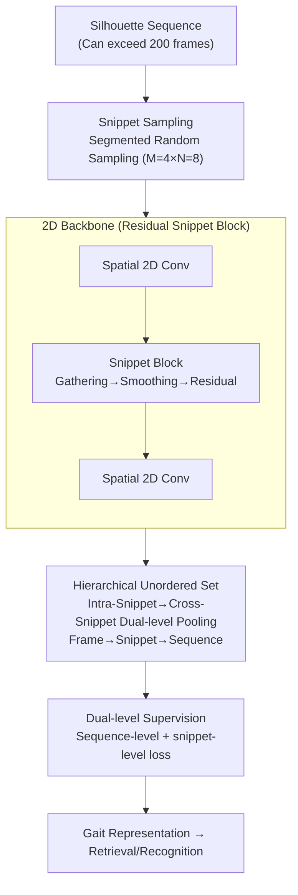

# GaitSnippet: Gait Recognition Beyond Unordered Sets and Ordered Sequences

**Conference**: ICLR2026  
**arXiv**: [2508.07782](https://arxiv.org/abs/2508.07782)  
**Code**: To be confirmed  
**Area**: Human understanding  
**Keywords**: gait recognition, snippet paradigm, temporal modeling, silhouette, 2D convolution  

## TL;DR

Ours proposes the Snippet paradigm: organizing gait silhouette sequences into multiple "snippets," where each snippet consists of frames randomly sampled within a continuous interval. This approach balances short-range temporal context with long-range temporal dependencies. Using a 2D convolutional backbone, it achieves 77.5% Rank-1 on Gait3D, surpassing all 3D convolutional methods.

## Background & Motivation

Gait recognition utilizes silhouette sequences as input. Current mainstream modeling paradigms include two types:

**Unordered Set**: Represented by GaitSet, this treats all frames as an unordered set, using 2D convolutions to extract features independently, followed by Set Pooling for aggregation. The advantages are efficiency and robustness to frame order disturbances; however, independent frame processing **loses short-range temporal context between adjacent frames**.

**Ordered Sequence**: Represented by GaitGL and DeepGaitV2-3D, this uses 3D/P3D convolutions to jointly model spatio-temporal features. While capturing local dynamics, training typically involves sampling only ~30 continuous frames, making it **difficult to model long-range temporal dependencies** (real-world sequences can exceed 200 frames).

**Core Problem**: Is it possible to find a new paradigm that achieves both short-range temporal awareness and long-range temporal coverage?

The authors draw inspiration from human cognition—recognizing an individual often requires observing only a few key actions (rather than a full gait cycle). Thus, gait is viewed as a **combination of individualized actions**, where each action is represented by a snippet.

## Method

### Overall Architecture

GaitSnippet aims to establish a third path between "unordered sets" and "ordered sequences": retaining the set paradigm's coverage of long sequences while recovering the short-range temporal context unique to the sequence paradigm. The mechanism involves segmenting a silhouette sequence into several equal-length segments. Within each segment, frames are randomly sampled to form a snippet (representing a local action). Features are then aggregated twice along the "frame → snippet → sequence" hierarchy. A lightweight temporal module injects local context within snippets, and cross-snippet set pooling aggregates them into the final sequence-level gait representation. The entire pipeline runs on a pure 2D convolutional backbone, with temporal modeling achieved through the snippet structure itself.

### Key Designs

**1. Snippet Sampling: Achieving short-range context and long-range coverage via "segmented random sampling"**

While sequence paradigms only sample ~30 continuous frames (missing long-range info) and set paradigms treat frames independently (missing short-range info), snippet sampling divides the sequence into $K$ equal-length segments (length $L=16$, approximately one gait cycle). During training, $M=4$ segments are randomly selected, and $N=8$ frames are randomly sampled within each segment to form a snippet. The total number of sampled frames is $S = M \times N = 32$. This ensures that frames within each snippet remain close to each other to preserve the temporal continuity of local actions, while the sampled segments are distributed across the entire long sequence to cover long-range dependencies. The length of the first segment $L_1$ is randomly chosen from $\{1,\ldots,L\}$ to increase sampling diversity and act as regularization. During inference, all frames are used—each segment forms a snippet ($M=K, N=L$), with the first segment length fixed at $L$ for stability.

**2. Intra-Snippet Modeling (Snippet Block): Layer-wise injection of local temporal context into frame-level features**

Snippet sampling alone is insufficient; the network must actively utilize the temporal relationships within snippets. The Snippet Block consists of three steps: **Gathering**, treating frames within a snippet as an unordered set and aggregating them via non-parametric Temporal Max Pooling; **Smoothing**, applying a $1\times1$ convolution to smooth noise and reduce the semantic gap between frame-level and snippet-level features; and **Residual**, adding this snippet-level context back to each frame-level feature via a residual connection. Integrating this block between two spatial convolutional layers of a standard 2D residual block yields the **Residual Snippet Block**, the fundamental component of the backbone. Inspired by P3D, this allows frame-level features to continuously perceive the local temporal context of their snippet during layer-wise convolution, rather than performing temporal aggregation only at the end. The backbone is based on DeepGaitV2-2D (ResNet-style), replacing standard residual blocks with Residual Snippet Blocks and utilizing Horizontal Pyramid Mapping for multi-granularity local representations.

**3. Cross-Snippet Modeling (Hierarchical Unordered Set): Aggregating sequence representations without losing temporal information**

At the backbone output, Intra-Snippet Gathering is performed to obtain each snippet's representation. All snippets are then treated as an unordered set, and a second Temporal Max Pooling aggregates them into a sequence-level representation, forming a "frame → snippet → sequence" hierarchical structure. Key Insight: Although set pooling is used at both levels—resembling a permutation-invariant set paradigm—the frame-level pipeline is **not** permutation-invariant because the Snippet Block has already modeled temporal relations within snippets. Long-range coverage is provided by set pooling, while short-range context is preserved by the Snippet Block.

### Loss & Training

The snippet paradigm naturally produces dual-level representations (sequence-level and snippet-level). Ours adds an independent supervision branch for snippet-level features. The sequence level uses Triplet Loss $\mathcal{L}_{tp}$ and Cross-Entropy Loss $\mathcal{L}_{ce}$ (with BNNeck); the snippet level constructs positive/negative pairs at the snippet granularity to obtain $\mathcal{L}_{tp}^{\star}$ and $\mathcal{L}_{ce}^{\star}$. The total loss is:

$$\mathcal{L}_{all} = \mathcal{L}_{tp} + \mathcal{L}_{ce} + \alpha\,(\mathcal{L}_{tp}^{\star} + \mathcal{L}_{ce}^{\star}),\quad \alpha=0.75.$$

The snippet-level branch is active only during training and is discarded during inference, incurring no additional inference cost.

## Key Experimental Results

### Main Results (Real-world Datasets)

| Method | Type | Backbone | Gait3D R1 | Gait3D mAP | GREW R1 | GREW R5 |
|------|------|------|-----------|------------|---------|---------|
| GaitSet | Set | 2D | 36.7 | 30.0 | 48.4 | 63.6 |
| GaitBase | Set | 2D | 64.6 | 55.3 | 60.1 | 75.5 |
| DeepGaitV2-2D | Set | 2D | 68.2 | 60.4 | 68.6 | 82.0 |
| DeepGaitV2-3D | Seq | 3D | 72.8 | 63.9 | 79.4 | 88.9 |
| VPNet | Seq | 3D | 75.4 | — | 80.0 | 89.4 |
| SwinGait-3D | Seq | Swin3D | 75.0 | 67.2 | 79.3 | 88.9 |
| **GaitSnippet** | **Snippet** | **2D** | **77.5** | **69.4** | **81.7** | **90.9** |

Key Findings:

- GaitSnippet, using a 2D convolutional backbone, **completely outperforms** all 3D convolutional methods.
- Compared to the baseline DeepGaitV2-2D with the same backbone: Gait3D R1 improves by **+9.3%**, and mAP improves by **+9.0%**.
- Achieves best performance on CCPG (clothing change) with 95.1% AVG and CCGR-MINI R1 with 42.4%.

### Ablation Study (Gait3D)

**Snippet Sampling Effect**:

- Simply replacing the sampling strategy of DeepGaitV2-2D from Set to Snippet increases R1 from 68.2% to 69.5% (+1.3%), indicating that snippet sampling itself provides a regularization effect.
- Optimal hyperparameters: $L=16, M=4, N=8$.

**Snippet Block Components**:

- Removing Gathering: R1 drops to 73.3% (snippet-level supervision becomes impossible).
- Removing Smoothing: R1 drops to 74.8% (increased noise and semantic gap).
- Removing Residual: R1 drops to 72.5% (loss of fine-grained frame info, representing the most significant impact).

**Snippet-Level Supervision**:

- $\alpha=0$ (no snippet-level supervision) still yields competitive results, proving the effectiveness of the Snippet Block itself.
- Incorporating snippet-level supervision ($\alpha=0.75$) further enhances performance.

## Highlights & Insights

**Highlights**:

- Proposes a third paradigm between sets and sequences, with clear conceptual contributions supported by cognitive science.
- Surpasses all 3D methods using only a 2D convolutional backbone, resulting in lower computational costs.
- The Snippet Block design is simple (non-parametric pooling + 1×1 conv + residual) and easily integrates into existing architectures.
- Hierarchical supervision (sequence-level + snippet-level) fully exploits the structural advantages of the snippet paradigm.
- Demonstrates SOTA performance in both controlled (CCPG) and unconstrained (Gait3D/GREW) scenarios.

**Limitations**:

- The snippet length $L$ is fixed at 16 frames, which may not be adaptive to individuals with significantly different gait frequencies.
- Cross-Snippet Modeling uses only Max Pooling; more complex inter-snippet relationship modeling (e.g., Transformers) was not explored.
- Inference requires processing all frames across all snippets, which may still result in high overhead for very long sequences.
- Validated only on the silhouette modality; not yet extended to other modalities such as skeleton or RGB.

## Rating

- Novelty: ⭐⭐⭐⭐ Proposes a new snippet paradigm with clear conceptual contributions.
- Experimental Thoroughness: ⭐⭐⭐⭐⭐ Four datasets plus exhaustive ablation studies.
- Value: ⭐⭐⭐⭐ 2D backbone outperforms 3D methods, offering high practicality.

<!-- RELATED:START -->

## Related Papers

- [\[CVPR 2026\] MMGait: Towards Multi-Modal Gait Recognition](../../CVPR2026/human_understanding/mmgait_multi_modal_gait_recognition.md)
- [\[CVPR 2026\] EventGait: Towards Robust Gait Recognition with Event Streams](../../CVPR2026/human_understanding/eventgait_towards_robust_gait_recognition_with_event_streams.md)
- [\[CVPR 2026\] HyperGait: Unleashing the Power of Parsing for Gait Recognition in the Wild via Hypergraph](../../CVPR2026/human_understanding/hypergait_unleashing_the_power_of_parsing_for_gait_recognition_in_the_wild_via_h.md)
- [\[CVPR 2026\] Text-guided Feature Disentanglement for Cross-modal Gait Recognition](../../CVPR2026/human_understanding/text-guided_feature_disentanglement_for_cross-modal_gait_recognition.md)
- [\[CVPR 2026\] Unlocking Motion from Large Vision Models with a Semantic and Kinematic Duality for Gait Recognition](../../CVPR2026/human_understanding/unlocking_motion_from_large_vision_models_with_a_semantic_and_kinematic_duality_.md)

<!-- RELATED:END -->
