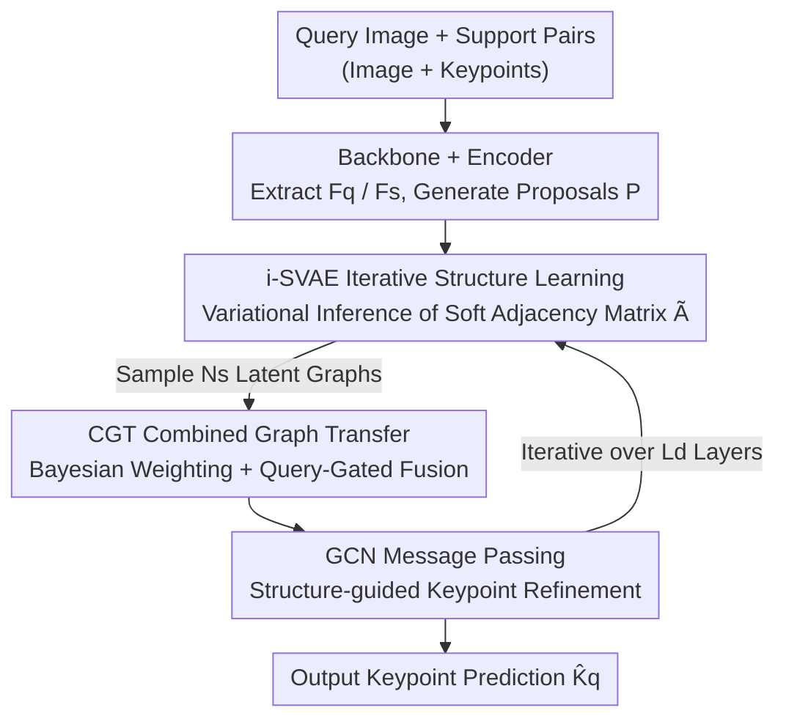

# GenCape: Structure-Inductive Generative Modeling for Category-Agnostic Pose Estimation

**Conference**: ICLR 2026  
**OpenReview**: [https://openreview.net/forum?id=IVjs6vNDhV](https://openreview.net/forum?id=IVjs6vNDhV)  
**Code**: None  
**Area**: Human Understanding / Category-Agnostic Pose Estimation  
**Keywords**: Category-Agnostic Pose Estimation, Variational Graph Auto-Encoder, Latent Skeleton Structure, Bayesian Fusion, Few-shot

## TL;DR
GenCape treats the keypoint skeleton structure in Category-Agnostic Pose Estimation (CAPE) as a **latent variable** to be generated. It employs an iterative structure-aware variational auto-encoder (i-SVAE) to infer instance-specific soft adjacency matrices from support images. A Combined Graph Transfer (CGT) module then performs Bayesian fusion of multiple sampled graphs based on uncertainty and query relevance. This approach **completely eliminates the need for pre-defined skeletons and text priors**, achieving new SOTA results on MP-100 for both 1-shot and 5-shot settings (mPCK +1.59% over FMMP).

## Background & Motivation

**Background**: Category-Agnostic Pose Estimation (CAPE) aims to localize semantic keypoints on query images of any novel category given only a few annotated support images. Current methods generally follow two paths: treating keypoints as isolated entities (POMNet, CapeFormer) using metric learning for matching, or introducing structural priors for graph reasoning (GraphCape, SCAPE), which typically rely on **manually pre-defined skeleton connections** or **extra text descriptions**.

**Limitations of Prior Work**: Manual skeletons and text priors suffer from two major flaws. First, **expensive and rigid annotation**: each category requires manual skeleton construction or descriptions, and fixed skeletons cannot adapt to major pose changes, non-rigid deformations, or topological differences in novel instances. Second, **vulnerability to low-quality support sets**: in few-shot settings where support sets are randomly sampled, occlusions or structure inconsistencies in the support image can mislead the fixed structural inference, causing a sharp drop in accuracy.

**Key Challenge**: CAPE requires structural modeling that is "flexible across categories and robust against support noise." However, existing methods use **deterministic, category-fixed skeletons** to approximate **instance-varying topologies**, essentially forcing a static prior onto a dynamic structure. SDPNet, the most relevant prior work, predict a fixed adjacency matrix discriminatively from support features but fails to account for structural uncertainty, leading to instability during support-query mismatch.

**Goal**: (1) To infer keypoint relationships in a data-driven manner purely from image support sets without relying on external skeletons or text; (2) To enable structural modeling that explicitly expresses uncertainty and adaptively handles noisy support sets for the query.

**Key Insight**: The authors reformulate "skeleton learning" as **generative latent structure learning**. Keypoints are graph nodes, and relationships are encoded into a latent adjacency matrix. Variational inference is used to learn a **distribution** over the instance's graph structure rather than a point estimate. This captures epistemic uncertainty from sparse signals and allows for step-by-step refinement across decoding layers.

**Core Idea**: Replace "fixed skeleton priors" with "variational generation of a family of soft adjacency matrices + Bayesian fusion into a query-aware graph," treating structure as a latent variable for inference and adaptation.

## Method

### Overall Architecture
GenCape is built upon a version of GraphCape without skeleton priors. The pipeline consists of "feature extraction → proposal generation → Graph Transformer decoding (with embedded structure inference in each layer)." Given a query image $I_q$ and $N$ support pairs $\{(I^s_i, K^s_i)\}_{i=1}^N$, a shared backbone $\phi$ extracts query features $F_q$ and support features. Support features and keypoint targets are aggregated into keypoint-aware embeddings $F_s \in \mathbb{R}^{M\times D}$. A similarity-aware proposal generator computes initial position proposals $P\in\mathbb{R}^{M\times2}$.

The core lies in the decoder: In **each layer** of the Graph Transformer Decoder, an **i-SVAE** is embedded to infer a family of latent soft adjacency matrices $\{\tilde{A}^{(l)}_n\}$ from current support node embeddings $F_s^{(l)}$. These sampled graphs are passed to the **CGT** module, which performs Bayesian fusion based on uncertainty and query relevance to produce a final query-aware graph $\tilde{A}^{(l)}_{\text{final}}$. This graph drives a GCN layer for inter-keypoint message passing, iteratively refining keypoint predictions.

### Key Designs

**1. i-SVAE: Generating and Refining Skeleton Structures as Latent Variables Layer-by-Layer**

To address the rigidity of fixed skeletons, the authors use a Variational Graph Auto-Encoder (VGAE) framework to treat the adjacency matrix as a latent variable. In decoding layer $l$, the encoder generates an approximate posterior $q_\phi(z^{(l)}|F_s^{(l)}) = \mathcal{N}(z^{(l)}; \mu^{(l)}, \mathrm{diag}(\sigma^{(l)}))$. Using the reparameterization trick, they sample $z^{(l)} = \mu^{(l)} + \sigma^{(l)}\odot\epsilon, \epsilon\sim\mathcal{N}(0,I)$, and a fully connected decoder constructs the adjacency matrix $\hat{A}=\mathrm{Dec}(z)$. To ensure undirectedness and interpretability, symmetrization and row normalization are applied: $\tilde{A}^{(l)}=\mathrm{norm}(\frac{1}{2}(\hat{A}^{(l)}+\hat{A}^{(l)\top}))$.

The "iterative" nature is key: i-SVAE is embedded into **every decoding layer**, allowing the latent pose graph to be updated as visual semantics and localization cues evolve. Unlike deterministic modeling, this generative approach encodes epistemic uncertainty from support signals into the distribution, making message passing within the Graph Transformer more expressive and robust.

**2. CGT: Combining Sampled Graphs via Bayesian Belief Weighting and Query Gating**

Random sampling in i-SVAE introduces variance across latent graphs. CGT aggregates $N_s$ sampled graphs $\{\tilde{A}^{(l)}_n\}$ into a robust query-aware graph. First, **uncertainty-based weighting** is applied: the confidence of each sampled graph is defined as the inverse of the total variance $w_n = 1/(\sum_{i=1}^{D_z}\sigma^{(l)}_{n,i}+\epsilon)$. After normalization, highly certain graphs (low variance) receive higher weights.

Next, **query-guided gating** aligns with query evidence: cosine similarity between the global query descriptor and layer means $\mu^{(l)}$ yields attention gating scores $\alpha^{(l)}$. The final graph $\tilde{A}^{(l)}_{\text{final}}$ is a weighted sum over layers. This mechanism ensures structural inference is not hijacked by noisy samples and remains anchored to the query's visual context.

**3. Double Regularization: KL Divergence and $\ell_2$ Sparsity**

To ensure meaningful latent representations, i-SVAE uses two constraints. **Prior Regularization** minimizes the KL divergence between the posterior $q_\phi(z|X)$ and a Gaussian prior $p(z)=\mathcal{N}(0,I)$. **Sparsity Constraint** applies an $\ell_2$ penalty $\frac{\beta}{M^2}\lambda\|\tilde{A}^{(l)}_{\text{final}}\|_F^2$ to the adjacency matrix to encourage interpretable and minimal connections. The VAE loss is defined as $\mathcal{L}^{(l)}_{\text{VAE}} = \mathcal{L}^{(l)}_{\text{KL}} + \beta\cdot\mathcal{L}^{(l)}_{\text{sparse}}$ ($\beta=0.1$).

### Loss & Training
The prediction loss follows standard CAPE protocols: $\mathcal{L}_{\text{pred}} = \lambda_{\text{heatmap}}\cdot\mathcal{L}_{\text{heatmap}} + \mathcal{L}_{\text{offset}}$. The total objective is $\mathcal{L} = \mathcal{L}_{\text{pred}} + \gamma\cdot\mathcal{L}_{\text{VAE}}$ ($\gamma=10^{-3}$). During **inference**, the latent code $z$ is set directly to the posterior mean $\mu$, collapsing the random sampling to obtain a consistent structural prior.

## Key Experimental Results

### Main Results
Benchmark on MP-100 dataset (100 subcategories, 8 super-categories, PCK metric).

| Setting | Method | Support Type | Average PCK | Comparison |
|--------|------|------|------|------|
| 1-shot | GraphCape-S (baseline) | Image+Graph | 90.68 | — |
| 1-shot | CapeX-S (Text+Graph) | Image+Text+Graph | 90.37 | — |
| 1-shot | **GenCape-S (Ours)** | Image (Gen. Graph) | **91.01** | +0.33 over baseline, +0.64 over CapeX-S |
| 5-shot | GraphCape | Image+Graph | 92.83 | — |
| 5-shot | **GenCape (Ours)** | Image (Gen. Graph) | **93.53** | Beats all, including PPM+CPT 92.58 |

In strict threshold settings (Split-1, ResNet-50), GenCape-R50 outperforms FMMP by +1.59% mPCK, with the gap widening at PCK@0.05 (+1.61%).

### Ablation Study

| Configuration | PCK | Δ | Description |
|------|---------|------|------|
| baseline | 91.19 | — | Pure generated graph without regul. or CGT |
| + $\mathcal{L}_{\text{KL}}$ | 91.43 | +0.24 | KL stabilizes posterior |
| + $\mathcal{L}_{\text{KL}}$ + $\mathcal{L}_{\text{sparse}}$ | 91.75 | +0.56 | Synergetic effect of sparsity and KL |
| Full (+ CGT) | 92.05 | +0.86 | CGT fuses uncertainty hypotheses |

### Key Findings
- **CGT is highly effective**: Adding CGT improves PCK from 91.75 to 92.05, confirming that Bayesian fusion is critical for robust structural inference.
- **Strong Cross-Super-Category Generalization**: GenCape significantly outperforms GraphCape in cross-topology transfers (e.g., Person↔AnimalFace), with gains up to +11.8 points.
- **Robustness to Hyperparameters**: Optimal at $D_z=32$ and $N_s=3$; larger capacities introduce redundancy.

## Highlights & Insights
- **Distribution Estimation vs. Point Estimation**: Casting "skeleton learning" as distribution estimation via VGAE allows $\sigma$ to explicitly model epistemic uncertainty, which is then used for confidence weighting.
- **Iterative Refinement as a Loop**: Embedding i-SVAE in every layer creates a "structure ↔ position" feedback loop, where localization cues help refine the graph and vice-versa.
- **Text-free matching Text-based Performance**: GenCape matches or exceeds methods using external text priors, suggesting that data-driven structural representations can effectively substitute for semantic labels.

## Limitations & Future Work
- Evaluation is limited to the MP-100 dataset; performance in open-world/real-world wild scenes is unverified.
- Collapsing $z$ to the mean $\mu$ at inference time discards the modeled randomness; utilizing multi-hypothesis sampling at test time might further improve robustness.
- Specific failure cases in Split 3 (5-shot) were not analyzed in detail regarding topological failure modes.

## Related Work & Insights
- **vs. SDPNet**: SDPNet predicts a fixed matrix discriminatively; GenCape models a generative distribution, offering better flexibility and noise resistance.
- **vs. GraphCape**: GenCape replaces manual priors with data-driven latent structures, significantly improving cross-category transfer.
- **vs. CapeX/X-Pose**: While these rely on costly text annotations, GenCape achieves superior performance using only image signals.

## Rating
- Novelty: ⭐⭐⭐⭐ (First to internalize skeleton structure as iterative latent distributions in CAPE).
- Experimental Thoroughness: ⭐⭐⭐⭐ (Comprehensive ablations, though limited to one dataset).
- Writing Quality: ⭐⭐⭐⭐ (Logical flow and clear motivation).
- Value: ⭐⭐⭐⭐ (Provides a template for few-shot structural inference without manual priors).

<!-- RELATED:START -->

## Related Papers

- [\[CVPR 2025\] Recurrent Feature Mining and Keypoint Mixup Padding for Category-Agnostic Pose Estimation](../../CVPR2025/human_understanding/recurrent_feature_mining_and_keypoint_mixup_padding_for_category-agnostic_pose_e.md)
- [\[ECCV 2024\] SCAPE: A Simple and Strong Category-Agnostic Pose Estimator](../../ECCV2024/human_understanding/scape_a_simple_and_strong_category-agnostic_pose_estimator.md)
- [\[CVPR 2026\] Decoupled Generative Modeling for Human-Object Interaction Synthesis](../../CVPR2026/human_understanding/decoupled_generative_modeling_for_human-object_interaction_synthesis.md)
- [\[ECCV 2024\] LaPose: Laplacian Mixture Shape Modeling for RGB-Based Category-Level Object Pose Estimation](../../ECCV2024/human_understanding/lapose_laplacian_mixture_shape_modeling_for_rgb-based_category-level_object_pose.md)
- [\[ICLR 2026\] Pose Prior Learner: Unsupervised Categorical Prior Learning for Pose Estimation](pose_prior_learner_unsupervised_categorical_prior_learning_for_pose_estimation.md)

<!-- RELATED:END -->
