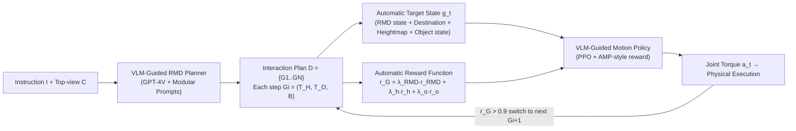

# Human-Object Interaction via Automatically Designed VLM-Guided Motion Policy

**Conference**: ICLR 2026  
**OpenReview**: [https://openreview.net/forum?id=LfkPlFTfe0](https://openreview.net/forum?id=LfkPlFTfe0)  
**Code**: [https://vlm-rmd.github.io/](https://vlm-rmd.github.io/)  
**Area**: Human Understanding / Physics-based HOI  
**Keywords**: Human-Object Interaction, VLM-guided, Relative Motion Dynamics, Automatic Reward Design, Reinforcement Learning, Long-horizon interaction

## TL;DR
A VLM translates high-level instructions into a part-level bipartite graph of "Relative Motion Dynamics (RMD)," automatically constructing target states and reward functions for reinforcement learning. This enables physically simulated characters to complete long-horizon interactions with static, dynamic, and articulated objects without motion capture data or manual reward tuning.

## Background & Motivation
- **Background**: Physics-based human-object interaction (HOI) synthesis is a core capability for animation, simulation, and robotics. Existing approaches fall into two categories: **motion tracking policies** (mimicking mocap trajectories) and **task-centric policies** (manually designing specific rewards for interactions like "sitting" or "carrying").
- **Limitations of Prior Work**: Tracking-based methods rely heavily on expensive high-quality mocap data and struggle to generalize beyond reference trajectories. Task-centric methods require domain experts to **manually design rewards**, covering only single targets and often producing motions that violate human biomechanics. Recent works like Eureka or Grove use LLMs for automatic reward generation but rely on iterative search, which is sampling-inefficient and costly.
- **Key Challenge**: The most related work, UniHSI, uses a "chain-of-contacts" to abstract interactions into discrete contact events. While conceptually elegant, it **only applies instantaneous point contact constraints**, which are discarded once met. This ignores the spatio-temporal evolution of interactions, failing to model full-body coordination or dynamic objects, and often results in jittery static interactions.
- **Goal**: Construct the first **unified** physical HOI framework that leverages the world knowledge of VLMs to automatically construct target states and rewards, supporting long-horizon interactions with static, dynamic, and articulated objects.
- **Key Insight**: **Use "Relative Motion," a classical mechanics concept, as a bridge.** Interactions are abstracted as the time-evolving relative motion between sets of human parts and object parts, encoded into a fine-grained spatio-temporal bipartite graph (RMD). This allows the VLM to go beyond symbolic planning to "imagine" motion-level dynamics and ground them into executable RL targets.

## Method

### Overall Architecture
The framework consists of two tightly coupled modules: the **VLM-Guided RMD Planner** translates instructions $I$ and top-view images $C$ into a sequence of multi-step interaction plans in RMD format. The **VLM-Guided Motion Policy** **automatically** converts each step of the RMD plan into target states $g_t$ and reward functions, executed sequentially by a physical humanoid character trained via PPO.

### Key Designs

**1. Relative Motion Dynamics (RMD): Abstracting Interaction as a Part-level Bipartite Graph.** This is the foundation of the work. The insight is that HOI is essentially the time-evolving relative motion between two sets of rigid bodies: human parts $P_H$ and object parts $P_O$. This is formalized as a bipartite graph $B=(V,E,w)$, where $V=P_H \cup P_O$ and edges $E \subseteq P_H \times P_O$. Each edge $e_{ij}=(p_{hi}, p_{oj})$ carries a weight $w_{ij} \in \{0,1,2,3\}$ characterizing the relative motion mode: $0$ for **stationary contact**, $1$ for **approach**, $2$ for **separation**, and $3$ for **no consistent trend**. Unlike the discrete contact points in UniHSI, RMD encodes both discrete interaction goals (e.g., contact) and continuous dynamics (e.g., coordinated movement). For instance, carrying a box requires a $w=0$ constraint for "hands maintaining a stable relative configuration with the box."

**2. VLM as RMD Planner: Modular Prompts for Step-wise Reasoning.** GPT-4V serves as the planner, taking instruction $I$, top-view $C$, and a set of modular prompts. Each prompt triggers a specific reasoning capability: environment parsing, object part understanding, motion dynamics inference, and symbolic representation generation. The VLM outputs the RMD graph $B$ and two spatial anchors: the human root target $\mathcal{T}_H$ and object root target $\mathcal{T}_O$. The final plan is a sequence of $N$ triplets $D=\{G_1,\dots,G_N\}$ where $G_i=\{\mathcal{T}_H, \mathcal{T}_O, B\}$. Using vision is critical; ablation studies show performance drops significantly when replaced with pure LLM text planning due to loss of spatial perception.

**3. Automatic Target State Construction: Encoding RMD into RL-readable States.** For each edge $e_{ij}$, position-velocity pairs of human joints and the nearest object surface points are extracted from the simulator. Relative quantities $\tilde p_{ij}=p^p_{oj}-p^p_{hi}$ and $\tilde v_{ij}=p^v_{oj}-p^v_{hi}$ are calculated in the agent's root-centric frame. These, along with the one-hot encoded weight $w'_{ij}$, form the edge features. The full RMD state is $s^{RMD}_t = \mathrm{concat}_{(i,j)\in E}(\tilde p_{ij}, \tilde v_{ij}, w'_{ij}) \in \mathbb{R}^{|E|\times(3+3+4)}$. Spatial anchors $\mathcal{T}_H, \mathcal{T}_O$ are given as `object(spatial-relationship)` (e.g., `armchair(front)`), where relationships $\delta$ are mapped to local displacements $\Delta q(\delta)$ to determine absolute targets $p^h_{tar}=c_{obj}+\Delta q(\delta_h)$. This is augmented with a $9\times9$ heightmap $h_t$ for obstacle avoidance and the object state $o_t=(V^{box}_t,\theta_t,v_t,\omega_t)$, forming the complete goal $g_t=(s^{RMD}_t, d_t, h_t, o_t)$.

**4. Automatic Reward Design: Implementing Plan Intent.** The reward must drive the human root toward $\mathcal{T}_H$, the object root toward $\mathcal{T}_O$, and satisfy RMD motion modes. The first two are Gaussian distance rewards $r^h_d=\exp(-\|x^h_t-d^h_t\|^2)$ and $r^o_d=\exp(-\|x^o_t-d^o_t\|^2)$. The RMD term is a weighted sum of alignment rewards for each edge: $r_{RMD}=\sum_{(i,j)\in E}\lambda_{ij}\cdot r_{rmd}(\tilde p_{ij},\tilde v_{ij},w_{ij})$. The total task reward $r_G=\lambda_{RMD} r_{RMD}+\lambda_h r^h_d+\lambda_o r^o_d$ is normalized to $[0,1]$. When $r_G>0.9$, the system switches to the next plan step $G_{i+1}$. AMP-style discriminator rewards $r_S$ ensure motion naturalness: $r_t=\alpha_{task} r_G + \alpha_{style} r_S$.

## Key Experimental Results

Environment: Isaac Gym parallel simulation, PD-controlled humanoid with 15 bodies and 28 joints. PPO training on a single RTX 3090. Dataset: **Interplay** (thousands of long-horizon plans with assets from PartNet, 3D-FRONT, SAMP, etc.).

### Main Results: Long-horizon Multi-task Scenarios (Table 2)

| Method | Success Rate% (Static/Dynamic/Mixed) ↑ | Sub-step Success% (S/D/M) ↑ | Sub-step Accuracy cm (S/D/M) ↓ |
|------|------|------|------|
| InterPhys* | 21.3 / 47.8 / 27.5 | 37.3 / 61.9 / 54.1 | 13.8 / 18.7 / 16.9 |
| TokenHSI* | 25.2 / 52.5 / 36.0 | 48.1 / 65.7 / 60.1 | 13.1 / 16.6 / 14.4 |
| UniHSI | 37.2 / - / - | 61.3 / - / - | 10.2 / - / - |
| **Ours** | **75.1 / 71.2 / 53.8** | **86.2 / 84.3 / 71.8** | **7.7 / 13.0 / 11.2** |
| Ours w/ LLM | 62.8 / 53.1 / 39.9 | 81.7 / 78.3 / 67.2 | 8.9 / 15.2 / 13.8 |

The static success rate of 75.1% nearly doubles UniHSI's 37.2%. Replacing VLM with LLM (text-only) results in a performance drop across all metrics, confirming the necessity of visual input.

### Main Results: Single-task Scenarios (Table 3, Completion %)

| Method | Carry | Push | Open | Sit | Lie | Reach |
|------|------|------|------|------|------|------|
| AMP* | 53.2 | 40.4 | 63.2 | 7.4 | 0.9 | 93.2 |
| InterPhys* | 67.8 | 47.1 | 83.2 | 23.2 | 2.7 | 95.3 |
| TokenHSI* | 71.2 | 49.3 | 81.1 | 27.8 | 8.9 | 95.7 |
| UniHSI | - | - | - | 58.9 | 23.2 | 97.1 |
| **Ours** | **88.3** | **84.1** | **91.2** | **92.6** | **62.0** | **97.5** |

Ours shows the greatest advantage in tasks requiring temporal coordination, such as "standing up/leaving" (Sit 92.6% vs UniHSI 58.9%, as RMD explicitly guides part "separation").

### Ablation Study

| Setting | Meaning | Impact |
|------|------|------|
| multi-one | Single object entity (no parts) | Loss of fine-grained geometry; slight drop |
| one-one | Single human part × single object part | Breaks coordination; significant drop |
| w.o. $\tilde p_{ij}$ | Remove relative position | Major success rate drop (e.g., Carry 88.3→71.7) |
| w.o. $\tilde v_{ij}$ | Remove relative velocity | Moderate drop |
| w.o. $w'_{ij}$ | Remove motion mode weights | Largest performance drop (Carry 88.3→69.1) |

### Key Findings
- **Unified representation enables long-horizon robustness**: All tasks share the RMD representation for seamless transitions; methods that naively concatenate skills (InterPhys/TokenHSI) often fail at task switches.
- **Motion mode weights $w'_{ij}$ are the most critical component of RMD**, indicating that temporal semantics (approach/separate/static) are more important than pure geometry.
- **VLM > LLM**: The spatial grounding provided by top-view images is a prerequisite for generating coherent long-horizon behaviors.

## Highlights & Insights
- **Rediscovery of "Relative Motion"**: This classical mechanics concept is repurposed as a bridge between high-level VLM reasoning and low-level RL execution, turning "imagined motion" into computable bipartite graphs.
- **Elimination of Mocap and Manual Reward Engineering**: Target states and rewards are entirely auto-constructed from VLM outputs, making this the first unified physical HOI framework for static, dynamic, and articulated objects.
- **Redefining Task Completion**: By introducing "leaving/standing up" steps, the policy is forced to recover to a neutral pose after interaction, which is more realistic for long-horizon tasks and exposes the limitations of old "sit and finish" benchmarks.

## Limitations & Future Work
- **Dependency on GPT-4V Planning Quality**: The RMD graph and spatial anchors are generated in a single pass; errors in VLM's understanding of parts or spatial relations propagate directly to the reward without an online correction loop.
- **Simplified Geometry**: Using AABBs for object geometry may be insufficient for fine-grained interactions with complex or non-convex objects.
- **Heuristic Thresholds**: Parameters like $r_G>0.9$ and adaptive weights are hard-coded or inherited from UniHSI; stability across highly diverse tasks remains to be fully verified.
- Experiments are restricted to indoor scenes and single GPU simulation; scaling to real-world robot transfer is a future direction.

## Related Work & Insights
- **Comparison to UniHSI**: The core advancement is upgrading "discrete instantaneous contact" to "continuous spatio-temporal relative motion," enabling dynamic object handling and coordinated recovery.
- **Comparison to Eureka/Grove**: Instead of iteratively searching for reward code, this work grounds the VLM using a structured RMD representation in one go, avoiding the search loop.
- **Insight**: Using "part-level bipartite graphs + semantic edge weights" as an intermediate representation between VLMs and RL is a promising paradigm for contact-intensive tasks like robot manipulation and multi-agent coordination.

## Rating
- **Novelty**: ⭐⭐⭐⭐⭐ — The RMD bipartite graph is a truly original abstraction for VLM-RL interfacing.
- **Experimental Thoroughness**: ⭐⭐⭐⭐ — Strong baselines and comprehensive ablations, though limited to indoor simulation.
- **Writing Quality**: ⭐⭐⭐⭐ — Clear motivation and well-explained concepts; some implementation details are relegated to the appendix.
- **Value**: ⭐⭐⭐⭐⭐ — Addresses both mocap dependency and manual reward engineering while supporting long-horizon tasks, offering high utility for the animation/robotics communities.

<!-- RELATED:START -->

## Related Papers

- [\[ICLR 2026\] Unleashing Guidance Without Classifiers for Human-Object Interaction Animation](unleashing_guidance_without_classifiers_for_human-object_interaction_animation.md)
- [\[ICLR 2026\] InfBaGel: Human-Object-Scene Interaction Generation with Dynamic Perception and Iterative Refinement](infbagel_human-object-scene_interaction_generation_with_dynamic_perception_and_i.md)
- [\[ICLR 2026\] LINK: Learning Instance-level Knowledge from Vision-Language Models for Human-Object Interaction Detection](link_learning_instance-level_knowledge_from_vision-language_models_for_human-obj.md)
- [\[CVPR 2026\] Decoupled Generative Modeling for Human-Object Interaction Synthesis](../../CVPR2026/human_understanding/decoupled_generative_modeling_for_human-object_interaction_synthesis.md)
- [\[ICLR 2026\] Cross-Domain Policy Optimization via Bellman Consistency and Hybrid Critics](cross-domain_policy_optimization_via_bellman_consistency_and_hybrid_critics.md)

<!-- RELATED:END -->
