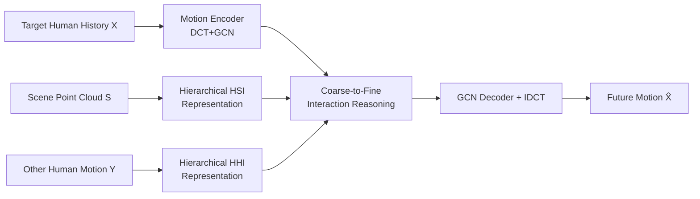

# HUMOF: Human Motion Forecasting in Interactive Social Scenes

**Conference**: ICLR 2026  
**OpenReview**: [https://openreview.net/forum?id=INy8guZqrm](https://openreview.net/forum?id=INy8guZqrm)  
**Code**: [https://github.com/scy639/HUMOF](https://github.com/scy639/HUMOF)  
**Area**: Human Understanding / Human Motion Prediction  
**Keywords**: Human Motion Prediction, Human-Human Interaction, Human-Scene Interaction, Hierarchical Representation, Coarse-to-Fine, DCT  

## TL;DR
HUMOF uniformly encodes "human-human interaction" (HHI) and "human-scene interaction" (HSI) in dynamic social scenes into hierarchical features (high-level semantics + low-level geometry). These features are injected layer-by-layer via a coarse-to-fine Transformer reasoning module, achieving state-of-the-art (SOTA) performance on four public datasets.

## Background & Motivation
**Background**: Human motion prediction (HMP) is a fundamental capability for surveillance, healthcare, autonomous driving, and human-computer interaction. Early methods focused on single-person prediction using only the target's historical actions; later, "scene-aware" methods incorporated static scenes as a whole, while "social-aware" methods implicitly modeled interactions between multiple people using attention mechanisms.

**Limitations of Prior Work**: Real-world scenes are dynamic and interaction-dense—humans approach others to talk, avoid collisions, and interact with the environment (e.g., sitting on stairs, lying on beds). However, scene-aware methods focus on static environments while ignoring multi-person social dynamics, and social-aware methods focus on multiple people while ignoring scene information. The only work to consider both, SAST (Mueller et al., 2024), uses a diffusion model but extracts human and scene features in a **decoupled** manner, failing to fully capture interactions. Moreover, it relies on pre-defined scene semantic segmentation labels, which are difficult to obtain from raw sensor data.

**Key Challenge**: To uniformly model all "human-related interactions" within a single framework, two questions must be addressed: (1) How to design effective **representations** to characterize the multi-level and diverse interactions between humans and the environment/each other? (2) Given a good interaction representation, how can it be **effectively utilized** to improve prediction accuracy?

**Goal**: Achieve precise human motion prediction in dynamic social scenes by handling both HHI and HSI without relying on scene semantic annotations.

**Core Idea**: **Hierarchical Interaction Modeling + Coarse-to-Fine Reasoning**. "Interaction distance" is used to explicitly characterize interactions, constructing hierarchical representations of high-level semantics and low-level geometry. During reasoning, high-level features are first used to establish global understanding, followed by the layer-wise introduction of low-level features for detail refinement, while simultaneously suppressing high-frequency updates in the frequency domain.

## Method

### Overall Architecture
HUMOF receives three inputs: the target human's historical motion sequence, the 3D point cloud of the scene, and the historical motion sequences of nearby individuals. Motion is mapped to the frequency domain via a "DCT+GCN" motion encoder. Interactions are encoded into hierarchical tokens by two separate branches: Human-Human Interaction (HHI) and Human-Scene Interaction (HSI). Finally, a "Coarse-to-Fine Interaction Reasoning Module" injects HHI/HSI tokens layer-by-layer to decode future motion.

### Key Designs
**1. Motion Encoder: Mapping motion to the frequency domain to extract spatial dependencies.** Following mainstream practices, the historical sequence of length $H$ is padded to $H+T$ using the last frame. Discrete Cosine Transform (DCT) is used for temporal processing, and Graph Convolutional Network (GCN) captures spatial dependencies between joints. Learnable positional embeddings are added to each joint to obtain the frequency domain encoding $\tilde{X} = \mathrm{GCN}(\mathrm{DCT}(X)) + P$. Each joint is described by $C=20$ DCT coefficients $\times 3$ directions, condensing the entire motion into a frequency domain representation aligned for subsequent interactions.

**2. Hierarchical Human-Human Interaction (HHI) Representation: Auto-encoding for "independent actions" and Relation encoding for "inter-dependencies."** In social settings, an individual exhibits both independent motion (e.g., walking) and interaction-driven motion (e.g., swerving or approaching). The auto-encoding branch processes each interacting person's motion through a motion encoder and a two-layer Transformer to obtain joint-level tokens and a learnable "body-level" token. The relation encoding branch explicitly models "interaction distance": for the $j$-th joint of the $k$-th interacting person, the distance to the target's nearest joint is calculated per frame as $D^{(k)t}_j = \phi(\min_{i}\|y^{(k)t}_j - x^t_i\|^2_2)$, where $\phi(\cdot)$ assigns higher values to closer joints. This time series is then transformed via DCT into joint-level relation encodings, which are MLP-aggregated into body-level relation encodings.

**3. Hierarchical Human-Scene Interaction (HSI) Representation: Hierarchical point cloud abstraction + interaction distance without semantic labels.** Scene point clouds often contain tens of thousands of points, making point-by-point interaction modeling infeasible. HUMOF utilizes PointNet++ set abstraction layers with Farthest Point Sampling (FPS) to iteratively approximate neighborhoods with center points, constructing hierarchical approximations $\tilde{F}^{(b)} = G^{(b-1)}(\tilde{F}^{(b-1)})$. The input features for points at the lowest level are not color/semantics, but frequency-domain interaction features $m_j = \{\phi(\|s_n - x^t_j\|^2_2)\}$ derived from DCT-transformed interaction distances between points and target joints. This preserves rich interaction information across scales without relying on instance segmentation labels.

**4. Coarse-to-Fine Injection + Adaptive DCT Rescaling: Global semantics first, then local geometry.** The reasoning module consists of 6 "Interaction-aware Transformer" layers. Each layer performs self-attention on target joint tokens, followed by cross-attention where joint tokens act as queries and interaction tokens as keys/values. The injection strategy is **coarse-to-fine**: the first layer injects the highest-level HSI tokens $\tilde{F}^{(3)}$ and body-level HHI tokens $\tilde{O}_{body}$, while the final layer injects the lowest-level $\tilde{F}^{(1)}$ and joint-level $\tilde{O}_{joint}$. Concurrently, adaptive DCT rescaling is applied: $\tilde{x}^{(l)}_j \leftarrow \tilde{x}^{(l)}_j \odot v'(\tilde{X})^{(l)}$, where $v^{(l)}$ is a predefined vector that suppresses high-frequency noise in shallow layers (approaching 0) and gradually releases it in deeper layers. The sample-adaptive vector $\alpha(\tilde{X})$ allows for custom frequency scaling based on action categories.

## Key Experimental Results

### Main Results
On HIK and HOI-M3 (dynamic social scenes with HHI and HSI), three types of methods (Scene-aware / Social-aware / Social-Scene-aware) were compared, reporting Path Mean and Pose Mean Error (mm, lower is better):

| Dataset | Method | Path mean | Pose mean |
|---------|--------|-----------|-----------|
| HIK | STAG | 239.7 | 100.6 |
| HIK | IAFormer | 200.1 | 95.0 |
| HIK | SAST | 189.0 | 93.2 |
| HIK | **HUMOF (Ours)** | **180.7** | **90.2** |
| HOI-M3 | SAST | 184.8 | 122.3 |
| HOI-M3 | **HUMOF (Ours)** | **174.6** | **117.9** |

On static scene datasets, HUMOF also leads: for HUMANISE (unseen scenes), Path Mean dropped from 50.1 (MutualDistance) to 43.4; for GTA-IM, Path Mean dropped from 72.0 to 62.9 and Pose Mean from 41.5 to 38.7. Notably, HUMOF does not use GT segmentation, whereas SAST requires it.

### Ablation Study
Validation of modules on HOI-M3 (Path/Pose mean, mm):

| Variant | Path mean | Pose mean |
|---------|-----------|-----------|
| No HSI/HHI (baseline) | 187.6 | 123.2 |
| HHI only (Auto+Rel) | 183.7 | 120.9 |
| HSI only | 182.9 | 121.4 |
| HSI + HHI Relation (No Auto) | 178.4 | 120.0 |
| HSI + HHI Auto (No Relation) | 177.0 | 119.9 |
| **Full Model** | **174.6** | **117.9** |

Additional ablations show: Coarse-to-fine injection outperforms single-level injection. Adaptive DCT rescaling with both static vectors $v^{(l)}$ and sample-adaptive $\alpha(\tilde{X})$ provides the best results.

### Key Findings
- HSI and HHI representations are complementary; removing either degrades performance. Within HHI, both auto-encoding and relation encoding contribute significantly.
- Utilizing hierarchical features in a coarse-to-fine manner is more effective than brute-force injection of all levels at once.
- The model is lightweight (9.6M parameters) and efficient (43ms inference on HOI-M3), scaling naturally to multi-person joint reasoning and dynamic scene elements.

## Highlights & Insights
- **Explicit interaction modeling via "distance"** is a clever design choice: interactions like talking or avoiding collisions correspond to specific distance patterns. Simplifying complex interactions into calculable, DCT-compatible distance series is both efficient and interpretable.
- **Dual alignment of spatial and frequency domain coarse-to-fine strategies**: Shallow layers inject high-level tokens while suppressing high frequencies; deep layers inject low-level tokens while releasing high frequencies. These mechanisms synergize to implement the "global-to-local" philosophy.
- **Elimination of semantic labels**: HSI uses pure geometric interaction distance and PointNet++ abstractions, bypassing SAST's dependency on instance segmentation and enabling the processing of raw point clouds.

## Limitations & Future Work
- Existing datasets contain few dynamic scene elements; the paper only provides preliminary verification for dynamic furniture in the appendix. While the framework can theoretically handle dynamic points $p_s(t)$, large-scale empirical evidence is lacking.
- Interaction distance uses the "nearest joint" approximation, potentially losing fine-grained structure when multiple joints interact simultaneously.
- The authors suggest the framework could extend to multi-modal world models (video/audio) via pre-trained encoders (e.g., ViT), though this remains a future direction.

## Related Work & Insights
- **Intersection of three research lines**: HUMOF unifies scene-aware (ContactAware, STAG, MutualDistance) and social-aware (T2P, IAFormer) paradigms.
- **Direct improvement over SAST**: While addressing the same "social + scene" problem, HUMOF replaces implicit encoding with explicit interaction distance and replaces semantic labels with hierarchical point abstractions.
- **Frequency-domain HMP context**: Building on the DCT+GCN lineage (Mao et al.), this work couples frequency rescaling with hierarchical injection, providing an operational paradigm for "frequency as granularity" that could transfer to trajectory prediction or motion generation.

## Rating
- Novelty: ⭐⭐⭐⭐ Unifying HHI/HSI into hierarchical representations with explicit distance modeling and dual coarse-to-fine strategies is a novel response to SAST's weaknesses.
- Experimental Thoroughness: ⭐⭐⭐⭐ Covers four datasets (dynamic and static), three categories of baselines, and detailed ablations including parameters, latency, and multi-person discussions.
- Writing Quality: ⭐⭐⭐⭐ Clear logic from motivation to challenge to design; formulas and diagrams are well-aligned.
- Value: ⭐⭐⭐⭐ High practical potential for HRI and autonomous driving due to its lack of reliance on semantic labels and its lightweight efficiency.

<!-- RELATED:START -->

## Related Papers

- [\[ICLR 2026\] SpeakerVid-5M: A Large-Scale High-Quality Dataset for Audio-Visual Dyadic Interactive Human Generation](speakervid-5m_a_large-scale_high-quality_dataset_for_audio-visual_dyadic_interac.md)
- [\[ECCV 2024\] Human Motion Forecasting in Dynamic Domain Shifts: A Homeostatic Continual Test-Time Adaptation Framework](../../ECCV2024/human_understanding/human_motion_forecasting_in_dynamic_domain_shifts_a_homeostatic_continual_test-t.md)
- [\[ICLR 2026\] KinemaDiff: Towards Diffusion for Coherent and Physically Plausible Human Motion Prediction](kinemadiff_towards_diffusion_for_coherent_and_physically_plausible_human_motion_.md)
- [\[CVPR 2025\] MotionMap: Representing Multimodality in Human Pose Forecasting](../../CVPR2025/human_understanding/motionmap_representing_multimodality_in_human_pose_forecasting.md)
- [\[CVPR 2026\] Beyond Scanpaths: Graph-Based Gaze Simulation in Dynamic Scenes](../../CVPR2026/human_understanding/beyond_scanpaths_graph-based_gaze_simulation_in_dynamic_scenes.md)

<!-- RELATED:END -->
