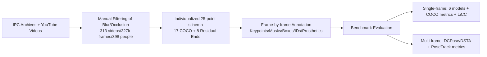

# InclusiveVidPose: Bridging the Pose Estimation Gap for Individuals with Limb Deficiencies in Videos

**Conference**: ICLR 2026  
**OpenReview**: [https://openreview.net/forum?id=SyQqXAdWUq](https://openreview.net/forum?id=SyQqXAdWUq)  
**Code/Data**: Project page InclusiveVidPose (Dataset CC BY-NC-SA 4.0)  
**Area**: Human Understanding / Pose Estimation / Datasets & Benchmarks  
**Keywords**: Human Pose Estimation, Limb Deficiencies, Residual Limb Keypoints, Video Datasets, Fairness, Confidence Calibration  

## TL;DR
This paper constructs the first large-scale video human pose estimation dataset specifically for **individuals with limb deficiencies** (amputation, congenital limb differences, prosthetic users), named InclusiveVidPose. Building on the COCO 17-point schema, it adds 8 new residual limb keypoints and proposes the LiCC metric to quantify a model's ability to distinguish between "actual residual limbs/missing limbs" and "complete limbs," revealing systematic failures of existing SOTA models for this population.

## Background & Motivation
- **Background**: Mainstream Human Pose Estimation (HPE) datasets (MS COCO, MPII, PoseTrack, etc.) and methods assume that the human body possesses complete limbs and a fixed skeletal structure. Approximately 445 million people globally have traumatic amputations, and about 31.64 million children (0–14 years old) have congenital limb differences, yet they are almost entirely absent from HPE research.
- **Limitations of Prior Work**: Under the fixed skeleton assumption, models force high-confidence predictions for **non-existent joints**. Figure 2 demonstrates typical failures of ViTPose trained on COCO—misidentifying prosthetics as natural ankles, attaching missing wrist keypoints to the torso, or placing a knee at the geometric midpoint between the hip and ankle due to asymmetric thigh length, which is anatomically impossible.
- **Key Challenge**: The keypoint schema for HPE is **fixed and assumes anatomical integrity**, whereas the anatomy of individuals with limb deficiencies is highly **individualized and variable** (varying residual limb lengths/positions/appearances and prosthetic geometries). A single fixed skeleton cannot represent "which joints are missing" or "where the residual limb end is." In a single image, an occluded limb and a truly missing limb look identical, making the annotation inherently ambiguous.
- **Goal**: To fill this void by constructing a video pose dataset and benchmark specifically for individuals with limb deficiencies, and to provide an evaluation metric that measures whether a model falsely predicts impossible joints.
- **Core Idea**: **Disambiguating via video instead of single images** + **Personalized extended keypoint schema** + **New confidence consistency metric**. The temporal continuity and viewpoint changes in video are utilized to distinguish "occluded" from "truly missing"; 8 residual limb keypoints are added to the COCO 17-point schema (labeling only anatomical residual ends, explicitly excluding prosthetics); and the **Limb-specific Confidence Consistency (LiCC)** is proposed to measure whether prediction confidence adheres to anatomical mutual exclusivity rules.

## Method

### Overall Architecture
The paper does not propose a new model but rather constructs a dataset, evaluation protocol, and new metric. The overall pipeline involves: collecting videos from IPC archives and YouTube → manually filtering to remove motion blur/heavy occlusion segments → customizing a 25-point schema (17 standard + 8 residual ends) for each individual → frame-by-frame annotation of keypoints/segmentation masks/bounding boxes/tracking IDs/prosthetic status → benchmarking 6+2 representative models under single-frame and multi-frame protocols, and using LiCC to expose confidence mismatch issues.

### Key Designs

**1. Extended Keypoint Schema for Residual Limbs: Aligning individual differences with anatomical anchors rather than device geometry.** The fundamental flaw of existing fixed skeletons is the lack of a "residual limb end" concept, forcing models to locate non-existent joints. This paper adds 8 residual limb keypoints (one each for left/right upper/lower elbow and left/right upper/lower knee, indices 17–24) to the COCO 17-point set, forming a 25-point protocol. Crucially, these points label only the **anatomical endpoints of the physical residual limb**, explicitly excluding prosthetics and assistive devices—the prosthetic shape and environmental contact are instead expressed via pixel-level segmentation masks and per-limb prosthetic status labels. This provides models with targets that have **clear semantics to distinguish complete vs. residual structures** without being misled by prosthetic geometry. Since deficiencies are unique, two trained annotators and one internationally certified Paralympic classifier determined an individualized schema for all 398 individuals, using a 25-dimensional presence mask to indicate which keypoints apply.

**2. Video Temporal Disambiguation: Separating "occlusion" from "absence".** This is the core motivation for choosing video over curated images. In a single image, a limb obscured by clothing or pose is indistinguishable from one that is truly missing, making residual limb annotation inherently ambiguous. Video sequences provide temporal continuity and perspective changes; annotators can determine if a limb is "just blocked" or "truly non-existent" by observing motion and viewpoint shifts, allowing for precise and consistent residual end labeling across frames. The process utilized X-AnyLabeling + SAM2 promptable segmentation to generate initial masks (SAM2's zero-shot generalization to unseen residual shapes reduced mask drawing time by 50%+), with a double-annotation cross-check enforced at an 80% accuracy threshold.

**3. LiCC Metric: Quantifying anatomical mutual exclusivity consistency.** Existing OKS-like metrics only assess the localization accuracy of visible points and do not evaluate whether a model "assigns high confidence to impossible joints." This paper defines a mutual exclusivity set $M(i)$ for keypoint $i$—for instance, if a residual wrist is visible, both the residual elbow and a normal wrist cannot coexist. Given $s_i$ as the predicted confidence for keypoint $i$, LiCC is defined as the proportion of keypoints whose confidence is strictly higher than the maximum confidence of all its mutually exclusive partners:

$$\text{LiCC} = \frac{1}{|V|} \sum_{i \in V} \mathbb{1}\!\left( s_i > \max_{j \in M(i)} s_j \right)$$

where $V$ is the set of ground truth keypoints with visibility $v \ge 1$, and $\mathbb{1}(\cdot)$ is the indicator function. A higher LiCC indicates that the confidence assigned to visible keypoints successfully suppresses anatomically impossible alternatives, meaning the model's confidence calibration is more "anatomically aware." This metric transforms common failure modes on individuals with limb deficiencies into a quantifiable and optimizable target.

## Key Experimental Results

The dataset is split 7:1:2 by video, ensuring that the same individual does not span across splits (preventing data leakage), sampling one frame every 60 frames. All models are initialized from official COCO pre-trained weights. Evaluation is performed on both COCO and InclusiveVidPose, emphasizing that "a good pose estimator should serve everyone."

### Main Results (Single-frame, partial InclusiveVidPose→InclusiveVidPose results)

| Method | Backbone | AP | AR | **LiCC** |
|------|----------|----|----|------|
| YOLOX-Pose-S | YoloxPose-S | 65.4 | 77.5 | **72.7** |
| DEKR | HRNet-w32 | 77.7 | 83.2 | 55.2 |
| ViPNAS | MobileNetV3 | 78.6 | 80.3 | 53.8 |
| Swin | Swin-L/384 | 80.7 | 82.0 | 72.1 |
| RTMPose-M | — | 82.2 | 83.3 | 69.5 |
| ViTPose | ViT-H | **86.3** | **87.6** | 73.6 |

Key Contrast: **AP is high (ViT-H reaches 86.3) but LiCC generally ranges between 60–74%**—even when large models are accurate at locating visible points, they frequently assign higher confidence to anatomically impossible points. While DEKR and ViPNAS have decent COCO AP, their LiCC is only 53–55%, failing to distinguish complete joints from residual ends; conversely, YOLOX-Pose, which uses confidence learning, achieves a higher LiCC.

### Multi-frame Experiment (PoseTrack-style AP, residual limb groupings)

| Method | Shoulder | Wrist | Knee | ArmUp | ArmLow | LegUp | LegLow | Mean |
|------|----------|-------|------|-------|--------|-------|--------|------|
| DCPose | 72.0 | 79.3 | 72.4 | 1.6 | 0.2 | 12.2 | 16.0 | 43.2 |
| DSTA | 72.2 | 81.9 | 71.9 | 0.6 | 0.0 | 14.3 | 17.3 | 43.7 |

Standard joint AP values are all 70+, but **the four residual limb groups are almost entirely failed**: AP for upper limb residual ends (ArmUp/ArmLow) is near 0, and lower limb residual ends are only in the teens. The minor gains from temporal aggregation (43.2→43.7) fail to bridge the massive gap in residual regions.

### Key Findings
- Existing SOTA models systematically fail on residual limb ends; high scores on standard joints mask fundamental incompetence regarding individuals with limb deficiencies.
- The "high AP, low LiCC" phenomenon reveals that localization accuracy $\neq$ correct confidence calibration; model judgments on missing or prosthetic limbs are unreliable.
- COCO→InclusiveVidPose vs. COCO→COCO comparisons show real distribution shift; adding COCO to training helps large models but can harm smaller models (YOLOX-Pose-T, RTMPose-T) on the limb deficiency population.

## Highlights & Insights
- **Filling a Societal Gap**: The first video HPE dataset for individuals with limb deficiencies, covering nearly 400 people, 327k frames, and multiple amputation/congenital/prosthetic types. The distribution of gender (51%/49%) and prosthetic use (48%/52%) is balanced, directly supporting downstream applications like rehabilitation monitoring and health assessment.
- **Insight on "Video for Disambiguation"**: Converting the "occlusion vs. absence" ambiguity unsolvable in single images into a decidable problem under temporal observation is a key dataset design insight.
- **LiCC Hits the Mark**: Traditional metrics cannot capture the failure mode of "high confidence on non-existent joints." LiCC quantifies this via anatomical mutual exclusivity rules, providing a clear optimization target for future methods.
- **Expert-in-the-loop Annotation**: Guided by an internationally certified Paralympic classifier for individualized 25-point schemas, and utilizing SAM2 to accelerate masking with 80% double-blind cross-checks, ensuring high-quality annotations.

## Limitations & Future Work
- **Lack of New Methodology**: The paper focuses on "exposing the problem" and does not provide a new model that significantly improves residual end prediction or LiCC; the challenge of residual AP being near 0 remains for subsequent work.
- **Data Source Constraints**: Reliance on IPC archives and YouTube biases scenes toward sports/rehabilitation; everyday diversity and rare deficiency types may be underrepresented. YouTube videos are only linked, not redistributed, creating long-term reproducibility risks.
- **Evaluation is Primarily Single-frame**: The multi-frame benchmark only tests two models (DCPose/DSTA); how temporal information can truly assist residual end localization remains an open question.
- **LiCC Dependency on Mutual Exclusivity Definitions**: Rules must be manually specified; the completeness of these rules when migrating to more complex anatomical variations or multi-prosthetic scenarios needs verification.

## Related Work & Insights
- **General HPE Datasets**: MS COCO, MPII, CrowdPose, OCHuman, and PoseTrack assume anatomical integrity; this work is the first to include "limb deficiency" as a first-class citizen.
- **HPE Models**: ViTPose, AlphaPose, OpenPose, DWPose (accuracy-oriented) and RTMPose, YOLOPose, DEKR (efficiency-oriented), SAPIENs (synthetic data) form the baseline subjects.
- **Pose Estimation for Underrepresented Groups**: WheelPose (synthetic wheelchairs), WheelPoser (IMU), and ProGait (2025, transfemoral gait only) are the most relevant predecessors; this work covers a broader range of deficiencies, includes full-body + residual personalized schemas, and adds frame-level prosthetic status/segmentation/boxes/tracking.
- **Insight**: For any visual task involving "long-tail/marginalized populations," rather than stacking models, one should first examine the "standard human/standard category" assumptions implicit in data and evaluation protocols. Fixed schemas and metrics focused solely on localization are themselves sources of fairness gaps. The LiCC approach of "using domain mutual exclusivity constraints for confidence consistency checks" can be transferred to other prediction tasks with structural mutual exclusivity.

## Rating
- **Novelty**: ⭐⭐⭐⭐⭐ First video pose dataset for limb deficiencies + residual end keypoint schema + LiCC metric; the problem definition and approach are highly novel.
- **Experimental Thoroughness**: ⭐⭐⭐⭐ 6 models in single-frame settings + 2 models for multi-frame, covering COCO/InclusiveVidPose cross-evaluation. However, lacks comparative experiments for improved methods.
- **Writing Quality**: ⭐⭐⭐⭐ Clear motivation, powerful visuals (failure cases, schemas, statistical distributions), and rigorous discussion of distribution shift.
- **Value**: ⭐⭐⭐⭐⭐ High societal significance and research value, opening a new direction and quantifiable target for fair and inclusive pose estimation research.

<!-- RELATED:START -->

## Related Papers

- [\[ECCV 2024\] Bridging the Gap Between Human Motion and Action Semantics via Kinematic Phrases](../../ECCV2024/human_understanding/bridging_the_gap_between_human_motion_and_action_semantics_via_kinematic_phrases.md)
- [\[ICLR 2026\] Inverse Virtual Try-On: Generating Multi-Category Product-Style Images from Clothed Individuals](inverse_virtual_try-on_generating_multi-category_product-style_images_from_cloth.md)
- [\[CVPR 2025\] Analyzing the Synthetic-to-Real Domain Gap in 3D Hand Pose Estimation](../../CVPR2025/human_understanding/analyzing_the_synthetic-to-real_domain_gap_in_3d_hand_pose_estimation.md)
- [\[ICLR 2026\] Pose Prior Learner: Unsupervised Categorical Prior Learning for Pose Estimation](pose_prior_learner_unsupervised_categorical_prior_learning_for_pose_estimation.md)
- [\[ICLR 2026\] BAH Dataset for Ambivalence/Hesitancy Recognition in Videos for Digital Behaviour Analysis](bah_dataset_for_ambivalencehesitancy_recognition_in_videos_for_digital_behaviour.md)

<!-- RELATED:END -->
