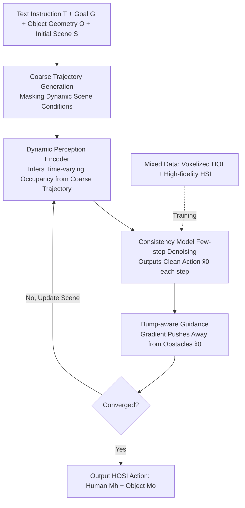

# InfBaGel: Human-Object-Scene Interaction Generation with Dynamic Perception and Iterative Refinement

**Conference**: ICLR 2026  
**OpenReview**: [https://openreview.net/forum?id=TeyHNq4WlI](https://openreview.net/forum?id=TeyHNq4WlI)  
**Code**: [yudezou.github.io/InfBaGel-page](https://yudezou.github.io/InfBaGel-page)  
**Area**: Human Understanding / Human-Object Interaction Generation  
**Keywords**: HOSI Generation, Consistency Models, Dynamic Perception, Collision Avoidance, Mixed-data Training, SMPL-X  

## TL;DR
InfBaGel aligns Human-Object-Scene Interaction (HOSI) motion generation with the few-step denoising process of a consistency model. By using **dynamic perception** to iteratively update scene occupancy, **bump-aware guidance** to suppress interpenetration, and **mixed-data training** to bypass the scarcity of HOSI labels, the framework achieves real-time generation of long-range interactions—such as carrying large objects while avoiding obstacles—without requiring HOSI-specific annotations.

## Background & Motivation

**Background**: Human motion generation has seen breakthroughs in Human-Object Interaction (HOI) and Human-Scene Interaction (HSI)—the former enables whole-body grasping and carrying of large objects, while the latter allows walking and sitting in static scenes. However, daily life involves coupled interactions: a person **carries a chair through a cluttered room, avoids obstacles, places the chair, and then sits on it**. This defines Human-Object-Scene Interaction (HOSI).

**Limitations of Prior Work**: HOSI is more challenging than HOI/HSI for two reasons. The first is **dynamic object-scene variation**: traversable space changes as humans and objects move. Mainstream solutions (e.g., TRUMANS, LINGO) use one-time static scene encoding and fail to update scene states during generation. Multi-stage methods decouple movement and interaction, breaking temporal consistency, while planner-based methods are computationally expensive and limited by planner quality. The second is **data scarcity**: the combinatorial explosion of object types, scene configurations, and instructions makes acquiring high-quality HOSI data with scene annotations extremely difficult, hindering generalization.

**Key Challenge**: Available datasets either contain real scene geometry but lack object diversity (HSI data) or offer rich object interactions without scene annotations (HOI data). There is no HOSI dataset that combines diverse scenes, diverse manipulable objects, and text instructions.

**Goal**: To generate physically plausible, scene-aware, and real-time long-range HOSI motions without relying on full HOSI annotations.

**Core Idea**: **(1) Aligning interaction generation with few-step iterative denoising in consistency models**—where each step outputs a clean motion to update the time-varying scene state for refinement, achieving "generation while perceiving." **(2) Mixed-data training**—voxelizing HOI data to synthesize pseudo-scenes and training jointly with high-fidelity HSI data to combine macro-scene knowledge with micro-object manipulation skills.

## Method

### Overall Architecture

InfBaGel is an autoregressive framework that generates sequences coupling human motion $M_h$ (SMPL-X root translation + 22 joints 6D rotation) and object motion $M_o$ (centroid translation + relative rotation) from text instructions $T$ and goal positions $G$. It adopts a coarse-to-fine strategy: an initial coarse trajectory is generated in the starting scene to derive **frame-wise time-varying scene occupancy**, which then serves as a condition for iterative refinement via bump-aware guidance. The system trains a scene-conditioned diffusion model (supporting both with/without dynamic scene conditions) and distills it into a consistency model, enabling the real-time loop of "few-step clean motion generation → precise scene update → refinement."

### Key Designs

**1. Dynamic Perception Encoding: Iterative Refreshing of Scene Conditions.** Since traversable space in HOSI changes with human/object movement, static encoding is insufficient. InfBaGel uses five voxel occupancy grids to represent the local scene within each generation window: two **static** grids centered on the start and goal regions, and three **dynamic** grids centered on human pelvis positions sampled uniformly across the time window. Each grid is a $\{0,1,2\}^{N\times N\times N}$ 3D array (0: traversable, 1: occupied, 2: object-occupied), encoded into 512D embeddings via a ViT. Dynamic grids are masked during coarse trajectory generation and gradually filled during refinement to form a "motion $\to$ scene change $\to$ motion correction" loop.

**2. Diffusion Distillation to Consistency Models: Reliable Perception Anchors.** Standard diffusion models require many steps to produce clean samples, making them inefficient and unsuitable for scene updates due to intermediate noise. Ours distills the diffusion model into a consistency model $f_\theta:(x_{\tau_n},\tau_n,C_{\tau_n},\omega)\mapsto \hat x_0$, where **each step directly maps any noisy sample back to the clean origin** $\hat x_0$. This provides a clear motion at every step to update the time-varying scene. Consistency Distillation (CD) is used: $\mathcal{L}_{CD}=\mathbb{E}\big[d\big(f_\theta(x_{\tau_n},\tau_n,C_{\tau_n},\omega),\, f_{\theta'}(\hat x^{\Psi,\omega}_{\tau_{n-1}},\tau_{n-1},C_{\tau_{n-1}},\omega)\big)\big]$, where $\theta'$ is the EMA of $\theta$, supervised by forward kinematics of human/object vertices $\mathcal{L}=\mathcal{L}_{CD}+\lambda_h\mathcal{L}_{joints}+\lambda_o\mathcal{L}_{obj}$.

**3. Bump-aware Guidance: Avoiding Interpenetration without High-res Meshes.** To ensure collision-free results, the system reconstructs human joints and object points from the clean motion $\hat x_0$ predicted by the consistency model. If points fall into occupied voxels in scene $S$, a gradient is calculated to push the sample away from obstacles: $\tilde x_0=\hat x_0+\gamma_{\tau_n}\nabla_{x_{\tau_n}}\mathcal{L}_{bump}(\hat x_0)$, where $\mathcal{L}_{bump}=\sum_{p\in\{\hat M_h,\hat M_o\}} D(V(p))$. $D(\cdot)$ returns the distance from a voxel center to the nearest free voxel. Precomputing distance maps for the regular voxel structure allows this guidance to be embedded into consistency sampling without expensive mesh-based nearest-point searches.

**4. Mixed-data Training: Upgrading HOI to HOSI via Voxelized Pseudo-scenes.** To circumvent HOSI data scarcity, Ours combines two data types into a unified $(S,O,T,G)$ interface. High-fidelity HSI data (e.g., LINGO) provides "macro" knowledge of navigation and static interaction. For large-scale HOI data (e.g., OMOMO), following Liu et al., we identify the spatial volume occupied by the human and object throughout the motion and **voxelize the surrounding free space** into a plausible context. This converts standard HOI data into HOSI triplets, providing "micro" knowledge of object manipulation. This joint training enables zero-shot generalization across 67 unseen scenes.

## Key Experimental Results

Evaluation uses a custom HOSI benchmark: 469 sequences with 7 object types from OMOMO in 67 unseen indoor scenes from TRUMANS. Metrics include Task Success (S%), Motion Quality (Foot Slide FS, Body Penetration $P_{body}$), Scene Awareness (Scene Penetration $P_{mean}/P_{max}/P_f\%$), and Speed (AITS, FPS).

### Main Results: HOSI Benchmark Comparison

| Method | S% ↑ | FS ↓ | $P_{body}$ ↓ | Human-Scene $P_f\%$ ↓ |
|------|------|------|------|------|
| TRUMANS | 1.92 | — | — | High (Severe) |
| LINGO | 53.09 | 5.72 | 0.57 | 38.07 |
| **InfBaGel** | **83.16** | **3.96** | **0.13** | **16.62** |
| InfBaGel (Mixed Data) | 81.45 | 5.05 | 0.15 | 12.45 |

Success rate jumps from 53.09% (LINGO) and 1.92% (TRUMANS) to **83.16%**, while achieving the lowest foot slide and significantly reduced scene penetration.

### Speed Comparison

| Metric | TRUMANS | LINGO | InfBaGel-DM (Diffusion) | **InfBaGel** |
|------|---------|-------|------|------|
| AITS ↓ | 5.84 | 6.46 | 57.17 | **6.75** |
| FPS ↑ | 31.57 | 28.86 | 3.38 | **28.75** |

The consistency model distillation brings performance back to the real-time range (~28.75 FPS), compared to the 3.38 FPS of the diffusion version.

### Ablation Study

| DP (Dynamic) | G (Guidance) | S% ↑ | $P_{body}$ ↓ | Obj-Scene $P_f\%$ ↓ | FPS |
|------|------|------|------|------|------|
| ✗ | ✗ | 71.22 | 0.19 | 146.10 | 23.01 |
| ✓ | ✗ | **86.35** | 0.14 | 138.12 | 23.01 |
| ✓ | C+B (Bump) | 83.16 | 0.13 | **109.61** | 22.72 |

### Key Findings
- **Dynamic Perception is the Success Engine**: DP increases success rates from 71.22% to 86.35%, proving that "generation while updating the scene" is vital for reachability.
- **Bump-aware Guidance Fixes Penetration**: Adding bump-aware (C+B) guidance reduces object-scene penetration $P_f\%$ from ~140 to 109.61 with negligible impact on FPS.
- **Consistency Distillation preserves quality**: The success rate remains high (83.16% vs 84.22% for DM) while the speed is improved by orders of magnitude.
- **Strong Zero-shot Generalization**: Mixed-data training allows the model to maintain high success and low penetration in 67 entirely unseen scenes.

## Highlights & Insights
- **Embedding perception into the denoising loop** is the core innovation: Consistency models provide a reliable "current world state" snapshot at every step, making dynamic perception an internal loop of generation rather than post-hoc planning.
- **Pragmatic Data Synthesis**: Instead of manual HOSI collection, the strategy of "voxelizing HOI + high-fidelity HSI" synthesizes capability from cheaper data sources.
- **Voxel + Precomputed Distance Maps** provide a balance between physical plausibility and computational efficiency, avoiding expensive online nearest-point searches on high-res meshes.

## Limitations & Future Work
- Voxel resolution is limited by memory, affecting collision accuracy for fine geometries (e.g., thin walls).
- Synthetic HOI pseudo-scenes only fill free space around trajectories, lacking the semantic complexity of real cluttered environments.
- As a kinematic generator, it requires low-level physical controllers for robot or simulation deployment.
- Lacks autonomous task planning (e.g., multi-step decomposition); goals are currently user-provided.

## Related Work & Insights
- **HOI Generation**: Prior works often rely on predetermined object trajectories (CHOIS); Ours uses instruction + goal driving to free the model from trajectory dependence.
- **HSI Generation**: Previous methods decouple movement from interaction (Hassan) or rely on expensive external planners (Zhao, Yi); Ours uses a unified coarse-to-fine framework with dynamic perception.
- **Dynamic Interaction**: RL methods (Hassan 2023) lack diversity, while kinematic methods (TRUMANS/LINGO) use static scenes or simplified constraints. InfBaGel's mixed-data training directly addresses these gaps.
- **Insight**: Reinterpreting the "denoising iteration" of generative models as a "perception-action" closed loop may serve as a general paradigm for embodied tasks where environments change with agent behavior.

## Rating
- **Novelty** ⭐⭐⭐⭐: Original combination of consistency model denoising, dynamic perception, and HOI-to-HOSI synthesis.
- **Experimental Thoroughness** ⭐⭐⭐⭐: Extensive evaluation across 67 unseen scenes with comprehensive ablation.
- **Writing Quality** ⭐⭐⭐⭐: Clear progression from challenges to technical solutions.
- **Value** ⭐⭐⭐⭐: High potential for Embodied AI and character animation by enabling HOSI without specialized datasets.

<!-- RELATED:START -->

## Related Papers

- [\[CVPR 2026\] HSI-GPT2: A Dual-Granularity Large Motion Reasoning Model with Diffusion Refinement for Human-Scene Interaction](../../CVPR2026/human_understanding/hsi-gpt2_a_dual-granularity_large_motion_reasoning_model_with_diffusion_refineme.md)
- [\[ICLR 2026\] Unleashing Guidance Without Classifiers for Human-Object Interaction Animation](unleashing_guidance_without_classifiers_for_human-object_interaction_animation.md)
- [\[ICLR 2026\] Disentangled Hierarchical VAE for 3D Human-Human Interaction Generation](disentangled_hierarchical_vae_for_3d_human-human_interaction_generation.md)
- [\[ICLR 2026\] Human-Object Interaction via Automatically Designed VLM-Guided Motion Policy](human-object_interaction_via_automatically_designed_vlm-guided_motion_policy.md)
- [\[CVPR 2026\] InterPhys: Physics-aware Human Motion Synthesis in a Dynamic Scene](../../CVPR2026/human_understanding/interphys_physics-aware_human_motion_synthesis_in_a_dynamic_scene.md)

<!-- RELATED:END -->
