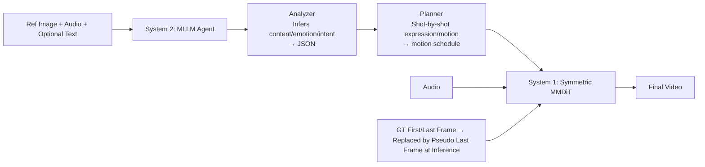

# Instilling an Active Mind in Avatars via Cognitive Simulation

**Conference**: ICLR 2026  
**OpenReview**: [https://openreview.net/forum?id=80JylHgQn1](https://openreview.net/forum?id=80JylHgQn1)  
**Code**: Project Page (Link provided in the paper, repository to be confirmed)  
**Area**: Digital Human / Audio-Driven Video Generation / Multimodal Diffusion  
**Keywords**: Video Avatar, Audio-Driven Animation, MLLM Agent, System 1/System 2, MMDiT, Pseudo Last Frame  

## TL;DR
This paper attributes the "monotonous lip-syncing and movements" of digital humans to the exclusive simulation of human "System 1 (Fast Thinking)." It proposes using an MLLM agent as "System 2 (Slow Thinking)" to generate high-level semantic plans. Furthermore, a symmetric MMDiT with a Pseudo Last Frame is designed to integrate text, audio, and image modalities without conflict, enabling avatars to achieve accurate lip-syncing alongside context-aware and emotional performances.

## Background & Motivation
**Background**: Audio-driven video avatars have evolved from early lip-sync and portrait animation to half-body and full-body generation. End-to-end methods based on Diffusion Transformer (DiT) align character movements with audio rhythms, achieving high lip-sync precision.

**Limitations of Prior Work**: These models essentially learn a low-level reactive mapping of audio $\rightarrow$ motion. Consequently, while the mouth moves accurately, gestures remain repetitive, monotonous, and lack context—they produce "motion" without understanding "what motion should be performed." They fail to capture the character's true personality, emotion, and intent.

**Key Challenge**: Drawing from Kahneman’s dual-process theory, the authors argue that existing models remain at the intuitive "System 1," excelling at reactive mappings like audio-to-lip but failing at goal-oriented, context-dependent reasoning typical of "System 2." To make avatars "alive," both systems must be simulated simultaneously. However, injecting MLLM-generated textual guidance is difficult: text is a new modality that often conflicts with audio (tempo) and reference images (identity)—audio might override semantic actions, while reference conditions might stiffen movement. The **Key Challenge** is introducing high-level reasoning without causing mutual interference between modalities.

**Goal**: To generate character animations that are both physically plausible and semantically expressive while maintaining lip-sync accuracy.

**Core Idea**: **Dual-System Simulation (System 1 + System 2)**—An MLLM agent explicitly reasons out a high-level "behavioral schedule" as deliberate guidance (System 2). A specifically designed MMDiT (System 1) robustly fuses this guidance with reactive signals like audio. A Pseudo Last Frame is utilized to resolve the motion rigidity caused by reference images.

## Method

### Overall Architecture
The model uses a DiT pretrained on general video tasks as its backbone, operating in the latent space of a 3D VAE and trained via flow matching with autoregressive concatenation for long videos. Two cognitive layers are added: **System 2** uses an MLLM agent for multi-step reasoning on reference images, audio, and optional text prompts to output a structured semantic "schedule." **System 1** is a symmetric MMDiT with a dedicated audio branch that fuses the textual schedule and reactive audio signals into the final video. Modality conflicts are mitigated by the Pseudo Last Frame and MM-Branch Warm-up.

### Key Designs

**1. Dual Agent Reasoning: Thinking before Acting.** System 2 core is a two-stage MLLM pipeline. The **Analyzer** receives the reference image (with caption), audio, and user prompts. Guided by "step-by-step probing" prompts, it infers the content, emotional state, and intent, consolidating these into a structured JSON. The **Planner** then formulates a detailed action plan organized into shots, where each shot defines expressions and movements. This pipeline ensures persona consistency. The framework is extensible: the Planner can incorporate reflective re-planning to correct semantic drift in long videos.

**2. Pseudo Last Frame: Using a "Lure" to Maintain Identity without Locking Motion.** The authors re-examine the traditional use of reference images. Reference images typically serve two roles: providing initial frame prefixes and maintaining identity consistency. While the former is necessary, the latter (locking identity via a static image) is harmful. Previous methods conditioned on reference images sampled from the training video taught the model a false correlation: the reference image must appear unchanged in the sequence, restricting dynamics. The solution is to **discard reference images during training**, conditioning instead on the video's natural GT first and last frames with a 0.1 dropout. At inference, the user's reference image is placed at the "last frame" position as a Pseudo Last Frame. Crucially, its RoPE position encoding is shifted to a fixed temporal distance further than the final generated frame. This acts like a "carrot on a stick," guiding the model toward the identity without forcing a static copy, thus eliminating training artifacts and balancing dynamics with identity stability.

**3. Symmetric Fusion + Modal Warm-up: Joint Attention without Dominance.** Built on the native MMDiT backbone, the authors add a **dedicated audio branch** symmetric to the video and text branches. Instead of cross-attention, tokens from all three modalities are concatenated within each transformer block for a single shared Multi-Head Self-Attention. This achieves deep semantic alignment through joint modeling. To prevent the model from over-relying on dense audio signals (which might suppress textual guidance), a two-stage **MM-Branch Warm-up** is used. Phase one involves joint training to force the audio branch to specialize in lip-sync and speaking habits. Phase two initializes branches with their respective specialized or original weights before full fine-tuning. This ensures System 1 can faithfully execute System 2’s deliberate plans.

## Key Experimental Results

Training involved three stages: audio branch warm-up $\rightarrow$ 15,000-hour video training $\rightarrow$ 100-hour high-quality subset fine-tuning. Evaluation used two self-built challenge sets (Single-subject 150 cases, Multi-subject 57 cases), CelebV-HQ, and CyberHost. Metrics included FID/IQA/FVD/Sync-C/HKC/HKV and a 40-person subjective study.

### Main Results

Comparison on CelebV-HQ (Portrait) and CyberHost (Full-body):

| Dataset | Method | IQA ↑ | Sync-C ↑ | FID ↓ | FVD ↓ |
|---|---|---|---|---|---|
| CelebV-HQ | OmniHuman-1 | 3.875 | **5.199** | 31.435 | 46.393 |
| CelebV-HQ | **Ours** | 3.817 | 5.053 | **31.320** | **45.771** |
| CyberHost | OmniHuman-1 | 4.142 | **7.443** | 31.641 | 27.031 |
| CyberHost | **Ours** | **4.144** | 7.243 | **31.160** | 27.642 |

Multi-subject Animation Comparison:

| Method | DA↑ | LSI↓ | MU↓ | GSB↑ | Sync-D↓ | HKV↑ |
|---|---|---|---|---|---|---|
| InterActHuman | - | - | - | - | 8.163 | 103.91 |
| Ours w/o Reasoning | 0.88 | 0.13 | 0.63 | -0.26 | 7.541 | 138.43 |
| **Ours (Full)** | **0.94** | **0.04** | **0.12** | **+0.26** | **6.904** | **158.36** |

Objective metrics are competitive with SOTA (OmniHuman-1), but the model excels in identity/quality metrics and dynamism.

### Ablation Study

Ablation of Agentic Reasoning and Conditioning Modules:

| Method | Sync-C ↑ | HKV ↑ |
|---|---|---|
| Ours w/o Reasoning (System 1 Only) | 3.507 | 122.376 |
| Ours w/o Multi-Step Reasoning | 3.853 | 157.638 |
| Ours w/ Cross-Attention | 3.263 | 116.317 |
| Ours w/o MM-Warmup | 3.993 | 164.080 |
| Ours w/ Ref. Image | 3.982 | 160.889 |
| **Ours (Full Model)** | 4.087 | **168.912** |

## Key Findings
- **The value of reasoning lies in dynamics**: Removing reasoning leaves low-level metrics (Sync-C/IQA) almost unchanged, but HKV (Hand Keypoint Variance) decreases significantly. This proves System 2 enhances expressiveness and contextual relevance rather than just lip-sync accuracy.
- **Symmetric joint attention significantly outperforms Cross-Attention**, validating the necessity of deep joint modeling for modality fusion.
- **Subjective preference is decisive**: The full model shifts GSB from negative to positive, highlighting improvements in "performance quality" that objective metrics fail to capture.

## Highlights & Insights
- **Cognitive Science Perspective**: Reconceptualizing video avatars via the System 1/System 2 dual-process theory provides a clear diagnostic framework for "monotonous movement."
- **Ingenious Pseudo Last Frame**: Resolves the false correlation of static reference images, decoupling identity maintenance from motion freedom via a "lure" mechanism and shifted RoPE.
- **Metric Insight**: Points out that low-level metrics are saturated and insensitive to high-level semantics, urging the use of HKV and user studies for "performance quality."

## Limitations & Future Work
- **Heavily dependent on closed-source MLLMs and massive data**: High reproduction costs.
- **Objective metrics do not significantly exceed SOTA**: Advantages are primarily seen in dynamism and subjective preference.
- **Decoupling of reasoning and synthesis**: Separate planning and diffusion stages may still lead to semantic drift in very long videos.

## Related Work & Insights
- **Video Avatar / Audio-Driven Animation**: Distinguished by the inclusion of an explicit "planning-reasoning" stage rather than pure reactive mapping.
- **MMDiT / DiT Video Generation**: Applies a symmetric audio branch and warm-up training to the MMDiT architecture.
- **LLM as a Planner for Generation**: Extends the paradigm of using LLMs to generate structured intermediate representations to steer fine-grained avatar behavior.

## Rating
- **Novelty**: ⭐⭐⭐⭐⭐ High. Reconstructing the problem through cognitive theory and the Pseudo Last Frame are innovative.
- **Experimental Thoroughness**: ⭐⭐⭐⭐ Solid. Detailed ablation and subjective studies, though dependent on self-built benchmarks.
- **Writing Quality**: ⭐⭐⭐⭐⭐ Clear narrative and insightful problem diagnosis.
- **Value**: ⭐⭐⭐⭐ Provides a paradigm for "acting" rather than just "lip-syncing," useful for both industrial avatars and generative control.

<!-- RELATED:START -->

## Related Papers

- [\[CVPR 2026\] Beyond Scanpaths: Graph-Based Gaze Simulation in Dynamic Scenes](../../CVPR2026/human_understanding/beyond_scanpaths_graph-based_gaze_simulation_in_dynamic_scenes.md)
- [\[ICML 2026\] WaveVerse: Scalable RF Simulation in Generative 4D Worlds](../../ICML2026/human_understanding/scalable_rf_simulation_in_generative_4d_worlds.md)
- [\[CVPR 2026\] Push-and-Step: From RL-Based Balance Recovery to Physical Simulation of Dense Crowds](../../CVPR2026/human_understanding/push-and-step_from_rl-based_balance_recovery_to_physical_simulation_of_dense_cro.md)
- [\[CVPR 2025\] Quaffure: Real-Time Quasi-Static Neural Hair Simulation](../../CVPR2025/human_understanding/quaffure_real-time_quasi-static_neural_hair_simulation.md)
- [\[CVPR 2026\] AudioAvatar: Personalized Audio-driven Whole-body Talking Avatars](../../CVPR2026/human_understanding/audioavatar_personalized_audio-driven_whole-body_talking_avatars.md)

<!-- RELATED:END -->
