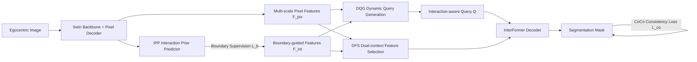

# Interaction-aware Representation Modeling With Co-Occurrence Consistency for Egocentric Hand-Object Parsing

**Conference**: ICLR 2026  
**OpenReview**: [https://openreview.net/forum?id=RYwQ0xQcAh](https://openreview.net/forum?id=RYwQ0xQcAh)  
**Code**: [https://github.com/yuggiehk/InterFormer](https://github.com/yuggiehk/InterFormer)  
**Area**: Egocentric Vision / Hand-Object Segmentation (EgoHOS)  
**Keywords**: egocentric vision, hand-object segmentation, interaction-aware query, transformer decoder, physical consistency  

## TL;DR
For pixel-level segmentation of hands and active objects in egocentric images, this paper proposes InterFormer. It utilizes interaction boundary priors to dynamically generate "interaction-aware queries," purifies decoding features, and incorporates a "conditional co-occurrence loss" to encode the physical common sense that "an active object should not appear if its interacting hand is not detected" into training. It achieves SOTA performance on EgoHOS and cross-domain mini-HOI4D.

## Background & Motivation
- **Background**: Egocentric (first-person view, FPV) vision is a fundamental capability for embodied AI, AR/VR, and assistive robotics. A core task is EgoHOS (Egocentric Hand-Object Segmentation)—segmenting left/right hands and "objects being operated by hands" (left-hand object / right-hand object / two-hand object) pixel-by-pixel. Transformer architectures (DETR, Mask2Former, Care-Ego, etc.) have become mainstream for this task due to their ability to balance long-range dependencies and parameter efficiency.
- **Limitations of Prior Work**: The authors point out three unresolved structural flaws. First, **rigid query initialization**—existing methods use either learnable parameters (static queries after training) or directly sample image features (introducing background noise), failing to explicitly encode "hand-object interaction relationships," leading to poor adaptability to diverse active objects. Second, **"semantic bias" in decoding features**—pixel-wise semantic features only answer "what object is this" but fail to address "is it being interacted with," causing irrelevant content to be integrated into the final embedding, reducing accuracy. Third, **interaction illusion**—the model makes predictions that violate physical causality, such as predicting a "two-hand object" when the right hand is not detected at all.
- **Key Challenge**: General semantic representations excel at "object recognition," but EgoHOS truly requires "identifying interaction relationships"; the misalignment of targets causes queries, features, and prediction logic to deviate from the essence of interaction.
- **Goal**: Shift the model from "object-category-centric" to "hand-object-interaction-centric" and impose physical common sense as hard constraints on predictions.
- **Key Insight**: **Use a lightweight auxiliary branch to predict "interaction boundaries" as a coarse localization prior, then propagate this prior through query generation, feature purification, and consistency loss**, end-to-end embedding interaction relationships into every stage of representation learning.

## Method

### Overall Architecture
On top of a Swin backbone + deformable DETR pixel decoder, InterFormer adds an Interaction Prior Predictor (IPP) bypass. Supervised by interaction boundary ground truth, it outputs "boundary-guided features." These features drive two core modules: the Dynamic Query Generator (DQG) uses them to generate interaction-aware queries, and the Dual-context Feature Selector (DFS) uses them to purify semantic features in each decoder layer. Finally, a Conditional Co-Occurrence (CoCo) loss is applied to constrain the physical consistency of the output.

### Key Designs
**1. Interaction Prior Predictor (IPP): Coarse localization of contact areas.** Most methods feed pixel features directly into the decoder, but determining which object is "active" requires looking at its relationship with hands rather than just semantics. IPP receives global features $F_g$ and employs a cascaded U-Net decoder with a convolutional head to predict an interaction boundary map $M_b$. The supervision signal is the boundary ground truth $G_b$ obtained by the intersection of dilated hand and object masks, trained with binary cross-entropy $L_b=L_{bce}(M_b,G_b)$. The resulting boundary-guided features $F_{int}$ provide spatial constraints for "hand-object contact zones," serving as a shared prior foundation for the subsequent modules.

**2. Dynamic Query Generator (DQG): Aligning queries with interaction regions instead of object categories.** The core involves two steps: "Selection" then "Fusion." The final pixel features $F^L_{pix}$ are divided into $n \times n$ non-overlapping sub-regions. The cosine similarity between these regions and the aligned boundary-guided features is calculated to obtain a dense similarity map $S=\frac{\langle F_{int},F^L_{pix}(i,j)\rangle}{\|F_{int}\|\cdot\|F^L_{pix}(i,j)\|}$. The top $N$ regions with the highest similarity are selected, and their feature vectors are concatenated into intermediate queries $Q_v\in\mathbb{R}^{N\times C}$—ensuring that selected regions are involved in contact rather than general semantics. Finally, $Q_v$ is element-wise added to a set of learnable parameters to obtain the final queries $Q$. This retains dynamic adaptation to active objects in the scene while maintaining stability via learnable parameters, solving the dilemma between static queries and noisy sampling.

**3. Dual-context Feature Selector (DFS): Purifying semantic features into interaction features in each decoder layer.** To tackle semantic bias, DFS takes both pixel features $F^l_{pix}$ and boundary-guided features $F^l_{int}$ at each decoding layer to perform "interaction-guided cross-attention." The query $\tilde Q$ is derived from boundary-guided features, while key/value $\tilde K, \tilde V$ are derived from pixel features (with learnable positional parameters $T$ for robustness): $F^l_{cos}=\text{softmax}(\tilde Q\tilde K^\top/\sqrt{dim})\tilde V$. Using the interaction prior as the "inquirer" to retrieve semantic features effectively filters semantic content using interaction signals and suppresses interaction-irrelevant noise. This is followed by an interaction-enhanced self-attention layer $F^l_{isa}=\phi_{sa}(\cdot)$ for long-range dependency modeling. The final refined features $F^l_{inf}=\hat F^l_{pix}+\phi_{norm}(F^l_{isa}+\phi_{norm}(\phi_{drop}(F^l_{cos})))$ are used as iteratively updated key/values for the decoder.

**4. Conditional Co-Occurrence (CoCo) loss: Differentiable constraints for physical common sense.** The authors treat interaction illusions as macro-logical errors, better measured by "mask pixel count (existence of the object)" rather than "average pixel-wise confidence." The rule for CoCo is: if the predicted mask pixel count for a hand is below a threshold $\tau$ (hand is considered absent), the prediction of the associated object is penalized. If the hand is present (count exceeds $\tau$), the penalty is disabled to allow normal learning. For left/right hand objects, this is formalized as $L^{left}_{co}=(1-\mathbb{I}_{\{N_{lh}>\tau\}})\cdot N_{lo}$ and $L^{right}_{co}=(1-\mathbb{I}_{\{N_{rh}>\tau\}})\cdot N_{ro}$. For two-hand objects, both hands must be present: $L^{two}_{co}=(1-\mathbb{I}_{\{N_{rh}>\tau\wedge N_{lh}>\tau\}})\cdot N_{to}$. The total loss is $L=\lambda_b L_b+\lambda_{co}L_{co}+\lambda_{cls}L_{cls}+\lambda_{dic}L_{dic}+\lambda_{ce}L_{ce}$, optimized end-to-end.

## Key Experimental Results

### Main Results (IoU ↑, selected Overall/mIoU)

| Dataset | Setting | Prev. SOTA | InterFormer | Gain |
|---|---|---|---|---|
| EgoHOS | In-domain | Care-Ego 71.49 | **73.22** | +1.73 (+7.76 for Two-hand Obj) |
| EgoHOS | Cross-domain | ANNEXE 65.36 | **72.82** | +7.46 |
| mini-HOI4D | OOD | ANNEXE 62.87 | **66.07** | +3.20 |

The most significant in-domain gain comes from the most difficult "two-hand object" category (51.13→64.17 IoU), validating the value of interaction modeling for complex contact relationships. Large leads in cross-domain and OOD tests indicate that interaction-aware representations generalize better than pure semantic ones.

### Ablation Study (EgoHOS In-domain, mIoU / mAcc)

| Config | IPP | DQG | DFS | CoCo | mIoU | mAcc |
|---|---|---|---|---|---|---|
| Baseline | – | – | – | – | 70.72 | 77.48 |
| +CoCo | – | – | – | ✓ | 70.95 | 79.02 |
| +IPP | ✓ | – | – | – | 71.23 | 79.97 |
| +IPP+DQG+DFS | ✓ | ✓ | ✓ | – | 72.35 | 80.13 |
| Full | ✓ | ✓ | ✓ | ✓ | **73.22** | **80.68** |

All four components bring incremental gains; IPP serves as the prerequisite prior base for DQG and DFS.

### Key Findings
- **The "Sweet Spot" for Threshold $\tau$**: CoCo loss performs best at $\tau=100$ (mIoU 73.22). A threshold too small (50) makes the model "hypersensitive," producing false hand detections, while a threshold too large (≥150) misses some visible hands, showing a clear unimodal trade-off.
- **Model Size-Accuracy Trade-off**: InterFormer achieves the highest mIoU within a moderate parameter range, outperforming much heavier MLLM-based methods (like ANNEXE), placing it on the "better and lighter" Pareto frontier.
- **Cross-domain Gains > In-domain Gains**: The in-domain gain is only +1.73 mIoU, but the cross-domain (+7.46) and OOD (+3.20) gains are substantial. This suggests that interaction-aware representations are most valuable in distribution-shift scenarios; pure semantic models crash when background or object categories change, whereas representations anchored in interaction relationships remain stable.

## Highlights & Insights
- **One Prior Through Three Stages**: The interaction boundary prior is not an isolated auxiliary task; it is reused in query generation (DQG), feature purification (DFS), and loss constraints (CoCo), reflecting a unified "interaction-centric" design philosophy.
- **Physical Common Sense as Loss, Not Post-processing**: The CoCo loss uses the simple proxy of pixel counting to measure "hand presence," making the "hand-first" causal constraint end-to-end differentiable rather than relying on rule-based post-processing. This approach is transferable to other structured prediction tasks requiring physical consistency.
- **DQG Reconciles Query Initialization Contradictions**: By "selecting interaction regions then fusing learnable parameters," DQG achieves both dynamic adaptability and training stability.

## Limitations & Future Work
- **Dependency on Interaction Boundary Annotations**: IPP requires boundary supervision derived from hand/object mask dilation and intersection, which involves higher migration costs for datasets without such annotations.
- **Coarse Approximation of "Hand Presence"**: Using pixel counts with a fixed threshold $\tau$ for CoCo may misjudge scenarios where the hand is heavily occluded or shows only a tiny area.
- **Single-frame focus**: The method targets static images and does not exploit the temporal continuity of egocentric video. Expanding to video-level temporal consistency for hand-object interaction parsing is a natural next step.
- **Complex Scenarios (Two-hand/Multi-object)**: Although two-hand objects saw the largest improvement, the absolute IoU (64%) remains significantly lower than hand segmentation (92%+), leaving room for improvement in complex contact relationships.

## Related Work & Insights
- **EgoHOS Lineage**: From Para/Seq (Zhang 2022) to Care-Ego (Su 2025a), InterFormer departs from purely semantic features by explicitly introducing interaction priors. It also outperforms MLLM-based ANNEXE in the accuracy-parameter trade-off.
- **Query Initialization**: Compared to Mask2Former's learnable queries and sampling-based queries, DQG provides a third way—"interaction-guided selection + learnable fusion"—which is instructive for other DETR-like tasks requiring content-adaptive queries.
- **Physical/Logical Consistency Constraints**: The "conditional co-occurrence" concept in CoCo loss aligns with works in scene graphs and HOI detection that emphasize causal/co-occurrence priors, inspiring the encoding of domain common sense into differentiable supervision.
- **Embodied AI/AR Implications**: Physical consistency in hand-object interaction is a foundation for downstream grasp planning and action prediction. By moving the "hand-first" constraint forward to the perception/segmentation stage, the paper suggests that injecting physical priors into perception rather than leaving error correction to downstream modules may lead to more robust system designs.

## Rating
- **Novelty**: ⭐⭐⭐⭐ — The unified design of using interaction boundary priors across queries, features, and losses is well-conceived. The use of pixel counts for physical consistency in CoCo loss is a novel perspective.
- **Experimental Thoroughness**: ⭐⭐⭐⭐ — Comprehensive benchmarks across in-domain, cross-domain, and OOD settings, along with component-wise ablation and hyperparameter analysis for $\tau$.
- **Writing Quality**: ⭐⭐⭐⭐ — The narrative connecting the three pain points to the three modules is clear. Formulas are well-defined, though some operators in DFS are slightly dense.
- **Value**: ⭐⭐⭐⭐ — EgoHOS is a fundamental capability for embodied AI/AR. The method is SOTA and open-source, and the insights regarding interaction priors and consistency losses are transferable to related structured prediction tasks.

<!-- RELATED:START -->

## Related Papers

- [\[ICCV 2025\] Dynamic Reconstruction of Hand-Object Interaction with Distributed Force-aware Contact Representation](../../ICCV2025/human_understanding/dynamic_reconstruction_of_hand-object_interaction_with_distributed_force-aware_c.md)
- [\[ICLR 2026\] UniHand: A Unified Model for Diverse Controlled 4D Hand Motion Modeling](unihand_a_unified_model_for_diverse_controlled_4d_hand_motion_modeling.md)
- [\[CVPR 2026\] Decoupled Generative Modeling for Human-Object Interaction Synthesis](../../CVPR2026/human_understanding/decoupled_generative_modeling_for_human-object_interaction_synthesis.md)
- [\[ICLR 2026\] Unleashing Guidance Without Classifiers for Human-Object Interaction Animation](unleashing_guidance_without_classifiers_for_human-object_interaction_animation.md)
- [\[ICLR 2026\] TOUCH: Text-guided Controllable Generation of Free-Form Hand-Object Interactions](touch_text-guided_controllable_generation_of_free-form_hand-object_interactions.md)

<!-- RELATED:END -->
