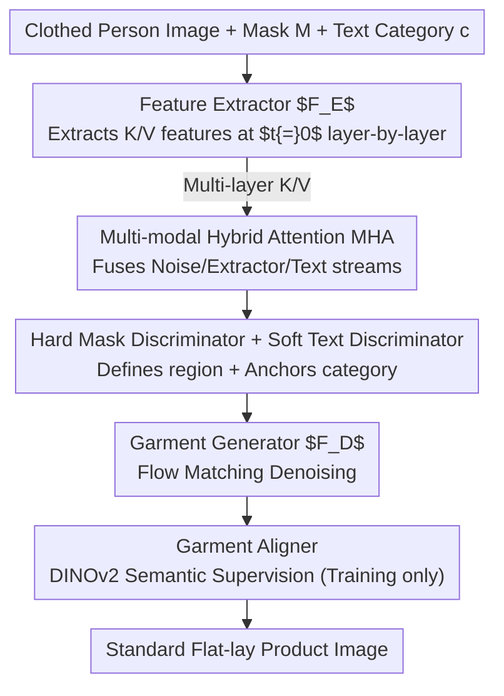

# Inverse Virtual Try-On: Generating Multi-Category Product-Style Images from Clothed Individuals

**Conference**: ICLR 2026  
**arXiv**: [2505.21062](https://arxiv.org/abs/2505.21062)

**Code**: [Project Page](https://temu-vtoff-page.github.io/)

**Area**: Human Understanding  
**Keywords**: Virtual Try-Off, garment extraction, Dual-DiT, multi-modal attention, garment alignment

## TL;DR

Ours proposes TEMU-VTOFF—a Dual-DiT architecture for the virtual try-off (VTOFF) task. It employs a collaborative division between a feature extractor and a garment generator, utilizing Multi-modal Hybrid Attention (MHA) to fuse image, text, and mask information to resolve visual ambiguity. Additionally, a DINOv2-driven garment aligner is designed to preserve high-frequency details. Ours achieves SOTA performance in multi-category scenarios on both VITON-HD and Dress Code datasets.

## Background & Motivation

**VTOFF Task Definition**: The goal of Virtual Try-Off (VTOFF) is to recover standardized flat-lay product images from photos of clothed individuals. In contrast to VTON (Virtual Try-On), VTOFF has a consistent output format (flat-lay display) but limited input information (only the clothed photo).

**Value**: Fashion e-commerce requires a large volume of standard catalog images for retrieval and recommendation, but manual photography costs are high. VTOFF can automatically convert clothed photos of customers or models into standard images, enabling scalability.

**Limitations of Prior Work (1)——Architecture Mismatch**: Methods like TryOffDiff and TryOffAnyone simply invert the VTON pipeline without designing dedicated architectures for the unique characteristics of the VTOFF task, leading to structural artifacts in the neckline, waist, and overall shape.

**Limitations of Prior Work (2)——Single-Modality Bottleneck**: Relying solely on visual cues from a single image leads to high ambiguity under occlusion or complex poses. CLIP pooled vectors are too coarse ($\mathbb{R}^{2048}$) to encode fine-grained garment features.

**Limitations of Prior Work (3)——Category Restrictions**: TryOffDiff and TryOffAnyone only support the upper-body category. While MGT supports multiple categories, it still suffers from texture and color distortion.

**Technical Trends**: DiT with Flow Matching has surpassed U-Net with DDPM in diffusion models. SD3 demonstrated the effectiveness of joint text-image attention (MMDiT) in DiT, providing a foundational architecture for multi-modal conditioning.

## Method

### Overall Architecture

TEMU-VTOFF decomposes virtual try-off into two collaborative DiTs with identical architectures: a feature extractor $F_E$ that reads the clothed person image and outputs intermediate features rich in garment structure layer-by-layer, and a garment generator $F_D$ that performs denoising using these features to generate standard flat-lay product images. The two are integrated via a Multi-modal Hybrid Attention (MHA) mechanism that merges three streams of information—image features, text categories, and mask regions—into a single attention space to resolve visual ambiguity under occlusion and complex poses. During training, a garment aligner is attached to provide DINOv2-driven semantic supervision to anchor high-frequency details.

### Key Designs

**1. Feature Extractor $F_E$: Replacing a Coarse Vector with a Full Feature Map**

Existing methods compress the clothed photo into a CLIP pooled vector $e^v_{pool} \in \mathbb{R}^{2048}$ fed into the generator. This coarse encoding loses fine details like textures, necklines, and stitching, which is the root cause of structural artifacts. $F_E$ uses a full DiT to extract features: globally, the CLIP pooled vector is injected via AdaLN for style modulation; locally, the noise latent $z_t$ (16 channels), binary mask $M$ (1 channel), and the VAE encoding of the masked person image $x_M=\mathcal{E}(x_{model}\odot M)$ (16 channels) are concatenated along the channel dimension as input $z'_t=[z_t, M, x_M]\in\mathbb{R}^{h\times w\times 33}$. The key detail is extracting key-value pairs $K^l_{extractor},V^l_{extractor}$ from each layer at $t=0$ (clean data, rather than at each denoising step). This yields an unfolded feature of dimension $S\times d$ instead of a single $\mathbb{R}^{2048}$ vector. The $L$ layers naturally cover multi-granularity information from coarse to fine; since $F_E$ shares the same architecture as $F_D$, the feature spaces are naturally aligned, resulting in minimal distortion during transfer.

**2. Multi-modal Hybrid Attention (MHA): Packing Text, Latents, and Extractor Features into One Attention Block**

Image features alone are insufficient—the garment structure at occluded areas is visually invisible and requires text categories to "complete" the semantics. MHA concatenates the three streams into Q/K/V: $Q=[Q_{z_t},Q_{text}]$, $K=[K_{z_t},K_{extractor},K_{text}]$, and $V=[V_{z_t},V_{extractor},V_{text}]$, where text embeddings consist of $e_{text}=[\text{CLIP}(c),\text{T5}(c)]\in\mathbb{R}^{77\times 4096}$. This concatenation enables three interactions simultaneously: $A_{text\leftrightarrow z_t}$ maintains pre-trained language-image alignment, $A_{z_t\leftrightarrow extractor}$ transfers fine-grained features from the clothed photo to the generated garment image, and $A_{text\leftrightarrow extractor}$ anchors text semantics to the structural features of the extractor. This last interaction provides the semantic guidance for "what the occluded sleeve should look like."

**3. Hard Mask Discriminator + Soft Text Discriminator: Achieving Multi-category Unification via Complementary Signals**

To allow a single model to handle both upper-body and lower-body garments, it must be explicitly told "which garment is the target and what category it belongs to." Here, the mask and text play complementary roles: the mask acts as a hard discriminator, precisely defining the pixel region occupied by the target garment (answering "which pixels"); the text acts as a soft discriminator, providing category semantics like "upper-body shirt" or "lower-body pants" (answering "what category"). Condition injection also follows two paths—CLIP pooled text features $e_{pool}\in\mathbb{R}^{2048}$ provide high-level style/appearance via AdaLN, while full text embeddings provide local semantics via MHA. Ablations show both are indispensable: removing both mask and text increases FID from 5.74 to 9.63; removing only the mask increases it to 6.58, and removing only the text increases it to 7.75.

**4. Garment Aligner: Anchoring High-frequency Details in Semantic Space rather than Pixel Space**

Diffusion loss is optimized in noise space and is inherently insensitive to high-frequency details, often resulting in blurred patterns or stitching. The garment aligner uses a lightweight CNN to downsample DiT layer 8 features into the DINOv2 representation space, using cosine similarity to supervise them toward the semantic features of the ground truth garment:

$$\mathcal{L}_{align} = -\mathbb{E}_{z_g, \epsilon_t, t}\left[\frac{1}{N}\sum_{i=1}^{N}\cos(\tilde{h}_i^{DiT}, h_i^{enc})\right]$$

This effectively adds an extra layer of supervision for high-frequency details at the semantic level, which is more robust than reconstruction in pixel space. The aligner is only attached during training and discarded during inference, incurring zero additional computational overhead.

### Loss & Training

Training is conducted in two stages: first, the feature extractor $F_E$ is trained independently using diffusion loss to learn how to extract useful garment structural features from clothed photos; then, the garment generator $F_D$ is trained, optimizing both the diffusion loss and the alignment loss simultaneously. The final objective is:

$$\mathcal{L}_{total} = \mathcal{L}_{DiT} + \lambda \cdot \mathcal{L}_{align}$$

where $\mathcal{L}_{align}$ is applied only during the training phase, and $\lambda$ balances denoising reconstruction and semantic alignment.

## Key Experimental Results

### Main Results: Dress Code Dataset

| Method | SSIM↑ | LPIPS↓ | DISTS↓ | FID↓ | KID↓ |
|------|-------|--------|--------|------|------|
| Any2AnyTryon | 77.56 | 35.17 | 25.17 | 12.32 | 3.65 |
| MGT | 77.77 | 35.37 | 27.28 | 13.47 | 5.28 |
| **Ours (TEMU-VTOFF)** | **75.95** | **31.46** | **18.66** | **5.74** | **0.65** |

Compared to the runner-up Any2AnyTryon, FID is reduced by 53.4% (12.32→5.74) and DISTS by 25.9%.

### Main Results: VITON-HD Dataset

| Method | SSIM↑ | LPIPS↓ | DISTS↓ | FID↓ | KID↓ |
|------|-------|--------|--------|------|------|
| TryOffDiff | 75.53 | 39.56 | 25.53 | 17.49 | 5.30 |
| TryOffAnyone | 75.90 | 35.26 | 23.47 | 12.74 | 2.85 |
| One Model for All | — | 22.50 | 19.20 | 9.12 | 1.49 |
| **Ours (TEMU-VTOFF)** | **77.21** | **28.44** | **18.04** | **8.71** | **1.11** |

### Ablation Study (Dress Code, selected results)

| Configuration | DISTS↓ | FID↓ |
|------|--------|------|
| w/o Feature Extractor $F_E$ | 23.56 | 9.11 |
| w/o Garment Aligner | 20.63 | 5.91 |
| w/o Text and Mask | 25.20 | 9.63 |
| w/o Text Modulation | 22.54 | 7.75 |
| w/o Fine Mask | 20.87 | 6.58 |
| **Full TEMU-VTOFF** | **18.66** | **5.74** |

Each component makes a clear contribution. Removing $F_E$ increases FID from 5.74 to 9.11 (+58.7%), proving the core value of the Dual-DiT design.

## Key Findings

- **Text↔extractor interaction in MHA** is crucial for resolving occlusion ambiguity—text provides semantic anchors for visually invisible structural features.
- **Joint effect of mask and text is significantly greater than individual use**: Removing both increases FID from 5.74→9.63; removing only the mask → 6.58; removing only the text → 7.75.
- **Cross-dataset generalization**: Trained on Dress Code and tested on VITON-HD, FID is 20.39 vs. MGT's 23.11; reverse transfer also shows a clear advantage (FID 18.63 vs. TryOffDiff's 41.91).
- **Downstream Gain**: Using synthetic garment images generated by TEMU-VTOFF to augment training data led to a decrease in CatVTON's FID across all categories, validating the practical utility of the generation quality.

## Highlights & Insights

- **Dedicated VTOFF Architecture Design**: Instead of simply inverting the VTON pipeline, a Dual-DiT with separate feature extraction and generation was designed to address the "restricted input information" characteristic of VTOFF.
- **Complementary Theory of Mask (Hard) and Text (Soft) Discriminators**: A clear analytical framework—masks determine "which pixels" while text determines "what category," with both being essential.
- **Clever Application of DINOv2 Alignment**: Used only during training with zero inference overhead. Aligning in semantic space rather than pixel space leads to more robust retention of high-frequency details.
- **Utility Validation**: Evaluates not just VTOFF itself, but also proves that synthetic data can improve the performance of downstream VTON tasks.
- **Superior Generalization**: The cross-dataset experimental design demonstrates genuine generalization capability rather than dataset overfitting.

## Limitations & Future Work

- SSIM metrics are not optimal (75.95 vs. Any2AnyTryon's 77.56)—there is still room for improvement in pixel alignment precision.
- Performance in the lower-body category is relatively lower (Dress Code lower-body samples are ~9k vs. upper-body ~15k vs. full-body dresses ~29k), indicating a data imbalance issue.
- Dependency on text descriptions as input conditions necessitates an additional captioning module for actual deployment.
- Mask extraction quality directly affects results, requiring a reliable segmentation front-end.
- Inference speed is limited by the double forward passes of the Dual-DiT (though $F_E$ is only run once).
- Validation was limited to fashion datasets; generalization to a broader range of item categories (accessories, shoes, bags) remains unknown.

## Related Work & Insights

### vs. TryOffDiff (Velioglu et al., 2024)
TryOffDiff is a pioneer in the VTOFF task, using a SigLIP-conditioned diffusion model to recover garment images. However, it only supports a single category (upper-body) and simply reuses VTON architectures, leading to structural artifacts. TEMU-VTOFF fundamentally redesigns the VTOFF pipeline through Dual-DiT+MHA, reducing FID from 17.49 to 8.71 on VITON-HD and achieving unified multi-category processing for the first time.

### vs. MGT (Velioglu et al., 2025)
MGT extends to multiple categories via category embeddings but is still limited by coarse-grained visual encoding. TEMU-VTOFF significantly leads in FID on the full Dress Code set (5.74 vs. 13.47) and shows a clear advantage in cross-dataset testing (20.39 vs. 23.11). The key difference lies in the introduction of dual-modal text+mask conditioning and a dedicated feature extractor in TEMU-VTOFF, rather than just adding category labels.

### vs. One Model for All (Liu et al., 2025)
One Model for All unifies VTON and VTOFF into a single framework, showing competitive LPIPS (22.50) and DISTS (19.20). However, TEMU-VTOFF, as a dedicated VTOFF architecture, still performs better in FID (8.71 vs. 9.12) and KID (1.11 vs. 1.49), indicating that task-specific design remains valuable.

## Rating

- **Novelty**: ⭐⭐⭐⭐ The Dual-DiT division of labor, MHA three-way cross-attention, and mask/text complementary disambiguation demonstrate a clear and original VTOFF-specific architecture.
- **Experimental Thoroughness**: ⭐⭐⭐⭐⭐ Comprehensive evaluation system across two datasets, six metrics, full ablations, cross-dataset generalization, and downstream VTON enhancement experiments.
- **Writing Quality**: ⭐⭐⭐⭐ Thorough motivation analysis (hard mask/soft text discriminators), well-structured method descriptions, and fair experimental comparisons.
- **Value**: ⭐⭐⭐⭐ Directly valuable for e-commerce platforms; practical usability is verified by downstream gain experiments.

<!-- RELATED:START -->

## Related Papers

- [\[CVPR 2026\] MV-Fashion: Towards Enabling Virtual Try-On and Size Estimation with Multi-View Paired Data](../../CVPR2026/human_understanding/mv-fashion_towards_enabling_virtual_try-on_and_size_estimation_with_multi-view_p.md)
- [\[CVPR 2026\] RefTon: Reference Person Shot Assist Virtual Try-on](../../CVPR2026/human_understanding/refton_reference_person_shot_assist_virtual_try-on.md)
- [\[CVPR 2026\] Mobile-VTON: High-Fidelity On-Device Virtual Try-On](../../CVPR2026/human_understanding/mobile_vton_ondevice_virtual_tryon.md)
- [\[ICLR 2026\] InclusiveVidPose: Bridging the Pose Estimation Gap for Individuals with Limb Deficiencies in Videos](inclusivevidpose_bridging_the_pose_estimation_gap_for_individuals_with_limb_defi.md)
- [\[ICLR 2026\] Zero-Shot Human Pose Estimation Using Diffusion-Based Inverse Solvers](zero-shot_human_pose_estimation_using_diffusion-based_inverse_solvers.md)

<!-- RELATED:END -->
