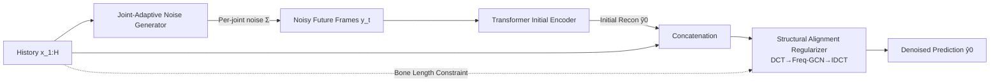

# KinemaDiff: Towards Diffusion for Coherent and Physically Plausible Human Motion Prediction

**Conference**: ICLR 2026  
**OpenReview**: [https://openreview.net/forum?id=uxTQeKAUh5](https://openreview.net/forum?id=uxTQeKAUh5)  
**Code**: TBD  
**Area**: Human Understanding / Stochastic Human Motion Prediction  
**Keywords**: Human Motion Prediction, Diffusion Models, Joint-adaptive Noise, Skeletal Structure Constraints, Physical Plausibility  

## TL;DR
KinemaDiff directly embeds human skeletal topology and joint-level dynamics **into the diffusion process itself**. By replacing the conventional practice of "implicitly encoding priors via network architecture" with a Joint-Adaptive Noise Generator and a Structural Alignment Regularizer, it significantly enhances the physical plausibility and accuracy of stochastic human motion prediction while maintaining diversity.

## Background & Motivation
- **Background**: Stochastic Human Motion Prediction (HMP) aims to predict multiple possible future human trajectories from a segment of historical motion. Diffusion models have recently become mainstream, refining random noise into coherent human poses through iterative denoising, outperforming early VAE/GAN approaches in diversity and fidelity.
- **Limitations of Prior Work**: Current diffusion methods suffer from two structural flaws. First, they apply the **same noise schedule to all joints**, ignoring the vast differences in degrees of freedom and dynamic behavior between the wrists/ankles and the root node; this homogeneity often leads to disordered or physically invalid predictions. Second, **skeletal anatomical structures are only implicitly learned or corrected via post-processing**, rather than being integrated into the diffusion process, resulting in generated poses that violate biomechanics (e.g., bone stretching/compression).
- **Key Challenge**: While encoding structural priors into network architectures can promote kinematic rationality, it remains an **indirect control** over the generation process and cannot strictly guarantee that physical constraints are met—there is a lack of a direct, controllable knob between diversity and physical realism.
- **Goal**: To provide **direct, explicit control** over physical realism within the diffusion process without sacrificing diversity, ensuring that every denoising step adheres to human skeletal constraints.
- **Core Idea**: **Structural Alignment + Joint-Aware Diffusion Modification**. Instead of altering the denoising network architecture, this work modifies the diffusion process itself by injecting skeletal topology and joint dynamics into both the forward diffusion and reverse denoising stages.

## Method

### Overall Architecture
KinemaDiff integrates three components onto a standard conditional diffusion backbone (predicting $y_0$ conditioned on historical motion $x$). First, the **Joint-Adaptive Noise Generator** produces heterogeneous noise for each joint and sample, which is added to the target future motion. The noisy future frames pass through a Transformer encoder to obtain an **unconditional initial reconstruction** $\tilde{y}_0$. Finally, the initial reconstruction is concatenated with the historical motion and sent to the **Structural Alignment Regularizer**, which processes the data using GCN in the frequency domain before transforming back to the time domain to output the final denoised prediction $\hat{y}_0$. The entire sampling process uses only 10 DDPM steps.

### Key Designs

**1. Joint-Adaptive Noise Generator: Enabling joint-specific noise intensities.** Conventional diffusion applies a single scalar noise rate to all joints. This work modifies the forward process into a multivariate noise schedule, replacing isotropic noise with a diagonal covariance matrix $\Sigma=\mathrm{diag}(s_1^2,s_2^2,\dots,s_J^2)$: $q(y_t\mid y_{t-1})=\mathcal{N}\big(y_t;\,\alpha_t y_{t-1},\,(1-\alpha_t)\Sigma\big)$. The scaling factor for each joint $s_j=f_\theta(j,\,x_j^{(1:H)})$ is determined by both the joint index (reflecting inherent dynamic characteristics) and its historical trajectory (making the noise instance-adaptive), where $f_\theta$ consists of simple linear layers. Consequently, distal joints with high degrees of freedom receive stronger noise to support diversity, while stable joints like the root receive less noise to prevent "robotic" rigidity caused by uniform noise. The reverse denoising is performed under the same $(1-\alpha_t)\Sigma$ to ensure consistency.

**2. Structural Alignment Regularizer: Embedding bone length consistency into every denoising step.** A key observation is that historical motion is noise-free and provides reliable skeletal structures. For a batch of noisy samples $y_t=\sqrt{\bar\alpha_t}\,y_0+\sqrt{1-\bar\alpha_t}\,\epsilon$, since $\epsilon$ is zero-mean, noise can be approximately removed by taking the batch mean: $\bar y_t=\frac1B\sum_b y_t^{(b)}\approx\sqrt{\bar\alpha_t}\,y_0$. This allows calculating the bone length $\ell_{i,j}=\lVert y_i-y_j\rVert_2$ for every connection $(i,j)\in E$. The regularizer aligns the average bone length of the observed history $\bar b_{obs}$ with both the final prediction $\bar b_{pred}$ and the reference reconstruction $\bar b_{ref}$: $L_{align}=\frac1{|E|}\sum(\bar b_{obs}-\bar b_{pred})^2+\frac1{|E|}\sum(\bar b_{obs}-\bar b_{ref})^2$. This addresses the issue where direct $y_0$ predictions at large $t$ are inaccurate and suffer from "bone drift," ensuring skeletal proportions remain stable throughout the denoising trajectory.

**3. Frequency-Specific Graph Denoising Network: Modeling dynamics in the frequency domain.** The Structural Alignment Regularizer is not merely a loss term; it transforms the entire motion sequence into the frequency domain via DCT/IDCT and processes it with GCNs. Unlike previous methods that use a fixed adjacency matrix, this work assigns a **unique set of adjacency connections to each frequency band**. This is because low-frequency (global translation) and high-frequency (distal jitter) components involve different joint coupling patterns, and band-specific modeling more precisely captures these motion dynamics.

**4. Fully Supervised Direct $y_0$ Prediction Objective.** The denoiser outputs a pose prediction $\hat y_0$ at every timestep (rather than predicting noise). Thus, reconstruction and alignment losses can be **applied to every diffusion step** instead of just the final one. The reconstruction loss $L_{rec}=\frac1J\sum_j(\lVert(x_j-\hat x_j)\lambda_j\rVert_1\gamma+\lVert(y_0^j-\hat y_0^j)\lambda_j\rVert_1)$ applies different weights $\lambda_j$ to different joints. The total loss is $L_{total}=\alpha L_{rec}+\beta L_{align}$. Step-by-step supervision ensures the denoising trajectory adheres to anatomically plausible human motion.

## Key Experimental Results

### Main Results (Human3.6M, lower is better except for APD)

| Method | Type | ADE↓ | FDE↓ | APD↑ | CMD↓ | FID↓ |
|------|------|------|------|------|------|------|
| DLow | VAE | 0.425 | 0.518 | 11.741 | 4.927 | 1.255 |
| DivSamp | VAE | 0.370 | 0.485 | 15.310 | 11.692 | 2.083 |
| HumanMAC | DM | 0.369 | 0.480 | 6.301 | – | – |
| BeLFusion | DM | 0.372 | 0.474 | 7.602 | 5.988 | 0.209 |
| CoMusion | DM | 0.350 | 0.458 | 7.632 | 3.202 | 0.102 |
| SkeletonDiff | DM | 0.344 | 0.450 | 7.249 | 4.178 | 0.123 |
| **Ours** | DM | **0.331** | **0.449** | 6.912 | 4.60 | **0.083** |

Both accuracy (ADE/FDE) and realism (FID) achieve new SOTA, with FID improved by approximately 19% relative to the previous best, CoMusion. APD (raw diversity) is not the highest; the authors emphasize that this work prioritizes the physical fidelity of each sample over blindly increasing diversity.

In cross-dataset generalization (AMASS), Ours leads in most metrics (ADE 0.478 / FDE 0.540 / MMADE 0.456 / MMFDE 0.457 / CMD 9.448), indicating the model learns fundamental motion laws rather than dataset-specific artifacts.

### Ablation Study (Human3.6M)

| Encoder | J-Noise | Align | APD↑ | ADE↓ | FDE↓ | FID↓ |
|---------|---------|-------|------|------|------|------|
| - | - | - | 19.601 | 0.852 | 0.775 | 2.393 |
| ✓ | - | - | 9.600 | 0.653 | 0.574 | 0.932 |
| ✓ | - | ✓ | 7.243 | 0.339 | 0.454 | 0.088 |
| ✓ | ✓ | - | 7.014 | 0.336 | 0.453 | 0.089 |
| ✓ | ✓ | ✓ | 6.912 | **0.331** | **0.449** | **0.083** |

Noise scheduler comparison: Variance (Ours) FID 0.083 outperforms Sqrt (0.108) and Cosine (0.178).

### Key Findings
- The Structural Alignment Regularizer is the primary contributor to ADE/FDE accuracy, as it prevents kinematic error accumulation during each step and protects long-term predictions from collapsing.
- Joint-adaptive noise and structural alignment act **synergistically**: the former shapes naturally heterogeneous joint movements to avoid rigidity, while the latter filters out anatomically impossible poses. Together, they achieve the lowest FID.
- These results are achieved with only 10 diffusion steps, ensuring high sampling efficiency.

## Highlights & Insights
- **Modifying the "Process" instead of the "Architecture"**: While most diffusion motion methods focus on complex denoising network structures, this work modifies both ends of the diffusion process (noise addition/denoising), providing direct control over physical realism. This differs conceptually from works like SkeletonDiffusion that only use static skeletal priors for anisotropic noise.
- **Batch-mean Denoising as a Clever Trick**: By utilizing the zero-mean property of Gaussian noise, averaging across a batch allows for the approximate recovery of clean bone lengths from noisy samples, enabling bone length constraints to be applied at any timestep with zero cost.
- **Explicit Diversity-Realism Trade-off**: The authors do not chase the highest APD but instead use joint-level noise to ensure diversity "grows on a physically plausible manifold." This valuation is more practical for downstream applications like autonomous driving, assistive robotics, and digital avatars.

## Limitations & Future Work
- The raw diversity metric (APD) is lower than some VAE/diffusion baselines, which might be conservative for scenarios requiring extreme motion variety.
- Structural alignment relies on the assumption that "bone length is approximately constant between history and future," which may not be fully validated for non-rigid objects, clothing deformation, or multi-person interactions.
- The frequency band division and joint connection design for the frequency-specific adjacency matrix are somewhat empirical; a systematic sensitivity analysis of this design is lacking.
- Evaluation was limited to mocap data like Human3.6M / AMASS; robustness against real-world noisy 2D/monocular reconstructions remains to be investigated.

## Related Work & Insights
- **Comparison with SkeletonDiffusion (CVPR2025) is critical**: While the latter also introduces anisotropic noise, its covariance is derived from a **static** skeletal kinematic tree. KinemaDiff’s noise is **learnable and instance-adaptive**, suggesting that "priors should adjust dynamically with data rather than being hard-coded."
- **CoMusion / HumanMAC** represent the approach of "refining architectures with GCNs in the DCT frequency domain." This work reuses frequency-domain GCNs but adds frequency-specific connections and process-level constraints, demonstrating that architecture and process modifications can be orthogonally combined.
- Insights from task-specific noise design (e.g., tailored noise in molecular or image diffusion) suggest a general direction: **Injecting domain structural knowledge into the noise covariance** is often more efficient than simply stacking deeper networks.

## Rating
- Novelty: ⭐⭐⭐⭐ — The combination of "modifying the diffusion process rather than the denoising network" with joint-adaptive noise and step-wise bone length constraints is a distinct contribution in HMP, though it continues the trajectory initiated by SkeletonDiffusion.
- Experimental Thoroughness: ⭐⭐⭐⭐ — Comprehensive ablation, cross-dataset evaluation on Human3.6M + AMASS, and scheduler/step analysis are provided; missing multi-person or real-world input scenarios.
- Writing Quality: ⭐⭐⭐⭐ — Logical flow from motivation to method and experiments is smooth, diagrams are clear, and the mathematical derivation (batch-mean denoising) is well-explained.
- Value: ⭐⭐⭐⭐ — Physical plausibility is highly practical for downstream fields like robotics and digital humans; the methodology is transferable to other structured sequence generation tasks.

<!-- RELATED:START -->

## Related Papers

- [\[CVPR 2025\] PhysMoDPO: Physically-Plausible Humanoid Motion with Preference Optimization](../../CVPR2025/human_understanding/physmodpo_physically-plausible_humanoid_motion_with_preference_optimization.md)
- [\[ICLR 2026\] ReactDance: Hierarchical Representation for High-Fidelity and Coherent Long-Form Reactive Dance Generation](reactdance_hierarchical_representation_for_high-fidelity_and_coherent_long-form_.md)
- [\[AAAI 2026\] mmPred: Radar-based Human Motion Prediction in the Dark](../../AAAI2026/human_understanding/mmpred_radar-based_human_motion_prediction_in_the_dark.md)
- [\[ICLR 2026\] HUMOF: Human Motion Forecasting in Interactive Social Scenes](humof_human_motion_forecasting_in_interactive_social_scenes.md)
- [\[ICLR 2026\] Zero-Shot Human Pose Estimation Using Diffusion-Based Inverse Solvers](zero-shot_human_pose_estimation_using_diffusion-based_inverse_solvers.md)

<!-- RELATED:END -->
## Related Papers

- [\[CVPR 2025\] PhysMoDPO: Physically-Plausible Humanoid Motion with Preference Optimization](../../CVPR2025/human_understanding/physmodpo_physically-plausible_humanoid_motion_with_preference_optimization.md)
- [\[AAAI 2026\] mmPred: Radar-based Human Motion Prediction in the Dark](../../AAAI2026/human_understanding/mmpred_radar-based_human_motion_prediction_in_the_dark.md)
- [\[ICLR 2026\] ReactDance: Hierarchical Representation for High-Fidelity and Coherent Long-Form Reactive Dance Generation](reactdance_hierarchical_representation_for_high-fidelity_and_coherent_long-form_.md)
- [\[ICLR 2026\] HUMOF: Human Motion Forecasting in Interactive Social Scenes](humof_human_motion_forecasting_in_interactive_social_scenes.md)
- [\[ICLR 2026\] TriC-Motion: 三域因果建模驱动的文本到动作生成](tric-motion_tri-domain_causal_modeling_grounded_text-to-motion_generation.md)

<!-- RELATED:END -->
