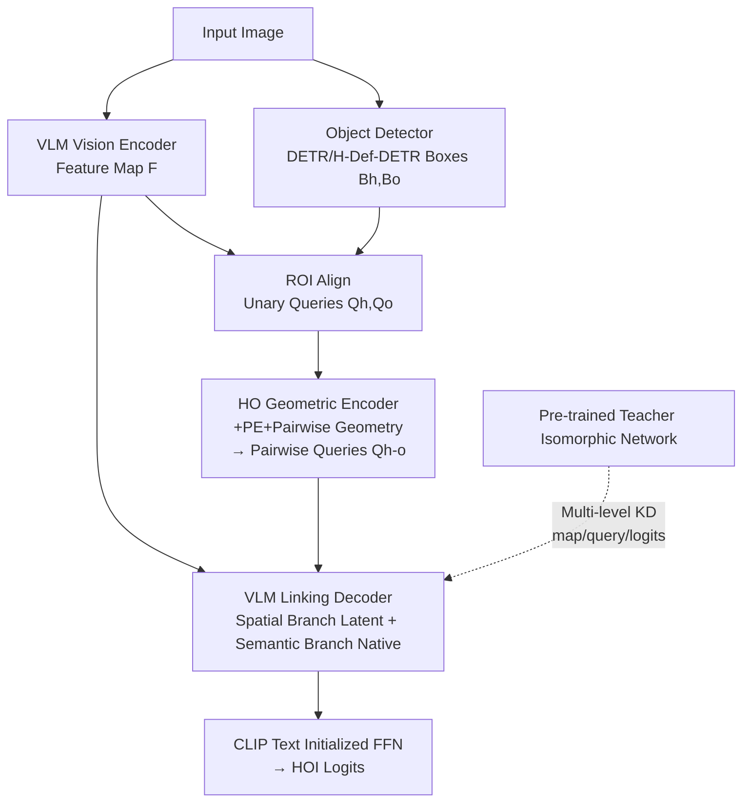

# LINK: Learning Instance-level Knowledge from Vision-Language Models for Human-Object Interaction Detection

**Conference**: ICLR 2026  
**OpenReview**: [https://openreview.net/forum?id=CTdweIFocz](https://openreview.net/forum?id=CTdweIFocz)  
**Code**: To be confirmed  
**Area**: Human Understanding / Human-Object Interaction Detection  
**Keywords**: HOI Detection, Vision-Language Models, Knowledge Distillation, Zero-shot, Open-vocabulary, Geometric Encoding  

## TL;DR
LINK utilizes a plug-and-play two-stage HOI detection framework comprising a "geometric encoder + VLM linking decoder," supplemented by a progressive learning strategy under a teacher-student paradigm. By converting sparse HOI annotations into dense supervision covering all human-object pairs, it achieves SOTA performance across fully-supervised, zero-shot, and open-vocabulary settings.

## Background & Motivation
**Background**: Human-Object Interaction (HOI) detection aims to parse images into `<human, action, object>` triplets, serving as a fundamental task for robotics and abnormal behavior analysis. Recent works have integrated pre-trained Vision-Language Models (VLMs) like CLIP into HOI detection, leveraging their strong image-text alignment to improve the recognition of rare or unseen interactions, thereby advancing zero-shot and few-shot HOI detection.

**Limitations of Prior Work**: The authors point out two long-standing contradictions. First is the **antinomy between specialization and generalization**—specialized architectures perform strongly on fully-supervised benchmarks but collapse in zero-shot or cross-domain scenarios; conversely, zero-shot methods often involve lightweight modifications to CLIP that recognize new categories well but cannot compete with specialized models in fully-supervised settings. Second is **sparse supervision**—while humans and objects form a dense interaction graph in an image, Ground Truth (GT) only labels a few edges (positive pairs), leaving many "valid but unlabeled positive pairs" and "informative negative samples" wasted.

**Key Challenge**: VLMs are pre-trained on image-level pairs providing global semantic representations, whereas HOI requires instance-level, fine-grained spatial and semantic discrimination. Transferring the former to the latter under sparse supervision is the fundamental difficulty in adapting VLMs for HOI.

**Goal**: To build a **unified** two-stage HOI detector that excels in specialization on standard benchmarks while maintaining generalization in zero-shot/open-vocabulary settings without sacrificing either.

**Core Idea**: **[Architecture Decoupling]** Making interaction queries dependent only on VLM features and detection boxes, decoupled from specific detectors to allow plug-and-play functionality with any object detector. **[Dense Supervision]** Using teacher-student distillation to expand supervision from a few matched pairs to all candidate human-object pairs, enabling the model to learn robust and transferable HOI representations by contrasting subtle spatial and semantic differences between positive and negative instances.

## Method

### Overall Architecture
LINK follows a two-stage pipeline: first, a commodity detector (DETR / H-Deformable-DETR) generates boxes; then, interaction reasoning is performed on each human-object pair. The architecture consists of a **Human-Object Geometric Encoder** (injecting spatial awareness and constructing pairwise queries) and a **VLM Linking Decoder** (aggregating VLM feature maps via dual-path cross-attention: spatial and semantic branches). Training is driven by a **Progressive Learning Strategy** (training a teacher first, then using the teacher to provide multi-level dense distillation for the student covering all human-object pairs). Crucially, query features are derived solely from ROI Aligned VLM feature maps and boxes, independent of detector-specific queries.

### Key Designs

**1. Human-Object Geometric Encoder: Providing spatial awareness to "semantics-only" VLMs**. CLIP-like VLMs are pre-trained with image-level contrastive objectives, excelling in global semantics but lacking regional spatial discrimination. The authors supplement each box with positional information: boxes $B=(x_1,y_1,x_2,y_2)$ are normalized and their centers $C$ and sizes $S$ are used for 2D sine positional encoding $PE(B)=PE(C)\oplus PE(S)$, which is added to unary queries and refined via self-attention $Q=\text{Self-Attn}(Q+PE(B))$. Pairwise queries are then formed by enumerating combinations $Q_{h\text{-}o}=\text{Linear}(\mathcal{C}[Q_i,Q_j]),\ i\in H,\ j\in O\cup H$ (including human-human interactions). Following UPT, pairwise spatial relation vectors $R_{i,j}$ (IoU, directional vectors, relative sizes) are encoded and fused with semantic queries. This **decouples the queries from detector features**, avoiding detector bias and explicitly injecting spatial dependencies.

**2. VLM Linking Decoder: Dual branches for fine-grained reasoning and transferability**. Instead of simple cross-attention, the authors split the process. The **spatial branch** uses a connector to reduce feature map dimensionality into a latent bottleneck $F^l=\text{MLP}(F)$, forcing queries to focus on geometric relations in a compressed space. It employs box-encoding-guided attention ($CA_{be}$) to constrain the attention map for fine-grained spatial reasoning. The **semantic branch** projects queries into the VLM's native high-dimensional space $Q^n_{h\text{-}o}=\text{Linear}(Q_{h\text{-}o})$ and performs standard cross-attention $CA$ to aggregate high-level global semantics. The fused outputs are passed through an **FFN initialized with CLIP text embeddings**, preserving spatial precision while inheriting VLM open-set semantics.

**3. Progressive Teacher-Student Learning: Supplementing sparse GT with dense supervision**. In the first stage, a teacher is trained using only GT. In the second stage, the student is trained from scratch, supervised by GT and densely guided by the teacher on **all candidate human-object pairs**. Since the teacher and student share the **same input and architecture**, they can be aligned instance-by-instance. Distillation uses KL divergence $KD_{KL}(f_{stu},f_t)=\text{KL}(\sigma(f_t/\tau)\,\|\,\sigma(f_{stu}/\tau))$ across three levels: **Feature map level** ($L^{feat}_{KD}=KD(F_{stu},F''_t)$), **Query level** (token-wise alignment across encoder/decoder layers), and **Logits level** (distilling $\Psi_s=\log\frac{P}{1+\exp(-O_s)-P}$). This forces the model to resolve ambiguities by contrasting subtle differences between instances.

## Key Experimental Results

### Main Results (HICO-DET / V-COCO, Fully-supervised)

| Method | Backbone / VLM | HICO-DET Full | Rare | V-COCO AP_role |
|---------------|----------------|---------------|------|----------------|
| LAIN | R50 / CLIP-B | 36.02 | 35.70 | 65.1 |
| **Ours (LINK)** | R50 / CLIP-B | **37.43** | **37.18** | **66.5** |
| HOLa | R50 / CLIP-L | 39.05 | 38.66 | 66.0 |
| **Ours (LINK)** | R50 / CLIP-L | **42.92** | **45.03** | **68.1** |
| BC-HOI | R50 / BLIP-2 | 43.01 | 45.76 | 70.6 |
| **Ours (LINK)** | R50 / BLIP-2 | **43.72** | **45.82** | 68.5 |
| HORP | Swin-L / CLIP-L | 47.53 | 46.81 | 68.3 |
| **Ours (LINK)** | Swin-L / CLIP-L | **49.06** | **53.63** | **69.2** |

With R50+CLIP-L, Full/Rare scores are +3.87 / +6.37 mAP higher than previous bests (relative +9.9% / +16.5%).

### Ablation Study (HICO-DET Fully-supervised, Table 6)

| # | Encoder | Decoder + Distillation | Full | Rare | N-Rare |
|---|--------|----------------|------|------|--------|
| A1 | Self-Attn | Cross-Attn (baseline) | 36.10 | 33.67 | 36.97 |
| A2 | Self-Attn | VLM-Link | 39.23 | 39.76 | 39.02 |
| A3 | Geometrical | Cross-Attn | 38.30 | 35.46 | 39.31 |
| A4 | Geometrical | VLM-Link | 41.20 | 41.43 | 41.13 |
| A5 | A4 + Logit-level KD | | 41.89 | 43.82 | 41.27 |
| A6 | A5 + Query-level KD | | 42.34 | 43.62 | 41.84 |
| A7 | A6 + Map-level KD | | 42.92 | 45.03 | 42.20 |
| A8 | A7 + multi-teacher (CLIP+SigLIP) | | 43.54 | 45.58 | 42.93 |

The Geometric encoder (A3) and VLM-Link decoder (A2) are both effective; their combination (A4) is optimal. Triple-level distillation (A5→A7) provides consistent gains, especially for the Rare subset (33.67→45.03).

### Key Findings
- **Zero-shot settings** (RF-UC / NF-UC / UO / UV): Achieved two best and two second-best results; RF-UC unseen 32.25 surpasses previous SOTA by +1.64.
- **Open-vocabulary SWiG-HOI**: Full set 17.97 mAP, +2.71 (relative +17.8%) over previous best, with Rare subset relative gain of +22.1%.
- **Cross-model Universality**: Consistent gains across CLIP/BLIP (contrastive), DINOv2 (self-supervised), and SigLIP2/Florence2 (multitask/multimodal), with the largest gains in long-tail HOI (≤10 samples).
- Few-shot (1→32-shot) results are best-in-class on both HICO-DET and V-COCO.

## Highlights & Insights
- **Detector decoupling is the switch for generalization**: By not using DETR-specific queries and relying on VLM feature maps + boxes, the model becomes plug-and-play and removes detector bias—the structural reason it excels in both fully-supervised and zero-shot settings.
- **Isomorphic teacher-student alignment elegantly solves sparse supervision**: Sharing the architecture allows instance-to-instance alignment, meaning distillation can legally cover all candidate pairs without introducing noise through simple pseudo-labeling.
- **Dual-branch labor division**: The spatial branch ensures fine-grained precision (specialization), while the semantic branch preserves VLM global semantics (generalization).
- Multi-teacher (CLIP+SigLIP) integration shows the framework can act as a container for aggregating knowledge from heterogeneous foundation models.

## Limitations & Future Work
- The two-stage process with multi-level distillation on all pairs involves significant training and memory costs.
- Inference remains two-stage, so performance is bounded by the quality of the upstream object detector.
- The geometric encoding follows established designs (UPT/PViC); innovation lies more in the "decoupling + dense distillation" combination.
- The benefits and conflicts of even larger heterogeneous teacher ensembles have not been fully explored.

## Related Work & Insights
- **Two-stage vs. One-stage**: LINK follows the two-stage (decoupled) route for flexibility and modularity, contrasting with query-based one-stage models like GEN-VLKT.
- **VLM Adaptation for HOI**: While related to HOICLIP and ADA-CM in using CLIP, LINK differs by focusing on architectural decoupling and dense distillation rather than prompt/memory modification.
- **Inspiration**: The isomorphic teacher-student dense distillation approach can be transferred to other tasks with sparse graph structures, such as Scene Graph Generation or Relationship Detection.

## Rating
- Novelty: ⭐⭐⭐ — While components like geometric units and KD are known, the combination for "detector decoupling + isomorphic dense distillation" effectively addresses the specialization/generalization trade-off.
- Experimental Thoroughness: ⭐⭐⭐⭐⭐ — Covers fully-supervised, zero-shot, and open-vocabulary settings across multiple benchmarks and six foundation models; very solid.
- Writing Quality: ⭐⭐⭐⭐ — Clear motivation, systematic methodology, and complete formulas.
- Value: ⭐⭐⭐⭐ — Plug-and-play nature and significant gains on long-tail/unseen classes provide strong practical value for HOI applications.

<!-- RELATED:START -->

## Related Papers

- [\[ICCV 2025\] CleanPose: Category-Level Object Pose Estimation via Causal Learning and Knowledge Distillation](../../ICCV2025/human_understanding/cleanpose_category-level_object_pose_estimation_via_causal_learning_and_knowledg.md)
- [\[ICLR 2026\] Unleashing Guidance Without Classifiers for Human-Object Interaction Animation](unleashing_guidance_without_classifiers_for_human-object_interaction_animation.md)
- [\[ICLR 2026\] EmoPrefer: Can Large Language Models Understand Human Emotion Preferences?](emoprefer_can_large_language_models_understand_human_emotion_preferences.md)
- [\[CVPR 2026\] Unleashing Vision-Language Semantics for Deepfake Video Detection](../../CVPR2026/human_understanding/unleashing_vision-language_semantics_for_deepfake_video_detection.md)
- [\[ICLR 2026\] Human-Object Interaction via Automatically Designed VLM-Guided Motion Policy](human-object_interaction_via_automatically_designed_vlm-guided_motion_policy.md)

<!-- RELATED:END -->
