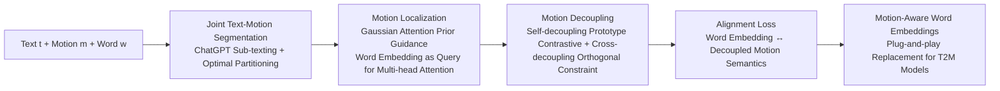

# Motion-Aligned Word Embeddings for Text-to-Motion Generation

**Conference**: ICLR 2026  
**OpenReview**: [https://openreview.net/forum?id=zbHpRwzrq5](https://openreview.net/forum?id=zbHpRwzrq5)  
**Code**: [https://github.com/ke-han-aca/MATE.git](https://github.com/ke-han-aca/MATE.git)  
**Area**: Human Understanding / Text-to-Motion Generation  
**Keywords**: Text-to-Motion Generation, Word Embedding Alignment, Motion Semantic Decoupling, Contrastive Learning, Prototype Representation  

## TL;DR
MATE pushes "motion semantic alignment" down to the **word embedding layer** of the LLM text encoder. By fine-tuning only this thin layer (3.2M parameters) through motion localization and word-level decoupling, it binds motion-related words like "clockwise" to skeletal movements. This produces a plug-and-play motion-aware text encoder that improves mainstream T2M models like MoMask and MDM to new SOTA levels with virtually no architectural changes.

## Background & Motivation
- **Background**: Text-to-Motion (T2M) generation generally adopts a two-stage pipeline: a pre-trained LLM (CLIP, DistilBERT) encodes the text, and a motion generator (diffusion or quantized VAE) decodes it into skeletal sequences. Most works freeze the text encoder and focus on refining the motion generation module.
- **Limitations of Prior Work**: CLIP/DistilBERT are trained on general text corpora (or image-text pairs) and lack fine-grained alignment between motion-related words and human movement. While models can align sentence-level semantics (e.g., generating a person walking in a clockwise circle), they fail on complex prompts like "jogs in a clockwise motion and falls to their knees" due to non-robust understanding of words like "clockwise."
- **Key Challenge**: The root problem lies in the **word embedding layer**. Words like "clockwise" and "anti-clockwise" share high linguistic similarity but represent **completely opposite and incompatible** rotational directions kinematically. Prior methods focusing on sentence-level alignment (LaMP, MotionGPT, TMR) cannot bridge this cross-modal word-level semantic gap.
- **Goal**: To inject word-level motion semantics into LLMs without discarding their powerful context modeling capabilities, producing a motion-aware text encoder that can directly replace encoders in existing T2M models.
- **Core Idea** (**Word Embeddings as the Alignment Bottleneck**): Only the word embedding layer is optimized while freezing all subsequent layers. The hypothesis is that language and motion share structural attributes (both consist of compositional elements in temporal order); thus, high-level context modeling can generalize to motion semantics if the bottom-level "lookup table" is calibrated to a kinematic context. The challenge is that semantics in motion sequences are **naturally entangled**—datasets only have sentence-level labels, and neighbor-word semantics overlap.

## Method

### Overall Architecture
Given a triplet $\{t, m, w\}$ (text description, motion sequence, sampled word), MATE aims to align the word embedding of $w$ with its corresponding motion semantics in $m$. The framework includes a text encoder with trainable word embeddings, a motion encoder, and a motion decoder. It solves "where word semantics come from" and "how to purify them" in two steps: **motion localization** to find the timestamp of the word, and **motion decoupling** to isolate the specific semantics of that word.

### Key Designs

**1. Joint Text-Motion Segmentation: Creating soft labels for data lacking word-level annotation.** Since datasets only provide sentence-level labels, MATE uses ChatGPT to split description $t$ into $N$ sub-texts $t_1, \dots, t_N$ (each describing one coherent sub-motion). The motion sequence is then partitioned into $N$ non-overlapping segments to match. Boundaries are determined by solving an optimal partitioning problem: $\min_{\{s_n,e_n\}}\sum_{n=1}^{N}\big(1-\cos(E_t(t_n), E_m(m[s_n{:}e_n]))\big)$, where $E_t, E_m$ are frozen encoders from a pre-trained T2M retrieval model, with the constraint $s_{n+1}=e_n$. This segmentation acts as a soft prior rather than a hard label.

**2. Text-Guided Motion Localization: Anchoring words to time intervals via Gaussian attention priors.** After segmentation, the motion encoder extracts both sequence-level representation $f^m$ and frame-level features $F^m \in \mathbb{R}^{T \times D}$. The core mechanism involves using the **word embedding as a Query** to attend to relevant motion features: $f^m_{word}=\text{MultiHead}(Q, K, V)$, where $Q=\text{Proj}(\text{WE}(w))$, $K=(1+\omega \cdot \text{AttentionPrior}(t)) \odot F^m$, and $V=F^m$. The attention prior is Gaussian-shaped: $\text{AttentionPrior}(t)=\exp\!\big(-\frac{(t-c_n)^2}{2\sigma_n^2}\big)$, with center $c_n=\frac{s_n+e_n}{2}$ and width $\sigma_n=\frac{e_n-s_n}{2}$. This highlights frames near the segment center and decays smoothly, making it more robust than binary masking.

**3. Word-Guided Motion Decoupling: Isolating word-specific semantics via three criteria.** Localization only addresses "which segment," but words like "turn" and "clockwise" remain entangled within that segment. MATE proposes three decoupling criteria: stability, discriminability, and plausibility. To satisfy the first two, **self-decoupling** is introduced: $K$ learnable motion-word prototypes $\{f^p_{w_k}\}$ are pre-defined. A prototype-level contrastive loss $\mathcal{L}_{self}=\frac{1}{|V|}\sum_{i\in V}-\log\frac{\exp(\cos(f^{m_i}_{w_i},f^p_{w_i})/\tau)}{\sum_k \exp(\cos(f^{m_i}_{w_i},f^p_{w_k})/\tau)}$ pulls decoupled features toward their own prototypes and pushes them from others, ensuring dataset-level semantic stability. For plausibility, **cross-decoupling** is added: query motion $m_i$ with word $w_j$ from sample $j$; if $m_i$ does not contain $w_j$, the output is forced to be orthogonal to $f^{m_i}_{w_i}$ via $\mathcal{L}_{cross}=\frac{1}{|N|}\sum_{(i,j)\in N}\big(|\cos(f^{m_i}_{w_i},f^{m_i}_{w_j})|+|\cos(f^{m_i}_{w_i},f^{m_j}_{w_i})|\big)$.

**4. Loss & Training: Welding semantics into word embeddings via symmetric InfoNCE.** Finally, a symmetric InfoNCE alignment loss $\mathcal{L}_{align}$ pulls the projected word embedding $f^e_{w_i}=\text{Proj}(\text{WE}(w_i))$ close to its decoupled motion semantics $f^{m_i}_{w_i}$. The word-level objective is $\mathcal{L}_{word}=\mathcal{L}_{self}+\mathcal{L}_{cross}+\mathcal{L}_{align}$. To maintain context, sentence-level InfoNCE $\mathcal{L}_{sent}$ and a motion reconstruction loss $\mathcal{L}_{rec}$ are added. The total objective is $\mathcal{L}_{all}=\mathcal{L}_{rec}+\omega_1\mathcal{L}_{word}+\omega_2\mathcal{L}_{sent}$. After training, only the MATE-enhanced word embeddings are plugged back into the original T2M model for retraining.

## Key Experimental Results

### Main Results
Replacing the CLIP encoder with the MATE-enhanced version (updating only word embeddings) on HumanML3D yields consistent improvements across four mainstream models:

| Method | R-Prec Top-1 ↑ | FID ↓ | MM-Dist ↓ |
|---|---|---|---|
| Real Motion | 0.511 | 0.002 | 2.974 |
| MDM | 0.320 | 0.544 | 5.566 |
| MDM + MATE | **0.509** | **0.332** | **3.057** |
| MotionDiffuse | 0.491 | 0.630 | 3.113 |
| MotionDiffuse + MATE | **0.536** | **0.234** | **2.907** |
| MMM | 0.515 | 0.089 | 2.926 |
| MMM + MATE | **0.541** | **0.069** | **2.887** |
| MoMask (SOTA Baseline) | 0.521 | 0.045 | 2.958 |
| MoMask + MATE | **0.550** | **0.040** | **2.811** |

Improvements were also observed on the KIT dataset (e.g., MoMask Top-1 0.433 → 0.443), though the magnitude was smaller due to the smaller dataset size.

### Ablation Study
**Which layers are critical to optimize?** (HumanML3D, CLIP encoder):

| Trainable Layers | Parameters | Top-1 ↑ | FID ↓ |
|---|---|---|---|
| No training | 0M | 0.521 | 0.045 |
| **Word Embedding Only** | **3.2M** | **0.550** | **0.040** |
| Subsequent Layers | 37M | 0.022 | 7.611 |
| All Layers | 40.2M | 0.014 | 9.468 |
| LoRA Adapter | 0.4M | 0.525 | 0.051 |

Loss Ablation: Removing $\mathcal{L}_{self}$ dropped performance to Top-1 0.498, and removing $\mathcal{L}_{sent}$ caused a collapse (0.324). Attention Prior Ablation: No prior (0.428) < Binary (0.431) < Full-sequence Gaussian (**0.443**).

### Key Findings
- **Finetuning subsequent/all layers causes catastrophic overfitting**: Using 37M-40M parameters on small motion data pushed FID to 7.6-9.5, validating the hypothesis to only calibrate word embeddings.
- **Cross-LLM Generality**: Both CLIP and DistilBERT benefited significantly from MATE (e.g., DistilBERT+MATE reduced MDM's FID from 0.615 to 0.244).
- **Antonym Testing**: By replacing words in prompts (e.g., "turn right" to "left"), MATE generated correctly corresponding motions, proving that word-level semantics were truly anchored.

## Highlights & Insights
- **Precise Localization, Minimal Change**: Pinpoints the long-ignored alignment bottleneck at the word embedding layer. Using only 3.2M parameters to set a new SOTA is an exemplar of "finding the right spot is better than stacking modules."
- **No Word-level Labels Required**: Synthesizes word-level supervision from sentence-level data via ChatGPT segmentation and Gaussian soft priors.
- **Prototypes Scale to Dataset-level**: Learning prototypes instead of batch-level contrastive pairs allows word semantics like "clockwise" to converge stably across the entire dataset.
- **Engineering Value**: Since it produces an encoder rather than a framework, it is a non-invasive drop-in for any two-stage T2M model.

## Limitations & Future Work
- **Dependency on ChatGPT**: Segmentation quality relies on ChatGPT's ability to split sentences and the retrieval model's matching accuracy.
- **Diminishing Returns on Small Datasets**: The KIT dataset showed less gain than HumanML3D, suggesting word embedding optimization is constrained by data volume.
- **Boundaries of Word-level Hypothesis**: The method attributes semantics to single words; its ability to model complex phrase-level semantics (e.g., the nuance of "stumbling forward") is not fully tested.
- **Prototype Scalability**: The number of prototypes grows linearly with the vocabulary size, potentially posing challenges for open-vocabulary scenarios.

## Related Work & Insights
- **vs. Sentence-level Alignment (LaMP / MotionGPT / TMR)**: These methods operate at the sentence level or train motion-language models from scratch, which are limited by the small scale of motion data. MATE retains the knowledge of large-scale text corpora by only tuning the LLM's embeddings.
- **vs. LLM Full Finetuning (LMM / AvatarGPT)**: These involve expensive full-model tuning and are prone to overfitting. MATE is resource-efficient and plug-and-play.
- **Insight**: Cross-modal alignment does not always require stacking high-level modules. Calibrating the "semantic lookup table" at the lowest level can be a more elegant and parameter-efficient solution for tasks combining general LLMs with domain-specific decoders.

## Rating
- **Novelty**: ⭐⭐⭐⭐ Precise attribution of alignment bottlenecks to word embeddings and the use of prototypes to bootstrap word-level supervision is a fresh perspective.
- **Experimental Thoroughness**: ⭐⭐⭐⭐ Strong validation across multiple benchmarks and base models, with comprehensive ablations.
- **Writing Quality**: ⭐⭐⭐⭐ Clear motivation, logical design of the three decoupling criteria, and effective visualization.
- **Value**: ⭐⭐⭐⭐ High practical value for the T2M community due to its parameter efficiency and plug-and-play nature.

<!-- RELATED:START -->

## Related Papers

- [\[ICLR 2026\] TriC-Motion: Tri-domain Causal Modeling for Text-to-Action Generation](tric-motion_tri-domain_causal_modeling_grounded_text-to-motion_generation.md)
- [\[ICLR 2026\] Event-T2M: Event-level Conditioning for Complex Text-to-Motion Synthesis](event-t2m_event-level_conditioning_for_complex_text-to-motion_synthesis.md)
- [\[CVPR 2026\] Next-Scale Autoregressive Models for Text-to-Motion Generation](../../CVPR2026/human_understanding/next-scale_autoregressive_models_for_text-to-motion_generation.md)
- [\[CVPR 2025\] PersonaBooth: Personalized Text-to-Motion Generation](../../CVPR2025/human_understanding/personabooth_personalized_text-to-motion_generation.md)
- [\[CVPR 2026\] MoLingo: Motion-Language Alignment for Text-to-Human Motion Generation](../../CVPR2026/human_understanding/molingo_motion-language_alignment_for_text-to-motion_generation.md)

<!-- RELATED:END -->
