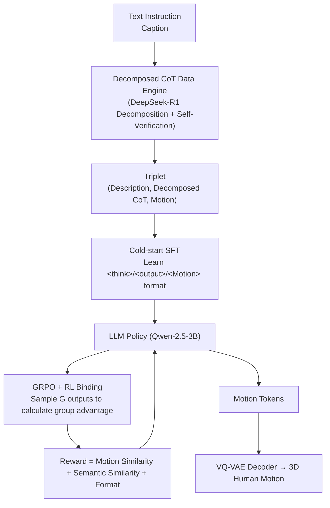

# Motion-R1: Enhancing Motion Generation with Decomposed Chain-of-Thought and RL Binding

**Conference**: ICLR 2026  
**OpenReview**: [https://openreview.net/forum?id=eXXsUer975](https://openreview.net/forum?id=eXXsUer975)  
**Project Page**: [https://motion-r1.github.io/](https://motion-r1.github.io/)  
**Area**: Human Understanding / Text-to-Motion  
**Keywords**: Text-to-Motion, Decomposed Chain-of-Thought, Reinforcement Learning, GRPO, Multi-modal Alignment, LLM  

## TL;DR
Motion-R1 combines a "Decomposed Chain-of-Thought (CoT) Data Engine" with "RL Binding": the former uses an LLM to decompose high-level instructions into temporal/causal sub-action chains for cold-start SFT; the latter uses GRPO to directly incorporate "motion similarity + semantic similarity + format" as rewards, eliminating the need for expensive human preference annotations while generating semantically aligned and realistic 3D human motions.

## Background & Motivation
**Background**: Text-to-Motion (T2M) is a fundamental task in human-computer interaction, synthesizing realistic human movements from natural language descriptions. Recent mainstream approaches involve discretizing motion into tokens (VQ-VAE) followed by LLM/diffusion-based generation (e.g., T2M-GPT, MotionGPT, MoMask, MotionLLM). Some works also introduce RL (MotionRL, MotionCritic) to align with human preferences and improve motion quality.

**Limitations of Prior Work**: The authors highlight two specific contradictions. First, most methods utilize **end-to-end supervised learning**, mapping text directly to motion sequences, which fails to capture deep temporal and causal relationships in language—for instance, "making a cup of coffee" implies a sequence of sub-actions like "reach → grasp → pour → stir → put down." End-to-end models often flatten this into oversimplified or incoherent movements. Second, **existing RL methods are overly complex and over-engineered**: they generally require training a preference/reward model with human annotations, which is costly, difficult to scale, and hard to deploy across diverse tasks.

**Key Challenge**: Language naturally possesses hierarchical temporal and causal structures, yet motion generation models lack explicit intermediate reasoning to align with this structure and are further hindered by the poor scalability of expensive reward engineering.

**Goal**: To address "missing reasoning" and "expensive rewards" simultaneously within a unified framework, improving motion quality, interpretability, and generalization without additional human annotation.

**Core Idea**: **[Explicit Reasoning + Cheap Alignment]** Use Decomposed CoT to break instructions into interpretable motion planning paths for cold-start training, then refine the strategy using RL Binding (based on GRPO) that embeds multi-modal alignment directly into the reward function, bypassing expensive preference models.

## Method

### Overall Architecture
Motion-R1 consists of two core components: a pre-trained **Motion Tokenizer** (VQ-VAE, discretizing continuous motion into tokens and decoding them back into smooth trajectories) and an **LLM with action-oriented reasoning capabilities** (using Qwen-2.5-3B-Instruct as the backbone). Training is conducted in two stages: the first stage uses a Decomposed CoT Data Engine to synthesize `(description, decomposed CoT, motion)` triplets for cold-start SFT, enabling the LLM to output reasoning-enhanced results in a `<think>/<output>/<Motion>` format; the second stage uses RL Binding (GRPO) to embed multi-modal alignment into the reward for further policy refinement.

### Key Designs

**1. Motion Tokenizer: Converting Motion into Discrete Symbols for LLMs**  
Since motion data differs significantly from natural language in structure and modality, the authors use a VQ-VAE to bring continuous motion into the LLM's symbolic space. The encoder $E$ maps the input motion sequence $m_{1:T}\in\mathbb{R}^{T\times D}$ to latent representations $z_{1:(T/l)}$ (where $l$ is the temporal downsampling rate). Nearest neighbor quantization is performed using a learnable codebook $C=\{c_n\}_{n=1}^{N}$ such that $\hat{z}_i=\arg\min_{c_n\in C}\lVert z_i-c_n\rVert_2$, and the decoder $D$ reconstructs $\hat{m}_{1:T}$. Training uses a composite objective $L_{vq}=L_{reconstruct}+L_{commit}+L_{embed}$, where reconstruction includes smooth L1 with velocity regularization to improve fluency. This step is a prerequisite for generating motion with an LLM.

**2. Decomposed CoT Data Engine: Automated Generation of Interpretable Reasoning Supervision**  
This is the core solution for "missing reasoning." The engine uses carefully designed prompts (including explicit instructions, output format constraints, and in-context examples) to guide an LLM to decompose free-form descriptions into **logically ordered sub-action chains obeying temporal dependencies and motion semantics**. For example, "a person performing Tai Chi" is decomposed into sub-actions like "standing → arm movement → weight shift → hand positioning," with added details on movement direction and body parts. Generated CoT trajectories undergo **self-verification quality control**: DeepSeek-R1 evaluates each entry for relevance, logical consistency, and conciseness. Redundant or verbose trajectories are filtered and regenerated until they meet the criteria. Each qualified CoT is paired with its original description and motion sequence as cold-start supervision.

**3. Cold-start Training: Why Pure RL is Insufficient**  
The authors initially attempted end-to-end RL (similar to DeepSeek-R1-Zero) to induce reasoning and generation solely via reward signals, but training was highly unstable. The model struggled to produce coherent reasoning or valid motion tokens. The reasons are twofold: motion generation requires **long, structured sequences** rather than short symbolic outputs, and motion tokens are newly introduced symbols with insufficient embedding training to bridge the modality gap. Therefore, SFT cold-start is used first to bootstrap the model to a state where it can generate structured reasoning and valid actions, providing a stable starting point for RL.

**4. RL Binding: Direct Multi-modal Alignment as Rewards**  
This is the core solution for "expensive rewards," based on GRPO. For each prompt $q$, a group of $G$ outputs is sampled from the old policy, and each is assigned a scalar reward $r=\{r_1,\dots,r_G\}$. The group-relative advantage $\hat{A}_i=\frac{r_i-\text{mean}(r)}{\text{std}(r)}$ is used for policy updates with a clipped objective and KL regularization:

$$J_{GRPO}(\theta)=\mathbb{E}\left[\frac{1}{G}\sum_{i=1}^{G}\min\left(\frac{\pi_\theta(o_i|q)}{\pi_{old}(o_i|q)}\hat{A}_i,\ \text{clip}\left(\frac{\pi_\theta(o_i|q)}{\pi_{old}(o_i|q)},1-\varepsilon,1+\varepsilon\right)\hat{A}_i\right)-\beta\, D_{KL}(\pi_\theta\Vert\pi_{ref})\right]$$

The reward consists of three parts requiring no human labels: **Format Reward** $r_{format}$ (binary check for `<think>{CoT}</think><Motion>{tokens}</Motion>`), **Motion Similarity Reward** $r_{motion}=\frac{f_{motion}(\hat{m})\cdot f_{motion}(m)}{\lVert f_{motion}(\hat{m})\rVert_2\,\lVert f_{motion}(m)\rVert_2}$ (cosine similarity between generated and ground truth motion using a pre-trained encoder), and **Semantic Similarity Reward** $r_{semantic}=\frac{f_{motion}(\hat{m})\cdot f_{text}(T)}{\lVert f_{motion}(\hat{m})\rVert_2\,\lVert f_{text}(T)\rVert_2}$ (alignment between motion and text embeddings in a shared latent space).

## Key Experimental Results

### Main Results
Comparison with VAE-based and Diffusion-based SOTA on HumanML3D and KIT-ML (selected metrics):

| Dataset | Method | R-Prec@3 ↑ | FID ↓ | MM-Dist ↓ | Diversity ↑ |
|---|---|---|---|---|---|
| HumanML3D | MoMask | 0.807 | **0.045** | 2.958 | 9.620 |
| HumanML3D | MotionLLM | 0.801 | 0.230 | 2.967 | 9.908 |
| HumanML3D | MotionGPT-2 | 0.782 | 0.191 | 3.080 | 9.860 |
| HumanML3D | **Motion-R1** | **0.818** | 0.201 | **2.854** | **10.026** |
| KIT-ML | MotionDiffuse | 0.739 | 1.954 | **2.958** | 11.100 |
| KIT-ML | T2M-GPT | 0.745 | 0.514 | 3.007 | 10.920 |
| KIT-ML | MotionLLM | 0.750 | 0.781 | 2.982 | 11.407 |
| KIT-ML | **Motion-R1** | **0.761** | **0.287** | 3.196 | 10.875 |

- On HumanML3D, MM-Dist reached a minimum of 2.854 (approx. 3.5% gain), while R-Prec and Diversity were optimal; FID (0.201) is competitive with strong baselines.
- On KIT-ML, Motion-R1 achieved **first place across all R-Prec and FID metrics**, demonstrating stability across different distributions.

### Ablation Study
Component-wise ablation on HumanML3D (CoT / Semantic Reward $R_{sem}$ / Motion Reward $R_{motion}$ / Self-Verification / LLM for CoT):

| Configuration | R-Prec@1 ↑ | FID ↓ | MM-Dist ↓ |
|---|---|---|---|
| CoT only | 0.340 | 0.530 | 4.216 |
| CoT + $R_{sem}$ | 0.482 | 0.297 | 2.963 |
| CoT + $R_{motion}$ | 0.483 | 0.281 | 2.947 |
| CoT + Dual Rewards (no self-verification) | 0.489 | 0.234 | 3.127 |
| All + GPT-4o for CoT | 0.520 | 0.213 | 2.895 |
| **All + DeepSeek-R1 (Full)** | 0.515 | **0.201** | **2.854** |

### Key Findings
- **CoT alone is insufficient**: R-Prec@1 is only 0.340 without RL alignment; adding similarity rewards boosts performance significantly.
- **Complementary Rewards**: Semantic rewards focus on text alignment while motion rewards focus on spatio-temporal realism; both are necessary for optimal performance.
- **Self-verification is effective**: Removing the self-verification mechanism leads to performance degradation.
- **Robustness to CoT source**: Using GPT-4o to generate CoT yields similar results, showing the framework is not strictly tied to a specific LLM.

## Highlights & Insights
- **Explicit Reasoning for Motion**: By utilizing CoT, the model externalizes the implicit temporal/causal structures of language into interpretable sub-action chains, addressing the "flattened language structure" issue in end-to-end methods.
- **Reward as Alignment**: Direct use of motion/semantic similarity as rewards bypasses the need for expensive preference models, making the process scalable.
- **Honest Training Insights**: The inclusion of failed experiments (pure RL instability) provides a credible motivation for the cold-start SFT design.

## Limitations & Future Work
- **Reliance on External LLMs**: The data engine depends on models like DeepSeek-R1/GPT-4o for CoT generation and verification, creating a dependency on external black-box models.
- **Reward Bound by Pre-trained Encoders**: The reward quality is limited by the representation quality of the pre-trained motion/text encoders used for similarity calculations.
- **FID is not consistently SOTA**: While competitive, FID on HumanML3D still trails behind MoMask (0.045).
- **Benchmark Limitations**: Harder scenarios like long-term sequences, multi-person interaction, and physical constraints were not fully explored.

## Related Work & Insights
- **Extension of LLM-based Action Tokens**: Built on the trajectory of T2M-GPT, MotionGPT, and MotionLLM, it adds the missing "explicit reasoning" component.
- **Contrast with RL-for-motion**: Unlike MotionRL or MotionCritic which require human preference labels or simulations, Motion-R1 uses a lighter alternative via embedding similarity rewards.
- **Transfer of the R1 Paradigm**: The transition of the "Cold-start + GRPO" paradigm from LLM reasoning to motion generation serves as a case study for the cross-modal expansion of the R1 framework.

## Rating
- **Novelty**: ⭐⭐⭐⭐ Successfully migrates the R1 paradigm (Decomposed CoT + GRPO) to motion generation with a clear motivation.
- **Experimental Thoroughness**: ⭐⭐⭐⭐ Comprehensive coverage across three benchmarks and detailed ablations, though some results are relegated to the appendix.
- **Writing Quality**: ⭐⭐⭐⭐ Clear mapping between problems and designs; honest discussion of the training process.
- **Value**: ⭐⭐⭐⭐ Provides a scalable, "preference-model-free" route for motion generation that is highly relevant for other multi-modal tasks.

<!-- RELATED:START -->

## Related Papers

- [\[CVPR 2026\] FaceCoT: Chain-of-Thought Reasoning in MLLMs for Face Anti-Spoofing](../../CVPR2026/human_understanding/facecot_cot_reasoning_face_anti_spoofing.md)
- [\[ICLR 2026\] Motion-Aligned Word Embeddings for Text-to-Motion Generation](motion-aligned_word_embeddings_for_text-to-motion_generation.md)
- [\[ICLR 2026\] TriC-Motion: Tri-domain Causal Modeling for Text-to-Action Generation](tric-motion_tri-domain_causal_modeling_grounded_text-to-motion_generation.md)
- [\[ICLR 2026\] SesaHand: Enhancing 3D Hand Reconstruction via Controllable Generation with Semantic and Structural Alignment](sesahand_enhancing_3d_hand_reconstruction_via_controllable_generation_with_seman.md)
- [\[AAAI 2026\] Facial-R1: Aligning Reasoning and Recognition for Facial Emotion Analysis](../../AAAI2026/human_understanding/facial-r1_aligning_reasoning_and_recognition_for_facial_emotion_analysis.md)

<!-- RELATED:END -->
