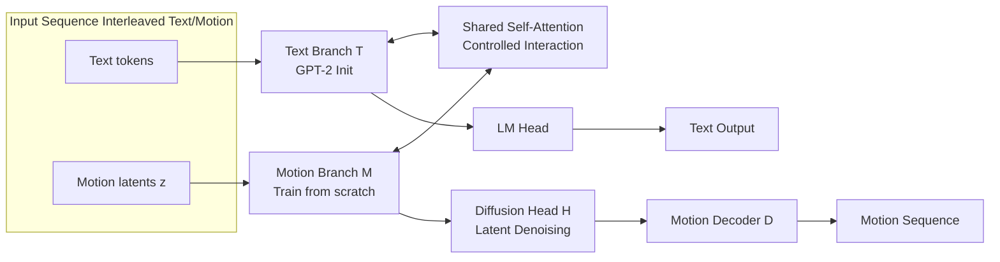

# MotionGPT3: Human Motion as a Second Modality

**Conference**: ICLR 2026  
**arXiv**: To be confirmed (OpenReview: https://openreview.net/forum?id=Ha075JDMZR)  
**Code**: https://github.com/OpenMotionLab/MotionGPT3  
**Area**: Human Understanding / Motion-Language Unified Modeling  
**Keywords**: Human motion generation, Motion-text understanding, Continuous VAE latent space, Bimodal Transformer, Latent space diffusion, Multimodal LLM  

## TL;DR
By treating human motion as a "second modality," this work replaces discrete VQ tokens with a continuous VAE latent space and utilizes a symmetric motion branch with shared attention instead of a single-stream backbone. Combined with a lightweight diffusion head attached to the autoregressive backbone, a unified model performs both text-to-motion generation and motion-to-text understanding, achieving $2-4\times$ faster training convergence.

## Background & Motivation
- **Background**: Multimodal LLMs aim to unify "understanding and generation" into a single backbone, a paradigm already proven in image, audio, and video domains. The mainstream approach in motion modeling is to discretize motion into tokens via VQ-VAE and feed them into a Transformer, reusing text training and inference pipelines via next-token prediction.
- **Limitations of Prior Work**: (1) **Quantization error ceiling**—discretizing continuous trajectories into codebook indices loses high-frequency micro-dynamics and breaks semantic-physical consistency; RVQ or post-training tokenization only mitigate rather than eliminate this "numerical-semantic discontinuity." (2) **Single-stream crosstalk**—forcing discrete text and continuous motion into the same pathway leads to gradient interference and loss scale mismatch during multi-objective optimization, resulting in hyperparameter sensitivity, training instability, and loss of language capability (negative transfer).
- **Key Challenge**: The statistical properties of motion (continuous, low-dimensional, strong kinematic priors) are fundamentally incompatible with the discrete symbol assumptions of LLMs. It is difficult to balance the continuous nature of motion with the reasoning benefits of LLMs within a "single shared representation."
- **Goal**: Develop a bimodal motion-language model that avoids quantization bottlenecks while explicitly balancing multimodal and multi-objective training to support unified motion understanding and generation.
- **Key Insight**: **[Motion as a Second Modality]**—Borrowing from Mixture-of-Transformers, the language backbone is equipped with a symmetric motion branch. Both branches retain their own embeddings, FFNs, and normalization, only exchanging information through shared self-attention layers. **[Continuous Latent Space + Latent Diffusion]**—Motion is directly encoded into continuous latent vectors using a pre-trained VAE, and a lightweight diffusion head attached to the LLM hidden states performs denoising to recover the motion, bridging continuous motion with the autoregressive framework.

## Method

### Overall Architecture
MotionGPT3 consists of three components: a **Motion VAE** that compresses motion into continuous latent vectors, a **Bimodal backbone** where text and motion follow separate paths and meet only at shared attention layers, and a **Lightweight diffusion head** that translates LLM hidden states back into motion latent vectors. The text branch is initialized with GPT-2, the motion branch is trained from scratch, and a three-stage "generate-then-align" training strategy is used to align the motion branch with the language branch.

### Key Designs

**1. Continuous VAE Latent Representation vs. Discrete VQ Tokens: Replacing Codebooks with Smooth Manifolds**. Given an $N$-frame motion sequence $m_{1:N}$, the encoder $\mathcal{E}$ maps it to a compact continuous latent vector $z \in \mathbb{R}^d$, and the decoder $\mathcal{D}$ reconstructs $m = \mathcal{D}(\mathcal{E}(m))$. The VAE is pre-trained using reconstruction loss (including pose and velocity kinematic terms) and KL regularization. The KL term reduces latent variance to create a smooth manifold where adjacent points correspond to gradual motion changes. Using real-valued vectors instead of codebook indices avoids quantization artifacts and preserves high-frequency micro-dynamics—precisely where the VQ route hits a ceiling.

**2. Bimodal Backbone + Shared Attention for Controlled Interaction: Routing Modalities Separately**. Each element of the input sequence $S = s_{1:k}$ is either a text embedding $\tau_i$ or a motion latent $z_i$, assigned by a router $\vartheta_i \in \{0,1\}$ to the text branch $\mathcal{T}$ or motion branch $\mathcal{M}$. Each branch computes its own hidden states $h_t$ and $h_m$, which are then re-concatenated in original order and fed into shared self-attention layers. This allows information exchange only at the attention level without collapsing into a single embedding space. Since continuous latents lack a vocabulary, specific interfaces are added: boundary tokens like `<som>/<eom>/<motion_in>/<motion_out>`, a Motion Understanding Head to linearly map latents to the Transformer input space, and a Motion Generation Head to project hidden states back to the VAE latent space via diffusion.

**3. Latent Diffusion Head in Autoregressive Backbone: Bridging Continuous and Discrete Gaps**. The autoregressive + cross-entropy nature of LLMs naturally assumes discrete targets, which is incompatible with continuous motion latents. A lightweight diffusion module $\mathcal{H}$ is attached to predict motion latents from the backbone hidden states. During training, fixed forward noise is added to the ground-truth latent $z_0 = \mathcal{E}(x)$ to obtain $z_t = \sqrt{\bar\alpha_t}\, z_0 + \sqrt{1-\bar\alpha_t}\,\epsilon$. The denoiser $\mathcal{H}$ is conditioned on the motion hidden states $h_m$ and trained using the standard DDPM objective: $L_{\text{diff}} = \mathbb{E}_{z_0,t,\epsilon}\big[\|\epsilon - \mathcal{H}(z_t, t, h_m)\|_2^2\big]$. During inference, the text branch generates until it outputs `<som>`, followed by $K$ `<motion_out>` placeholders. Hidden states are extracted in one forward pass, and the diffusion head samples the clean latent $\hat z_0$.

**4. Three-stage "Generate-then-Align" Training: Progressively Pulling the Motion Branch into Language Space**. Stage I (Uni-task Pre-training) freezes the text branch and supervises the motion branch solely on text $\to$ motion tasks to provide stable initialization. Stage II (Cross-modal Alignment) still freezes the text branch but introduces multiple tasks (T2M, M2T, prediction, inbetweening) using instructional prompts. Stage III (Joint Fine-tuning) unfreezes all parameters for instruction fine-tuning on paired data to stabilize language capabilities. Ablations show this "generate-then-align" sequence is crucial; omitting Stage I causes T2M performance to collapse.

## Key Experimental Results

Experiments were conducted on HumanML3D and KIT-ML using a 263-dimensional pose representation. The model size is approximately 238M (124M GPT-2 text branch + motion branch), trained on 2 RTX 3090 GPUs.

### Main Results

Text-to-Motion Generation (HumanML3D, $\to$ indicates closer to Real is better):

| Type | Method | R@3$\uparrow$ | FID$\downarrow$ | MMDist$\downarrow$ | Diversity$\to$ |
|------|------|------|------|---------|-----------|
| Real | - | 0.797 | 0.002 | 2.974 | 9.503 |
| Gen. Only | MoMask | 0.807 | **0.045** | 2.958 | 9.620 |
| Gen. Only | **MotionGPT3†** | **0.826** | 0.239 | **2.797** | 9.688 |
| Gen+Und | MoTe | 0.825 | 0.075 | 2.867 | - |
| Gen+Und | **MotionGPT3** (Unified) | **0.837** | 0.208 | **2.725** | 9.700 |

Motion-to-Text Understanding (HumanML3D captioning):

| Method | R@3$\uparrow$ | MMDist$\downarrow$ | Bleu@4$\uparrow$ | Rouge$\uparrow$ | Cider$\uparrow$ | BertScore$\uparrow$ |
|------|------|---------|---------|--------|--------|-----------|
| MoTe | **0.871** | 2.649 | 11.15 | 37.4 | **31.5** | 30.3 |
| MotionGPT3† | 0.853 | 2.524 | 17.661 | 44.997 | 30.980 | **35.850** |
| **MotionGPT3** (Unified) | 0.864 | **2.426** | **19.412** | **46.173** | 28.721 | 35.231 |

Language metrics (Bleu/Rouge) are significantly higher, and MMDist is the lowest, indicating that bimodal alignment bonds motion and language closer at the semantic level.

### Ablation Study

Component Ablation (HumanML3D, crossing "Architecture $\times$ Representation"):

| Configuration | T2M R@3$\uparrow$ | T2M FID$\downarrow$ | M2T R@3$\uparrow$ | M2T BertScore$\uparrow$ |
|------|----------|----------|----------|----------------|
| Unified+VQ | 0.435 | 0.403 | - | - |
| Unified+VAE | 0.792 | 0.489 | 0.426 | 16.197 |
| Bimodal+VQ | 0.532 | 0.454 | 0.702 | 18.085 |
| **Bimodal+VAE** (Ours) | **0.826** | **0.239** | **0.853** | **35.850** |

Switching to Bimodal primarily benefits M2T (alleviating crosstalk), while switching to VAE primarily benefits T2M (removing quantization loss and improving synthesis fidelity).

Training Stage Ablation (HumanML3D):

| Stage I | Stage II | Stage III | T2M R@3$\uparrow$ | T2M FID$\downarrow$ | M2T R@1$\uparrow$ |
|:---:|:---:|:---:|------|------|------|
| ✔ | | | 0.826 | 0.239 | - |
| ✔ | ✔ | | 0.831 | 0.215 | 0.571 |
| ✔ | ✔ | ✔ | **0.837** | **0.208** | 0.573 |
| | ✔ | ✔ | 0.772 | 0.325 | 0.573 |

### Key Findings
- **VQ Path Ceiling**: VQ baselines saturate early at R@3 $\approx$ 0.5, significantly underperforming VAE variants—quantization loss acts as a hard ceiling.
- **Bimodal Acceleration**: Compared to single-stream, the bimodal structure speeds up diffusion loss convergence by approximately $2\times$. At the same loss level, bimodal maintains higher quality. Overall training loss converges $2\times$ faster, and validation converges up to $4\times$ faster.
- **CMA Layers are Non-monotonic**: Placing cross-modal attention in the last $L$ layers shows improvement up to $L=5$, but R-Precision drops slightly at $L=6$; "late but not entire path" CMA is optimal.
- **Stage I is Essential**: Removing T2M pre-training hurts T2M significantly while M2T remains stable, proving motion-specific initialization is key for generation.

## Highlights & Insights
- **Deconstructing the "Motion as Language" Metaphor**: The authors point out that discretization treats motion as symbols, masking the gap between symbolic sequences and continuous trajectories. Using continuous VAE latents with LLMs is a clear correction to this trend.
- **"Divide and Conquer" is Counter-intuitive but Effective**: Common wisdom suggests shared spaces bring modalities "closer," but experiments show single-stream coupling entangles modality structures and causes negative transfer.
- **Low-cost Reproducibility**: SOTA results achieved with 238M parameters and 2x 3090 GPUs make motion-language research accessible.
- **Diffusion Head as a "Translator"**: Running a small diffusion specialist in a low-dimensional latent space to bridge continuous generation into a next-token framework is a lightweight adhesive between two paradigms.

## Limitations & Future Work
- **Fine-grained Control Failures**: Directional cues (e.g., left/right) are prone to errors.
- **Single Latent Constraints**: Currently, each sequence produces one latent vector; fragment-level composition and local semantic alignment are not explicitly supported.
- **Out-of-domain Generalization**: Limited by data coverage.
- **Future Work**: Incorporating more pure text corpora in the final alignment, using stronger language backbones, exploring hierarchical/segmented latent representations for compositional control, and validating on larger, more diverse datasets.

## Related Work & Insights
- **Mixture-of-Transformers (MoT)**: Direct source of the bimodal architecture—modality-specific experts + shared attention allows modular training and reduces interference.
- **MLD / MotionGPT**: Predecessors in representation (MLD/Continuous VAE) and architecture (MotionGPT/Discrete Tokens). This work re-combines their strengths.
- **Chameleon / Show-o / Janus**: Visual-language unified models. The authors use these to argue against single-stream crosstalk and for the value of multi-stream routing.
- **Insight**: When the statistical properties of a new modality differ greatly from text, "separate paths + shared attention interaction + latent diffusion" serves as a transferable paradigm for continuous modalities like audio or point clouds.

## Rating
- **Novelty**: ⭐⭐⭐⭐ Combining continuous VAE latent space, MoT bimodal paths, and latent diffusion into a unified model. While individual components exist, the "Motion as Second Modality" framework is a distinct innovation.
- **Experimental Thoroughness**: ⭐⭐⭐⭐ Comprehensive comparison on HumanML3D/KIT-ML plus ablation on architecture, representation, CMA layers, and training stages.
- **Writing Quality**: ⭐⭐⭐⭐ Logic is clear, diagrams are helpful, and arguments are well-supported by data.
- **Value**: ⭐⭐⭐⭐ Provides a practical, efficient, and low-compute path for unified motion-language modeling with high reproducibility.

<!-- RELATED:START -->

## Related Papers

- [\[ICLR 2026\] HUMOF: Human Motion Forecasting in Interactive Social Scenes](humof_human_motion_forecasting_in_interactive_social_scenes.md)
- [\[ICLR 2026\] KinemaDiff: Towards Diffusion for Coherent and Physically Plausible Human Motion Prediction](kinemadiff_towards_diffusion_for_coherent_and_physically_plausible_human_motion_.md)
- [\[ICLR 2026\] PulpMotion: Framing-Aware Multimodal Camera and Human Motion Generation](pulp_motion_framing-aware_multimodal_camera_and_human_motion_generation.md)
- [\[ICLR 2026\] Human-Object Interaction via Automatically Designed VLM-Guided Motion Policy](human-object_interaction_via_automatically_designed_vlm-guided_motion_policy.md)
- [\[ECCV 2024\] Towards Unified Representation of Invariant-Specific Features in Missing Modality Face Anti-Spoofing](../../ECCV2024/human_understanding/towards_unified_representation_of_invariant-specific_features_in_missing_modalit.md)

<!-- RELATED:END -->
