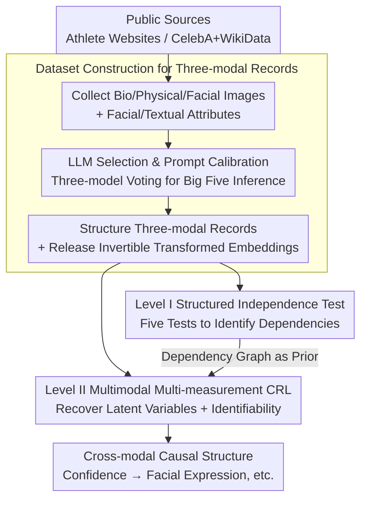

# PersonaX: Multimodal Datasets with LLM-Inferred Behavior Traits

**Conference**: ICLR2026  
**arXiv**: [2509.11362](https://arxiv.org/abs/2509.11362)  
**Code**: [lokali/PersonaX](https://github.com/lokali/PersonaX)  
**Area**: Human Understanding  
**Keywords**: multimodal dataset, behavior traits, Big Five, causal representation learning, LLM, identifiability  

## TL;DR
Ours constructs the PersonaX multimodal dataset (containing LLM-inferred Big Five behavior traits, facial embeddings, and biographical metadata) and proposes a two-layer analysis framework: structured independence testing + unstructured causal representation learning (with identifiability theoretical guarantees) to reveal cross-modal causal structures.

## Background & Motivation
- Understanding human behavior traits is crucial for human-computer interaction, computational social science, and personalized AI systems. However, existing datasets rarely provide behavior descriptors simultaneously with complementary modalities such as facial attributes and biographical information.
- Behavior traits differ from personality in psychology (internal dispositions); they are external behavioral patterns observable from public information and can be ethically inferred at scale.
- Advances in LLMs enable reliable behavior trait assessment based on the Big Five framework under carefully designed prompts, yet systematic cross-modal and causal analysis resources are lacking.
- Existing multimodal datasets (e.g., YouTube-Vlogs, MuPTA, MDPE) often lack explicit textual trait descriptions or cross-modal interpretation frameworks.

## Core Problem
1. How to construct a large-scale, multimodal, privacy-preserving behavior trait dataset?
2. What statistical dependencies exist between behavior traits, facial attributes, and biographical features?
3. How to learn latent variables and their causal mechanisms from unstructured multimodal data with identifiability guarantees?

## Method

### Overall Architecture
PersonaX divides the work into two stages: "data construction" followed by "analysis." The data construction stage collects two complementary datasets from public sources (the athlete dataset AthlePersona and the celebrity dataset CelebPersona). It uses rigorously selected and prompt-calibrated LLMs to infer the Big Five behavior traits for each individual. Each record is organized as a "behavior trait text + facial embedding + biographical metadata" triplet, and only embeddings subjected to invertible transformations are released to protect privacy. The analysis stage uses a two-layer framework to reveal cross-modal relationships: Level I performs statistical independence tests on structured variables (trait scores, physical traits, geography, etc.) to identify true correlations; Level II performs Causal Representation Learning (CRL) on unstructured image/text embeddings to recover underlying latent variables and their causal structures, supported by identifiability proofs ensuring the learned latent variables are semantic causal factors. This ultimately outputs cross-modal causal chains such as "Confidence → Facial Expression."

### Key Designs

**1. Dataset Construction for Three-modal Records: Providing Multimodal Foundations for Behavior Traits with Secure Release**

For behavior traits to be analyzed at scale, they must be linked to observable signals like faces and biography within the same record without compromising the identities of individuals. AthlePersona collects biography (name, DOB, nationality), physical traits (height, weight), and facial images of 4,181 male professional athletes from seven major league websites (NBA, NFL, NHL, ATP, PGA, Premier League, Bundesliga), geocoding nationality into coordinates. CelebPersona, based on CelebA, links 9,444 public figures to WikiData entities for biographical completion and retains 10 attributes reflecting stable appearance (e.g., Big Nose, High Cheekbones) from the original 40, discarding transient attributes (e.g., Heavy Makeup). Each record integrates three components: LLM-inferred behavior trait text descriptions and Big Five scores, facial images with attribute labels, and structured biographical metadata. To balance "analyzability" and "privacy," the dataset does not release raw images or text—facial images are converted to 1024-dimensional ImageBind embeddings, and text to 3584-dimensional gte-Qwen2 embeddings. Both undergo an invertible transformation layer for obfuscation, while categorical variables are converted to indices. This transformation ensures statistical and causal structures required for downstream analysis remain intact while preventing raw content recovery.

**2. LLM Selection and Prompt Calibration: Standardizing Subjective Trait Assessment into Reproducible Annotation**

Behavior trait assessment is inherently subjective, and the reliability of using LLMs for Big Five inference depends heavily on the model and prompt. Consequently, the authors treat this as an annotation step requiring quantitative screening. They systematically evaluated ten SOTA LLMs, scoring them across dimensions: generation time, missing rate, hesitation rate, privacy protection, output format, context consistency, and factual accuracy. ChatGPT-4o achieved the highest overall score ($OS=0.96$), followed by Gemini2.5-Pro and Llama-4. Regarding output formats, they compared numeric/textual outputs and 3-point/5-point scales, finding that the 3-point numeric scale exhibited the lowest rating variability and highest stability. Ultimately, ChatGPT-4o-Latest, Gemini-2.5-Pro, and Llama-4-Maverick were used to jointly generate trait annotations, using multi-model voting to reduce subjective bias from a single model and ensure reproducible annotations.

**3. Level I Structured Independence Test: Statistical Discovery of True Dependencies**

In the analysis phase, dependency screening is performed on structured variables (trait scores, gender, occupation, physical traits, geography) to avoid subsequent causal analysis based on spurious correlations. Big Five trait scores are aggregated by median after removing "0" values (indicating insufficient information). Five independence tests are applied in parallel for cross-verification: non-parametric KCI, RCIT, and HSIC for continuous variables, and Chi-square and G-square for discrete variables, with dependencies determined at a $p<0.05$ significance level. This cross-validation reduces the risk of misjudgment by a single method, and the resulting dependency graph provides priors for Level II causal analysis.

**4. Level II Multimodal Multi-measurement CRL: Recovering Latent Variables and Causal Chains from Embeddings**

Unstructured image/text embeddings cannot be directly subjected to statistical tests; underlying latent variables must be learned first. The authors define observations $\mathbf{x} = [\mathbf{x}_1, \dots, \mathbf{x}_M]$ for $M$ modalities, corresponding to causally related latent variables $\mathbf{z} = [\mathbf{z}_1, \dots, \mathbf{z}_M]$, and introduce a cross-modality shared latent variable $\mathbf{s}$ to explain inter-modal associations. The data generation process is modeled as causal relationships between latent variables $z_{m,i} = g_{z_{m,i}}(\text{Pa}(z_{m,i}), \mathbf{s}, \epsilon_{m,i})$ and modality generation functions $\mathbf{x}_m = g_{\mathbf{x}_m}(\mathbf{z}_m, \boldsymbol{\eta}_m)$. Crucially, they prove that under four mild assumptions, this multimodal multi-measurement setting is identifiable. For the same observation $\mathbf{x}$, each estimated latent variable component $\hat{z}_{m,i}$ is equivalent to the true $z_{m,i}$ up to an invertible mapping. This implies the learned latent variables are not arbitrarily entangled representations but true semantic causal factors, supporting the derivation of cross-modal causal chains like "Confidence → Facial Expression."

### Loss & Training
The training objective for the CRL network is a weighted combination of three terms: Reconstruction loss $\mathcal{L}_{\text{Recon}}$ uses MSE to reconstruct observations from each modality to ensure latent variables retain sufficient information; Independence constraint $\mathcal{L}_{\text{Ind}}$ uses KL divergence to align latent variable distributions to an isotropic Gaussian prior to encourage disentanglement; Sparsity regularization $\mathcal{L}_{\text{Sp}}$ uses the L1 norm to constrain the learnable adjacency matrix (implemented via normalizing flows) to obtain a sparse, interpretable causal graph. The total loss is $\mathcal{L} = \alpha_{\text{Recon}} \mathcal{L}_{\text{Recon}} + \alpha_{\text{Ind}} \mathcal{L}_{\text{Ind}} + \alpha_{\text{Sp}} \mathcal{L}_{\text{Sp}}$.

## Key Experimental Results

### Synthetic Experiments (Colored MNIST + Fashion MNIST)

| Method | R² | MCC |
|------|-----|-----|
| BetaVAE | Low | Low |
| MCL | Low | Low |
| MMCRL | 0.90 | 0.85 |
| **PersonaX (Ours)** | **0.96** | **0.92** |

### Independence Test Findings
- **CelebPersona**: Gender and occupation show strong dependencies with almost all trait scores; facial features (e.g., Pointy Nose, High Cheekbones) are significantly associated with trait scores.
- **AthlePersona**: Birth year and league affiliation are stronger sources of dependency; height and weight show consistent but moderate associations.
- Geographic variables (latitude/longitude) exhibit comparable moderate dependency across both datasets.

### Causal Graph Analysis (AthlePersona)
Causal graphs learned from real data show:
- Bilateral relationships exist between shared factors $S_1$ (mindset) and $S_2$ (culture).
- Cross-modal causal chains: Confidence ($Z_{2,1}$) → Facial Expression ($Z_{1,4}$); Emotional Stability ($Z_{2,3}$) → Appearance ($Z_{1,2}$).
- Sequential path for image latent variables: Skin Tone → Attractiveness → Facial Expression.

## Highlights
- **First large-scale multimodal dataset unifying LLM-inferred behavior traits with facial embeddings and biographical metadata**, filling a gap in existing resources.
- **Exquisitely designed two-layer analysis framework**: The structured layer reveals dependencies via statistical tests, while the unstructured layer learns causal mechanisms via CRL, complementing each other.
- The proposed CRL method provides **new identifiability theoretical guarantees under multimodal multi-measurement settings**, extending existing theories.
- Rigorous LLM selection process evaluating ten models across eight dimensions.
- Robust privacy measures: Raw data is not released; only embeddings with invertible transformations are provided.

## Limitations & Future Work
- **Group Bias**: AthlePersona includes only male athletes, and CelebPersona is biased toward wealthy, high-profile individuals, lacking universal representation.
- **Lack of Temporal Stability**: Behavior traits are dynamic, but data is inferred from static public information without longitudinal tracking.
- **LLM Inference Reliability**: Despite multi-model voting increasing robustness, LLM assessment of behavior traits remains subjective.
- Future work may expand to more data sources, including female athletes and more diverse groups.
- Semantic interpretation of latent variables in causal graphs relies on posterior guidance from independence test results, rather than being fully automated.

## Related Work & Insights

| Dataset | Modalities | Behavior Traits | Trait Framework | Causal Analysis |
|--------|------|----------|----------|----------|
| SALSA | Video+Sensors | Indirect | None | None |
| YouTube-Vlogs | Video+Audio | Impression Scores | Big Five | None |
| MuPTA | Video+Audio+Physio | Yes | Big Five | None |
| MDPE | Multimodal | Personality+Emotion | Big Five | None |
| **PersonaX** | **Image Emb.+Text Emb.+Bio** | **LLM-Inferred** | **Big Five** | **Yes (CRL+Identifiability)** |

The uniqueness of PersonaX lies in: (1) largest scale (9444+4181), (2) the only one providing explicit LLM-inferred behavior trait text, and (3) the only one including causal representation learning analysis with theoretical guarantees.

## Rating
- Novelty: ⭐⭐⭐⭐ — Combination of multimodal behavior trait dataset + new CRL theory is original.
- Experimental Thoroughness: ⭐⭐⭐⭐ — Dual validation with synthetic and real data; comprehensive independence testing.
- Writing Quality: ⭐⭐⭐⭐ — Clear structure; two-layer analysis framework is well-organized.
- Value: ⭐⭐⭐⭐ — Dataset and method offer long-term value to the multimodal causal inference community.

<!-- RELATED:START -->

## Related Papers

- [\[CVPR 2026\] Multi-level Causal LLM-based Text-to-Motion Generation with Human Alignment (MoTiGA)](../../CVPR2026/human_understanding/multi-level_causal_llm-based_text-to-motion_generation_with_human_alignment.md)
- [\[ECCV 2024\] Facial Affective Behavior Analysis with Instruction Tuning](../../ECCV2024/human_understanding/facial_affective_behavior_analysis_with_instruction_tuning.md)
- [\[CVPR 2026\] LaMoGen: Language to Motion Generation Through LLM-Guided Symbolic Inference](../../CVPR2026/human_understanding/lamogen_language_to_motion_generation_through_llm-guided_symbolic_inference.md)
- [\[ICML 2026\] Efficient, Validation-Free Intrinsic Quality Estimation for Large-Scale Face Recognition Datasets](../../ICML2026/human_understanding/efficient_validation-free_intrinsic_quality_estimation_for_large-scale_face_reco.md)
- [\[ICLR 2026\] PulpMotion: Framing-Aware Multimodal Camera and Human Motion Generation](pulp_motion_framing-aware_multimodal_camera_and_human_motion_generation.md)

<!-- RELATED:END -->
