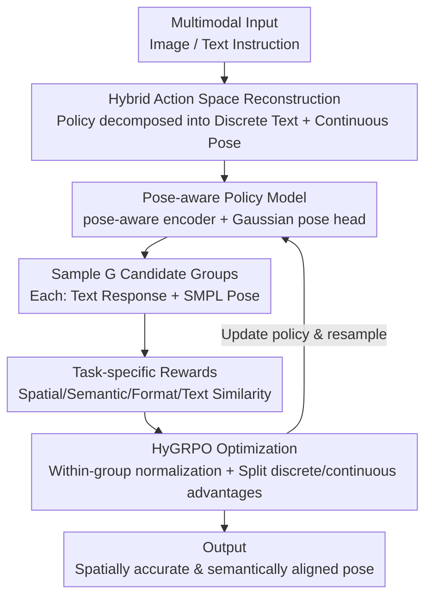

# Pose-RFT: Aligning MLLMs for 3D Pose Generation via Hybrid Action Reinforcement Fine-Tuning

**Conference**: ICLR 2026  
**OpenReview**: [https://openreview.net/forum?id=ea1U1MgbdT](https://openreview.net/forum?id=ea1U1MgbdT)  
**Code**: To be confirmed  
**Area**: Multimodal VLM / 3D Human Pose / Reinforcement Fine-tuning  
**Keywords**: 3D Human Pose Generation, MLLM, Reinforcement Fine-Tuning, Hybrid Action Space, SMPL

## TL;DR
Addressing the alignment gap where pose-specific MLLMs are forced into "average solutions" under supervised fine-tuning due to one-to-many ambiguity, this paper proposes Pose-RFT. It reformulates 3D human pose generation as a hybrid action reinforcement learning problem of "discrete text + continuous pose," utilizes the HyGRPO algorithm to optimize both output types separately, and incorporates four task-specific rewards, significantly outperforming existing pose-specific MLLMs on multiple benchmarks.

## Background & Motivation
**Background**: Generating 3D human poses (typically represented by SMPL parameters) from images or text has been an active research direction. Pose-specific multimodal large models (pose-specific MLLMs, such as ChatPose and UniPose) have shown potential by attaching a pose decoding head to a general LLM, allowing the model to jointly reason over language, vision, and 3D poses. The standard training paradigm for these models is Supervised Fine-Tuning (SFT).

**Limitations of Prior Work**: 3D pose generation is inherently "one-to-many." In text-to-pose, a phrase like "dancing, standing on one leg" can correspond to a wide range of plausible poses; in image-to-pose, a single 2D image also corresponds to multiple plausible 3D poses due to perspective ambiguity—a classic ill-posed problem. SFT uses regression loss to fit a unique ground truth for each sample, essentially learning a deterministic mapping that fundamentally mismatches this one-to-many distribution.

**Key Challenge**: To minimize expected error across the dataset, SFT models are forced to predict an "averaged" and often suboptimal output. This creates an **alignment gap** between model predictions and the true objectives (semantic consistency, spatial precision): the model is not incapable, but is constrained to the center of the distribution by the training objective.

**Goal**: To close this gap by shifting the learning paradigm from "supervised imitation" to "reward-driven optimization," allowing the model to directly pursue high-reward outputs aligned with semantics and spatial accuracy.

**Key Insight**: Reinforcement Learning (RL) is naturally suited for approximating task objectives using reward signals. However, existing Reinforcement Fine-Tuning (RFT) algorithms are almost exclusively designed for the discrete token space of language and cannot handle fine-grained continuous parameters like 3D poses.

**Core Idea**: Explicitly model pose generation as a **hybrid action space**—where the policy must simultaneously produce discrete actions (text tokens) and continuous actions (3D pose parameters)—and design an RL algorithm (HyGRPO) capable of stable optimization in this hybrid space, driven by task-specific rewards.

## Method

### Overall Architecture
The goal of Pose-RFT is to push a pose-specific MLLM from an "averaged solution derived from supervised imitation" to a "high-reward solution driven by rewards." The process is an online RL loop: given multimodal input (images or text instructions), the model acts as a **hybrid policy** to sample $G$ groups of candidate outputs, each consisting of "a text response + a 3D pose." These candidates are scored by task-specific reward functions. The HyGRPO algorithm then normalizes the within-group rewards into advantages to update the discrete and continuous policy heads separately, eventually biasing the model toward generating spatially accurate and semantically aligned poses.

To ensure a sufficiently strong policy base before sampling, the architecture is enhanced in two ways: integrating a pose-aware ViT encoder pre-trained on pose estimation to extract pose-related visual features, and formulating the continuous pose head as a differentiable multivariate Gaussian distribution (outputting mean and covariance) to enable both stochastic sampling and gradient optimization.

### Key Designs

**1. Hybrid Action Space Reconstruction: Modeling Pose Generation as a Joint Policy of "Discrete Text + Continuous Pose"**

This step directly addresses the core challenge—poses are continuous, while RL/RFT tools are designed for discrete tokens. The authors formulate the overall policy as a joint distribution and factorize it:

$$\pi_\theta(a, p \mid q) = \pi_\theta(a \mid q) \cdot \pi_\theta(p \mid q, a),$$

where $q$ is the multimodal input, $a$ is the discrete text response, and $p$ represents the continuous 3D pose parameters. The discrete sub-policy $\pi_\theta(a\mid q)$ manages text, while the continuous sub-policy $\pi_\theta(p\mid q,a)$ manages the pose conditioned on the input and generated text. Crucially, the continuous part no longer performs point estimation regression but is modeled as a multivariate Gaussian:

$$\pi_\theta(p \mid q, a) = \mathcal{N}\big(p;\, \mu_\theta(q,a),\, \Sigma_\theta(q,a)\big),$$

where the mean $\mu_\theta$ and covariance $\Sigma_\theta$ are predicted by the pose head. This serves two purposes: first, the covariance explicitly models the aleatoric uncertainty of poses, fitting the one-to-many distribution; second, the differentiable Gaussian allows for stochastic sampling (essential for RL exploration) and gradient-based optimization. This removes the barrier of "unable to perform RL on continuous poses."

**2. Pose-aware Policy Model: Supplementing the Shared Multimodal Embedding Space with Pose-related Visual Features**

A hybrid policy alone is insufficient. Leveraging the cross-modal alignment established during MLLM pre-training, the authors build both discrete and continuous policies on the same "language-aligned multimodal embedding space." Since general CLIP encoders are insensitive to fine-grained pose cues, an additional **pose-aware encoder**—a ViT pre-trained on pose estimation (from HMR2.0)—is introduced. Its pose-related features are fused with language-aligned embeddings to provide a more informative state space for RL. This architectural enhancement, combined with Gaussian probabilistic modeling, establishes a strong SFT baseline upon which RFT improves. Ablations show this encoder significantly increases spatial rewards in image-to-pose tasks but provides minimal help for semantic rewards in text-to-pose tasks—consistent with its role as a vision-centric module with low text alignment.

**3. HyGRPO: Group Relative Policy Optimization in Hybrid Action Space**

This is the core algorithm, solving the problem of "how to simultaneously and stably optimize discrete and continuous heads within a single objective." For each sample $q$, $G$ candidate groups $\{a_i, p_i\}_{i=1}^{G}$ are sampled. The importance weight is calculated as the ratio of the current policy to the reference policy and naturally decomposes into discrete and continuous terms:

$$r_i(\theta) = \frac{\pi_\theta(a_i\mid q)}{\pi_{\text{ref}}(a_i\mid q)} \cdot \frac{\pi_\theta(p_i\mid q,a_i)}{\pi_{\text{ref}}(p_i\mid q,a_i)} = r_d(a_i\mid q)\cdot r_c(p_i\mid q,a_i).$$

Another key design is the decomposition of the normalized advantage $\hat{A}$ into a discrete advantage $\hat{F}(q,a)$ (measuring text response quality) and a continuous advantage $\hat{\Delta}(q,a,p)$ (measuring pose quality). The final objective adopts the PPO clip for stability, applying clipping to both parts:

$$J_{\text{HyGRPO}} = \mathbb{E}\Big[\tfrac{1}{G}\sum_{i=1}^{G}\min(r_d\hat{F}_i, \text{clip}(r_d,1{-}\epsilon,1{+}\epsilon)\hat{F}_i) + \tfrac{1}{V}\sum_{i=1}^{V}\min(r_c\hat{\Delta}_i, \text{clip}(r_c,1{-}\epsilon,1{+}\epsilon)\hat{\Delta}_i) - \beta D_{\text{KL}}(\pi_\theta\|\pi_{\text{ref}})\Big].$$

Note that the discrete part is normalized over all $G$ candidates, while the continuous part is normalized only over the **subset $V$ containing valid pose outputs**—as not every sample produces a valid `<POSE>` tag. This "split advantage signal" allows the text and pose heads to receive their respective gradients, avoiding instability when forcing continuous poses into a discrete RL framework. Ablations comparing GRPO (discrete only) and HyGRPO show that GRPO fails to improve continuous pose quality, while HyGRPO consistently increases both spatial and semantic rewards.

**4. Task-specific Rewards: Providing a "Ruler" for Each Component of the Hybrid Output**

HyGRPO relies on rewards for navigation. The authors designed four rewards following the principle that "each reward is responsible for one component of the output," managing both continuous pose (spatial + semantic) and discrete text (format + correctness) to preserve original dialogue capabilities while learning new pose skills. ① **Spatial Positioning Reward** (image-to-pose) uses the inverse of joint error $R_{\text{joint}} = 1/\lVert J_{\text{pred}} - J_{\text{gt}}\rVert_2$; ② **Semantic Alignment Reward** (text-to-pose) uses a pre-trained text-pose retrieval model to map both into a shared space, taking the cosine similarity $R_{\text{semantic}} = \cos(\phi_t(q), \phi_p(p))$; ③ **Format Reward** $R_{\text{format}}$ uses regex matching to check if the output follows templates like "The SMPL pose of this person is `<POSE>`."; ④ **Text Embedding Similarity Reward** $R_{\text{text}} = \cos(E(a_{\text{pred}}), E(a_{\text{gt}}))$ uses the BGE-M3 encoder to calculate cosine similarity between generated and ground-truth text, anchoring general VQA capabilities during pose fine-tuning.

### Loss & Training
The backbone is LLaVA-1.5V-7B, with the pose-aware encoder using the pre-trained ViT from HMR2.0. During pre-training and fine-tuning, both the CLIP encoder and pose-aware encoder are frozen; only projectors and task heads are updated, and the LLM is fine-tuned using LoRA. Training data is a mix of four sources: text-pose (PoseScript), image-pose (Human3.6M / MPI-INF-3DHP / COCO / MPII), image-text (BEDLAM-Script), and VQA (LLaVA-Instruct-150k).

## Key Experimental Results

### Main Results
Image-to-pose (Human Pose Estimation, lower reconstruction error is better), comparing MLLM-based methods on 3DPW / Human3.6M / RPE:

| Method | 3DPW MPJPE↓ | 3DPW PA-MPJPE↓ | H3.6M MPJPE↓ | RPE MPJPE↓ | RPE PA-MPJPE↓ |
|------|------|------|------|------|------|
| ChatPose | 163.6 | 81.9 | 126.0 | 275.0 | 101.8 |
| UniPose | 94.7 | 59.1 | 69.2 | 213.4 | 94.1 |
| **Pose-RFT (Ours)** | **85.9** | **51.6** | **63.0** | **198.6** | **87.0** |

Pose-RFT leads in all MLLM-based comparisons and sets a new SOTA on the RPE (Reasoning Pose Estimation) task, which requires vision-language reasoning—a scenario where traditional discriminative models fall short. (Note: traditional specialized models like HMR2.0 still achieve lower errors in standard reconstruction, a gap the authors acknowledge.)

Text-to-pose (PoseScript Retrieval Recall@K, higher is better, shown for K=5/10/20):

| Method | Full Retrieval R@5/10/20 (T2P) | Random Sampling R@5/10/20 (T2P) |
|------|------|------|
| ChatPose | 17.6 / 25.3 / 35.8 | 39.9 / 50.6 / 58.7 |
| UniPose | — | 73.7 / 82.4 / 89.6 |
| **Pose-RFT (Ours)** | **42.2 / 53.0 / 65.5** | 71.8 / 82.6 / 88.7 |

Pose-RFT achieves the best performance across most metrics, particularly in the pose-to-text ($R_{P2T}$) direction, which the authors attribute to the semantic alignment reward enhancing fine-grained text-pose correspondence.

### Ablation Study
Synergy between Distributional Modeling and RFT (3DPW + PoseScript-H2):

| Config | Dist. | RFT | MPJPE↓ | PA-MPJPE↓ | mRecall T2P↑ | mRecall P2T↑ |
|------|------|------|------|------|------|------|
| Baseline | ✗ | ✗ | 90.4 | 57.1 | 36.2 | 41.5 |
| Baseline + Dist. | ✓ | ✗ | 91.4 | 59.2 | 37.4 | 42.0 |
| Baseline + Dist. + RFT | ✓ | ✓ | **85.9** | **51.6** | **53.6** | **57.6** |

### Key Findings
- **Distributional heads are ineffective without RFT**: Simply adding the Gaussian head (Baseline + Dist.) shows minimal change or slight degradation compared to the deterministic baseline. However, once RFT is added, performance jumps significantly—indicating that the value of probabilistic modeling lies in paving the way for reward-driven exploration in RL.
- **RFT is the primary driver of performance gains**: Adding RFT brings the largest gains across all tasks and metrics, validating the effectiveness of moving from a supervised to a reward-driven paradigm for closing the alignment gap.
- **HyGRPO cannot be replaced by GRPO**: Replacing HyGRPO with GRPO (which only supports discrete actions) results in zero improvement in continuous pose quality. HyGRPO's continuous rise in spatial/semantic reward curves proves that the hybrid action algorithm is the technical key to success.
- **Pose-aware encoder is vision-centric**: It significantly boosts spatial rewards in image-to-pose but offers little for semantic rewards in text-to-pose, due to the low alignment of its features with text inputs.

## Highlights & Insights
- **Reframing "ill-posedness/one-to-many" as an RL resource**: Instead of treating one-to-many mapping as noise to be averaged (SFT), this paper uses Gaussian covariance to explicitly model uncertainty and then uses rewards to select high-quality solutions.
- **Advantage Decomposition + Split Normalization**: Normalizing discrete actions over all $G$ candidates while normalizing continuous actions only over the valid pose subset $V$ cleanly handles the practical issue of samples failing to produce valid pose tags. This trick is transferable to any hybrid RFT scenario involving text and structured outputs.
- **Modular Reward Division**: Using the BGE-M3 text similarity reward as an "anchor" ensures the model retains general VQA capabilities while specializing in poses. This combination of "specialization rewards + general preservation rewards" is a reproducible template for other domain-specific fine-tuning.

## Limitations & Future Work
- The authors acknowledge that the model still lags behind traditional specialized models (e.g., HMR2.0) on standard reconstruction benchmarks; the advantage of MLLMs is primarily in reasoning-heavy RPE tasks.
- The pose-aware encoder provides almost no gain for text-to-pose, suggesting that feature fusion between visual and text lines is not yet fully unified. Semantic rewards rely on external pre-trained retrieval models, which may act as a performance bottleneck.
- HyGRPO requires sampling $G$ candidates per sample, making training costs highly dependent on sampling scale. The sensitivity to reward hyperparameters (e.g., weights, $\epsilon$, $\beta$) is not fully discussed.
- Future directions: Integrating pose-aware features with text alignment, replacing fixed retrieval models with learnable/verifiable semantic rewards, and extending hybrid action RFT to higher-dimensional continuous outputs like hand or whole-body meshes.

## Related Work & Insights
- **vs. ChatPose / UniPose (SFT-based MLLMs)**: These rely on SFT + SMPL parameter regression, leading to averaged solutions under one-to-many ambiguity. Pose-RFT switches to reward-driven RFT, directly optimizing spatial/semantic alignment and leading across MLLM comparisons.
- **vs. GRPO (Discrete RFT)**: GRPO is limited to discrete tokens. HyGRPO incorporates continuous heads into the same objective via policy and advantage decomposition, representing the core incremental contribution over standard RFT.
- **vs. Traditional Pose Estimation (HMR2.0, TokenHMR)**: Specialized models are stronger in pure reconstruction but lack vision-language reasoning. Pose-RFT sacrifices some pure precision for SOTA performance in reasoning-based pose estimation (RPE) and unified image/text task capabilities.

## Rating
- Novelty: ⭐⭐⭐⭐⭐ First hybrid action RFT framework for 3D human pose generation, integrating continuous poses into GRPO-style optimization.
- Experimental Thoroughness: ⭐⭐⭐⭐ Strong multi-task/benchmark results and key ablations on distribution/RFT/HyGRPO, though lacks reward hyperparameter sensitivity analysis.
- Writing Quality: ⭐⭐⭐⭐ Clear progression from motivation to contradiction to method; formulas align well with ablations.
- Value: ⭐⭐⭐⭐ Provides a reusable paradigm for "text + structured continuous output" hybrid RFT, offering insights for the pose and motion generation fields.

<!-- RELATED:START -->

## Related Papers

- [\[ICLR 2026\] EasyTune: Efficient Step-Aware Fine-Tuning for Diffusion-Based Motion Generation](easytune_efficient_step-aware_fine-tuning_for_diffusion-based_motion_generation.md)
- [\[ICLR 2026\] Pose Prior Learner: Unsupervised Categorical Prior Learning for Pose Estimation](pose_prior_learner_unsupervised_categorical_prior_learning_for_pose_estimation.md)
- [\[ICLR 2026\] From Sparse to Dense: Spatio-Temporal Fusion for Multi-View 3D Human Pose Estimation with DenseWarper](from_sparse_to_dense_spatio-temporal_fusion_for_multi-view_3d_human_pose_estimat.md)
- [\[CVPR 2026\] MoBind: Motion Binding for Fine-Grained IMU-Video Pose Alignment](../../CVPR2026/human_understanding/mobind_motion_binding_for_fine-grained_imu-video_pose_alignment.md)
- [\[ICLR 2026\] Cross-Domain Policy Optimization via Bellman Consistency and Hybrid Critics](cross-domain_policy_optimization_via_bellman_consistency_and_hybrid_critics.md)

<!-- RELATED:END -->
