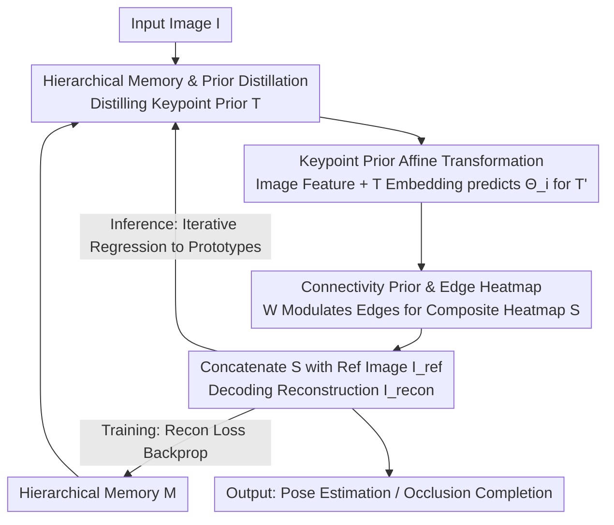

# Pose Prior Learner: Unsupervised Categorical Prior Learning for Pose Estimation

**Conference**: ICLR 2026  
**OpenReview**: [https://openreview.net/forum?id=hPY2jwJzZ4](https://openreview.net/forum?id=hPY2jwJzZ4)  
**Code**: Yes (Claimed public, see OpenReview link)  
**Area**: Pose Estimation / Self-Supervised Learning / Human Understanding  
**Keywords**: Categorical Prior, Unsupervised Pose Estimation, Hierarchical Memory, Template Transformation, Iterative Inference

## TL;DR
This paper proposes the Pose Prior Learner (PPL), which utilizes a hierarchical memory module to learn explicit and visualizable pose priors (keypoint priors + connectivity priors) from scratch using purely self-supervised image reconstruction. These priors constrain and iteratively refine pose estimation for single images. PPL outperforms manual-prior and prior-free baselines on several human and animal datasets and can complete reasonable full-body poses even under heavy occlusion.

## Background & Motivation

**Background**: Unsupervised pose estimation aims to learn keypoint structures from large amounts of unlabeled images. The dominant approach follows a self-supervised pipeline: "predict keypoints $\to$ assemble object structure $\to$ supervise via image reconstruction." These methods are divided into those that use no priors (e.g., AutoLink, BKind) and those that introduce manually defined categorical pose priors (e.g., STT, which uses predefined templates for affine alignment).

**Limitations of Prior Work**: Prior-free methods lack constraints on keypoint configurations and connectivity, often causing keypoints to fall on complex background textures or predicting topologically unreasonable poses under occlusion. Prior-based methods use categorical "standard poses" for regularization but require expensive manual annotations (especially for new categories). Furthermore, human annotations introduce implicit biases and may not be optimal—previous work (HPE) found that adjusting prior shapes could actually improve performance.

**Key Challenge**: While priors are useful for pose estimation, the question of "where the prior comes from" has not been well-addressed. Priors are either manually labeled at high cost or omitted entirely, allowing the model to be misled by backgrounds. Implicitly embedding priors in network weights makes them uninterpretable and impossible to analyze.

**Goal**: This paper formally defines "unsupervised categorical prior learning" as an independent problem: Can a general categorical pose prior be learned in a self-supervised manner solely from images without human labels? Pose estimation is then used as a testbed to verify the quality of the learned prior. This breaks down into three questions: How is the prior obtained? Can it be learned self-supervised from data? Can the prior quality be further improved?

**Key Insight**: Loosely inspired by humans—who form a general categorical prior impression by observing individuals of a class and then use it to infer new individuals' poses—this work uses a hierarchical memory to store "prototypical poses" and distills a general prior from them. The entire process is supervised only by image reconstruction.

**Core Idea**: A hierarchical memory stores compositional parts of keypoint configurations to distill **explicit, symbolic** pose priors (keypoint prior $T$ + connectivity prior $W$). These priors serve as constraints for estimating individual poses via affine transformation and image reconstruction. During inference, an iterative strategy regresses the estimated pose back to the prototypical poses in memory, enabling completion even in occluded scenes.

## Method

### Overall Architecture
PPL models pose as a graph connecting keypoints. The categorical pose prior is defined as $V=(T,W)$, where the keypoint prior $T=[P_1,\dots,P_N]$ consists of $N$ normalized 2D coordinates ($P_i\in[-1,1]\times[-1,1]$), and the connectivity prior $W$ is an $N\times N$ matrix where $w_{ij}$ represents the probability of a physical connection between keypoints $i$ and $j$. $T$, $W$, and the hierarchical memory $M$ are initially randomly initialized learnable parameters.

The pipeline operates as follows: First, the current keypoint prior $T$ is distilled from hierarchical memory $M$. Input image $I$ features and $T$ embeddings are concatenated to predict affine transformation parameters $\Theta_i$ for each keypoint, transforming $T$ into image-specific keypoints $T'$. The connectivity prior $W$ modulates edge heatmaps between any two points, which are max-pooled into a composite connectivity heatmap $S$. Finally, $S$ is concatenated with a reference image $I_{ref}$ (providing the background) and fed into a decoder to reconstruct image $I_{recon}$. The reconstruction quality provides backpropagation supervision. During inference, an iterative strategy repeatedly regresses estimated poses toward prototypical poses.

### Key Designs

**1. Hierarchical Memory and Keypoint Prior Distillation: Compiling Prototypical Poses into Compositional Parts**

Addressing the problem of prior origin and interpretability, PPL organizes memory $M$ into $m$ memory banks $\{b_1,\dots,b_m\}$, each containing $k$ learnable $d$-dimensional vectors ($m{=}34, k{=}16, d{=}512$). Given estimated keypoints $T'$, several MLP-Mixer blocks $\mathrm{MIX}_{enc}$ encode them into $m$ tokens $G=[g_1,\dots,g_m]$. Each token $g_i$ is mapped to the independent embedding space of its bank $b_i$. During retrieval, the most similar vector $g'_i$ is selected from $b_i$ via L2 distance to form $G'$, which is then decoded back to $N$ keypoints $T'_{recon}$ by $\mathrm{MIX}_{dec}$. The general prior is distilled by mean-pooling each bank $\mathrm{MP}(b_i)$ and decoding the result: $T=\mathrm{MIX}_{dec}([\mathrm{MP}(b_1),\dots,\mathrm{MP}(b_m)])$.

Hierarchical design (multiple banks, independent spaces) offers three advantages: capacity grows exponentially with layers; partitioning information across banks allows robust prototype retrieval under uncertainty (occlusion) by hypothesizing missing parts; and multi-level retrieval progressively narrows the search space. Unlike PCT, which uses a single space, PPL allows each bank to capture different pose components, enabling the distillation of a general prior.

**2. Affine Transformation of Keypoint Priors: Aligning "Categorical Standards" to Individual Images**

Individual poses are viewed as geometric transformations of the categorical prior. PPL transforms the general $T$ into image-specific $T'$. A 2D-CNN feature extractor $\phi_{enc}$ extracts image embeddings $h_I=\phi_{enc}(I)$, while $T$ is encoded into $h_T$ via a fully connected layer. These are fed into a two-layer FC network to predict an affine matrix $\Theta_i$ for each keypoint: $[\Theta_1,\dots,\Theta_N]=\mathrm{FC}(h_I,h_T)$. $\Theta_i$ includes translation $t_x^{(i)},t_y^{(i)}$ and coefficients $a^{(i)},b^{(i)},c^{(i)},d^{(i)}$ for rotation/scaling/shearing. Points are transformed via $[P'_i,1]^\top=\Theta_i[P_i,1]^\top$. Using the prior as a "template" with point-specific affine learning regularizes pose estimation within the categorical structure.

**3. Connectivity Prior and Differentiable Edge Heatmaps: Rigid Constraints to Suppress Background Noise**

Object connectivity is relatively rigid (e.g., the hand connects to the arm, not the foot). PPL generates differentiable edge heatmaps $S_{i,j}\in\mathbb{R}^{H\times W}$ for any pair $P'_i,P'_j$, modulated by the connectivity prior $w_{i,j}$. These are max-pooled: $S=\max_{i,j}^{N\times N}(w_{i,j}S_{i,j})$. Only truly connected pairs activate the heatmap $S$. $S$ provides foreground structure while $I_{ref}$ provides the background for the decoder: $I_{recon}=\phi_{dec}(I_{ref},S)$. Ablations show that freezing a random connectivity prior prevents convergence, whereas freezing a random keypoint prior still works, suggesting connectivity is more critical for guiding estimation.

**4. Iterative Inference: Correcting Occlusions via Prototypical Poses**

Standard feed-forward models often fail under occlusion. PPL utilizes prototypical poses in memory for autoregressive correction. At step 0, it uses image $I$. In subsequent steps, $I_{recon}$ from the previous step serves as input to predict $T'$, which is refined through hierarchical memory to $T'_{recon}$. This refined pose, combined with the **original (occluded) image** as the background reference, reconstructs the next $I_{recon}$. Iteration 0 results are hazy, but autoregressive refinement absorbs context to resolve uncertainty and structural dependencies, restoring occluded parts to reasonable full-body poses.

### Loss & Training
PPL jointly optimizes four losses:
- **Image Reconstruction Loss $L_{ir}$**: Perceptual loss using a frozen VGG19 pretrained on ImageNet: $L_{ir}=\lVert\psi(I_{recon})-\psi(I)\rVert_1$.
- **Boundary Loss $L_b$**: Penalizes keypoints falling outside image boundaries ($|P'_{i,*}|>1$).
- **Length Consistency Loss $L_l$**: Encourages limb lengths to remain consistent before and after transformation: $L_l=\sum_{i,j}w_{i,j}\lVert l(P_i,P_j)-l(P'_i,P'_j)\rVert_1$.
- **Keypoint Recon Loss $L_{kr}$**: Since memory retrieval is non-differentiable, this constrains retrieved vectors and decoded poses to stay close to original values: $L_{kr}=\lVert T'_{recon}-T'\rVert_2+\lVert G-G'\rVert_2$.

Implementation: Adam, LR $10^{-3}$, 50 epochs. Connectivity weights LR is scaled by 512. Batch size 64 on one RTX A6000.

## Key Experimental Results

### Main Results
Evaluated on Human3.6m, Taichi, and CUB-200-2011 (Norm. L2 for H3.6m/CUB; Sum L2 for Taichi):

| Dataset / Subset | Metric | Ours (PPL) | Strongest Baseline | Description |
|------------------|--------|------------|--------------------|-------------|
| Human3.6m (Res.128) | Norm. L2 ↓ | **1.92** | AutoLink 2.76 | Significant lead |
| Human3.6m (Res.256) | Norm. L2 ↓ | **2.56** | Jakab 2.73 | Best at full res |
| Taichi | Sum L2 ↓ | **293.35** | AutoLink 316.10 | SOTA |
| CUB-Aligned | Norm. L2 ↓ | **3.19** | GANSeg 3.23 | SOTA |
| CUB-All | Norm. L2 ↓ | **10.5** | AutoLink 11.3 | SOTA |

PPL outperforms baselines across all datasets. STT (using manual priors) is inferior to PPL, confirming that predefined priors are not optimal. PPL also matches Hedlin et al. (which relies on Stable Diffusion priors) while being much smaller and using only the visual modality.

### Ablation Study
Comparison of initialization (Predefined / Random / From Memory) and learnability (✓/✗) on Human3.6m (Res.256):

| Config | Keypoint Prior | Connectivity Prior | L2 ↓ | Description |
|--------|----------------|--------------------|------|-------------|
| Col 1 | Pre + Learnable| Pre + Learnable | **2.51** | Fine-tuning manual prior (Best) |
| Col 4 | Pre + Frozen | Pre + Frozen | 2.70 | Purely frozen manual prior |
| Col 11 | From Mem (Ours)| Rand + Learnable | 2.56 | Default PPL (Strong without manual input) |
| Col 7 | Rand + Learnable| Pre + Learnable | 2.68 | Rand Init fine-tuning $\approx$ manual |
| Col 9 | Rand + Learnable| Rand + Learnable | 2.75 | Fully random but still functional |

### Key Findings
- **Connectivity Prior > Keypoint Prior**: Freezing random keypoint priors allows reasonable accuracy, but freezing random connectivity leads to non-convergence.
- **Manual Priors are Optional**: Default PPL (2.56) outperforms frozen manual priors (2.70). Fine-tuning on manual priors (2.51) outperforms default PPL, showing PPL enhances even manual priors.
- **Memory Robustness**: Performance is stable across different memory capacities (16 vectors × 512 dim).
- **Iterative Completion**: Iteration restores occluded poses to errors near non-occluded levels.

## Highlights & Insights
- **Learnable Explicit Priors**: Priors are distilled into symbolic, visualizable keypoints and matrices rather than hidden weights. Keypoint priors converge to human forms within 5 epochs.
- **Hierarchical Memory as a Foundation**: Multi-bank independent spaces allow exponential capacity and robust prototypical completion, forming the basis for iterative inference.
- **Surpassing Predefined Priors**: Random initialization + fine-tuning rivals or exceeds manual priors, liberating structure estimation from expensive labeling.
- **Transferability**: Learned priors can be transferred to downstream tasks like image recognition.

## Limitations & Future Work
- **High Variation Categories**: Accuracy on dogs is lower due to variations in breeds, body types, and fur.
- **2D Rigidity**: The length constraint is a 2D approximation of 3D rigidity and may not be physically precise.
- **Hyperparameters**: Memory size and iteration steps (fixed at 4) are empirical and not adaptive.
- **Interpretability**: While hierarchical memory allows distributed representation, there is no one-to-one mapping between a single prototype and a full pose.

## Related Work & Insights
- **vs AutoLink**: Both use learnable connectivity, but AutoLink lacks hierarchical memory and categorical priors, making it prone to background noise.
- **vs STT**: STT aligns predefined priors; PPL learns them from data and achieves higher accuracy.
- **vs Hedlin et al.**: PPL achieves similar results without relying on massive pretrained diffusion models.
- **vs Implicit Priors**: Unlike methods that bury priors in weights, PPL extracts them explicitly for analysis and occlusion reasoning.

## Rating
- Novelty: ⭐⭐⭐⭐⭐ Formally defines unsupervised categorical prior learning with explicit results.
- Experimental Thoroughness: ⭐⭐⭐⭐ Detailed ablations across multiple categories, though 3D validation is limited.
- Writing Quality: ⭐⭐⭐⭐ Clear motivation and illustrations.
- Value: ⭐⭐⭐⭐⭐ Proves priors can be learned self-supervised to surpass manual labels.

<!-- RELATED:START -->

## Related Papers

- [\[CVPR 2026\] MGDHand: Multi-Granularity Prior-to-Inertial Distillation Framework for Sequential 3D Hand Pose Estimation from Sparse IMUs](../../CVPR2026/human_understanding/mgdhand_multi-granularity_prior-to-inertial_distillation_framework_for_sequentia.md)
- [\[CVPR 2026\] HamiPose: Hamiltonian Optimization for Unsupervised Domain Adaptive Pose Estimation](../../CVPR2026/human_understanding/hamipose_hamiltonian_optimization_for_unsupervised_domain_adaptive_pose_estimati.md)
- [\[NeurIPS 2025\] PandaPose: 3D Human Pose Lifting from a Single Image via Propagating 2D Pose Prior to 3D Anchor Space](../../NeurIPS2025/human_understanding/pandapose_3d_human_pose_lifting_from_a_single_image_via_propagating_2d_pose_prio.md)
- [\[ICLR 2026\] Zero-Shot Human Pose Estimation Using Diffusion-Based Inverse Solvers](zero-shot_human_pose_estimation_using_diffusion-based_inverse_solvers.md)
- [\[CVPR 2026\] Occluded Human Body Capture with Frequency Domain Denoising Prior](../../CVPR2026/human_understanding/occluded_human_body_capture_with_frequency_domain_denoising_prior.md)

<!-- RELATED:END -->
