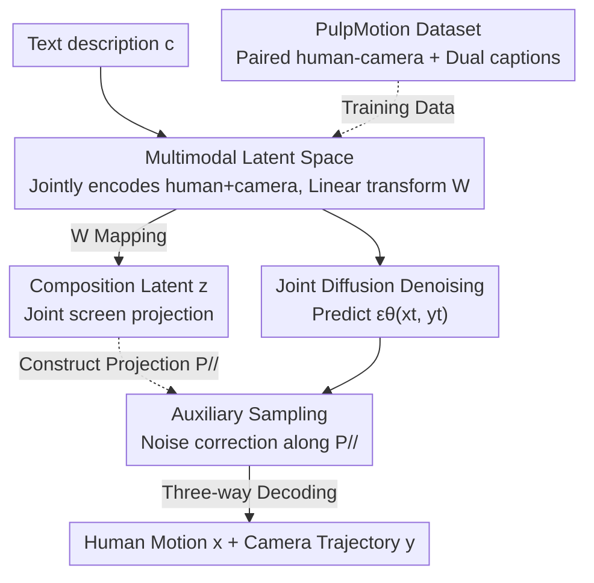

# PulpMotion: Framing-Aware Multimodal Camera and Human Motion Generation

**Conference**: ICLR 2026  
**OpenReview**: [https://openreview.net/forum?id=RRbnVt9c8t](https://openreview.net/forum?id=RRbnVt9c8t)  
**Code**: Project Page (The paper states that Code/models/data are open-sourced; see project page for details)  
**Area**: Multimodal Generation / Human Motion Generation / Camera Trajectory Generation / Diffusion Models  
**Keywords**: Joint Generation, Screen Composition, Auxiliary Sampling, Multimodal Consistency, Cinematography

## TL;DR
This paper introduces the text-conditioned **joint generation** of "human motion + camera trajectories" for the first time. Using a model-agnostic framework, it treats "screen composition (projection of human joints onto the camera view)" as an auxiliary modality bridge. During the sampling stage, generation is guided toward compositional consistency, ensuring characters remain in-frame with a cinematic aesthetic. It achieves new SOTA on this task across both DiT and MAR architectures.

## Background & Motivation
**Background**: Human motion generation and camera trajectory generation are two thriving independent fields—the former utilizes diffusion models to generate SMPL motion from text (MDM, MotionDiffuse, MAR, etc.), while the latter uses learning methods for camera movement from text or example videos (E.T., DataDoP, etc.). However, these two lines of research have mostly evolved separately: generating either only the body or only the camera, or at most treating camera parameters as constraints for a given motion.

**Limitations of Prior Work**: The essence of cinematography is the tight coordination between actor performance and camera blocking in **screen space**—the director follows the actor, and the actor coordinates with the camera timing. Decoupling the two during generation loses this synergy. Mismatched motion and camera leads to poor composition, awkward positioning, or even cases where the **subject exits the frame** (empty shots).

**Key Challenge**: This is essentially a **multimodal generation** problem—requiring high quality within each modality and coherence between them. However, human motion (high-dimensional, complex geometry) and camera trajectories (low-dimensional, including intrinsics) are heterogeneous. Directly modeling the joint distribution is difficult. Existing multimodal methods either rely on paired data for implicit correlation (requiring massive data), use laboriously designed architectures for explicit correlation (not generalizable), or require extra trained discriminators or external pre-trained models (ImageBind, DINOv2) for guidance (high cost, external dependency).

**Goal**: Achieve "compositional consistency" between joints of generated humans and cameras on screen without changing the architecture, additional training of discriminators, or dependence on external pre-trained models.

**Key Insight**: The authors observe a natural intermediate variable between the human and the camera—**screen composition $z$**, which is the 2D projection of human joints in the camera's field of view. It is jointly determined by both, with lower dimensions than their concatenated total ($N_z < N_x + N_y$), yet precisely captures "how the person is placed in the frame," the primary concern in cinema.

**Core Idea**: Use screen composition as an **auxiliary modality** bridge to push generation toward "compositionally consistent" regions during sampling. Specifically, a **linear transformation** from human/camera latent codes to composition latent codes is learned. This linear relationship is used to add an orthogonal projection guidance term during sampling, without needing to explicitly condition on $z$ during training.

## Method

### Overall Architecture
The method consists of two stages. **Stage 1 (Latent Space Training)**: A joint autoencoder encodes human motion $x_{raw}$ and camera trajectory $y_{raw}$ into a **shared latent space**, yielding latent codes $x,y$. A lightweight learnable linear transformation $W$ maps them to composition latent code $z=W[x,y]^\top$. Three independent decoders reconstruct the original modalities. Note that $z$ is never directly encoded; it is learned indirectly via $W$ and its reconstruction loss. **Stage 2 (Joint Diffusion + Auxiliary Sampling)**: A standard DDPM joint diffusion model is trained in this latent space to generate $(x,y)$ from text $c$. During inference, using the orthogonal projection $P_{//}$ derived from $W$, an auxiliary term is added to the predicted noise to correct it toward compositional consistency. This approach is model-agnostic and functions as a plug-and-play module for both DiT and MAR backbones.

### Key Designs

**1. Multimodal Latent Space and Linear Transformation W: Making "Screen Composition" a Computable Bridge**

Generating directly in the raw heterogeneous space is unstable and expensive. The authors utilize a joint autoencoder to encode both modalities into **one shared latent space**. A **learnable linear transformation** $W \in \mathbb{R}^{(N_x+N_y) \times N_z}$ maps the human and camera latent codes linearly to the composition latent code:

$$z = W[x,y]^\top$$

Three decoders $D_{\psi_x}, D_{\psi_y}, D_{\psi_z}$ reconstruct the original modalities, and the end-to-end training loss is:

$$\mathcal{L}_{AE} = \|D_{\psi_x}(E_\phi(x_{raw},y_{raw})) - x_{raw}\|^2 + \|D_{\psi_y}(\cdot) - y_{raw}\|^2 + \|D_{\psi_z}(W E_\phi(\cdot)) - z_{raw}\|^2$$

The linearity of $W$ is crucial: because $z$ is a linear function of $[x,y]$, an orthogonal projection can be used to decompose and guide the noise during the sampling stage.

**2. Auxiliary Sampling: Directing Sampling toward Compositional Consistency via Orthogonal Projection**

With the relationship $z = Wu$ (where $u = [x,y]^\top$), inference does not explicitly condition on $z$. Instead, borrowing from CFG separation logic, a guidance term is added to the sampling. Since $z$ is a compressed representation of $u$ ($N_z < N_x + N_y$), $u$ is decomposed into a "component $u_{//}$ determined by $z$" and its "orthogonal complement $u_\perp$": $u = u_\perp + u_{//}$, where $u_{//} = P_{//}u$ and $P_{//}$ is the projection onto the orthogonal complement of $\ker(W)$. The paper proves the density can be decomposed as $p(u) = p(u_\perp) p(u_{//})$ and provides $P_{//} = W(W^\top W)^{-1}W^\top$.

Using $\varepsilon(x) \propto \nabla_x \log p(x)$, the final sampling predicts noise through a linear combination:

$$\varepsilon_\theta(x_t,y_t,c,t) = \varepsilon_\theta(x_t,y_t,\varnothing,t) + w_z P_{//} \varepsilon_\theta(x_t,y_t,\varnothing,t) + w_c (\varepsilon_\theta(x_t,y_t,c,t) - \varepsilon_\theta(x_t,y_t,\varnothing,t))$$

where $w_z$ controls the composition guidance strength and $w_c$ is the text CFG weight. This effectively strengthens generation along the direction $u_{//}$ parallel to the composition modality.

**3. PulpMotion Dataset: Bridging the Gap for Paired "Human + Camera" Data**

Training a joint model requires paired human motion and camera trajectory data. Existing datasets usually cover only one side. The authors constructed **PulpMotion** by using TRAM to estimate 3D human-camera poses from CondensedMovies videos (significantly faster and higher quality than SLAHMR). To address low-quality motion caused by partial occlusions (e.g., close-ups), a **refinement** step was added: out-of-frame limbs were detected via projection and completed using RePaint and a pre-trained HumanML3D diffusion model. PulpMotion contains 193K samples and 314 hours of footage.

### Loss & Training
The autoencoder is trained end-to-end using the three-modality reconstruction loss $\mathcal{L}_{AE}$. Joint diffusion uses the standard DDPM noise prediction loss $\mathcal{L}_{noise}(\theta) = \mathbb{E}_{t,\varepsilon_{xy}}[\|\varepsilon_{xy}-\varepsilon_\theta(x_t,y_t,c)\|^2]$. Auxiliary sampling only occurs during inference. Data representation: composition features $z_{raw}$ use 2D NDC coordinates of 9 key joints ($\mathbb{R}^{F \times 18}$); human features $\mathbb{R}^{F \times 199}$, and camera features $\mathbb{R}^{F \times 14}$ (including 6D rotation, velocity, relative distance, and FOV).

## Key Experimental Results

### Main Results
Evaluated on the PulpMotion mixed subset against 5 baselines across DiT and MAR. Core metrics include FDframing (Fréchet distance of composition distribution) and Out-rate (percentage of frames where all 9 joints are out of view).

| Architecture | Configuration | FDframing ↓ | Out-rate ↓ | TMR-Score ↑ (Human) | CLaTr-Score ↑ (Camera) |
|--------------|---------------|-------------|------------|---------------------|------------------------|
| DiT          | (x)+DIRECTOR  | 22.21       | 60.56      | -                   | 24.44                  |
| DiT          | (x)(y)        | 11.21       | 48.02      | 23.50*              | 46.74                  |
| DiT          | (x)(y)+Aux    | **8.24**    | **41.24**  | -                   | 50.69                  |
| DiT          | Ours (x,y)    | 4.90        | 25.98      | 23.50               | 30.75                  |
| DiT          | Ours+Aux      | **3.37**    | **16.76**  | **25.05**           | **32.81**              |
| MAR          | Ours (x,y)    | 8.51        | 40.75      | 21.68               | 42.84                  |
| MAR          | Ours+Aux      | **6.42**    | **33.65**  | **24.46**           | **45.96**              |

(*Independent baseline human scores correspond to their respective models; Table intended to show trends.) Auxiliary sampling systematically reduced FDframing and Out-rate across all baselines and architectures while improving text alignment.

### Ablation Study
Varying auxiliary guidance weight $w_z$ (DiT, mixed subset):

| $w_z$ | FDframing ↓ | Out-rate ↓ | TMR-Score ↑ | FDTMR ↓ |
|-------|-------------|------------|-------------|---------|
| 0.00  | 4.90        | 25.98      | 23.50       | 372.61  |
| 0.25  | 3.37        | 16.76      | 25.05       | 431.54  |
| 0.50  | **3.09**    | 11.99      | **25.30**   | 493.53  |
| 0.75  | 3.37        | **9.66**   | 24.99       | 548.60  |

Data refinement also proved effective: Table 3 shows refinement reduced human motion FDTMR from 595.39 to 447.69.

### Key Findings
- Larger $w_z$ yields better composition (FDframing/Out-rate drop until $w_z = 0.5 \sim 0.75$), but single-modality fidelity (FDTMR) may slightly degrade—there is a trade-off between "compositional consistency" and "modality fidelity."
- Auxiliary sampling is **architecture-agnostic**: results were consistent on both DiT and MAR.
- The two-step data pipeline (TRAM instead of SLAHMR + RePaint refinement) significantly boosted human motion quality.

## Highlights & Insights
- **Using "screen composition" as an auxiliary modality** is the most elegant contribution: it is not an arbitrary bridge but a core cinematographic concern that is low-dimensional and information-dense.
- **Linear Transformation + Orthogonal Projection** provides a closed-form expression for the guidance term $P_{//} = W(W^\top W)^{-1}W^\top$, converting the abstract goal of consistency into a simple noise correction during sampling.
- This paradigm—guiding via an auxiliary modality without conditioning on it during training—is transferable to other multimodal tasks like video-audio or image-text.

## Limitations & Future Work
- Auxiliary sampling causes a slight drop in single-modality fidelity metrics, requiring manual tuning of $w_z$.
- The bridge modality $z$ must be a **linear** function of the target modalities for the closed-form orthogonal projection; highly non-linear relationships might cause this approximation to fail.
- Motion quality is still limited by the performance of upstream 3D pose estimators (TRAM) and has not yet reached mocap-level precision.

## Related Work & Insights
- **vs (x)+DIRECTOR (Two-stage conditional)**: This method generates humans first and then cameras. Information from the human alone is insufficient for ideal composition (FDframing 22.21 vs Ours 3.37).
- **vs ReDi / MMDisco**: These methods rely on extra discriminators or external models (ImageBind). Ours requires no external models and uses its own latent space properties.
- **vs Architecture-based methods (UniDiffuser)**: While they modify attention to force correlation, Ours modifies the sampling process and is thus bone-independent and plug-and-play.

## Rating
- Novelty: ⭐⭐⭐⭐⭐ First joint text-to-human-and-camera generation; elegant use of screen composition and orthogonal projection.
- Experimental Thoroughness: ⭐⭐⭐⭐ Solid results across DiT/MAR and multiple baselines; however, primarily evaluated on internal dataset/metrics.
- Writing Quality: ⭐⭐⭐⭐ Clear motivation and derivation of formulas.
- Value: ⭐⭐⭐⭐⭐ High value for AI cinematography and virtual production, providing both a new dataset and a generalizable sampling paradigm.

<!-- RELATED:START -->

## Related Papers

- [\[ICLR 2026\] EasyTune: Efficient Step-Aware Fine-Tuning for Diffusion-Based Motion Generation](easytune_efficient_step-aware_fine-tuning_for_diffusion-based_motion_generation.md)
- [\[ICCV 2025\] KinMo: Kinematic-Aware Human Motion Understanding and Generation](../../ICCV2025/human_understanding/kinmo_kinematic-aware_human_motion_understanding_and_generation.md)
- [\[ICLR 2026\] Motion-Aligned Word Embeddings for Text-to-Motion Generation](motion-aligned_word_embeddings_for_text-to-motion_generation.md)
- [\[CVPR 2026\] LAMP: Localization Aware Multi-camera People Tracking in Metric 3D World](../../CVPR2026/human_understanding/lamp_localization_aware_multi-camera_people_tracking_in_metric_3d_world.md)
- [\[AAAI 2026\] SOSControl: Enhancing Human Motion Generation through Saliency-Aware Symbolic Orientation and Timing Control](../../AAAI2026/human_understanding/soscontrol_enhancing_human_motion_generation_through_saliency-aware_symbolic_ori.md)

<!-- RELATED:END -->
