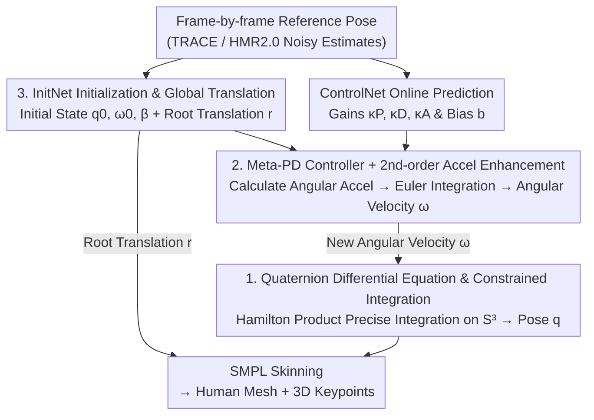

# QuaMo: Quaternion Motions for Vision-based 3D Human Kinematics Capture

**Conference**: ICLR 2026  
**arXiv**: [2601.19580](https://arxiv.org/abs/2601.19580)  
**Code**: Yes (mentioned as "available" in the paper, links to be public)  
**Area**: Human Understanding / 3D Vision  
**Keywords**: Quaternion Kinematics, 3D Human Motion Capture, State-Space Models, PD Controller, Acceleration Enhancement

## TL;DR

QuaMo proposes a 3D human kinematics capture method based on Quaternion Differential Equations (QDE). By solving kinematic equations under the unit sphere constraint and introducing a meta-PD controller with second-order acceleration enhancement, the method achieves discontinuity-free, low-jitter online real-time human motion estimation, outperforming state-of-the-art results on datasets like Human3.6M.

## Background & Motivation

**Background**: Monocular 3D human motion capture is a significant challenge in computer vision. While traditional 3D pose estimation methods (e.g., PoseFormer, HMR2.0) achieve high precision in distance metrics, they often ignore temporal consistency across frames, resulting in jitter and unnatural artifacts. Recent kinematic methods enforce temporal consistency by introducing physical models (velocity, acceleration).

**Limitations of Prior Work**: Existing kinematic methods (e.g., SimPoE, HuMoR, DnD) generally adopt Euler angles to represent joint rotations. Despite being intuitive, Euler angles suffer from two fundamental issues: (1) singularities (Gimbal Lock) and (2) discontinuities (jumps at $0$ and $2\pi$). These issues lead to incorrect reverse rotations near angular boundaries, causing highly unstable motion reconstruction—especially in online scenarios where back-propagation optimization is unavailable.

**Key Challenge**: Quaternions naturally avoid discontinuities and can represent all 3D rotations, but their derivatives cannot be simply approximated by finite differences due to rotation constraints, necessitating specialized operations based on the Hamilton product. Furthermore, existing PD controllers exhibit insufficient response speed during rapid motion changes.

**Goal**: (1) Replace Euler angles with quaternions for joint rotation representation; (2) Strictly solve QDE under the quaternion unit sphere $\mathcal{S}^3$ constraint; (3) Design an adaptive acceleration enhancement mechanism to handle rapid motion changes.

**Key Insight**: Quaternions are widely used for attitude control in aerospace and robotics but lack systematic research in the field of human kinematics. This work introduces quaternion differential equations and constrained integration methods from aerospace into human motion capture.

**Core Idea**: The approach utilizes quaternions and Hamilton products to accurately solve rotation differential equations (avoiding Euler angle discontinuities) and adaptively enhances PD control signals using second-order reference pose differences (improving tracking for fast movements).

## Method

### Overall Architecture

QuaMo addresses the instability and discontinuity inherent in Euler angle representations for online 3D human motion capture. It models human pose as a state-space model, where states consist of the quaternion pose $q$ and angular velocity $\omega$ for each joint. For each incoming frame, a ControlNet predicts control gains online based on the current state $(q_t, \omega_t)$ and reference pose $\hat{q}_t$. Two parallel flows then proceed: the **Angular Velocity Flow** calculates angular acceleration $\dot{\omega}_t$ using a meta-PD controller with second-order acceleration enhancement and bias terms, followed by Euler integration to obtain $\omega_{t+\Delta t}$; the **Quaternion Pose Flow** uses this new angular velocity to obtain the next frame's pose $q_{t+\Delta t}$ via precise integration of the QDE on the unit sphere $\mathcal{S}^3$ using Hamilton products. For the initial frame without history, an InitNet estimates the initial state. The predicted poses are eventually processed through the SMPL skinning model to generate human meshes and 3D keypoints.

### Key Designs

**1. Quaternion Differential Equation (QDE) and Constrained Integration: Keeping Rotation Updates on the Unit Sphere**

Euler angle discontinuities cause unstable motion reconstruction. The first step involves replacing the rotation representation and rewriting its integration method. Given angular velocity $\omega \in \mathbb{R}^3$, quaternion velocity is defined as $\dot{q} = \frac{1}{2}\Omega(\omega)q$, where $\Omega(\omega)$ is a $4 \times 4$ skew-symmetric matrix. Unlike standard vectors, quaternions cannot use direct finite differences: $q_{t+\Delta t} \approx q_t + \dot{q}_t \Delta t$ would cause the quaternion to deviate from unit length, violating the $\mathcal{S}^3$ constraint and accumulating error. QuaMo uses matrix exponentials for precise integration: assuming $\omega$ is constant over $\Delta t$, the analytical solution is:

$$q_{t+\Delta t} = \exp\!\Big(\tfrac{\Delta t}{2}\Omega(\omega_{t+\Delta t})\Big)\,q_t = q_\omega \otimes q_t$$

where $\otimes$ denotes the Hamilton product. This step is equivalent to strict constrained integration on a Lie group, ensuring $q_{t+\Delta t}$ resides on the unit sphere $\mathcal{S}^3$ without post-processing normalization, thus eliminating jumps at the $0/2\pi$ boundary.

**2. Meta-PD Controller and Second-order Acceleration Enhancement: Anticipating Fast Motion**

To drive the rotation update, an angular acceleration signal is required, which is provided by the meta-PD controller:

$$\dot{\omega}_t = \kappa_P\,\text{vec}(\hat{q}_t \otimes q_t^*) - \kappa_D\,\omega_t + b_t + \kappa_A\big(\text{vec}(\hat{q}_t \otimes \hat{q}_{t-\Delta t}^*) - \text{vec}(\hat{q}_{t-\Delta t} \otimes \hat{q}_{t-2\Delta t}^*)\big)$$

The first two terms represent classic PD control: the proportional term $\kappa_P\text{vec}(\hat{q}_t \otimes q_t^*)$ tracks the error between current and reference poses, while the derivative term $-\kappa_D\omega_t$ suppresses jitter. $b_t$ is a data-driven bias. Since standard PD control lags during sudden movements, QuaMo adds a second-order quaternion difference of the reference pose, representing the "acceleration" of the reference signal. This term increases control force for rapid changes and naturally decays near the target to avoid overshooting. All gains $\kappa_P, \kappa_D, \kappa_A$ and bias $b_t$ are predicted online by ControlNet.

**3. InitNet Initialization and Global Translation: Completing State and Displacement**

As history is unavailable at the start of online execution, InitNet predicts initial states $q_0, \omega_0$ and a sequence-fixed shape $\beta_{fix}$ from the first two reference poses $\hat{q}_{0:1}$ and initial shape $\beta_0$. Global translation $r$ is estimated separately using PD control and Euler integration:

$$r_{t+\Delta t} = r_t + \big(v_t + (\kappa_P(\hat{r}_t - r_t) - \kappa_D v_t)\Delta t\big)\Delta t$$

Euler integration is sufficient for translation as it lacks manifold constraints.

### Loss & Training

The total loss is $\mathcal{L}_{total} = \mathcal{L}_{local} + \mathcal{L}_{global} + \lambda \mathcal{L}_{beta}$. $\mathcal{L}_{local}$ is the L1 reconstruction loss for 3D keypoints and root translation. $\mathcal{L}_{global}$ is an L1 consistency loss for second-order finite differences (acceleration) to ensure smooth global motion. $\mathcal{L}_{beta}$ regularizes shape parameters. Training strategy: per-frame updates for the first 5 epochs (global loss off, low learning rate), followed by training on 100-frame sub-sequences with global loss. Total 35 epochs, batch size 64.

## Key Experimental Results

### Main Results

| Method | MPJPE ↓ | P-MPJPE ↓ | Accel ↓ | G-MPJPE ↓ | FS ↓ | Online |
|------|---------|-----------|---------|-----------|------|------|
| HMR2.0 | 46.7 | 30.7 | 9.1 | 97.2 | 11.5 | ✓ |
| TRACE | 56.1 | 39.4 | 18.9 | 143.0 | 80.3 | ✓ |
| DnD | - | - | - | - | - | ✗ |
| PhysPT | 52.7 | 36.7 | 2.5 | 335.7 | - | ✗ |
| **Ours** | **Best** | **Best** | **Low** | **Best** | **Lowest** | ✓ |

(QuaMo achieves the best local and global metrics among online methods on Human3.6M)

### Ablation Study

| Configuration | MPJPE | Accel | Note |
|------|-------|-------|------|
| Full QuaMo | Best | Best | Quaternions + Constrained Integration + Accel Enhancement |
| Euler angles instead of Quaternions | Increase | Increase | Errors due to discontinuities |
| Euler instead of Constrained Integration| Increase | - | Violates $\mathcal{S}^3$ constraint |
| Remove Accel Enhancement | Increase | Increase | Poor tracking of fast motions |
| Remove Global Consistency Loss | - | Increase | Reduced motion smoothness |

### Key Findings

- Quaternion representation outperforms Euler angles across all metrics, particularly in global motion and Foot Sliding (FS), confirming the negative impact of Euler angle discontinuities.
- Ablations on constrained integration (matrix exponential) vs. Euler integration clearly show that respecting $\mathcal{S}^3$ constraints improves accuracy.
- Acceleration enhancement contributes most to fast motion sequences, with less effect on slow motions, aligning with its adaptive design.
- QuaMo maintains advantages on diverse datasets like Fit3D, SportsPose, and AIST, demonstrating strong generalization.

## Highlights & Insights

- **Quaternion Kinematics**: First systematic application in human motion capture. While mature in aerospace, it has been largely overlooked in this field.
- **Adaptive Acceleration Enhancement**: Effectively handles rapid movements without needing an auxiliary network to classify motion speed; the second-order difference naturally adapts to motion dynamics.
- **Constrained vs. Euler Integration**: Provides a clear lesson that integration on Lie groups must respect manifold constraints to prevent error accumulation in long sequences.

## Limitations & Future Work

- Online methods rely on single-step inputs and cannot leverage future frame information, limiting accuracy compared to offline methods.
- Performance is sensitive to the quality of noisy reference estimates $\hat{q}$ from TRACE or HMR2.0.
- Occlusions and multi-person scenarios are not yet handled.
- Global translation still uses simple Euler integration, representing a potential area for improvement using quaternion-like manifold methods.

## Related Work & Insights

- **vs DnD (Li et al., 2022)**: DnD uses PD controllers but requires full-sequence attention and future frames. QuaMo is strictly online and introduces quaternion-based enhancements.
- **vs OSDCap (Le et al., 2024)**: OSDCap uses a learnable Kalman filter which may re-introduce noise; QuaMo avoids noise re-mixing.
- **vs PhysPT (Zhang et al., 2024)**: PhysPT is an offline Transformer autoencoder; QuaMo remains competitive while operating online.

## Rating

- Novelty: ⭐⭐⭐⭐ First systematic study of quaternion kinematics in human motion; clever acceleration enhancement.
- Experimental Thoroughness: ⭐⭐⭐⭐ 4 datasets, multiple input sources, detailed ablations, and reported with 5 random seeds.
- Writing Quality: ⭐⭐⭐⭐ Clear mathematical derivation and detailed method description.
- Value: ⭐⭐⭐⭐ Highly practical for online motion capture; the quaternion framework is generalizable to other kinematic problems.

<!-- RELATED:START -->

## Related Papers

- [\[ICLR 2026\] Sapiens2: High-Resolution Foundation Models for Human-Centric Vision](sapiens2.md)
- [\[ICLR 2026\] Sparkle: A Robust and Versatile Representation for Point Cloud-based Human Motion Capture](sparkle_a_robust_and_versatile_representation_for_point_cloud-based_human_motion.md)
- [\[CVPR 2025\] StickMotion: Generating 3D Human Motions by Drawing a Stickman](../../CVPR2025/human_understanding/stickmotion_generating_3d_human_motions_by_drawing_a_stickman.md)
- [\[ICLR 2026\] Disentangled Hierarchical VAE for 3D Human-Human Interaction Generation](disentangled_hierarchical_vae_for_3d_human-human_interaction_generation.md)
- [\[ICLR 2026\] LINK: Learning Instance-level Knowledge from Vision-Language Models for Human-Object Interaction Detection](link_learning_instance-level_knowledge_from_vision-language_models_for_human-obj.md)

<!-- RELATED:END -->
