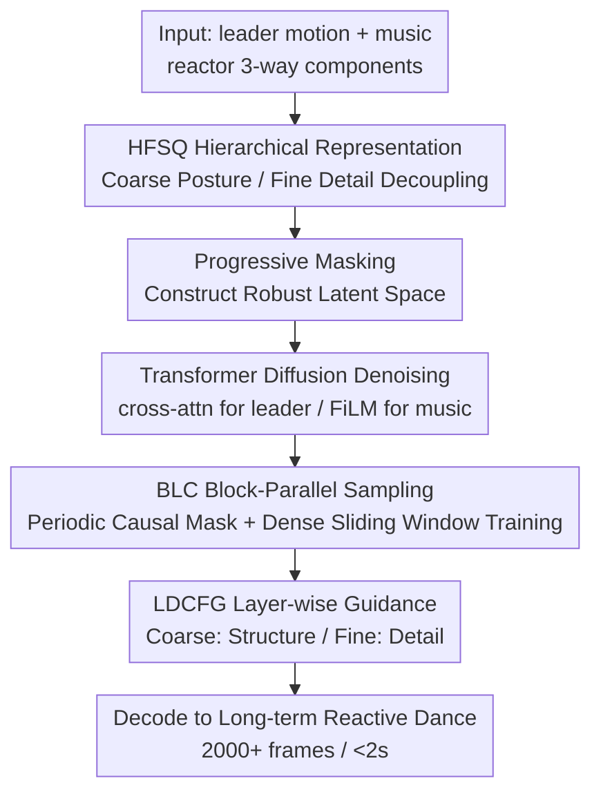

# ReactDance: Hierarchical Representation for High-Fidelity and Coherent Long-Form Reactive Dance Generation

**Conference**: ICLR 2026  
**OpenReview**: [https://openreview.net/forum?id=FvMyAMbbX0](https://openreview.net/forum?id=FvMyAMbbX0)  
**Paper**: [Project Page](https://ripemangobox.github.io/ReactDance)  
**Code**: TBD  
**Area**: Human Motion Generation / Dance Generation  
**Keywords**: Reactive Dance Generation, Hierarchical Quantization, Diffusion Models, Long-Sequence Parallel Sampling, Classifier-Free Guidance

## TL;DR
ReactDance utilizes a multi-scale motion representation via Hierarchical Finite Scalar Quantization (HFSQ) to decouple "coarse posture" from "high-frequency details." Combined with non-autoregressive Blocked Local Context (BLC) parallel sampling, it generates high-fidelity and long-term coherent "reactor" dances exceeding 2000 frames (60s+) in under 2 seconds.

## Background & Motivation
**Background**: Reactive Dance Generation (RDG) aims to automatically synthesize a "reactor's" dance given a "leader's" motion and background music, ensuring both synchrony and artistic expressiveness. This has applications in social robotics, virtual avatars, and human-computer interaction. Recent duo-dance methods have progressed in "duet synchronization" and "motion-music alignment" using customized network structures, physical constraints, or reinforcement learning.

**Limitations of Prior Work**: Existing methods rely on holistic, high-level constraints, resulting in motions that are "synchronized but artistically dull," ignoring subtle yet decisive local movements (e.g., the whip-like boleo in Tango). Furthermore, models are predominantly trained on short segments due to the complexity of learning long-range dependencies, leading to an inherent length gap between training and inference. This causes accumulated errors during inference, manifesting as temporal drift and synchronization collapse.

**Key Challenge**: RDG involves two entangled difficulties—**fine-grained spatial interaction** and **long-term temporal coherence**. The former requires simultaneous control over global body poses and high-frequency local details, which single-scale representations cannot control independently. The latter requires stability over lengths far exceeding the training window, whereas autoregressive generation is slow and prone to error accumulation.

**Key Insight**: The authors draw from two structural principles of dance theory: (1) **Hierarchical Motion Composition**—dance performances are naturally layered, where full-body rhythm provides structural scaffolding and fine-grained dynamics provide semantic detail. (2) **Modular Temporal Coherence**—long choreographies achieve consistency by concatenating short, coherent "motifs" while ensuring smooth transitions.

**Core Idea**: A "coarse-to-fine" hierarchical latent space replaces flat representations to address spatial details, while "block-parallel sampling + dense sliding window training" replaces autoregressive methods to ensure long-term coherence.

## Method

### Overall Architecture
ReactDance is a two-stage diffusion framework. **Stage 1**: Train an autoencoder with an HFSQ bottleneck to encode dance motions into a hierarchical (multi-scale, coarse-to-fine) continuous latent representation $V$. **Stage 2**: Train a Transformer diffusion model conditioned on leader motion and music to denoise and generate this hierarchical latent representation, which is then decoded back into final motions.

Specifically, the reactor's motion is split into three independent components—upper body, lower body, and relative root distance to the leader—each processed through an identical HFSQ stream. Leader motions are injected via cross-attention, and music features are fused through FiLM layers. During generation, **BLC** partitions the long timeline into parallelizable blocks, and **LDCFG** applies independent guidance strengths to different scales during each denoising step.

### Key Designs

**1. HFSQ: Hierarchical Finite Scalar Quantization for Spatial Decoupling**

To address the limitation where single-scale representations fail to independently control global poses and local details, HFSQ combines FSQ (Finite Scalar Quantization) stability with a hierarchical residual structure, avoiding the "codebook collapse" common in VQ-VAEs. The mechanism involves two steps: first, splitting encoder features $v \in \mathbb{R}^{n \times d}$ into $G$ parallel groups $v=[v_1,\dots,v_G]$; then applying $R$ levels of cascaded residual quantization. For each group, the initial residual is $e_{g,1}=v_g$, and the levels are calculated as $z_{g,r}=\mathrm{FSQ}_r(e_{g,r})$, $\hat{v}_{g,r}=\mathrm{Dequantize}(z_{g,r})$, and $e_{g,r+1}=e_{g,r}-s_r\cdot\hat{v}_{g,r}$. The final representation is the set of continuous reconstructions $V=\{\hat{v}_{g,r}\}_{g=1,r=1}^{G,R}$.

A key property of this residual hierarchy is that it **naturally decouples semantics by signal energy**: the base layer ($r=1$) minimizes primary reconstruction error, capturing coarse motion (global pose, orientation, low-frequency trajectories); subsequent layers ($r\ge 2$) encode residuals, capturing fine motion (high-frequency local dynamics, articulation). Compared to RVQ-VAE's discrete codebook (where adjacent indices lack semantic continuity, creating rugged optimization landscapes for diffusion), HFSQ maps motion onto a fixed scalar grid, preserving ordinal relationships and providing a smoother "diffusion-friendly" manifold. This explains why its generated FIDg significantly outperforms RVQ-VAE (7.63 vs 26.98).

**2. Progressive Masking: Ensuring Decoupling and Robustness**

Structure alone is insufficient for layer independence. During training, two complementary perturbations regularize the latent space $V$. **Residual Masking** randomly masks higher FSQ layers while adding scaled Gaussian noise to the base layer, forcing layers to be independent. **Code Masking** randomly masks dimensions within an individual FSQ code to increase decoder tolerance to imperfect inputs. Ablations show that removing progressive masking slightly improves MPJPE but leads to a sharp decline in realism (FIDg increases from 7.63 to 10.46).

**3. BLC: Blocked Local Context for Parallel Long-Sequence Generation**

Since inference length $K$ often exceeds training window $T$, BLC avoids autoregressive accumulation errors using two principles. **Intra-block consistency** is achieved via a sampling protocol: a block-diagonal **Periodic Causal Mask** restricts attention to non-overlapping blocks of size $T$, blocking error propagation between blocks. **Phase-Aligned Positional Encoding** $P_i=\sin(\frac{\pi(i \bmod T)}{T})\oplus\cos(\frac{\pi(i \bmod T)}{T})$ resets temporal phase for each block, making every inference block equivalent to a well-formed independent window seen during training.

**Inter-block continuity** is ensured by training dynamics—**Dense Sliding Window (DSW)**: the model is trained with a stride $m$ much smaller than the window size ($m\ll T$, e.g., $m=4, T=240$). This ensures the model sees the same frame as a beginning, middle, and end across different phase offsets, learning a "phase-invariant transition function." Even if parallel blocks have slight latent discontinuities during inference, the HFSQ decoder, trained on thousands of overlapping phase windows, projects these boundary latents back onto a valid continuous motion manifold, **effectively acting as a kinematic smoother** to stitch adjacent blocks.

**4. LDCFG: Layer-wise Decoupled Classifier-Free Guidance for Precision Control**

While multi-way inputs handle "spatial control" (which body regions interact), LDCFG provides "precision control," allowing users to adjust how strongly the generation follows conditions across different semantic scales. Standard CFG uses a single scalar for the entire representation, creating a trade-off between global pose stability and fine interaction detail. LDCFG leverages HFSQ's hierarchy for orthogonal control: during training, **Independent Condition Dropout** replaces conditions $(c, M_L)$ for the $r$-th layer with the null embedding $\varnothing$ with probability $p=0.2$. At inference, independent guidance strengths $s_r$ are assigned to each scale:
$$\hat{x}^r_0=(1+s_r)G_\theta(x^r_t,t,c,M_L)-s_r G_\theta(x^r_t,t,\varnothing,\varnothing)$$
Base guidance $s_1$ adjusts coarse motion (higher values anchor global pose and orientation), while residual guidance $s_{r\ge 2}$ adjusts fine motion (higher values enhance local details without shifting macro-structure).

### Loss & Training
The HFSQ autoencoder objective is $L_{\text{HFSQ}}=\lambda_{\text{kin}}L_{\text{kinematic}}+\lambda_{\text{lat}}L_{\text{latent}}$. Kinematic loss $L_{\text{kinematic}}$ applies L1 constraints on position, velocity, and acceleration. Latent loss $L_{\text{latent}}$ follows the commitment loss structure. The diffusion stage applies independent weights to each residual scale on the hierarchical latent $\sum_{r=1}^R \lambda_r\mathbb{E}\|V_r-G_\theta(x_t,t,c,M_L)_r\|_2^2$, supplemented by kinematic loss, foot contact loss $L_{fc}$, and leader-reactor relative orientation loss $L_{ro}$ for physical plausibility.

## Key Experimental Results

### Main Results
Evaluated on the DD100 dataset (1.95 hours of paired dance-music, 10 genres, 30fps). Average test sequence length is 2066 frames.

| Metric | Meaning | ReactDance | Next Best | Ground Truth |
|------|------|-----------|------|------|
| FIDk ↓ | Motion Quality (Kinematic) | **5.57** | 14.65 (GestureLSM) | - |
| FIDg ↓ | Motion Quality (Graphical) | **7.63** | 34.23 (GestureLSM) | - |
| MPJPE ↓ | Joint Position Error | **132.99** | 171.37 (GestureLSM) | - |
| PFC ↓ | Foot Skating Artifact | **0.6039** | 0.6226 (EDGE) | - |
| FIDcd ↓ | Interaction Coherence | **14.17** | 17.49 (Duolando) | - |
| BED → | Beat Alignment | **0.3863** | 0.3285 (Duolando) | 0.5308 |
| IPR ↓ | Interpenetration Rate | **7.84%** | 7.58 (TCDiff) | - |
| AITS ↓ | Inference Time per Seq (s) | **1.75** | 2.91 (EDGE) | - |

ReactDance leads in most metrics. Substantial gains in FIDk/FIDg stem from HFSQ hierarchical modeling. Lowest PFC indicates minimal foot skating. AITS of 1.75s highlights BLC efficiency.

### Ablation Study

| Configuration | FIDg ↓ | MPJPE ↓ | Note |
|------|------|------|------|
| VAE | 18.99 | 230.21 | Posterior collapse, over-smoothing |
| RVQ-VAE (w PM) | 26.98 | 138.28 | Rugged discrete codebook manifold |
| HFSQ (w/o PM) | 10.46 | 132.19 | Lacks progressive masking, lower realism |
| **HFSQ (w PM, Ours)** | **7.63** | 132.99 | Full model |

### Key Findings
- HFSQ's fixed scalar grid provides a "smoother" manifold for diffusion than RVQ-VAE's discrete codebooks.
- Progressive masking is a trade-off: it prioritizes realism (FIDg) over minor MPJPE improvements.
- Smaller Dense Sliding Window strides are critical for coherence: increasing stride from 4 to 64 significantly degrades FIDcd and BED.

## Highlights & Insights
- **"Diffusion-Friendly Manifolds"**: The performance gap between FSQ and VQ is attributed to latent topology (ordinal scalar grids vs. semantically discontinuous indices) rather than just capacity.
- **Decoder as a Kinematic Smoother**: Instead of explicit post-process stitching, BLC embeds "phase-invariant transition" priors into the decoder during training, allowing it to implicitly stitch parallel blocks.
- **Hierarchical CFG**: Combining HFSQ with LDCFG allows for orthogonal "artistic knobs" to adjust structure and detail independently.

## Limitations & Future Work
- HFSQ layers lack explicit semantic labeling, reducing interpretability for users.
- Finger motions were excluded due to noise in the DD100 dataset.
- Generalization is only verified on DD100. Future work aims for narrative-driven choreography and emotional expression.

## Related Work & Insights
- **vs Duolando**: Duolando uses single-scale VQ-VAE + autoregressive sampling, resulting in higher IPR (17.42%) and slower inference (4.41s). ReactDance improves quality and speed via HFSQ and BLC.
- **vs Lodge / EDGE**: Lodge uses rigid temporal hierarchies, and EDGE uses inefficient iterative inpainting. ReactDance achieves efficient parallelism by embedding temporal context directly into the representation.

## Rating
- Novelty: ⭐⭐⭐⭐⭐ HFSQ + BLC + LDCFG targetedly address RDG's core pain points in a principled manner.
- Experimental Thoroughness: ⭐⭐⭐⭐ Extensive metrics and user studies, though limited to a single dataset.
- Writing Quality: ⭐⭐⭐⭐⭐ Excellent motivation derived from dance theory; clear methodology.
- Value: ⭐⭐⭐⭐⭐ High utility for virtual avatars and HCI; advances parallel sequence generation.

<!-- RELATED:START -->

## Related Papers

- [\[ICLR 2026\] Text2Interact: High-Fidelity and Diverse Text-to-Two-Person Interaction Generation](text2interact_high-fidelity_and_diverse_text-to-two-person_interaction_generatio.md)
- [\[CVPR 2026\] Mobile-VTON: High-Fidelity On-Device Virtual Try-On](../../CVPR2026/human_understanding/mobile_vton_ondevice_virtual_tryon.md)
- [\[ICLR 2026\] KinemaDiff: Towards Diffusion for Coherent and Physically Plausible Human Motion Prediction](kinemadiff_towards_diffusion_for_coherent_and_physically_plausible_human_motion_.md)
- [\[ICLR 2026\] TOUCH: Text-guided Controllable Generation of Free-Form Hand-Object Interactions](touch_text-guided_controllable_generation_of_free-form_hand-object_interactions.md)
- [\[CVPR 2026\] 4DSurf: High-Fidelity Dynamic Scene Surface Reconstruction](../../CVPR2026/human_understanding/textit4dsurf_high-fidelity_dynamic_scene_surface_reconstruction.md)

<!-- RELATED:END -->
