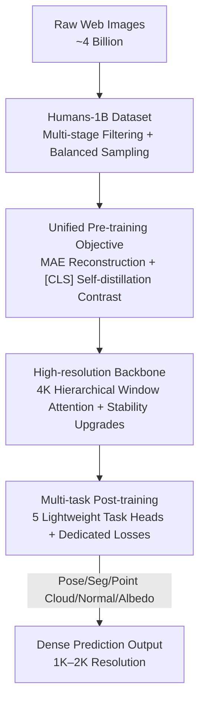

# Sapiens2: High-Resolution Foundation Models for Human-Centric Vision

**Conference**: ICLR 2026  
**OpenReview**: [https://openreview.net/forum?id=IVAlYCqdvW](https://openreview.net/forum?id=IVAlYCqdvW)  
**Code**: https://github.com/facebookresearch/sapiens2 (Available)  
**Area**: Human-Centric Vision / Self-Supervised Representation Learning / Vision Foundation Models  
**Keywords**: Human-centric vision, masked reconstruction, contrastive learning, high resolution, dense prediction

## TL;DR
Sapiens2 employs a unified pre-training objective of "mask reconstruction + self-distillation contrastive learning" to train 0.4B–5B high-resolution Transformers on 1 billion curated human images. Supporting 4K hierarchical backbones, it sets new SOTA benchmarks across multiple human dense tasks including pose estimation, body part segmentation, surface normals, point clouds, and albedo.

## Background & Motivation
**Background**: The previous generation, Sapiens, validated the path for "human-centric vision foundation models"—by performing large-scale pre-training exclusively on human images followed by lightweight head fine-tuning, it outperformed general-purpose models of comparable scale in tasks such as pose, segmentation, depth, and surface normals. Its primary pre-training mechanism was Masked Image Modeling (MIM), specifically MAE.

**Limitations of Prior Work**: MIM is essentially "compression"—relying on the reconstruction of occluded pixels to preserve low-level details and spatial structures, making it highly effective for textures, boundaries, and colors required in dense prediction. However, the learned semantics are relatively weak, typically requiring medium-to-high intensity supervision for reliable semantic expression (proving disadvantageous in zero-shot or low-annotation scenarios). Conversely, Contrastive Learning (CL) injects semantics via instance-level invariance, leading to strong zero-shot retrieval. However, global invariance objectives perform poorly in dense prediction, and aggressive appearance augmentations can "decouple" the teacher/student from actual observations, eroding low-level cues like color which are vital for photorealistic avatars. Hybrid approaches like iBOT, DINOv2, or v-JEPA narrowed this gap, but they perform matching in latent space, leading to "representation drift": features are no longer anchored to pixels, resulting in inconsistent performance at high resolutions.

**Key Challenge**: A structural trade-off exists between dense fidelity (requiring pixel-level color/details, where MIM excels) and semantic generalization (requiring zero-shot discrimination, where CL excels). Latent-space hybrid methods lose the low-level cues most critical for human dense tasks because they do not anchor representations to pixels.

**Goal**: To build a human-centric vision foundation model that simultaneously achieves "high-fidelity dense prediction" and "strong semantic generalization," while scaling resolution from 1K to 4K and parameters from 2B to 5B, covering an expanded range of human tasks (including point clouds and albedo).

**Key Insight**: Instead of performing contrastive matching in latent space, it is more effective to superimpose a contrastive objective on top of an MAE that **still reconstructs pixels**. This ensures features remain firmly anchored in pixel space (preserving color/details) while utilizing the global contrast on the [CLS] token to organize them semantically.

**Core Idea**: Utilize a joint objective of "pixel-anchored MAE reconstruction + [CLS] global self-distillation contrast," combined with 1 billion human images and a 4K hierarchical backbone, to create a universal, high-fidelity, and zero-shot transferable human representation.

## Method

### Overall Architecture
Sapiens2 is a pipeline for human vision foundation models consisting of "Data → Pre-training → Backbone Architecture → Post-training → Multi-task." During pre-training, multiple augmented views of a single human image are generated and fed into a shared encoder: one path follows the MAE branch (mask-reconstruction of pixels to learn low-level details), and another follows the contrastive branch ([CLS] cross-view matching via student/teacher to learn high-level semantics). The joint loss $L = L_{MAE} + \lambda L_{CL}$ is optimized. The backbone is a high-resolution Transformer redesigned for "stabilized scaling to 5B + 4K input + compatibility with sparse mask pre-training"; the 4K variant utilizes hierarchical window attention (local then global). After pre-training, the backbone is frozen or fine-tuned, and five lightweight task heads are attached for pose, body part segmentation, point clouds, surface normals, and albedo.

### Key Designs

**1. Unified Pre-training Objective: Pixel-anchored MAE Reconstruction + [CLS] Global Contrast**

This design directly addresses the core challenge of "fidelity vs. semantics." For each image, $V$ augmented views are sampled. The encoder $\Phi_{enc}$ processes only visible tokens, then scatters these features back to their original positions and inserts learnable mask tokens at occluded positions. The patch decoder $\Phi_{dec}$ reconstructs all patches, targeting the MSE on normalized pixels: $L_{MAE} = \frac{1}{V}\sum_i \frac{1}{|M_i|}\sum_{p\in M_i}(\tilde{x}^p_i - \hat{x}^p_i)^2$, where $M_i$ is the set of masked tokens. In parallel, the contrastive branch adopts a DINOv3-style student-teacher scheme: the teacher shares the same architecture as the student but is non-learnable, with parameters being the EMA of the student. [CLS] embeddings from both paths are mapped to $K$-dimensional logits via $\Phi_{cls}$, yielding $p_i, q_i$ after softmax. Teacher-to-student cross-entropy $L_{CL}=\frac{1}{|S|}\sum_{(i,j)\in S}H(q_j,p_i)$ is calculated across all cross-view global↔global and global↔local positive pairs $S$. The final joint objective is $L = L_{MAE} + \lambda L_{CL}$.

The critical distinction from "latent matching" methods like iBOT or DINOv2 is that the MAE branch **reconstructs real pixels**, anchoring features in pixel space to prevent representation drift and preserve color/texture essentials for human dense tasks. The contrastive branch only serves to organize features semantically via the [CLS] token. Dense probing demonstrates that whereas the MAE-only Sapiens was semantically weak and the contrastive DINOv3 lacked color cues, the joint objective succeeds in both dimensions at the same scale.

**2. Humans-1B: Billion-scale Human Image Corpus with Multi-stage Filtering and Balanced Sampling**

Generalization scales with data and capacity, but "scaling is only effective when the distribution is diverse, balanced, and of high quality." The authors began with ~4 billion web images and used a multi-stage filtering pipeline to isolate human content: bounding box detection, head pose estimation, aesthetic and realism scoring, CLIP features, and text overlay detection were used to discard non-realistic, low-quality, or watermarked images. Only instances where the short side of at least one person was $\ge 384$ pixels were retained. Deduplication was performed via perceptual hashing and deep feature nearest neighbors, followed by selective sampling after clustering visual embeddings to balance content across pose, viewpoint, occlusion, clothing, scene, and lighting. This resulted in ~1 billion high-quality human images.

Crucially, Sapiens2 **injects no human priors and uses no task labels** during pre-training; the only constraint is the presence of at least one salient person. This "purely inductive, prior-free" approach allows it to scale cleanly to billions of parameters and images without manual human-centric biases (unlike HAP's keypoint-guided masking or SOLIDER's semantic classification loss).

**3. 4K Hierarchical Window Attention Backbone + Stability Upgrades**

Prediction fidelity increases with the number of vision tokens, which scales with resolution—hence the push to 4K. Since global attention is infeasible at 4K, a hierarchical design is employed: for an $H \times W$ image with patch size $p$, yielding $N=(H/p)(W/p)$ tokens, the first $K$ layers perform **window self-attention** to capture local textures and boundaries. Subsequently, [CLS]-guided pooling reduces the token grid to $N/\omega$ using a spatial stride $\sqrt{\omega}$, and the remaining $L$ layers perform global attention on the condensed sequence to fuse long-range context. This layout is naturally compatible with MAE: token masking is applied after the local stage, ensuring information does not flow across masked regions and avoiding the need for masked convolutions.

To stabilize scaling to 5B over long training schedules, several upgrades were made: middle layers use Grouped Query Attention (GQA) for throughput, while the first and last layers use standard Multi-Head Attention; FFNs are replaced with gated SwiGLU; QK-Norm is applied before attention to improve high-resolution robustness; LayerNorm is replaced by RMSNorm; and PixelShuffle is used at the decoder for artifact-free sub-pixel upsampling. Additionally, a short reconstruction phase at 2K output is used specifically to sharpen sub-pixel fidelity without harming semantics.

**4. Multi-task Post-training: Frozen Backbone + Five Lightweight Task Heads**

Post-training attaches a lightweight head to each of the five human tasks without updating the backbone, with supervision volume increased roughly 10× compared to the original (~1M annotations per task). **Pose** estimation utilizes a top-down approach for 308 keypoint heatmaps (243 face, 40 hand, plus torso/limbs); 100K high-definition in-the-wild images were newly annotated. The loss is heatmap MSE $L_{pose}=\sum_u\|\hat H(u)-H(u)\|^2$ with OHEM. **Part Segmentation** covers 29 classes (adding eyeglasses) using pixel-wise weighted cross-entropy and Dice loss. **Point Cloud (Depth)** regresses 3D points $\hat P(u)$ per pixel in the camera frame; because scale is ambiguous without intrinsics, it predicts focal-length normalized point clouds $\tilde P(u)$ and a scalar head $s$ to synthesize $\hat P(u)=s\tilde P(u)$. **Normals** predict unit normals with multi-layer PixelShuffle, using cosine, L2, and gradient losses. **Albedo** predicts diffuse albedo per pixel, using L2, gradient, and spatial RGB mean alignment losses $\|\mu(\hat A)-\mu(A)\|^2$ to encourage light-invariant recovery of skin and clothing color. These tasks verify the universality of the unified representation.

## Key Experimental Results

### Main Results
Comparison with task-specific SOTAs on high-quality in-the-wild test sets:

| Task / Test Set | Metric | Prev. SOTA | Sapiens2-5B | Gain (vs Sapiens-1) |
|--------|------|------|----------|------|
| Pose (11K, 308 kpt) | mAP ↑ | Sapiens-2B 78.3 | **82.3** | +4.0 mAP |
| Segmentation (5K, 29 classes) | mIoU ↑ | Sapiens-2B 58.2 | **82.5** | +24.3 mIoU |
| Point Cloud (10K) | L2 (e-1) ↓ | MoGe 0.202 | **0.167** | — |
| Normals (10K, 4K GT) | Angle Error° ↓ | DAViD-L 10.73 | **6.73** | ~45.6% reduction |
| Albedo (10K) | MAE ↓ / PSNR ↑ | — | **0.012 / 32.6dB** | New Task |

Notably, segmentation shows a massive improvement: at 1K input, Sapiens2-1B is 27.9% higher in mIoU than Sapiens-1B, primarily due to improved in-the-wild supervision and doubling the output resolution.

### Pre-training Generalization Analysis (dense probing)
Backbones are frozen, and decoders are trained with identical hyperparameters to measure the zero-shot generalization of pre-trained features:

| Backbone | Params | Pose mAP↑ | Seg mIoU%↑ | Normal MAE°↓ | Albedo MAE↓ |
|------|------|------|------|------|------|
| Sapiens-1B (MAE-only) | 1.17B | 58.2 | 61.4 | 15.3 | 3.85 |
| DINOv3-7B (Contrastive) | 6.71B | 68.2 | 67.6 | 14.2 | 3.48 |
| Sapiens2-1B (Joint) | 1.46B | 68.3 | 65.2 | 14.5 | 3.64 |
| Sapiens2-5B (Joint) | 5.07B | **74.7** | **69.6** | **13.5** | **3.12** |

### Key Findings
- **Joint objective succeeds on both fronts**: The MAE-only original Sapiens was semantically weak (lower pose mAP) but retained appearance cues (good albedo). The contrastive DINOv3 had strong geometry/semantics but poor color cues. Sapiens2 excels in both categories at the same scale, and the 5B version outperforms all baselines including the 6.71B DINOv3-7B.
- **Predictable scaling**: Gains from 0.4B to 5B parameters are stable and predictable, following scaling laws. Even the 0.8B version outperforms the larger original model due to architecture and supervision improvements.
- **4K hierarchical backbone provides extra gains**: The 1B-4K variant outperforms its 1K counterpart in segmentation (81.9 mIoU) and normals (6.98°), proving that higher resolution yields finer boundaries and geometry.
- **Synthetic training generalizes**: Although point cloud, normal, and albedo tasks are supervised entirely with synthetic assets, they successfully generalize to real skin tones and in-the-wild images, while being significantly more efficient than diffusion-based methods.

## Highlights & Insights
- **"Pixel anchoring" is the most core insight**: While other methods attempt MIM+CL hybrids, superimposing contrast on a "pixel-reconstructing" MAE (rather than matching in latent space) preserves color/texture while gaining semantics. This avoids the representation drift of the DINOv2 lineage and is applicable to any field requiring both dense fidelity and semantic generalization.
- **Hierarchical window attention + post-local masking**: This combination makes 4K feasible. Masking tokens after the local stage naturally prevents information leakage across occluded regions without requiring specialized convolutional operations.
- **Specialization without priors**: Relying only on the "image contains a person" data constraint combined with massive scaling outperforms methods that explicitly inject keypoint or skeleton priors, reaffirming that "data scale > manual priors."
- **One backbone, five tasks**: Fixing the backbone and swapping lightweight heads for five diverse tasks (including new ones like albedo) provides robust evidence for the model's universality.

## Limitations & Future Work
- Pre-training compute is extremely high: The 5B model at 1K resolution reaches 15 TFLOPs—the largest reported FLOPs for a ViT—raising significantly the barrier for reproduction.
- Geometric tasks (point cloud/normal/albedo) rely **entirely on synthetic assets** for supervision; quantitative evaluation on real in-the-wild geometry remains constrained by a lack of ground truth.
- The model focuses solely on human-centric vision; the advantages of this unified objective for general dense tasks have not yet been validated.
- Tasks like albedo recovery remain challenging under extreme lighting or unusual materials. Extending to video or multi-view consistency is a natural next step.

## Related Work & Insights
- **vs. DINOv2 / DINOv3 (Latent MIM+CL)**: These models perform student-teacher matching in latent space. They are semantically strong but lack pixel anchoring, leading to drift and lost color cues. Sapiens2 retains pixel reconstruction, providing superior dense fidelity and outperforming even larger DINOv3 models in human-centric tasks.
- **vs. Sapiens-1 (MAE-only)**: The original relied on pure reconstruction and had weaker semantics. Sapiens2 adds the contrastive objective, increases data from 300M to 1B, resolution from 1K to 4K, and parameters from 2B to 5B.
- **vs. CMAE (MAE+CL hybrid)**: CMAE explored similar combinations but evaluated primarily on classification. Sapiens2 scales this to billion-level parameters and systematically validates it across multiple human dense tasks.
- **vs. HAP / SOLIDER / LiftedCL (Explicit Priors)**: These methods inject keypoint masks, semantic losses, or 3D skeletons. Sapiens2 avoids these, relying on data scale for better scalability and cleaner architecture.

## Rating
- Novelty: ⭐⭐⭐⭐ The "pixel-anchored MAE+CL joint objective" directly solves contradictions in human dense tasks. The components are well-integrated results of existing techniques.
- Experimental Thoroughness: ⭐⭐⭐⭐⭐ Comprehensive evaluation across five tasks, multiple scales, dense probing, and SOTA comparisons with high-quality test sets.
- Writing Quality: ⭐⭐⭐⭐ Motives are clear and diagrams are helpful; however, some hyperparameter sensitivity and real-world generalization proofs for synthetic supervision could be expanded.
- Value: ⭐⭐⭐⭐⭐ Sets a new SOTA for human vision foundation models, provides open-source code, and carries high utility for downstream applications like avatars and relighting.

<!-- RELATED:START -->

## Related Papers

- [\[ICLR 2026\] LINK: Learning Instance-level Knowledge from Vision-Language Models for Human-Object Interaction Detection](link_learning_instance-level_knowledge_from_vision-language_models_for_human-obj.md)
- [\[ICCV 2025\] High-Resolution Spatiotemporal Modeling with Global-Local State Space Models for Video-Based Human Pose Estimation](../../ICCV2025/human_understanding/high-resolution_spatiotemporal_modeling_with_global-local_state_space_models_for.md)
- [\[ICLR 2026\] QuaMo: Quaternion Motions for Vision-based 3D Human Kinematics Capture](quamo_quaternion_motion_kinematics.md)
- [\[ICLR 2026\] EmoPrefer: Can Large Language Models Understand Human Emotion Preferences?](emoprefer_can_large_language_models_understand_human_emotion_preferences.md)
- [\[ICLR 2026\] SpeakerVid-5M: A Large-Scale High-Quality Dataset for Audio-Visual Dyadic Interactive Human Generation](speakervid-5m_a_large-scale_high-quality_dataset_for_audio-visual_dyadic_interac.md)

<!-- RELATED:END -->
