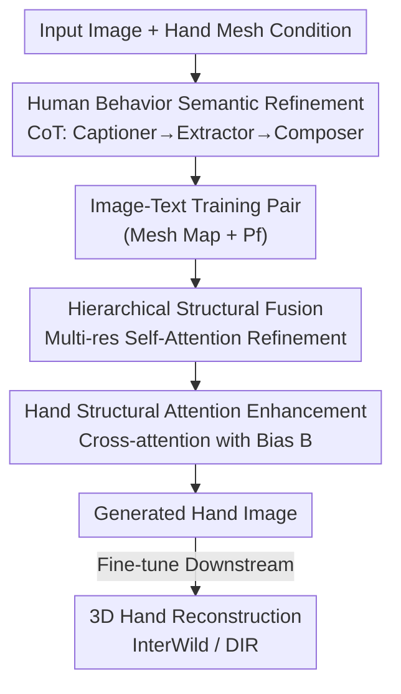

# SesaHand: Enhancing 3D Hand Reconstruction via Controllable Generation with Semantic and Structural Alignment

**Conference**: ICLR 2026  
**OpenReview**: [https://openreview.net/forum?id=sKMgGQQy7g](https://openreview.net/forum?id=sKMgGQQy7g)  
**Area**: Human Understanding / 3D Hand Reconstruction / Controllable Generation  
**Keywords**: 3D Hand Reconstruction, Controllable Image Generation, Chain-of-Thought, Self-Attention Structure, Synthetic Data

## TL;DR
SesaHand employs a controllable diffusion framework with a dual-pronged "semantic + structural alignment" approach to synthesize realistic hand images with 3D mesh labels. The semantic branch uses Chain-of-Thought (CoT) to refine "human behavior semantics" from VLM descriptions, removing irrelevant details, while the structural branch uses hierarchical self-attention fusion for hand-body alignment and a bias term for efficient hand cross-attention enhancement. The generated images significantly improve in-the-wild 3D hand reconstruction (e.g., MPVPE).

## Background & Motivation
**Background**: Single-image 3D hand reconstruction relies on large-scale precise annotations. Since manual annotation is expensive and time-consuming, the community has turned to synthetic data. The mainstream approach involves rendering hand images using game engines, allowing for mass production of various poses.

**Limitations of Prior Work**: Hand images synthesized by game engines suffer from limited texture/background libraries and poor diversity. Hands are often placed in environments semantically incompatible with the context. Worse, most of these images feature "floating hands" without arms or hand-object interaction (see Fig. 1a in the original paper), violating realistic human structure and behavior. While diffusion models can generate diverse and realistic images, direct application leads to "misalignment" issues.

**Key Challenge**: Controllable diffusion for hand image generation face two layers of misalignment. First is **semantic misalignment**—prior work (AttentionHand) directly uses VLMs to describe images, but VLMs suffer from "overthinking," describing every irrelevant element (e.g., cutlery) in detail. This redundancy distracts the model's attention during denoising, leading to unrealistic hands or excess occlusion. Second is **structural misalignment**—the hand is a critical part of the human body, and ignoring its structural relationship with the body results in floating hands and unnatural human poses.

**Goal**: Align controllable hand image generation from both semantic and structural perspectives, producing "image-annotation" pairs that are both realistic and usable for training downstream 3D hand reconstruction models.

**Key Insight**: The authors found that the truly useful part of an image description is the "human-centered context," which can be decomposed into four components: human pose, action, hand action, and environment. These are defined as **human behavior semantics**. Furthermore, the diffusion model's self-attention maps naturally preserve geometric/structural information, while cross-attention maps reveal semantic correspondences between text and images—serving as levers to address structural and semantic issues, respectively.

**Core Idea**: Use CoT to extract human behavior semantics instead of verbose VLM captions for semantic alignment. Employ hierarchical self-attention fusion and hand cross-attention bias enhancement for structural alignment. Together, these synthesize high-quality paired data to boost 3D hand reconstruction.

## Method

### Overall Architecture
SesaHand is built upon ControlNet (freezing Stable Diffusion, training a copy of encoding blocks, and connecting via zero convolutions). The condition is a 2D hand mesh image $c_i$, and the goal is to generate realistic hand images aligned with the mesh and human body structure. The pipeline is divided into two alignment branches: the **semantic branch** replaces text descriptions of training images with clean human behavior semantics offline to build better "image-text" pairs; the **structural branch** modifies features within the generation network to align the hand with the body and highlight hand regions.

Specifically, the input image passes through a semantic refinement pipeline (a three-step CoT: Captioner $\to$ Extractor $\to$ Composer) to produce the final text $P_f$. During training/generation, noisy latent $z_t$ and mesh condition $c_f$ enter ControlNet. Multi-resolution self-attention maps are extracted from encoding and middle blocks for **hierarchical structural fusion**, while a bias term $B$ is added to "hand-related tokens" in cross-attention layers for **hand structural attention enhancement**. Finally, the UNet decodes the hand image. The generated images are used to fine-tune downstream 3D hand reconstruction models (InterWild / DIR).

### Key Designs

**1. Human Behavior Semantic Refinement: Curing VLM Overthinking with CoT**

To address semantic misalignment: VLM captions often include irrelevant elements, contaminating generation and causing hand occlusions. The authors verified this—comparing VLM captions and human behavior semantics as prompts on 100 samples, the latter achieved 97% hand detector confidence vs. 86% for the former. Attention analysis showed overthinking shifts model attention to irrelevant objects. Thus, "human-centered context" is decomposed into human pose, action, hand action, and environment. A three-step CoT extracts this: the Captioner generates an initial description $X_t = \text{Captioner}(X)$; the Extractor uses few-shot examples $P_e$ to decompose key entities and attributes $P = \text{Extractor}(X_t, P_e)$, outputting JSON; the Composer then assembles the components into the final text $P_f = \text{Composer}(P_{pose}, P_{action}, P_{hand\,action}, P_{env})$. This retains sufficient human behavior information while removing irrelevant details that bias T2I models.

**2. Hierarchical Structural Fusion: Aligning Hand and Body via Multi-resolution Self-Attention**

To address the "hand-body alignment" issue within structural misalignment: Self-attention maps preserve geometric information. High resolutions (e.g., 64) capture fine-grained local body structure, while low resolutions (e.g., 8) focus on global structure. The authors extract multi-resolution self-attention maps $\psi_r$ ($r \in \{8, 16, 32, 64\}$) from ControlNet blocks, unify them via max pooling $M$, and aggregate them:

$$\psi' = \sum_{r=8,16,32,64} M(\psi_r)$$

The aggregated map is applied to the control module's output features $f_c$ to obtain refined features: $f'_c = f_c \otimes \psi'$ (where $\otimes$ denotes matrix multiplication). Finally, zero convolution $Z$ merges it back into the Stable Diffusion backbone: $f' = Z(f'_c) + f$. This makes the generated hand more structurally coordinated with the human body.

**3. Hand Structural Attention Enhancement: Efficiently Highlighting Hands via a Bias Term**

To address the issue where small hand regions are easily ignored and expensive to optimize: Unlike AttentionHand's two-stage optimization of $z_t$ (27.25 s/iter), the authors use a lightweight bias matrix in cross-attention. Hand-related tokens (verbs containing "hand") are identified using NLTK to form an index set $I$. A bias $B$ is added to these columns in the cross-attention calculation:

$$M_{cross} = \text{softmax}\!\left(\frac{Q_i K_i^{T}}{\sqrt{d_i}} + B\right),\quad B_{q,k} = \begin{cases}\alpha, & k \in I\\ 0, & \text{otherwise}\end{cases}$$

where $\alpha$ is a positive hyperparameter (optimal at 2.0). This increases the contribution of hand-related tokens in the weighted combination, causing the output $\phi'_i(z_t, c_f) = M_{cross}V_i$ to focus more on the hand region. This adds negligible overhead (0.44 vs. 0.41 s/iter for ControlNet) compared to iterative optimization.

### Loss & Training
The standard ControlNet denoising objective is used: $\mathcal{L}(\theta) = \mathbb{E}_{z_0,\epsilon,t,c_t,c_f}\big[\,\|\epsilon - \epsilon_\theta(z_t, t, c_t, c_f)\|_2^2\,\big]$, where $c_f = \text{En}(c_i)$ is the encoded hand mesh condition. The semantic refinement pipeline is offline and does not involve gradients. The two structural alignment modules are trained end-to-end within the ControlNet framework.

## Key Experimental Results

### Main Results
T2I generation is evaluated on MSCOCO (preprocessed per AttentionHand protocols). Metrics include FID/KID, hand-cropped FID-H/KID-H, hand confidence, 2D/3D keypoint MSE, and user preference.

| Method | FID ↓ | FID-H ↓ | KID-H ↓ | Hand Conf. ↑ | MSE-3D ↓ | User Pref. ↑ |
|------|-------|---------|---------|--------------|----------|--------------|
| Stable Diffusion | 40.52 | 50.78 | 0.02554 | 0.651 | 4.591 | 1.50 |
| ControlNet | 21.67 | 40.32 | 0.02098 | 0.810 | 2.182 | 3.21 |
| AttentionHand | 20.71 | 27.09 | 0.01287 | 0.965 | 1.986 | 4.05 |
| **Ours** | **18.63** | **17.77** | **0.00718** | **0.966** | **1.537** | **4.55** |

Compared to AttentionHand, FID-H improved by ~34% and KID-H by ~44%, showing that semantic + structural information significantly enhances hand image quality.

Downstream 3D hand reconstruction was fine-tuned on HIC and Re:InterHand (ReIH) using InterWild and DIR. Metrics include MPVPE / RRVE / MRRPE (mm):

| Model | Dataset | MPVPE ↓ | vs. +AttentionHand |
|------|--------|---------|---------------------|
| DIR* + Ours | HIC | 20.48 (−6.7%) | −5.6% |
| DIR* + Ours | ReIH | 19.21 (−13.2%) | −8.8% |
| InterWild* + Ours | HIC | 14.70 (−3.9%) | −3.7% |
| InterWild* + Ours | ReIH | 13.01 (−7.0%) | −0.3% |

Fine-tuning with SesaHand's generated images reduced error more than AttentionHand across almost all settings, notably improving InterWild's MPVPE on ReIH from −0.3% to −7.0%.

### Ablation Study
SE, SF, and AE denote Semantic refinement, Structural Fusion, and Attention Enhancement, respectively (evaluated on MSCOCO):

| Configuration | FID ↓ | FID-H ↓ | KID-H ↓ | HC ↑ |
|------|-------|---------|---------|------|
| w/o all | 21.04 | 21.90 | 0.00982 | 0.942 |
| + SE | 19.83 | 18.90 | 0.00807 | 0.944 |
| + SE + SF | 19.05 | 18.17 | 0.00722 | 0.960 |
| + SE + SF + AE | **18.63** | **17.77** | **0.00718** | **0.966** |

Each module provides cumulative gains: SE reduces FID from 21.04 to 19.83, SF aligns the hand-body, and AE primarily boosts hand confidence to 0.966.

### Key Findings
- **Training efficiency is a major highlight**: With 0.44 s/iter, it is nearly as fast as ControlNet (0.41), whereas AttentionHand requires 27.25 s/iter—a ~60x speedup achieved by replacing iterative optimization with a bias term.
- **Optimal bias $\alpha$ exists**: $\alpha=2.0$ yields the best FID (18.63) and FID-H (17.77). Values too small (1.0) fail to highlight the hand, while values too large (2.5) introduce noise.
- **Downstream gains are more pronounced on the difficult ReIH dataset**, suggesting that high-quality, aligned synthetic data is particularly beneficial for robust performance on complex samples (occlusions, truncations).

## Highlights & Insights
- **Quantifying "Overthinking"**: The authors used hand confidence (97% vs 86%) and attention shift analysis to clarify the harm of VLM captions, then applied CoT decomposition—a very specific and motivated approach.
- **Reusing Internal Diffusion Attention**: Using self-attention for structure (hand-body alignment) and cross-attention for semantics (hand token biasing) demonstrates a clean, transferable strategy for "local alignment" generation tasks.
- **Closing the Loop (Generation for Reconstruction)**: Beyond improving generation metrics, the paper proves that synthesized images boost 3D reconstruction, providing a reusable paradigm for "synthetic data for downstream tasks."

## Limitations & Future Work
- Semantic refinement depends on VLM/LLM quality and prompt design; the impact of refinement failure was not fully discussed.
- Structural conditions rely on 2D mesh images, which are subject to mesh quality. The simple max-pooling/summation for self-attention fusion may not be optimal.
- Evaluation was focused on MSCOCO for generation and HIC/ReIH for reconstruction. More diverse in-the-wild and complex hand-object interaction scenarios could be explored.
- Future work: Supporting joint meshes for hand-object interactions and linking semantic components with structural attention (e.g., adaptive $\alpha$ based on action type).

## Related Work & Insights
- **vs. AttentionHand**: Both perform controllable hand generation in-the-wild. However, AttentionHand suffers from VLM overthinking and uses slow two-stage optimization. SesaHand uses CoT for clean semantics and a lightweight bias term, resulting in better quality and ~60x faster speeds.
- **vs. FoundHand**: FoundHand uses 2D keypoints, ignoring shape; SesaHand uses mesh conditions to preserve hand shape.
- **vs. HandBooster**: HandBooster is limited to laboratory settings; SesaHand targets in-the-wild scenarios.
- **vs. HanDiffuser / Hand1000**: These generate hands from text but lack reliable mesh labels for training downstream reconstruction models; SesaHand generates paired data.

## Rating
- Novelty: ⭐⭐⭐⭐ Merging semantic (CoT) and structural (SF/AE) alignment into controllable generation is a specific and well-executed contribution.
- Experimental Thoroughness: ⭐⭐⭐⭐ Strong evaluation on both generation and reconstruction, though broader downstream models/datasets would be even better.
- Writing Quality: ⭐⭐⭐⭐ Motivated by quantitative analysis; methodology is clear and well-illustrated.
- Value: ⭐⭐⭐⭐ Provides an efficient, high-quality paradigm for boosting 3D hand reconstruction via synthetic data.

<!-- RELATED:START -->

## Related Papers

- [\[ICLR 2026\] TOUCH: Text-guided Controllable Generation of Free-Form Hand-Object Interactions](touch_text-guided_controllable_generation_of_free-form_hand-object_interactions.md)
- [\[CVPR 2025\] WiLoR: End-to-end 3D Hand Localization and Reconstruction in-the-wild](../../CVPR2025/human_understanding/wilor_end-to-end_3d_hand_localization_and_reconstruction_in-the-wild.md)
- [\[ICLR 2026\] Motion-R1: Enhancing Motion Generation with Decomposed Chain-of-Thought and RL Binding](motion-r1_enhancing_motion_generation_with_decomposed_chain-of-thought_and_rl_bi.md)
- [\[CVPR 2026\] OpenDance: Multimodal Controllable 3D Dance Generation with Large-scale Internet Data](../../CVPR2026/human_understanding/opendance_multimodal_controllable_3d_dance_generation_with_large-scale_internet_.md)
- [\[CVPR 2026\] View-Aware Semantic Alignment for Aerial-Ground Person Re-Identification](../../CVPR2026/human_understanding/view-aware_semantic_alignment_for_aerial-ground_person_re-identification.md)

<!-- RELATED:END -->
