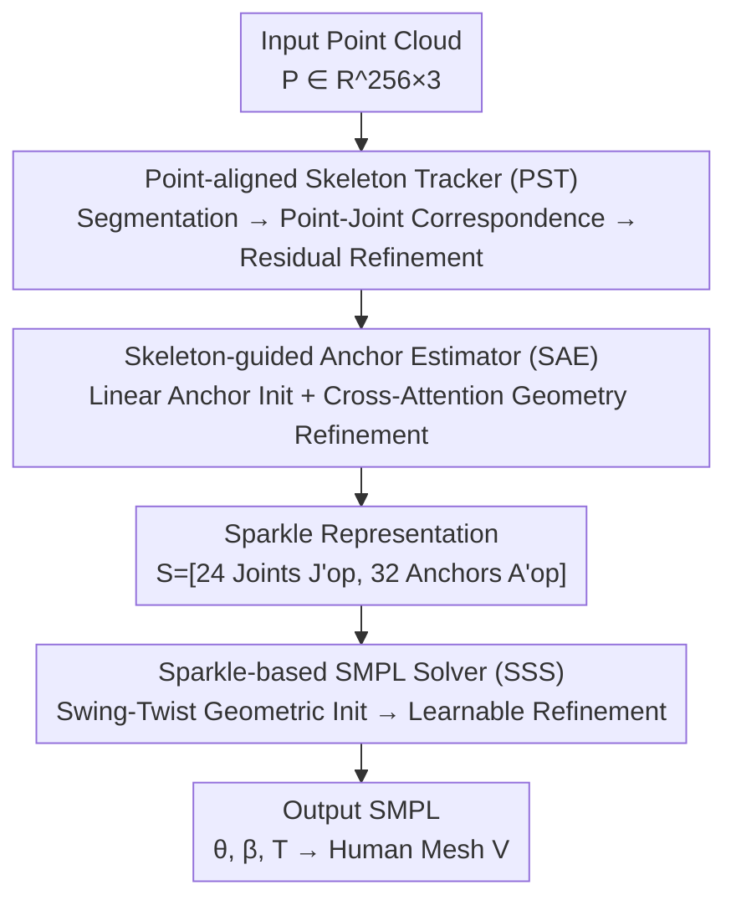

# Sparkle: A Robust and Versatile Representation for Point Cloud-based Human Motion Capture

**Conference**: ICLR 2026  
**OpenReview**: [https://openreview.net/forum?id=0blfYtdJES](https://openreview.net/forum?id=0blfYtdJES)  
**Code**: None  
**Area**: 3D Vision / Human Understanding / Point Cloud Motion Capture  
**Keywords**: Point cloud motion capture, human representation, skeleton-surface decoupling, SMPL solving, robust generalization

## TL;DR
Addressing the dilemma in point cloud motion capture where "point-level methods are detail-rich but noise-sensitive, while skeletal methods are robust but lose detail," this paper proposes the Sparkle representation—explicitly decoupling and then unifying 24 skeletal joints (internal kinematics) and 32 surface anchors (external geometry). Coupled with the SparkleMotion framework (Point-aligned Skeleton Tracker + Skeleton-guided Anchor Estimator + Sparkle-based SMPL Solver), it sets new SOTAs across 11 datasets, sensors, and occlusion noise.

## Background & Motivation
**Background**: Human motion capture (MoCap) supports numerous applications such as sports analysis, healthcare, VR, and human-computer interaction. Among various modalities, point cloud-based (LiDAR / depth camera) solutions offer unique advantages over wearable sensors and RGB cameras due to precise depth perception and inherent privacy protection (no identifiable faces). However, point clouds are unstructured, sparse, noisy, and often incomplete, making the learning of a "both expressive and robust" intermediate representation a core challenge.

**Limitations of Prior Work**: Existing methods have flaws on two main paths. One is **direct point-level representation** (e.g., PointNet-based), which retains geometric details but lacks structural priors, making it extremely sensitive to noise and occlusion. The other is **abstract skeletal representation** (e.g., LiveHPS-based), which possesses strong kinematic structural priors and noise robustness but loses all surface details—which are essential for resolving joint rotation ambiguities (especially "twist" around the bone axis) and restoring precise shapes. Neither approach achieves both expressiveness and robustness simultaneously.

**Key Challenge**: A trade-off exists between expressiveness (geometry detail) and robustness (structural prior). Furthermore, the authors emphasize that **simply concatenating skeletal and surface representations is insufficient**: the skeletal part lacks surface constraints, and the point-level part is unstable under sparsity/noise. Merging them merely compounds their respective defects.

**Goal**: Construct an intermediate human representation that balances expressiveness and robustness, and build a practical MoCap system that leads in accuracy, robustness, and cross-domain generalization.

**Key Insight**: Internal skeletal joints provide noise-resistant but incomplete structural descriptions, while external surface points provide detail-rich but fragile geometric descriptions; the two are complementary. The key is not simple union, but **redesigning each component**: the skeletal side shifts to "point-aligned estimation" to explicitly model the spatial correspondence between point clouds and joints (rather than direct regression), and the surface side shifts to "semantically consistent anchors that can be dynamically refined via skeletal guidance" (rather than cluttered raw points).

**Core Idea**: Propose **Sparkle** — using explicit "kinematic-geometric decoupling" to unify skeletal joints and surface anchors into a structured representation $S=[J'_{op}, A'_{op}]$, allowing the skeleton to ensure robustness and anchors to ensure expressiveness, followed by an efficient SMPL solver based on this decoupled structure.

## Method

### Overall Architecture
SparkleMotion takes normalized point cloud sequences $P_t \in \mathbb{R}^{256\times3}$ (farthest point sampled per frame) as input and outputs SMPL parameters: shape $\beta\in\mathbb{R}^{10}$, pose $\theta\in\mathbb{R}^{72}$ (axis-angle), and global translation $T\in\mathbb{R}^3$, resulting in a 6890-vertex human mesh $V$. The core of the pipeline is encoding the human body into the Sparkle representation—24 optimized skeletal joints $J'_{op}$ and 32 optimized surface anchors $A'_{op}$—and then solving for the final human model.

The system consists of three serial modules: the **Point-aligned Skeleton Tracker (PST)** estimates internal kinematics (skeletal joints) from the point cloud; the **Skeleton-guided Anchor Estimator (SAE)** estimates external geometry (surface anchors) under skeletal guidance; after forming the Sparkle representation, the **Sparkle-based SMPL Solver (SSS)** utilizes this "kinematic space + geometric space" decoupling to perform geometric initialization followed by learnable refinement to regress SMPL parameters.

### Key Designs

**1. Sparkle Representation: Unifying Robustness and Expressiveness via Skeleton-Surface Decoupling**

This is the foundation of the paper. It addresses the pain point that "point-level representations fear noise, skeletal representations lose detail, and simple concatenation is ineffective." Sparkle explicitly decomposes the human body into two complementary spaces and unifies them in one encoding: the internal kinematic space is described by 24 joints $J'_{op}$ (providing noise-resistant kinematic constraints), and the external geometric space is described by 32 anchors $A'_{op}$ (encoding local surface details needed to resolve shape/rotation ambiguity). The final representation is $S=[J'_{op}, A'_{op}]$. This explicit factorization introduces strong physical inductive biases: joints are naturally responsible for "pose stability," and anchors for "shape detail," significantly reducing learning complexity compared to unstructured raw point clouds. It is not a simple stack because both components are redesigned (see designs 2 and 3), and this decoupled structure allows for analytical geometric initialization in downstream SMPL solving (see design 4).

**2. Point-aligned Skeleton Tracker (PST): Reformulating Global Joint Regression as Correspondence-based Local Refinement**

Addressing the instability of direct skeletal regression from highly variable point clouds and its misalignment with observed geometry. PST first uses a PointNet backbone with a bidirectional GRU to predict initial joints $J_{init}$ and global translation $T_{init}$. It then performs implicit semantic segmentation on the point cloud, assigning each point a label $L_j\in\{0,1,\dots,24\}$ corresponding to its joint, thereby establishing explicit spatial correspondence. With this correspondence, the authors **reformulate the global regression problem into a set of local refinement tasks**: first, the point cloud is centered using the predicted translation $P_{centered}=P-T_{init}$, and for each joint $j$, a subset of points $P_j$ with label $j$ is extracted and normalized relative to that joint $\tilde P_j=\{p-J_{init,j}: p\in P_j\}$. A lightweight PointNet with **cross-joint shared weights** processes each local point set to obtain $F_{joint}$, and an MLP decodes the residual offset $\Delta J_j$. Finally:

$$J_{op}=J_{init}+\Delta J_j,\qquad T_{op}=T_{init}+\Delta J_0.$$

Shared weights force the network to learn a universal refinement function independent of specific body parts, significantly improving generalization. When a joint has too few associated points ($|\tilde P_j|<3$), local neighborhood features are used to propagate high-confidence predictions to uncertain regions. The training loss is $L_{PST}=\lambda_1 L_{MSE}(J_{op},J_{gt})+\lambda_2 L_{CE}(L_j,L_{j\,gt})+\lambda_3 L_{MSE}(T_{op},T_{gt})$ ($\lambda_1{=}1.0,\lambda_2{=}0.5,\lambda_3{=}1.0$).

**3. Skeleton-guided Anchor Estimator (SAE): Linear Initialization via Skeleton followed by Cross-Attention Geometric Refinement**

To address the difficulty of predicting surface anchors directly from unstructured point clouds, SAE adopts a "strong initial value followed by geometric context integration" strategy. **Structured Initialization**: 32 canonical anchors $A_{gt}$ are extracted from SMPL mesh vertices via PCA. A linear mapping from joints to anchors is pre-calculated via least squares from ground truth $M_{J2A}=(A_{gt}^\top A_{gt})^{-1}A_{gt}^\top J_{gt}$. Thus, $A_{init}=J_{op}M_{J2A}$ provides a rough but geometry-independent anchor prior based solely on predicted skeletons. **Geometric-aware Refinement**: Since $A_{init}$ lacks detail and may be biased by errors in $J_{op}$, the authors use cross-attention to learn a non-linear correction—treating PST joint features $F_{joint}$ as the query (representing "given current pose, what should the local surface look like") and anchor features $F_{anchor}$ from a point cloud transformer processing $A_{init}$ as key/value (representing "what is the actual local geometry"), allowing each joint query to selectively aggregate the most relevant geometric features. This compensates for both initial joint errors and linear model limitations. Furthermore, anchor reliability is implicitly captured via learned anchor segmentation $L_a$ for weighted downstream solving. Loss $L_{SAE}=\lambda_4 L_{MSE}(A_{op},A_{gt})+\lambda_5 L_{CE}(L_a,L_{a\,gt})$ ($\lambda_4{=}1.0,\lambda_5{=}0.5$). After joint and anchor optimization, a kinematic optimization step ensures temporal consistency for the final $S=[J'_{op},A'_{op}]$.

**4. Sparkle-based SMPL Solver (SSS): Parameter-free Swing-Twist Analytical Initialization via Decoupled Structure**

This step converts the Sparkle representation into SMPL parameters, proving Sparkle is an efficient encoding rather than just an intermediate product. Because the representation is explicitly divided into joint and anchor spaces, the solver can perform **deterministic geometric initialization**, bypassing the bias of purely learnable initialization. For each bone, axis-angle rotation is decomposed into swing-twist: **swing** uses pure skeletal info to align the template bone $\vec J_{tem}$ to the predicted bone $\vec J'_{op}$—

$$\vec n_{sw}=\frac{\vec J_{tem}\times\vec J'_{op}}{\|\vec J_{tem}\times\vec J'_{op}\|},\quad \alpha_{sw}=\arccos\frac{\vec J_{tem}\cdot\vec J'_{op}}{\|\vec J_{tem}\|\|\vec J'_{op}\|};$$

**twist** rotates around the bone axis $\vec n_{tw}=\vec J'_{op}/\|\vec J'_{op}\|$, using anchor alignment to determine the twist angle $\alpha_{tw}=\operatorname{arctan2}(\|A_{tem}\times A'_{op}\|, A_{tem}\cdot A'_{op})$. Finally, the Rodrigues formula synthesizes $R=R_{sw}R_{tw}$, yielding an initial pose $\hat\theta_{init}$ without learnable parameters. However, analytical solutions have ill-posed cases: swing axes are unstable when bones are nearly collinear; twist angles are non-unique when anchors are occluded or near the bone axis. Thus, a lightweight cross-attention network performs learnable correction—encoding $\hat\theta_{init}$ as queries and Sparkle features $F_{sparkle}$ as key/values to iteratively refine $\hat\theta_{op}$ and $\hat\beta$. Loss $L_{SSS}=\lambda_6 L_{MSE}(\hat\theta_{op},\theta_{gt})+\lambda_7 L_{MSE}(\hat\beta,\beta_{gt})$ ($\lambda_6{=}1.0,\lambda_7{=}0.5$). This two-stage "analytical initialization + learnable refinement" balances efficiency and accuracy.

## Key Experimental Results

### Main Results
Evaluated on 11 MoCap benchmarks using metrics: local/global joint and vertex error J/V Err(L/G) (mm, ↓) and angular error Ang Err (degrees, ↓). Baselines include LiDARCap, LiveHPS, VoteHMR, PointHPS, LiveHPS++ (point-based), and FreeCap (multi-view).

General noisy/occlusion scenarios (4 datasets, reporting J/V Err(G) and Ang Err):

| Dataset | Metric | Ours | LiveHPS++ (Prev. SOTA) | Gain |
|--------|------|------|----------|------|
| FreeMotion | J/V Err(G) | 105.1/113.9 | 112.1/120.4 | ↓ |
| FreeMotion | Ang Err | **9.66** | 15.40 | Large ↓ |
| FreeMotion-OBJ (Noise) | J/V Err(G) | 104.1/110.5 | 128.6/136.9 | Significant ↓ |
| FreeMotion-OBJ (Noise) | Ang Err | **8.49** | 15.85 | ~Half ↓ |
| NoiseMotion (Noise) | J/V Err(G) | 38.8/45.8 | 58.5/64.5 | Large ↓ |
| NoiseMotion (Noise) | Ang Err | **7.57** | 10.63 | ↓ |

Improvements are particularly significant on noisy datasets (FreeMotion-OBJ, NoiseMotion), with angular errors nearly halved compared to the previous SOTA, validating the robustness of the decoupled representation.

Close interaction (3 datasets, vs. LiveHPS++):

| Dataset | Metric | Ours | LiveHPS++ |
|--------|------|------|-----------|
| Interhuman | J/V Err(G) | 40.4/48.4 | 55.0/73.8 |
| Interhuman | Ang Err | **6.75** | 18.47 |
| Hi4D | Ang Err | **13.11** | 25.29 |

Generalization across sensors (GTA-Human-Point / HuMMan-Point with Ouster-128/64beam, Kinect, etc.) and multi-view scenarios (FreeMotion-MV / HuMMan-MV vs. FreeCap) also shows comprehensive leads. For multi-view, Sparkle dynamically selects the most reliable representation combination using confidence scores from anchor segmentation, without needing explicit multi-view fusion.

### Ablation Study

| Configuration | FreeMotion J/V Err(G) | Description |
|------|------|------|
| Full Ours | 105.1/113.9 | Complete model |
| w/o PST | 149.2/159.6 | Without PST; global error spikes |
| w/o SAE | 116.0/125.3 | Without SAE; pose accuracy drops |
| w/o SSS | 112.6/122.4 | Without SSS; parameter regression degrades |
| PST w/o Offset | 107.2/116.7 | Direct prediction instead of residual; joint error rises |
| SAE w/o Initialization | 108.3/118.4 | Without linear init; unstable convergence |
| SSS w/o Initialization | 108.8/117.9 | Without geo-init; converges to suboptimal pose |

Anchor design ablations (Table 6) compare PCA / Random / Manual selection and anchor counts: PCA-32 (default) is optimal for expressiveness, noise resistance, and efficiency; PCA-16 lacks coverage, while PCA-64/96 are prone to overfit noisy point clouds. Manual (CMU marker set) provides comprehensive coverage but lacks automation and generalization compared to PCA-derived anchors.

### Key Findings
- **PST contributes the most**: Removing it causes global error on FreeMotion to jump from 105/114 to 149/160, demonstrating that explicit point-joint correspondence is the foundation for stable skeleton estimation.
- **Residual refinement + shared weights** is more stable than direct regression, and the part-agnostic refinement function learned via shared weights is a key source of generalization.
- **More anchors are not necessarily better**: 32 PCA anchors represent the sweet spot; excessive anchors make regression from noisy point clouds harder due to error accumulation.
- The largest improvements occur in noisy/interaction scenarios (angular errors often reduced by half), confirming the design intent: "skeleton for noise robustness, anchors for detail."

## Highlights & Insights
- **Decoupled-then-Unified Representation**: Neither a direct PointNet output nor just a skeleton, but an explicit split between "internal kinematics" and "external geometry" handled separately and factorized for the solver. This approach resolves the conflict between "robustness" and "expressiveness" at the representation level.
- **Reframing Global Regression as Local Refinement**: PST converts "regressing a whole skeleton at once" into "individual local refinements + shared weights" via segmentation. This reduces difficulty and improves generalization—a reformulation valuable for other structured point cloud prediction tasks.
- **Hybrid Analytical-Learnable Solving**: SSS uses swing-twist + Rodrigues for parameter-free geometric initialization to find a physically plausible starting point, then uses cross-attention to fix ill-posed cases. This balances efficiency and precision better than purely learnable or purely analytical methods.
- **Implicit Confidence**: Instead of regressing explicit confidence, the quality of anchor segmentation implicitly characterizes reliability, which is used directly for dynamic selection in multi-view settings, bypassing explicit multi-view fusion modules.

## Limitations & Future Work
- The representation and solver are tied to SMPL (24 joints / 32 anchors / template bone and zero pose); migrating to non-SMPL topologies or other deformable bodies (e.g., animals, hands) would require redesigning anchors and mappings.
- Swing-twist analytical initialization is inherently ill-posed when bones are nearly collinear or anchors are occluded; it relies on the subsequent learnable refinement. Whether refinement can stabilize under extreme occlusion/lack of geometric evidence remains unanalyzed.
- The linear mapping $M_{J2A}$ is pre-calculated from ground truth, and anchors are PCA-derived from SMPL vertices, creating a dependency on the shape statistics of the training distribution. Generalization to out-of-distribution body shapes (e.g., obesity, children, heavy clothing) is not fully validated.
- No code is provided; reproduction requires implementing PST/SAE/SSS modules and point cloud generation (some data is synthesized via LIP methods).

## Related Work & Insights
- **vs. LiveHPS / LiveHPS++ (Skeletal Route)**: These focus on joint optimization and are robust to sparse LiDAR but discard surface details and fail to fully utilize geometric info from dense depth point clouds. Sparkle recovers surface geometry and models point-joint correspondence, outperforming them in noise and interaction scenarios.
- **vs. Point-level Methods (PointNet / VoteHMR / PointHPS)**: These retain details but lack structural priors, making them unstable under noise. Sparkle uses skeletal priors to guide anchors and reformulates regression as local refinement, achieving both detail and stability.
- **vs. FreeCap (Multi-view MoCap)**: FreeCap relies on explicit multi-view fusion. Sparkle uses implicit confidence from segmentation to dynamically pick the best representations across views, performing better without a dedicated fusion module.
- **vs. Virtual Markers**: Traditional markers are precise but require hardware calibration and controlled environments. Sparkle’s anchors act as "learned virtual markers" automatically derived from point clouds and refined via skeletal guidance, balancing automation with geometric consistency.

## Rating
- Novelty: ⭐⭐⭐⭐⭐ Explicit skeleton-surface decoupling + global-to-local refinement reformulation + hybrid solving; novel combination with solid motivation.
- Experimental Thoroughness: ⭐⭐⭐⭐⭐ 11 datasets covering noise, occlusion, interaction, cross-sensor, and multi-view; comprehensive module and design ablations.
- Writing Quality: ⭐⭐⭐⭐ Method logic is clear and formulas are complete, though some notation (e.g., subscripts in $\Delta J_j$) and table layouts are slightly cluttered.
- Value: ⭐⭐⭐⭐⭐ Provides a real-time, privacy-friendly, cross-sensor point cloud MoCap solution; the representation design is transferable to other structured point cloud tasks.

<!-- RELATED:START -->

## Related Papers

- [\[ICLR 2026\] QuaMo: Quaternion Motions for Vision-based 3D Human Kinematics Capture](quamo_quaternion_motion_kinematics.md)
- [\[CVPR 2026\] Progressive Guessing to Fixed Point: Rethinking Human Motion Prediction with Deep Equilibrium Models](../../CVPR2026/human_understanding/progressive_guessing_to_fixed_point_rethinking_human_motion_prediction_with_deep.md)
- [\[CVPR 2025\] MotionReFit: Dynamic Motion Blending for Versatile Motion Editing](../../CVPR2025/human_understanding/motionrefit_motion_editing.md)
- [\[AAAI 2026\] Improving Sparse IMU-based Motion Capture with Motion Label Smoothing](../../AAAI2026/human_understanding/improving_sparse_imu-based_motion_capture_with_motion_label_smoothing.md)
- [\[ICLR 2026\] MotionGPT3: Human Motion as a Second Modality](motiongpt3_human_motion_as_a_second_modality.md)

<!-- RELATED:END -->
