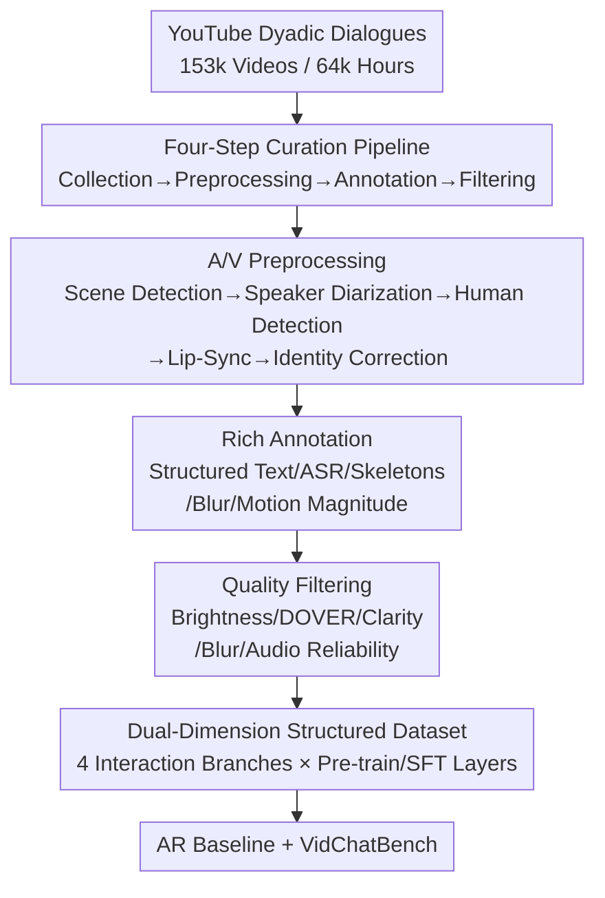

# SpeakerVid-5M: A Large-Scale High-Quality Dataset for Audio-Visual Dyadic Interactive Human Generation

**Conference**: ICLR 2026  
**OpenReview**: [https://openreview.net/forum?id=U004uqALWl](https://openreview.net/forum?id=U004uqALWl)  
**Code**: Dataset and processing code will be released (Open-source commitment in the paper)  
**Area**: Human Understanding / Audio-Visual Digital Human / Dataset & Benchmark  
**Keywords**: Digital Human Generation, Dyadic Interaction, Audio-Visual Alignment, Dataset, Auto-regressive Generation

## TL;DR
Addressing the lack of public data for "active interactive digital humans," this work constructs SpeakerVid-5M—the first large-scale, high-quality dataset for audio-visual dyadic interactive digital human generation (8,743 hours, 5.2 million single-person clips, 770,000 dialogue pairs). It also introduces an auto-regressive video dialogue baseline and the VidChatBench evaluation benchmark.

## Background & Motivation

**Background**: With the development of large-scale video models, 2D digital human "driving + rendering" has become highly realistic—from early GAN routes (PD-FGC, etc.) to diffusion routes (EMO, OmniHuman-1, MoCha, etc.). Lip-sync, talking heads, and full-body performances have continuously set new SOTA records, supporting industrial applications like automated lip-syncing, digital anchors, and virtual actors.

**Limitations of Prior Work**: These methods are essentially "passively driven"—generating video given audio/text conditions. These digital humans lack a "brain"; they cannot understand input or respond actively. Academic and industrial circles increasingly seek **active interactive digital humans**: agents that can understand an interlocutor and autonomously generate meaningful audio-visual responses (essential for virtual assistants, e-commerce streaming, and online education). However, training such interactive foundation models requires massive specialized data, yet **public interactive digital human datasets are almost non-existent**: existing data is either small-scale and low-quality (early talking head/lip-reading data), too general with inconsistent quality (ACAV-100M), or simply not open-sourced (data used by OmniHuman-1). Even recent datasets like OpenHumanVid and TalkCuts only cover single-person talking head scenarios and are only partially released.

**Key Challenge**: Dyadic generation and traditional conditional generation are two different tasks. Traditional tasks involve "audio/text → video" modality alignment, whereas dyadic generation requires the model to **first understand the initiator's complete multi-modal content, then generate the responder's audio and video**, demanding an order of magnitude higher understanding and reasoning capability. Without paired "query-response" audio-visual data, this path is impassable.

**Goal**: ① Construct a large-scale, high-quality, richly annotated, and strictly audio-visual aligned dyadic interaction dataset; ② Structure the data across interaction scenarios and quality dimensions to suit different needs from pre-training to SFT; ③ Provide a baseline method and standardized evaluation benchmark to establish a starting point for future work.

**Key Insight**: Starting from massive real-world dyadic dialogue videos on YouTube (interviews, news, seminars, variety shows, debates, education), an automated pipeline with multi-model collaboration is used to process "raw long videos" into "well-aligned, richly annotated, quality-stratified clips."

**Core Idea**: Refine 64,000 hours of raw video into SpeakerVid-5M via a "four-step curation pipeline + dual-dimensional structuring of interaction types and data quality," advancing the digital human task from "conditional driving" to "audio-visual dyadic interaction" for the first time.

## Method

### Overall Architecture

The output of this paper consists of two parts: **a dataset** and **supporting facilities (baseline + benchmark)**.

For the dataset, the construction of SpeakerVid-5M follows a clear four-step serial pipeline: first, manually collect 153,000 dyadic dialogue videos from YouTube (64,000 hours of raw data); then, undergo multi-step audio-visual preprocessing to segment long videos into single-person clips while aligning speaker identities; next, use multiple models to provide rich annotations for each clip, including structured text, ASR, skeletons, blurriness, and motion magnitude; finally, use a set of quality filters to remove low-quality data. Post-production, the data is organized along **two orthogonal dimensions**: interaction scenarios (Dialogue/Monologue/Listening/Multi-turn) and data quality (large-scale Pre-training subset and curated SFT subset).

For the facilities, the authors trained an **auto-regressive (AR) audio-visual dialogue baseline** (Qwen2.5-Omni for multi-modal understanding + next-chunk AR joint generation of audio-visual tokens + spatial transformer + diffusion MLP refinement) and constructed **VidChatBench** (500 unseen speaker input-output pairs + 6-dimensional custom metrics) to evaluate this new task.

The following diagram illustrates the main dataset construction pipeline (four-step curation):

### Key Designs

**1. Four-step Audio-Visual Curation Pipeline: Turning "Dirty Long Videos" into "Aligned Single-person Clips"**

The hardest part of dyadic interaction data is not "finding videos," but accurately determining "who is speaking, which face it corresponds to, and whether audio and video are aligned." This work splits construction into collection, preprocessing, annotation, and filtering. The core difficulty lies in **preprocessing**: first, use SceneDetect to segment scenes (discarding <3s, splitting >14s, obtaining 3–14s clips $S_{sp}$ and recording temporal indices for sequence concatenation); use 3D-Speaker for speaker diarization, selecting the two main speakers $S_{sv}$ by frequency and duration; use YOLO for human tracking to crop single-person clips $S_{rsp}$; then use SyncNet to calculate audio-visual synchronization confidence on the temporal overlap segment $S_{ol}$ between $S_{rsp}$ and $S_{sv}$, **binding the face box with the highest confidence to the corresponding speaker ID**; finally, use ArcFace for identity correction—ensuring face consistency for the same speaker ID across multiple clips from the same source video, correcting outliers more similar to other IDs. The key is that "audio-side speaker IDs" and "visual-side face boxes" must be dual-aligned via SyncNet (A/V sync) + ArcFace (face consistency) to avoid misattribution in dyadic scenes.

**2. Rich Annotation: Annotating each clip for "Fine-grained Controllable Generation"**

Aligned video is not enough; generative models need rich conditional signals. Each clip is paired with: **Structured text annotations** generated by Qwen2.5-VL (camera movement, entity list, body orientation, framing, detailed actions, and expressions); dialogue **topic categories** summarized from multiple ASR clips by Qwen-3; **Audio annotations** (Whisper ASR transcripts + SyncNet metrics + 3D-Speaker identity, plus a cleaned version where non-target speaker segments are muted); **Human skeletons** estimated by DWPose (clips without detectable faces are discarded); **Blurriness scores**—Laplacian variance calculated after cropping face/hand boxes to $128 \times 128$, used as a conditional signal to help explicitly model motion blur; **Motion magnitude scores**—rated 1–5 (1 minimal, 5 massive) by Qwen2.5-VL using **multiple persona prompts** to simulate different perspectives, averaging scores after removing outliers to mitigate subjective annotation noise. This suite provides all necessary conditions (identity, pose, clarity, motion, semantics) for fine-grained controllable generation.

**3. Dual-dimensional Structure: Orthogonal split by Interaction Type × Data Quality**

This is key to the dataset's "usability." The first dimension splits data into four **interaction scenarios**: **Dialogue branch** (770k pairs / 1.8k hours / 16k speakers, each sample being an "input-response" pair for dyadic generation); **Monologue branch** (5.2M clips / 8.7k hours / 83k speakers, the largest talking head dataset to date); **Listening branch** (distinguishing "co-occurrence listening" via SyncNet score differences and "non-co-occurrence listening" where ASR is valid but SyncNet is low, composed of "speaker audio + listener silent video"); **Multi-turn branch** (retains temporal indices, defining dialogue start $x$ and max history $T$, aggregating clips in $[x-T, x]$ as context). The second dimension is **Quality Stratification**: using stricter thresholds (hand blur >0.5, face blur >0.7, DOVER >0.6, motion >2, ASR confidence >-1) to extract a **571k clip / 1,368 hour high-quality SFT subset**, leaving the remaining 7,375 hours as a large-scale pre-training subset. This orthogonal organization allows the data to fit modern "large-scale pre-training then small-scale SFT" paradigms and serve various downstream tasks.

**4. AR Baseline + VidChatBench: Building a Starting Line for the New Task**

To prove data utility, the authors designed an AR baseline: using **Qwen2.5-Omni** as a "thinker" for multi-modal understanding, feeding its hidden states and raw A/V embeddings to a generation head. Video is encoded into latent patch tokens via 3D-VAE (temporal stride 4, spatial stride 8), and audio via CosyVoice2 tokenizer. **One latent map + its corresponding audio tokens form a chunk** for **next-chunk joint prediction** (all tokens attend to all previous and current chunk tokens). The visual side uses a **spatial transformer** (borrowing from MAR/NOVA) for set-by-set token refinement, followed by a diffusion MLP for denoising. During training, **random noise is injected** into visual tokens to mitigate error accumulation. Training follows three stages: visual pre-training (single-person data) → audio-visual joint training → high-quality dyadic dialogue fine-tuning. The paired **VidChatBench** uses 500 unseen pairs, evaluating via: video quality (FID/FVD/PSNR/SSIM), identity preservation (ArcFace), dialogue coherence (ranking against candidates), A/V consistency (SyncNet), emotional alignment (expression features), and audio identity (SIM-o).

### Loss & Training
Three-stage progressive training (Visual Pre-training → A/V Joint Training → High-quality Dyadic Dialogue Fine-tuning). Visual objectives are optimized with diffusion loss, while audio objectives use cross-entropy for next-chunk prediction. Random noise injection is applied to visual tokens to combat error accumulation.

## Key Experimental Results

### Main Results

Comparison on VidChatBench between Conditioned (Text: GT ASR + Detailed description) and Dyadic (Direct A/V generation) protocols, incrementally adding Audio (joint generation), Spatial (set-by-set transformer), and Noise (injection):

| Protocol | Config | FID↓ | FVD↓ | PSNR↑ | SSIM↑ | ArcFace↑ | Sync_conf↑ |
|------|------|------|------|-------|-------|----------|-----------|
| Conditioned | base | 56.82 | 55.06 | 15.26 | 0.62 | 0.638 | – |
| Conditioned | +Audio+Spatial+Noise | 34.72 | 30.43 | 17.39 | 0.65 | 0.758 | 2.655 |
| Dyadic | base | 49.97 | 47.23 | 15.74 | 0.62 | 0.637 | – |
| Dyadic | +Audio+Spatial+Noise | **32.35** | **28.82** | **17.55** | **0.66** | **0.772** | **2.698** |

The Dyadic protocol (direct A/V input) consistently outperforms Conditioned (abstract text), confirming that "direct audio-visual input preserves finer-grained information."

### Ablation Study

| Config (Dyadic) | FID↓ | FVD↓ | ArcFace↑ | Description |
|------|------|------|----------|------|
| base | 49.97 | 47.23 | 0.637 | Video generation only |
| +Audio | 49.86 | 36.90 | 0.635 | Joint audio generation; no degradation in video |
| +Audio+Spatial | 35.67 | 31.28 | 0.749 | Spatial transformer significantly improves visual metrics |
| +Audio+Spatial+Noise | 32.35 | 28.82 | 0.772 | Noise injection further combats error accumulation |

### Key Findings
- **Spatial transformer provides the largest gain**: Moving from +Audio to +Audio+Spatial, FID drops from 49.86 → 35.67 and ArcFace rises from 0.635 → 0.749, showing set-by-set refinement is transformative for visual quality.
- **Joint audio generation does not harm video**: Adding Audio leaves FID nearly unchanged (49.97→49.86), while FVD actually decreases, indicating that treating audio as an additional condition does not burden visual fidelity.
- **Noise injection effectively counters error accumulation**: AR generation is prone to frame drift; injecting noise reduces FID further to 32.35, validating this robustness trick for AR.
- **Dataset Statistics**: 93% of videos are ≥1080P; the monologue branch (5.2M clips) is the largest talking head dataset to date; the dialogue branch (770k pairs) is the first public resource for dyadic interaction.

## Highlights & Insights
- **Task definition is the primary contribution**: Advancing digital humans from "conditional driving" to "audio-visual dyadic interaction" and providing paired data is a prerequisite for end-to-end interactive agents.
- **A/V alignment via dual signals**: SyncNet (sync) for ID-face binding + ArcFace (consistency) for cross-clip error correction is a robust strategy for "who is speaking" in dyadic scenes.
- **Multi-persona motion scoring**: Using multiple persona prompts for MLLM-based rating is a practical trick to mitigate subjective annotation noise.
- **Blurriness as a condition, not just a filter**: Using Laplacian variance as an explicit input allows the model to learn reasonable clarity priors even in motion-heavy scenes.
- **Orthogonal dual-dimensional structuring**: The Scenario × Quality split makes the data naturally compatible with modern "Pre-train + SFT" paradigms.

## Limitations & Future Work
- **Preliminary baseline**: This serves as an "initial exploration" in the AR paradigm; absolute metrics (FID 32, PSNR 17.5) still lag behind industrial realism.
- **Single data source**: All data comes from YouTube, constrained by real-world dialogue distributions (interviews/news/variety).
- **Dependency on existing models**: Annotations inherited from Qwen-VL/Whisper may carry their biases.
- **Ethics and Copyright**: Based on public YouTube data; privacy and potential biases require caution. Only annotations and URLs are provided.
- **Future Directions**: Extending to group interactions (>2 people), introducing stronger diffusion generation heads, and utilizing multi-turn branches for long-term memory dialogue modeling.

## Related Work & Insights
- **vs. OpenHumanVid / TalkCuts**: These are large but single-person focused; this work provides the first public large-scale paired dyadic data.
- **vs. OmniHuman-1 Data**: The latter is private; this work publicizes a similar scale of data with richer annotations (skeletons, blur, motion).
- **vs. ViCo (learning to listen)**: ViCo only covers listening; this work integrates listening into a larger four-branch structure.
- **vs. BodyofHer**: BodyofHer proved AR-LLMs can perform end-to-end interaction but lacked public data; this work fills that gap.

## Rating
- Novelty: ⭐⭐⭐⭐⭐ First public large-scale dyadic interactive dataset, defining a new task direction.
- Experimental Thoroughness: ⭐⭐⭐⭐ Solid statistics and ablation, though baseline performance is preliminary.
- Writing Quality: ⭐⭐⭐⭐ Clear explanation of pipelines and structure.
- Value: ⭐⭐⭐⭐⭐ Fills a major gap in public data and benchmarks for interactive agents.

<!-- RELATED:START -->

## Related Papers

- [\[CVPR 2026\] OpenT2M: No-frill Motion Generation with Open-source, Large-scale, High-quality Data](../../CVPR2026/human_understanding/opent2m_no-frill_motion_generation_with_open-source_large-scale_high-quality_dat.md)
- [\[CVPR 2026\] RoMo: A Large-Scale, Richly Organized Dataset and Semantic Taxonomy for Human Motion Generation](../../CVPR2026/human_understanding/romo_a_large-scale_richly_organized_dataset_and_semantic_taxonomy_for_human_moti.md)
- [\[ICLR 2026\] HUMOF: Human Motion Forecasting in Interactive Social Scenes](humof_human_motion_forecasting_in_interactive_social_scenes.md)
- [\[ICML 2026\] Efficient, Validation-Free Intrinsic Quality Estimation for Large-Scale Face Recognition Datasets](../../ICML2026/human_understanding/efficient_validation-free_intrinsic_quality_estimation_for_large-scale_face_reco.md)
- [\[CVPR 2026\] MimicTalker: A Multimodal Interactive and Memory-Enhanced Framework for Real-Time Dyadic 3D Head Generation](../../CVPR2026/human_understanding/mimictalker_a_multimodal_interactive_and_memory-enhanced_framework_for_real-time.md)

<!-- RELATED:END -->
