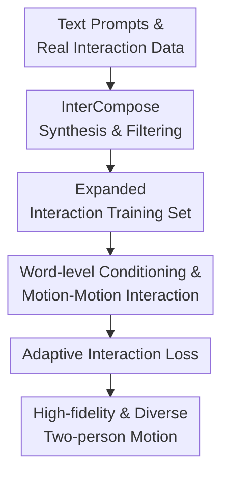

# Text2Interact: High-Fidelity and Diverse Text-to-Two-Person Interaction Generation

**Conference**: ICLR2026  
**OpenReview**: [https://openreview.net/forum?id=cthzUgBUn7](https://openreview.net/forum?id=cthzUgBUn7)  
**Code**: https://github.com/Qingxuan-Wu/Text2Interact  
**Area**: Human Understanding / Two-Person Interaction Generation  
**Keywords**: Text-to-Motion Generation, Two-Person Interaction, Human Motion Synthesis, Fine-grained Text Conditioning, Synthetic Data Expansion  

## TL;DR
Text2Interact addresses text-driven two-person 3D interaction generation. It first utilizes InterCompose to synthesize high-quality interaction data from LLMs and single-person motion priors, then employs InterActor with word-level text conditioning, dual-person motion interaction attention, and adaptive interaction loss to enhance motion realism, text alignment, and cross-distribution generalization.

## Background & Motivation
**Background**: Text-to-human motion generation has established mature pipelines for single-person actions. Models ranging from VAEs and diffusion models to masked transformers can generate natural walking, jumping, or waving based on a single text prompt. However, generating two-person interactions is significantly more challenging. The output is not merely two individually reasonable skeleton sequences, but two characters responding to each other in the same time and space. Factors such as who initiates the action, who responds, the specific body parts involved in contact, and the spatial-temporal synchronization determine the perceived realism of the interaction.

**Limitations of Prior Work**: The first bottleneck is data-related. Datasets like InterHuman contain only a few thousand sequences, which is significantly smaller than single-person datasets like HumanML3D. Consequently, they fail to cover complex scenarios like fighting, dancing, collaboration, support, or specialized training. Models trained on these limited samples often fail to generalize to novel prompts, resulting in stiff, repetitive, or semantically incomplete motions.

**Limitations of Prior Work**: The second bottleneck involves the granularity of text modeling. Descriptions for two-person interactions are typically longer and contain cues about roles (initiator/responder), temporal order, contact points, and emotions. Previous methods often compress the entire sentence into a single vector, injecting it via AdaLN or sentence-level conditioning. This approach struggles with structured prompts like "one person pulls a rope, the other is dragged forward, and eventually the former wins the tug-of-war," as the model may fail to reflect the late-stage semantics in the final motion.

**Key Challenge**: Two-person interaction generation requires both broader data coverage and finer semantic control. Relying solely on real MoCap is expensive and slow to scale. Conversely, training end-to-end models on existing sparse data with coarse text conditions limits performance. This research posits that coverage should be achieved through scalable "single-person motion priors + language priors," while interaction fidelity should be improved via word-level supervision and contact-aware spatial losses.

**Goal**: The authors decompose the problem into two sub-tasks: 1) obtaining diverse and credible interaction training samples without additional large-scale MoCap collection, and 2) enabling the model to accurately interpret role assignments, temporal relationships, and contact cues within long captions.

**Key Insight**: A key observation is that many interactions can be viewed as "one person's motion acting as a condition for the other's reaction." By generating one character's motion using a strong single-person generator and training a reaction model to generate the second character based on the first motion and the full text, one can leverage large-scale single-person priors. Neural evaluators can then filter low-quality samples to maintain training set integrity.

**Core Idea**: Use InterCompose to expand data coverage and InterActor to preserve word-level text cues and explicitly supervise proximate joint pairs, creating a complete pipeline from scalable data to fine-grained interaction modeling.

## Method

### Overall Architecture
Text2Interact consists of two complementary components. InterCompose is an offline data synthesizer: starting from LLM-generated descriptions, it decomposes them into two single-person prompts, generates one person's motion via a single-person model, and uses a reaction model to complete the second person's motion. The output is filtered via a text-motion evaluator. InterActor is the final generation model: conditioned on the full text, it iteratively updates tokens for both individuals, allowing each to attend to word-level text cues and the other's motion state, optimized by an adaptive interaction loss.

Formally, the input is a text prompt $c_t$, and the output is a motion sequence $X = [x_1, x_2] \in \mathbb{R}^{2 \times T \times N \times 3}$. Each frame state includes global joint positions/velocities, 6D local rotations in the root coordinate system, and foot-contact labels. This representation allows the model to evaluate both posture and relative spatial relationships.

### Key Designs
**1. InterCompose Synthesis and Filtering: Expanding Coverage via Single-person Priors**

InterCompose addresses the data scarcity issue. Instead of arbitrary LLM "imagination" or simple concatenation, it maps real InterHuman texts to coarse-grained themes (e.g., greeting, conflict) and fine-grained tags (e.g., synchronized, intense). It then samples new interaction descriptions within this theme-tag space.

After obtaining the text, the system uses an LLM to split it into two self-consistent single-person descriptions. For example, "one person punches, the other blocks with crossed arms and kicks back" is split into the initiator's punch and the responder's block-and-kick. A strong model like MoMask first generates motion $x_1$, and a conditional diffusion reaction model $D_\theta$ learns $p_\theta(x_2 \mid x_1, c_t)$ to generate the response. This reduces "generating two people from scratch" to "generating a response given an action," leveraging rich single-person dynamics.

To prevent noisy data, a text-motion contrastive evaluator filters samples with cosine similarity below $\delta = 0.58$. Furthermore, an annular filtering strategy is used based on distances to real InterHuman embeddings: $r_{\min} \le d(f_\phi(x), E_{real}) \le r_{\max}$. The inner radius $r_{\min}$ avoids redundant samples too similar to real data, while the outer radius $r_{\max}$ excludes outliers too far from the human motion distribution.

**2. Word-level Conditioning and Motion-Motion Interaction: Ensuring Attention to Roles and Timing**

InterActor addresses coarse text conditioning. While previous methods use sentence vectors, InterActor utilizes a frozen CLIP-ViT-L/14 to extract word-level tokens $T = \{t^{(1)}, \ldots, t^{(L)}\}$. Each motion token dynamically attends to specific phrases (e.g., "pulls the rope") via cross-attention.

An InterActor block first performs **word-level conditioning**: motion features act as queries and word tokens as keys/values. This is followed by **motion-motion interaction**: each person uses self-attention for their own temporal sequence, then cross-attention to read the other person's motion tokens. This models dependencies like push-pull, synchronization, or blocking.

**3. Adaptive Interaction Loss: Focusing Supervision on Relevant Body Contacts**

In interactions, not all joint distances are equally important. Hand distance is critical during a handshake, while forearm-fist relationships matter more during blocking. Text2Interact introduces an adaptive interaction loss $L_{AdaInteract}$ that uses the reciprocal of real joint distances as weights, providing stronger supervision for joints in close proximity:

$$
L_{AdaInteract}=\sum_{i=1}^{N}\sum_{j=1}^{N}\frac{1}{d_{ij}+\epsilon}\lVert d_{ij}-\hat{d}_{ij}\rVert^2
$$

where $d_{ij}$ and $\hat{d}_{ij}$ are real and predicted distances between joint $i$ of person 1 and joint $j$ of person 2, and $\epsilon=0.1$. This automatically identifies contact points without manual labels, improving physical interaction realism.

### Loss & Training
InterActor employs 12 interleaved attention and word-level conditioning blocks. The diffusion process uses 1,000 denoising steps with a cosine schedule; inference uses 50-step DDIM with a classifier-free guidance weight of 3.5.

Training occurs in two stages. Phase 1: Train on InterHuman for 200,000 steps ($5\times10^{-5}$ learning rate). Phase 2: Fine-tune on a mix of real and filtered synthetic data for 50,000 steps ($5\times10^{-6}$ learning rate). The objective includes velocity loss $L_{vel}$, foot contact loss $L_{foot}$, bone length loss $L_{BL}$, relative orientation loss $L_{RO}$, and the proposed $L_{AdaInteract}$.

## Key Experimental Results

### Main Results
Text2Interact outperforms previous methods on the InterHuman test set in R-Precision, indicating superior text-motion alignment. While the FID is slightly higher than InterMask (by 0.037), the authors note that motion quality is statistically comparable.

| Method | Top-1 R-Precision↑ | Top-3 R-Precision↑ | FID↓ | MM Dist↓ | Diversity→ | MModality↑ |
|------|-------------------|-------------------|------|----------|------------|------------|
| Ground Truth | 0.452 | 0.701 | 0.273 | 3.755 | 7.948 | - |
| InterGen | 0.371 | 0.624 | 5.918 | 5.108 | 7.387 | 2.141 |
| MoMat-MoGen | 0.449 | 0.666 | 5.674 | 3.790 | 8.021 | 1.295 |
| in2IN | 0.425 | 0.662 | 5.535 | 3.803 | 7.953 | 1.215 |
| InterMask | 0.449 | 0.683 | 5.154 | 3.790 | 7.944 | 1.737 |
| **Ours** | **0.483** | **0.717** | 5.191 | **3.778** | 7.900 | 1.051 |

User studies on out-of-distribution (OOD) texts show a significant preference for Text2Interact, with over 80% of participants favoring its text consistency and motion quality over InterMask.

### Ablation Study
Ablations specifically target Word-Level Conditioning (WLC), Adaptive Interaction Loss (AIL), and Fine-Tuning (FT) with synthetic data.

| Configuration | Top-1 R-Precision↑ | Top-3 R-Precision↑ | FID↓ | MM Dist↓ | Diversity→ |
|------|-------------------|-------------------|------|----------|------------|
| w/o All Components | 0.441 | 0.681 | 6.237 | 3.781 | 7.959 |
| w/o AIL & FT | 0.484 | 0.710 | 6.192 | 3.779 | 7.853 |
| w/o WLC & FT | 0.484 | 0.711 | 5.877 | 3.779 | 7.851 |
| w/o FT | 0.485 | 0.721 | 5.701 | 3.777 | 7.904 |
| **Full Model** | 0.483 | 0.717 | **5.191** | 3.778 | 7.900 |

### Key Findings
- **WL Conditioning** primarily improves semantic coverage for long interactions, specifically temporal ordering (e.g., "bowing after a workout").
- **Adaptive Interaction Loss** significantly reduces FID (from 6.237 to 5.877 in isolations), confirming that weighted supervision on proximal joints leads to more natural physical relationships.
- **Data Filtering** is critical. FID improved from 5.701 to 5.191 only after setting the proper annular distance threshold for synthetic data, proving that "more data" is only beneficial if it remains close enough to the real motion manifold while offering novelty.

## Highlights & Insights
- **Dual-Strategy Solution**: Text2Interact simultaneously tackles data scale with InterCompose and model alignment with InterActor.
- **Reaction-based Synthesis**: Generating a response conditioned on a primary motion is a practical way to reuse single-person priors for multi-person tasks.
- **Adaptive Weighting**: The use of the reciprocal of distance in $L_{AdaInteract}$ is an elegant way to focus on interactions without requiring manual contact point annotations.
- **OOD Robustness**: The significant gains in user studies using LLM-generated OOD prompts demonstrate the value of synthetic data expansion for real-world applications.

## Limitations & Future Work
- **Physical Constraints**: The model lacks explicit physics-based constraints, which can lead to artifacts like foot sliding or slight interpenetration.
- **Dependency on Priors**: InterCompose relies on the quality of the LLM and the single-person motion generator.
- **Detail Granularity**: The model focuses on skeleton-level motion, lacking finger details or facial expressions necessary for intricate interactions.
- **Future Directions**: Exploring video-based interaction learning and incorporating explicit physical simulation for contact handling.

## Related Work & Insights
- **vs InterGen**: Text2Interact evolves from InterGen by replacing sentence-level conditioning with word-level tokens and using weighted distance loss instead of a global distance map.
- **vs InterMask**: While InterMask uses masked modeling, Text2Interact focuses on scalable data synthesis and fine-grained alignment, showing better performance on complex semantic prompts.
- **vs ComMDM**: Unlike ComMDM which simply composes two priors, Text2Interact utilizes a reaction-generation model and a data-driven fine-tuning cycle.

## Rating
- **Novelty**: ⭐⭐⭐⭐☆ (Strong system design combining synthesis and alignment).
- **Experimental Thoroughness**: ⭐⭐⭐⭐⭐ (Excellent OOD and filtering analysis).
- **Writing Quality**: ⭐⭐⭐⭐☆ (Clear and logically structured).
- **Value**: ⭐⭐⭐⭐⭐ (Practical framework for expanding interaction datasets).

<!-- RELATED:START -->

## Related Papers

- [\[ICLR 2026\] ReactDance: Hierarchical Representation for High-Fidelity and Coherent Long-Form Reactive Dance Generation](reactdance_hierarchical_representation_for_high-fidelity_and_coherent_long-form_.md)
- [\[CVPR 2026\] 4DSurf: High-Fidelity Dynamic Scene Surface Reconstruction](../../CVPR2026/human_understanding/textit4dsurf_high-fidelity_dynamic_scene_surface_reconstruction.md)
- [\[CVPR 2026\] Mobile-VTON: High-Fidelity On-Device Virtual Try-On](../../CVPR2026/human_understanding/mobile_vton_ondevice_virtual_tryon.md)
- [\[CVPR 2026\] ReMoGen: Real-time Human Interaction-to-Reaction Generation via Modular Learning from Diverse Data](../../CVPR2026/human_understanding/remogen_real-time_human_interaction-to-reaction_generation_via_modular_learning_.md)
- [\[ICLR 2026\] Motion-Aligned Word Embeddings for Text-to-Motion Generation](motion-aligned_word_embeddings_for_text-to-motion_generation.md)

<!-- RELATED:END -->
