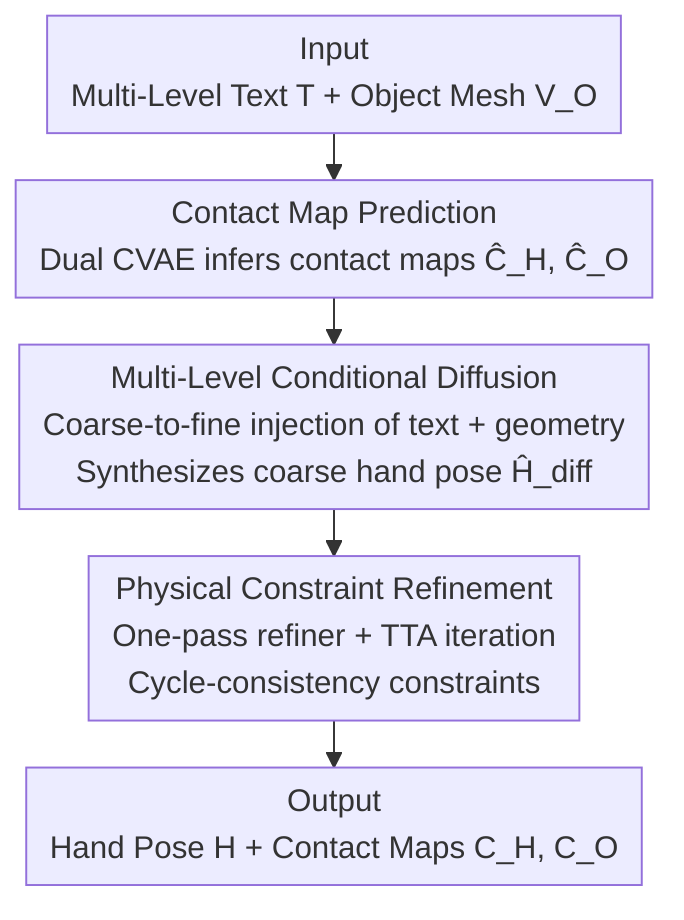

# TOUCH: Text-guided Controllable Generation of Free-Form Hand-Object Interactions

**Conference**: ICLR 2026  
**OpenReview**: [https://openreview.net/forum?id=4VW9HVCRw0](https://openreview.net/forum?id=4VW9HVCRw0)  
**Project Page**: [https://guangyid.github.io/hoi123touch/](https://guangyid.github.io/hoi123touch/)  
**Code**: See project page  
**Area**: Human Understanding / Hand-Object Interaction (HOI) Generation / 3D Generation  
**Keywords**: Hand-Object Interaction, Free-Form Interaction, Contact Map, Multi-level Diffusion, Textual Control

## TL;DR
Ours proposes the new task of "Free-Form Hand-Object Interaction (HOI) Generation" along with WildO2, an in-the-wild 3D dataset automatically reconstructed from web videos. A three-stage framework, TOUCH (Contact Map Prediction → Multi-level Conditional Diffusion → Physical Constraint Refinement), is designed to move beyond "stable grasping" priors, enabling the generation of diverse and physically plausible hand poses—such as pushing, poking, and rotating—based on fine-grained textual instructions.

## Background & Motivation
**Background**: Hand-object interaction (HOI) generation is a fundamental capability for AR/VR, robotics, and embodied AI. Prior works have evolved from "ensuring physical plausibility" to "incorporating semantic controllability." However, control signals are often limited to physical constraints like force closure or coarse "verb-noun" instructions, even when descriptions are detailed using LLMs.

**Limitations of Prior Work**: The model designs and inductive biases of these methods are fundamentally rooted in "grasping." Vague conditions naturally bias models toward stable grasping poses, sacrificing interaction diversity. Consequently, they fail to represent widespread non-grasping interactions (push, poke, rotate, etc.) and lack fine-grained control over hand poses, contact details, and subtle semantic intentions.

**Key Challenge**: The core difficulties of free-form interaction are "what to generate" and "how to generate." The former concerns spatial plausibility: given the high degrees of freedom (DoF) of the hand, the search space is vast and contains many physically infeasible poses without grasping priors (e.g., palm position/orientation, contact area assumptions). The latter concerns semantic controllability: accurately mapping fine-grained text to specific hand configurations and contact regions. The primary obstacle is the lack of data; existing 3D HOI datasets are mostly limited to laboratory grasping scenarios with few object categories, while large-scale real-world 3D acquisition is hindered by hardware limitations and occlusion.

**Goal**: Define and solve the Free-Form HOI generation task, requiring the generation of controllable, diverse, and physically plausible interactions under fine-grained intentional conditions, while providing in-the-wild 3D data to support this task.

**Key Insight**: The authors propose using "contact relations" as a strong signal to constrain the high-dimensional interaction space. Rather than specifying palm positions, contact maps delicately describe "which part of which finger touches where on the object," thereby isolating plausible poses from the vast space. On the semantic side, LLM priors are leveraged to map text to contacts and poses. On the data side, the focus shifts to massive 2D HOI videos online, automatically reconstructed into 3D.

**Core Idea**: Use contact maps as a bridge, employing multi-level text to control the diffusion process from coarse to fine, followed by self-supervised physical constraint refinement to expand HOI generation from "grasping-centric" to "free-form."

## Method

### Overall Architecture
Given multi-level text prompts $T$ and an object mesh $V_O$, TOUCH outputs hand pose parameters $H$ (MANO) and contact maps $C_H, C_O$ for both the hand and the object. The generation follows a three-stage sequential pipeline: first, **Contact Map Prediction** infers potential contact regions on the hand/object surfaces based on text and object geometry to compress the pose space as a strong spatial prior; second, **Multi-level Conditional Diffusion** injects coarse-to-fine text and geometric features into a Transformer to synthesize an initial hand pose; finally, **Physical Constraint Refinement** corrects global drift, eliminates interpenetration, and aligns contact details. This framework relies on an offline-constructed dataset, **WildO2**—a core contribution containing 4,414 3D HOI samples with fine-grained semantic annotations reconstructed from web videos.

### Key Designs

**1. WildO2 Dataset and O2HOI Paired Reconstruction: Creating daily 3D HOI data from web videos**

The biggest obstacle for free-form interaction is the lack of 3D training data, as severe occlusion between the hand and object in real scenes yields poor direct reconstruction. The authors introduce an "Object-only to HOI" (**O2HOI**) pairing strategy: 8k goal-oriented segments of single-hand-single-object interactions are filtered from Something-Something V2. For each, an unoccluded object-only frame $I_{ref}$ and an interaction frame $I_{hoi}$ are automatically extracted. SAM2 extracts the complete object mask from $I_{ref}$, which is then migrated to $I_{hoi}$ via dense matching to obtain $M_{inpaint}$. This avoids geometric inconsistencies of diffusion inpainting and is more scalable than manual annotation.

A three-stage reconstruction follows: **Stage 1** uses image-to-3D on $I_{ref}$ for textured meshes and hand reconstruction for initial MANO parameters. **Stage 2: Camera Alignment** resolves coordinate misalignment between the object (canonical space in $I_{ref}$) and hand (camera space in $I_{hoi}$) by optimizing the projection matrix and extrinsic parameters via differentiable rendering. The loss uses mask IoU + Sinkhorn + edge penalties for coarse alignment, followed by scale-invariant depth and RGB reconstruction losses for refinement:

$$\min_{K,R,t}\ L_{cam} = L_{mask} + L_{sinkhorn} + L_{edge} + \lambda_{fine}(L_{depth} + L_{rgb})$$

**Stage 3: Hand-Object Refinement** casts rays from the camera center through pixels in the interaction mask. Intersections delimit 3D contact zones, and hand parameters are optimized using 2D evidence and 3D physical constraints: $L_{align} = L^H_{mask} + L_{j2d} + L_{icp} + L_{phy}$. This yields 4,414 verified samples. The dataset includes multi-level annotations: templated short descriptions (SSC), VLM-generated and human-verified fine-grained descriptions (DSC), dense contact maps, and a fine-grained segmentation of the hand mesh into **17 parts** (including nails, knuckles, palmar/dorsal sides)—dorsal contact is essential for free-form interactions but often ignored in grasping datasets.

**2. Contact Map Prediction: Using contact relations to delimit the pose space**

To generate diverse interactions beyond grasping, the authors first predict binary contact maps for the object and hand sides using two independent but structurally similar CVAEs. The object branch samples $N_O=3000$ points from the mesh, normalizes them, records a scale factor $s_O$, and extracts geometric features $F_O$ via PointNet. The hand branch generates a canonical point cloud $N_H=778$ from MANO zero-pose, overlays hand part masks initialized by fine-grained text $T_{DSC}$, and extracts features $F_H$ via PointNet. This preserves topology while focusing attention on interaction-relevant hand regions through text. Both CVAEs are conditioned on their respective geometric features and shared textual features $F_{DSC}$ (extracted via Qwen-7B with a lightweight adapter):

$$L_{contact} = L_{focal} + L_{dice} + \beta L_{KL}$$

During inference, binary contact maps $\hat{C}_O, \hat{C}_H$ are decoded from a Gaussian prior. Determining "where to touch" before "how to pose" provides a strong spatial prior, significantly reducing uncertainty for high-DoF pose generation.

**3. Multi-level Conditional Diffusion: Staged control injection from global-coarse to local-fine**

The core is a Transformer-based DDPM that directly predicts denoised data $\hat{x}_0 = f_\theta(x_t, t, y)$ instead of noise, trained with L2 loss on pose parameters $L_{diff} = \mathbb{E}_{t,\epsilon}[\|\hat{x}_0 - x_0\|^2]$. Conditions are injected into $N_{inj}=8$ Transformer blocks in a coarse-to-fine manner: **Early stages ($i<4$)** inject only global context—global geometric features of the object/hand, scale, and coarse text $F^{SSC}_{qwen}$—to establish the overall pose. **Later stages ($4\le i<8$)** switch to fine-grained details, injecting local features derived from contact maps $\hat{C}$ to adaptively select local features $\tilde{F}_O^{loc}, \tilde{F}_H^{loc}$ from $N^O_{loc}=128$ object points and $N^H_{loc}=64$ hand points, combined with fine-grained text $F^{DSC}_{qwen}$. Global conditions $y^i_{glb}$ use FiLM to modulate main features, while local conditions $y^i_{loc}$ inject spatial cues via cross-attention, decoupling global guidance from local refinement. Random dropout (10%) is applied to global components during training. Two auxiliary losses are added: a global pose loss for hand rotation $r_{rot}$ and translation $T$, and a distance map loss for 21 hand joints to the object surface $d_{map}$ to ensure precise contact:

$$L_{total} = L_{diff} + \lambda_{global}(|\hat{r}_{rot}-r^{gt}_{rot}| + |\hat{T}-T^{gt}|) + \lambda_{dmap}|\hat{d}_{map}-d^{gt}_{map}|$$

**4. Physical Constraint Refinement: Self-supervised cycle-consistency to fix drifting hands**

In free-form generation, the hand often fails to "reach" the object (global pose drift), resulting in no contact. The authors add a lightweight refiner inheriting the diffusion Transformer architecture: a single forward pass quickly corrects the global localization of $\hat{H}_{diff}$ to establish primary contact, followed by $N_{tta}$ iterations of Test-Time Optimization (TTA) to fine-tune local details like finger placement. Refinement is driven by a self-supervised **cycle-consistency loss** $L_{cyc}$, which requires that a contact point on the hand, mapped to the nearest object point via $\Phi$, should return to its original position when mapped back via $\Psi$, and vice versa, suppressing ambiguity in contact mappings:

$$L_{refiner} = L_{phy} + \lambda_{cyc}\big(\mathbb{E}_{P_h\in PC_H}\|\Psi(\Phi(P_h))-P_h\|_1 + \mathbb{E}_{P_o\in PC_O}\|\Phi(\Psi(P_o))-P_o\|_1\big)$$

Together with $L_{phy}$ (contact, penetration, anatomical constraints), this step explicitly recovers the contact information that is often "for free" in grasping tasks but missing in free-form scenarios.

### Loss & Training
The model is trained on WildO2 with a 4:1 split of hand contact categories (approx. 3.7k train / 677 test). Long-tail hand part labels are balanced via resampling. Optimization uses Adam with a 1e-4 learning rate, batch size 128, for 1000 epochs; the refiner is trained with frozen diffusion parameters. Evaluation covers four dimensions: contact accuracy (IoU, F1), physical plausibility (MPVPE, penetration depth PD, penetration volume PV), diversity (entropy, cluster size), and semantic consistency (P-FID, VLM evaluation, and human preference scores PS). Note that physics-engine-based stability metrics are not used as free-form interactions extend far beyond force-closure grasping.

## Key Experimental Results

### Main Results
Evaluated against two representative baselines on the WildO2 test set: ContactGen (object-conditioned, multi-layer CVAE with coarse hand labels) and Text2HOI (Transformer diffusion with coarse text, adapted for snapshots). Both baselines include optimization-based post-processing to correct hand drift for a fair comparison.

| Method | P-IoU↑ | P-F1↑ | MPVPE↓ | PD↓ | PV↓ | P-FID↓ | VLM↑ | PS↑ |
|------|--------|-------|--------|-----|-----|--------|------|-----|
| ContactGen | 0.620 | 0.730 | 5.46 | 1.296 | 7.37 | 6.08 | 4.8 | 6.3 |
| Text2HOI | 0.711 | 0.795 | 4.69 | 1.239 | 4.93 | 15.72 | 6.5 | 7.5 |
| **Ours** | **0.776** | **0.844** | **2.97** | **0.932** | **2.67** | **4.13** | **7.1** | **8.8** |

TOUCH leads across almost all metrics: MPVPE drops from 4.69 to 2.97, PV from 4.93 to 2.67, and P-FID improves significantly from 15.72 to 4.13 compared to Text2HOI.

### Ablation Study
Ablations performed without TTA (Ours(✗TTA) as baseline):

| Configuration | P-IoU↑ | P-F1↑ | MPVPE↓ | P-FID↓ | Description |
|------|--------|-------|--------|--------|------|
| Ours(✗TTA) | 0.728 | 0.805 | 3.00 | 4.84 | Full model (TTA off) |
| ✗ hoc. | 0.492 | 0.611 | 4.93 | 5.41 | Contact guidance removed; accuracy drops sharply |
| ✗ refiner | 0.513 | 0.621 | 5.05 | 5.84 | PD/PV falsely low (hand drifts away, no contact) |
| ✗ $L_{cyc}$ | 0.702 | 0.787 | 3.00 | 5.79 | Contact consistency degrades |
| ✗ mul. | 0.525 | 0.631 | 5.00 | 6.84 | Multi-level structure removed; accuracy crashes |
| ✗ $T_{DSC}$ | 0.698 | 0.784 | 3.02 | 6.09 | Fine-grained semantic fidelity decreases |
| ✗ $T_{SSC}$ | 0.687 | 0.778 | 2.92 | 5.52 | Semantic fidelity decreases |
| CLIP/BERT/MPNet | — | — | — | 4.84-6.08 | All inferior to Qwen-7B |

### Key Findings
- **Contact guidance and multi-level structure are most critical**: Removing either drops P-IoU from 0.728 to ~0.49–0.53, confirming that "establishing contact first, then controlling via levels" is the backbone.
- **Physical metrics can be misleading**: The ✗refiner variant displays low PD/PV because the hand drifts away entirely. Thus, contact metrics should be prioritized; penetration is only meaningful when contact is established.
- **Qwen-7B text encoder** outperforms CLIP/BERT/MPNet in handling fine-grained semantics.
- **Generalization and Controllability**: The model generalizes to out-of-distribution (OOD) CAD models from Objaverse. Varying contact regions or verbs (Push/Lift) produces diverse poses. It even implicitly learns force-related terms: "firmly" results in 22–25% larger contact areas than "gently."

## Highlights & Insights
- **O2HOI Pairing + Mask Migration** is a practical data engineering trick: using unoccluded frames for segmentation and migrating to occluded frames bypasses geometric inconsistencies of inpainting, making large-scale 3D HOI acquisition from web videos feasible.
- **Contact Map as Intermediate Representation** makes physical plausibility explicit. It functions like drawing a bullseye in a high-DoF space before generating the pose—this is key to moving beyond grasping priors.
- **Stage-wise Condition Injection** (global FiLM early, local cross-attention later) aligns with the natural global-to-local progression of diffusion denoising, offering a valuable paradigm for conditional control.
- **Self-supervised Cycle-Consistency** elegantly uses the invertibility of contact mappings as a regularizer, suppressing hand-object correspondence ambiguity without needing extra labels.

## Limitations & Future Work
- The framework currently handles **static HOI snapshots** and cannot represent the temporal dynamics of interaction. Dataset size (4.4k) still has room for growth.
- No explicit physics engine modeling; force is learned implicitly from semantics ("firm/gentle"), limiting fine-grained force control.
- Observation: The pipeline depends on multiple pre-trained models (SAM2, image-to-3D, Qwen-7B, etc.), with a reconstruction success rate of ~55% (per dataset stats); errors may propagate through the pipeline.
- Future work: Extending to dynamic sequences (combining video + 6-DoF object poses) and upgrading contact maps to continuous representations with force/direction.

## Related Work & Insights
- **vs ContactGen**: Both use contact modeling and CVAE, but ContactGen uses coarse hand labels for grasping. Ours uses fine-grained (17 part) contact and multi-level text for free-form interaction, achieving superior metrics.
- **vs Text2HOI**: Both use text-conditioned Transformer diffusion, but Text2HOI uses coarse text for temporal sequences. Ours uses multi-level (SSC+DSC) control, contact priors, and refinement to reach significantly higher physical plausibility and semantic fidelity (P-FID 4.13 vs 15.72).
- **vs HOI Reconstruction**: Previous in-the-wild 3D HOI reconstruction was limited by object diversity and occlusion. Ours uses O2HOI mask migration and image-to-3D as a scalable data engine.

## Rating
- Novelty: ⭐⭐⭐⭐⭐ Establishes the Free-Form HOI task, first in-the-wild daily HOI dataset, and contact-guided multi-level diffusion framework.
- Experimental Thoroughness: ⭐⭐⭐⭐ Extensive main experiments, ablations, text encoder comparisons, and OOD generalization, though limited to two baselines.
- Writing Quality: ⭐⭐⭐⭐⭐ Clear hierarchy in motivation, data pipeline, and three-stage methodology.
- Value: ⭐⭐⭐⭐⭐ The dataset, task, and framework are poised to become foundational resources for future daily HOI generation research.

<!-- RELATED:START -->

## Related Papers

- [\[ICLR 2026\] SesaHand: Enhancing 3D Hand Reconstruction via Controllable Generation with Semantic and Structural Alignment](sesahand_enhancing_3d_hand_reconstruction_via_controllable_generation_with_seman.md)
- [\[ICLR 2026\] ReactDance: Hierarchical Representation for High-Fidelity and Coherent Long-Form Reactive Dance Generation](reactdance_hierarchical_representation_for_high-fidelity_and_coherent_long-form_.md)
- [\[ICLR 2026\] Human-Object Interaction via Automatically Designed VLM-Guided Motion Policy](human-object_interaction_via_automatically_designed_vlm-guided_motion_policy.md)
- [\[CVPR 2025\] FreeCloth: Free-Form Generation Enhances Challenging Clothed Human Modeling](../../CVPR2025/human_understanding/freecloth_free-form_generation_enhances_challenging_clothed_human_modeling.md)
- [\[CVPR 2026\] Unified Number-Free Text-to-Motion Generation Via Flow Matching](../../CVPR2026/human_understanding/unified_number-free_text-to-motion_generation_via_flow_matching.md)

<!-- RELATED:END -->
